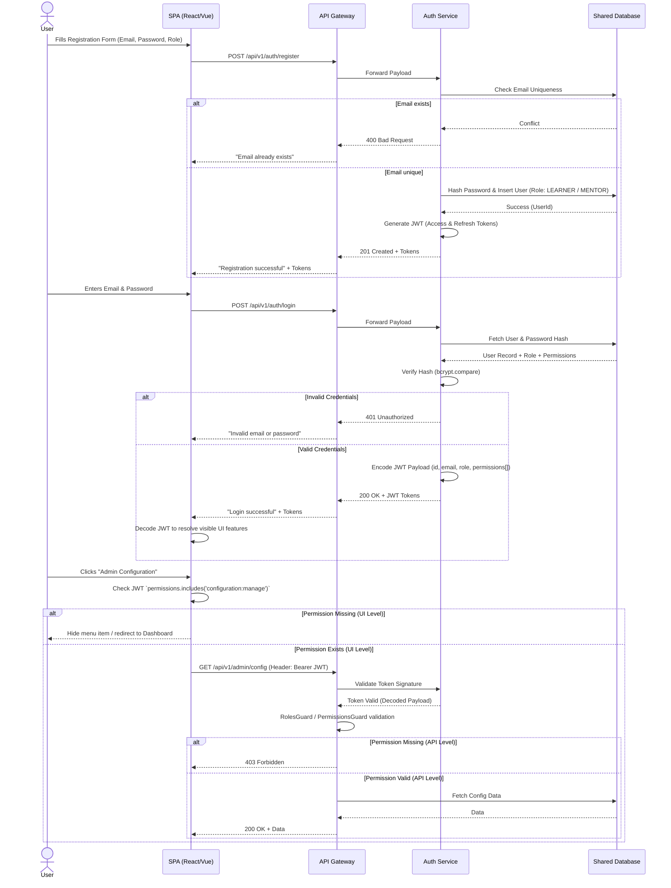

# Business Flow: Authentication & RBAC

This document outlines the business flow for user authentication, session generation, and Role-Based Access Control (RBAC) across the **IUROADMAP** platform.

## 1. Authentication Flow Diagram

The following sequence diagram illustrates how a user authenticates, how the JWT token is structured with permissions, and how the system controls access to protected routes.



## 2. Dynamic RBAC Configuration

Unlike static enum roles, **IUROADMAP** uses a dynamic `Role <-> Permission` mapping. The `Auth Service` handles this structure.

### JWT Payload Structure
When the user successfully logs in, the Auth service queries all permissions tied to their role and bakes them directly into the JWT:

```json
{
  "sub": 105,
  "email": "user@iuroadmap.com",
  "role": "ADMIN",
  "permissions": [
    "roadmap:read",
    "roadmap:write",
    "user:manage",
    "configuration:manage"
  ],
  "iat": 1723528255,
  "exp": 1723614655
}
```

### Business Rules & Constraints
1. **Token Lifespan:** Access Token (1 Hour), Refresh Token (7 Days).
2. **Double Validation (Zero Trust):** The frontend uses the decoded JWT array to toggle UI elements (e.g., hiding the Admin sidebar), while the backend API Gateway strictly re-verifies the same permissions via Guards (`@RequirePermissions('roadmap:write')`) before executing any logic.
3. **Admin Registration:** Users *cannot* register as an `ADMIN` via the public registration screen (`UC-01`). The public screen only allows `LEARNER` or `MENTOR`. Admins are created natively in the database or via the Admin Dashboard's User Management suite.
