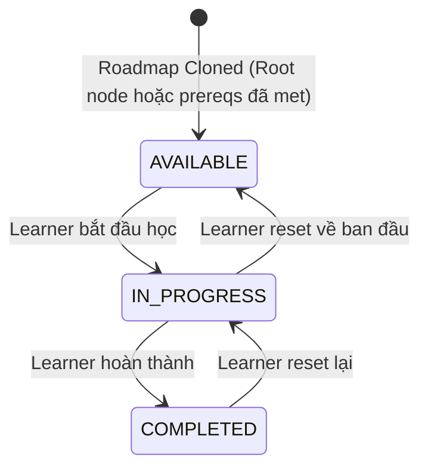

# LEARNER — Learner Portal

> ✅ **Đã implement** — Learner Portal đã hoạt động với browse majors, clone roadmap, macro/micro canvas, progress tracking.

## 1. Module description

Learner Portal là giao diện chính cho sinh viên: onboard, khám phá ngành học theo khoa, clone roadmap vào dashboard cá nhân, xem prerequisite graph trực quan (macro view), drill-down vào course topics (micro view), và track tiến độ từng môn.

## 2. Tên viết tắt

- **LEARNER** = Learner Portal
- Vietnamese: **Cổng Học viên**

## 3. Submodules

| Submodule | Mô tả | URL |
|---|---|---|
| **Browse Majors** | Khám phá catalog ngành học theo khoa | `/api/v1/academic/Major/GetByIndex` |
| **Major Details** | Chi tiết ngành + prerequisite graph preview | `/api/v1/academic/roadmaps/:slug` |
| **Clone Major** | Enroll/clone roadmap vào dashboard cá nhân | `POST /api/v1/learner/enrollments/:slug` |
| **My Roadmaps** | Dashboard tổng hợp các roadmap đã enroll | `/api/v1/learner/dashboard` |
| **Macro Canvas** | Visual course prerequisite graph + progress | `/api/v1/learner/progress/:userRoadmapId/overview` |
| **Micro Learning** | Topic drill-down + learning resources | `/api/v1/academic/roadmaps/course/:courseNodeId` |
| **Mark Progress** | Cập nhật status course/topic | `PATCH /api/v1/learner/progress/courses/:courseNodeId` |

## 4. Actors

| Role | Trách nhiệm |
|---|---|
| **Guest** | Browse majors, view major details (public, không cần auth) |
| **Authenticated Learner** | Clone roadmap, track progress, mark completed |

## 5. Status lifecycle

### NodeProgressStatus (Course/Topic Level)



**Color Coding trên Canvas:**
- 🔵 **Blue** = `AVAILABLE` (đủ điều kiện học)
- 🟡 **Yellow** = `IN_PROGRESS` (đang học)
- 🟢 **Green** = `COMPLETED` (đã hoàn thành)
- 🔒 **Gray/Locked** = Unmet Prerequisites (chưa đủ điều kiện)

### EnrollmentStatus (User Roadmap Level)

| Status | Mô tả |
|---|---|
| `ENROLLED` | Đang theo học lộ trình |
| `COMPLETED` | Hoàn thành toàn bộ roadmap |
| `DROPPED` | Đã bỏ/rút khỏi lộ trình |

## 6. Core flows

### Flow 1 — Browse Majors (UC-03)

1. User/Guest → `/explore/majors` (UI).
2. System fetch all active departments + child majors: `GET /api/v1/academic/Major/GetByIndex` (với param filter).
3. Render catalog grouped by Department.
4. User filter by:
   - Department checkbox/dropdown.
   - Search keyword (name/description).
5. Display major cards: `Name`, `Description`, `Credits Required`, `Course Count`.
6. Click **"View Details"** → UC-04.
7. Click **"Clone Major"** → UC-05.

**Alternative Flows:**
- **A1** – Không có majors → `"No majors available"`.
- **A2** – Filter ra 0 results → `"No matching results"`.

### Flow 2 — View Major Details (UC-04)

1. Navigate → `/majors/:slug` (UI).
2. System validate slug: `GET /api/v1/academic/roadmaps/:slug`.
3. Fetch: major metadata + course nodes + prerequisite edges.
4. Render:
   - **Info section**: Title, Total Credits, Description.
   - **Course list**: Name, Credits, Description (per course).
   - **Prerequisite graph preview**: Visual network (nodes + edges).
5. User click **"Enroll / Clone Major"** → UC-05.

**Alternative Flows:**
- **A1** – Slug không tồn tại → `404 "Major not found"`.
- **A2** – Major không có courses → `"No courses available in this major"`.
- **A3** – Courses không có prerequisite edges → hiển thị flat list.

### Flow 3 — Clone Major / Enroll (UC-05)

1. System check JWT auth state.
2. Nếu Guest → redirect to Login (`UC-02`) + `"Please log in to continue"`.
3. Display confirmation: `"Clone this roadmap to your dashboard?"`.
4. User confirm → `POST /api/v1/learner/enrollments/:slug`.
5. Backend:
   a. Validate major slug exists.
   b. Check duplicate enrollment (`user_roadmaps` where userId + majorRoadmapId).
   c. Atomic `Prisma.$transaction`:
      - Insert `user_roadmaps` record.
      - Initialize `user_course_progress` for all root courses (no prerequisites) → status = `AVAILABLE`.
6. Return `201 Created` + `"Enrollment successful"`.
7. Redirect to Dashboard (`/dashboard`).

**Alternative Flows:**
- **A1** – Already enrolled → `400 "You are already enrolled in this major"`.
- **A2** – Transaction fail → rollback + `"System error, please try again"`.

### Flow 4 — My Roadmaps Dashboard (UC-06)

1. Learner → `/dashboard` (UI).
2. System validate JWT → `GET /api/v1/learner/dashboard`.
3. Fetch all `user_roadmaps` for `userId`.
4. Backend calculate progress for each roadmap:
   ```
   Progress % = (Count(courses WHERE status == COMPLETED) / Total courses) × 100
   ```
5. Render roadmap cards:
   - Roadmap Name, Total Credits, Enrollment Date.
   - Visual progress bar with percentage.
6. Click **"View Progress"** → UC-07.

**Alternative Flows:**
- **A1** – No enrolled roadmaps → `"No enrolled roadmaps"` + "Explore Majors" button.

### Flow 5 — Macro Canvas View (UC-07)

1. Navigate → `/roadmaps/my/:userRoadmapId/overview`.
2. Backend verify ownership: `userId == user_roadmaps.userId`.
3. Fetch: nodes (id, title, credits, positionX, positionY, status), edges (source, target).
4. Render interactive 2D graph (`React Flow` / `Canvas API`):
   - Course nodes at (X, Y) coordinates.
   - Directional arrows for prerequisite edges.
   - Color-coded status badges (Blue/Yellow/Green/Gray).
5. **Left-click** node → navigate to Micro View (`UC-08`).
6. **Right-click** node → context menu: Mark as Completed / In Progress / Reset (`UC-09`).
7. **Hover** node → tooltip: Course Name, Credits, Status.

**Alternative Flows:**
- **A1** – Not enrolled → `403 "You are not enrolled in this roadmap"`.
- **A2** – Roadmap not found → `404 "Roadmap not found"`.
- **A3** – No courses → `"No courses available"`.

### Flow 6 — Micro Learning Viewer (UC-08)

1. Click course node → `/roadmaps/course/:courseNodeId`.
2. Backend: verify enrollment in parent roadmap.
3. Fetch: course metadata + topics ordered by `learningOrder ASC`.
4. Render:
   - **Left sidebar**: Ordered topic list with status indicators.
   - **Main panel**: Selected topic's:
     - Title + Description
     - Learning Objectives (bullet list)
     - Resources (VIDEO/ARTICLE URLs)
5. Navigation: **"Next Topic"** / **"Previous Topic"** buttons.
6. Click **"Mark Topic as Completed"** → UC-09.

**Alternative Flows:**
- **A1** – Not enrolled → `403`.
- **A2** – Course not found → `404`.
- **A3** – No topics → `"No topics available for this course"`.
- **A4** – First visit → all topic statuses default `AVAILABLE`.

### Flow 7 — Mark Progress / Update Status (UC-09)

1. Trigger: Right-click context menu (`UC-07`) OR "Mark Completed" button (`UC-08`).
2. Display context menu: `Mark as Completed`, `Mark as In Progress`, `Reset to Available`.
3. User select target status.
4. Backend: `PATCH /api/v1/learner/progress/courses/:courseNodeId`.
5. **Prerequisite validation** (`BR-02`):
   - If `targetStatus == IN_PROGRESS || COMPLETED`:
   - All parent prerequisite nodes must have `status == COMPLETED`.
   - If violated → `400 "Invalid status transition"`.
6. Update `user_course_progress.status` + `creditsEarned`.
7. Recalculate `user_roadmaps.progressPercentage`.
8. Return `200` + `"Status updated successfully"`.
9. UI: instant color update (Blue → Yellow → Green).

## 7. Database Schema

Tham chiếu: [`user-schema.md`](../schema/user-schema.md), [`roadmap-schema.md`](../schema/roadmap-schema.md)

Bảng chính:
- `USER_ROADMAPS_PROGRESS` — userId, roadmapId, enrollmentStatus, completionPercentage
- `USER_NODE_PROGRESS` — userRoadmapId, courseNodeId, status, creditsEarned

## 8. Related modules

- **AUTH** — JWT authentication guards
- **ROADMAP** — Departments, Majors, Courses, Topics data (Admin managed)
- **LECTURER REVIEW** — Course details link to lecturer reviews

## 9. Business Rules

| Rule ID | Rule |
|---|---|
| **BR-LRN-01** | Prerequisite Locking: Course node không thể IN_PROGRESS/COMPLETED nếu parent prereqs chưa COMPLETED (`BR-02` master) |
| **BR-LRN-02** | Root Node Unlocking: Clone roadmap → root courses (0 incoming edges) auto `AVAILABLE` (`BR-03` master) |
| **BR-LRN-03** | No Duplicate Enrollments: 1 user chỉ enroll 1 lần vào 1 major (`BR-09` master) |
| **BR-LRN-04** | Progress Formula: `(Completed / Total) × 100`, handle division by zero = 0% (`BR-15` master) |
| **BR-LRN-05** | creditsEarned validated: `>= 0` và `<= courseNode.credits` |
| **BR-LRN-06** | Clone transaction phải ACID — rollback nếu partial insert fail |

## 10. Non-Functional Requirements

| NFR | Requirement |
|---|---|
| **Response Time** | Dashboard loads ≤ 3.0s (95th pctl) |
| **Micro Query** | `GET /roadmaps/micro/:courseNodeId` ≤ 1.0s |
| **Status Mutation** | Mark Completed ≤ 1.0s |
| **Graph Rendering** | React Flow canvas smooth zoom/pan |
