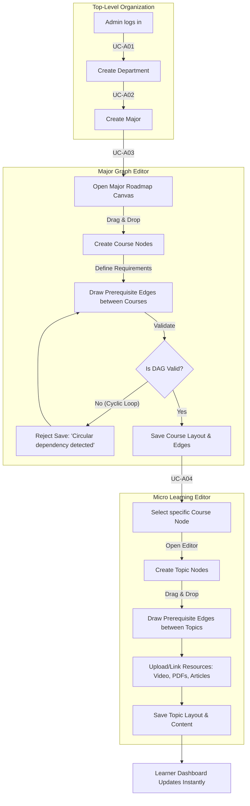

# Business Flow: Roadmap Management (Admin/Lecturer)

This document outlines the business flow for constructing the academic curriculum hierarchy in **IUROADMAP**, from defining macro structures (Departments & Majors) to designing visual node-based curriculum graphs (Courses & Topics).

## 1. Curriculum Hierarchy Construction Flow

The following flowchart illustrates the step-by-step process an Admin (or Lecturer, for standalone courses) follows to build a complete learning roadmap.

## 2. Business Logic & Constraints

### 2.1 The Directed Acyclic Graph (DAG) Rule
The visual canvas relies heavily on prerequisite edges (e.g., Course A -> Course B). The system enforces a strict mathematical rule to ensure learners do not get trapped in impossible learning loops.
- **Rule:** The graph must be a DAG.
- **Validation:** When an Admin attempts to draw a prerequisite edge from `Course B -> Course A`, the backend traverse algorithm checks if `Course A` is already an ancestor of `Course B`. If it is (e.g., `Course A -> Course B -> Course A`), the system throws a `400 Bad Request` and blocks the save operation.

### 2.2 X/Y Coordinate Persistence
Unlike standard flat-list LMS systems, **IUROADMAP** provides spatial context.
- When an Admin drags a node (Course or Topic) on the UI canvas, the React Flow component captures its new `X` and `Y` pixel coordinates.
- These coordinates are explicitly saved to the database (`course_nodes.positionX`, `course_nodes.positionY`) via the `/layout` API endpoint.
- When a learner views the roadmap, the graph renders in the exact spatial arrangement designed by the Admin.

### 2.3 Lecturer vs Admin Scope
- **Admins** operate top-down: `Departments -> Majors -> Courses -> Topics`.
- **Lecturers** (`UC-L01` to `UC-L05`) skip the Department/Major tiers. They operate at the **Course Level**, acting as authors for standalone courses. Their courses are placed into `DRAFT` status and must be submitted to the Admin for `PUBLISHED` approval before they become visible to learners.
