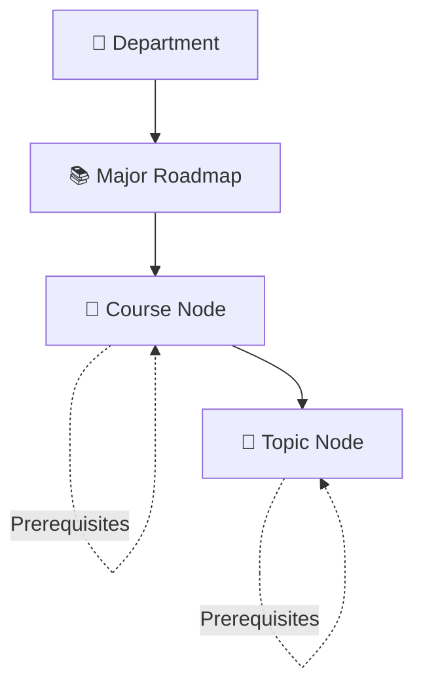

# ROADMAP — Roadmap Management & Curriculum Canvas

> ✅ **Đã implement** — Admin service đã hoạt động với Department/Major CRUD và Canvas editors.

## 1. Module description

Roadmap Management cho phép Admin quản lý hierarchy học thuật: `Departments → Majors → Courses → Topics`. Bao gồm visual drag-and-drop canvas editors cho prerequisite graphs ở cả macro (course) và micro (topic) level. Là backbone dữ liệu cho toàn bộ hệ thống.

## 2. Tên viết tắt

- **ROADMAP** = Roadmap Management & Curriculum Canvas
- Vietnamese: **Quản lý Lộ trình & Chương trình Học tập**

## 3. Submodules

| Submodule | Mô tả | URL |
|---|---|---|
| **Departments CRUD** | Quản lý khoa | `/api/v1/academic/Department/GetByIndex` |
| **Majors CRUD** | Quản lý ngành học | `/api/v1/academic/Major/GetByIndex` |
| **Macro Canvas Editor** | Course node + prerequisite edge editor | `/api/v1/academic/roadmaps/:majorSlug/canvas` |
| **Micro Canvas Editor** | Topic node + resource + prerequisite editor | `/api/v1/academic/roadmaps/courses/:id/topics/canvas` |

## 4. Actors

| Role | Trách nhiệm |
|---|---|
| **Admin** | Full CRUD departments, majors, course nodes, topic nodes |
| **Superadmin** | Admin + hard delete, cascade operations |

## 5. Data Hierarchy

## 6. Core flows

### Flow 1 — Department CRUD (UC-A01)

1. Admin → View list (`GET /api/v1/academic/Department/GetByIndex`).
2. System validate `Role == ADMIN` (`RolesGuard`).
3. View data table: `Name`, `Slug`, `Description`, `Total Majors`, `Actions`.

**Create:**
4. Click **"Create Department"**.
5. Fill: `Department Name`, `Slug`, `Description`.
6. `POST /api/v1/academic/Department/create`.
7. Backend: validate slug uniqueness, insert → `"Department created successfully"`.
8. Refresh table.

**Edit:**
9. Click **"Edit"** on row → populate edit form.
10. Modify fields → `POST /api/v1/academic/Department/update`.
11. Backend: validate, update → `"Department updated successfully"`.

**Delete:**
12. Click **"Delete"** → confirmation: `"Are you sure you want to delete this department?"`.
13. Confirm → `POST /api/v1/academic/Department/delete/:id`.
14. Backend: cascade delete majors + courses + topics → `"Department deleted successfully"`.

**Alternative Flows:**
- **A1** – Missing Name/Slug → `"Please fill in all required fields"`.
- **A2** – Duplicate Slug → `400 Bad Request`.
- **A3** – Cancel deletion → close modal, no change.

### Flow 2 — Major CRUD (UC-A02)

1. Admin → View list (`GET /api/v1/academic/Major/GetByIndex`).
2. View: `Name/Slug`, `Department`, `Credits Required`, `Total Courses`, `Actions`.

**Create:**
3. Fill: `Major Name`, `Slug`, `Department ID` (dropdown), `Total Credits Required`, `Description`.
4. `POST /api/v1/academic/Major/create`.
5. Backend: validate credits (`@IsInt() @Min(0)`), verify Department ID exists → insert.

**Edit:**
6. Click **"Edit"** → modify → `POST /api/v1/academic/Major/update`.

**Delete:**
7. Confirmation → `POST /api/v1/academic/Major/delete/:id` → cascade to course nodes.

**Open Canvas:**
8. Click **"Open Roadmap Canvas"** → UC-A03.

**Alternative Flows:**
- **A1** – Invalid credits (non-numeric, negative) → `"Credits must be a valid number."`.

### Flow 3 — Macro Canvas Editor (UC-A03)

1. Open → `/api/v1/academic/roadmaps/:majorSlug/canvas` (UI).
2. System render 2D graph canvas: existing course nodes (positionX, positionY) + prerequisite edges (arrows).

**Layout Operations:**
3. **Drag & Drop**: Reposition nodes → update local X/Y state.
4. Click **"Save Layout"** → `PUT /api/v1/academic/roadmaps/:majorId/layout`.
5. Backend: save coordinate array → `"Layout saved successfully"`.

**Create Course Node:**
6. Click **"Create Course Node"** → right drawer opens.
7. Fill: `Slug`, `Course Name`, `Credits`, `Description`.
8. Search/select `Prerequisites` from existing nodes (dropdown).
9. Click **"Create Node"** → `POST /api/v1/academic/roadmaps/:majorId/courses`.
10. Backend:
    - Validate inputs.
    - **DAG Validation**: Check if adding edges creates cyclic loop.
    - If circular → `400 "Circular prerequisite dependency detected"`.
    - Otherwise → insert node + edges → `"Course node created successfully"`.
11. Reload graph canvas.

**Edit Course Node:**
12. Left-click existing node → drawer populated with current data.
13. Modify fields, add/remove prerequisites → `PATCH /api/v1/academic/roadmaps/courses/:courseNodeId`.
14. Backend: re-validate DAG → update → `"Course node updated successfully"`.
15. Reload canvas.

**Delete Course Node:**
16. Click **"Delete Node"** in edit drawer → confirmation.
17. `DELETE /api/v1/academic/roadmaps/courses/:courseNodeId`.
18. Backend: cascade delete edges + topics → `"Course node deleted successfully"`.
19. Reload canvas.

### Flow 4 — Micro Canvas Editor (UC-A04)

1. Open → `/api/v1/academic/roadmaps/courses/:courseNodeId/topics/canvas` (UI).
2. System render micro roadmap canvas: topic nodes + prerequisite connections.

**Layout:**
3. Drag & drop topic nodes → "Save Layout" (`PUT /api/v1/academic/roadmaps/topics/layout`).

**Create Topic Node:**
4. Click **"Create Node"** → drawer.
5. Fill:
   - `Title`, `Estimated Hours`, `Description`.
   - `Learning Objectives` (bullet list).
   - `Resources`: add multiple items, each with `Title`, `Type` (VIDEO/ARTICLE), `URL`.
   - `Prerequisites`: search/select existing topics.
6. `POST /api/v1/academic/roadmaps/courses/:courseNodeId/topics`.
7. Backend: validate URL format (regex), insert topic + objectives + resources.

**Edit Topic Node:**
8. Click node → drawer populated with objectives, resources, prerequisites.
9. Modify → `PATCH /api/v1/academic/roadmaps/topics/:topicId`.

**Delete Topic Node:**
10. Confirmation → `DELETE /api/v1/academic/roadmaps/topics/:topicId` → cascade resource links.

**Alternative Flows:**
- **A1** – Missing Title/Hours → `"Please fill in all required fields"`.
- **A2** – Invalid Hours (non-numeric, ≤ 0) → `"Hours must be a valid number."`.
- **A3** – Invalid Resource URL → `"Please enter a valid URL."`.

## 7. Database Schema

Tham chiếu: [`roadmap-schema.md`](../schema/roadmap-schema.md)

Bảng chính:
- `DEPARTMENTS` — id, slug, name, description
- `MAJOR_ROADMAPS` — id, slug, name, totalCredits, departmentId
- `COURSES` — id, slug, name, credits, description (thư viện gốc)
- `ROADMAP_COURSES` — roadmapId, courseId, coords, semesterExpected (junction N-N)
- `COURSE_PREREQUISITES` — courseId, prerequisiteId (directed edges)
- `COURSE_TOPICS` — courseId, slug, title, description, learningObjectives, resourcesUrl
- `COURSE_TOPICS_EDGE` — sourceTopicId, targetTopicId (directed edges)

## 8. Related modules

- **LEARNER** — Uses roadmap data for clone, macro/micro views
- **LECTURER REVIEW** — Courses referenced by teaching assignments
- **AUTH** — Admin role guard
- **CONFIG** — Admin manages master data

## 9. Business Rules

| Rule ID | Rule |
|---|---|
| **BR-RM-01** | DAG Non-Cyclicity: course_prerequisites và topic_prerequisites phải là Directed Acyclic Graph (`BR-04` master) |
| **BR-RM-02** | Cascading Deletion: Delete department → cascade majors → courses → topics (`BR-12` master) |
| **BR-RM-03** | Slug uniqueness: departments.slug và major_roadmaps.slug unique across table |
| **BR-RM-04** | Credits validation: `@IsInt() @Min(0)` cho courses và majors |
| **BR-RM-05** | Resources URL: phải match HTTP/HTTPS regex |
| **BR-RM-06** | Topic estimatedHours: `@IsFloat() @Min(0.1)` |
