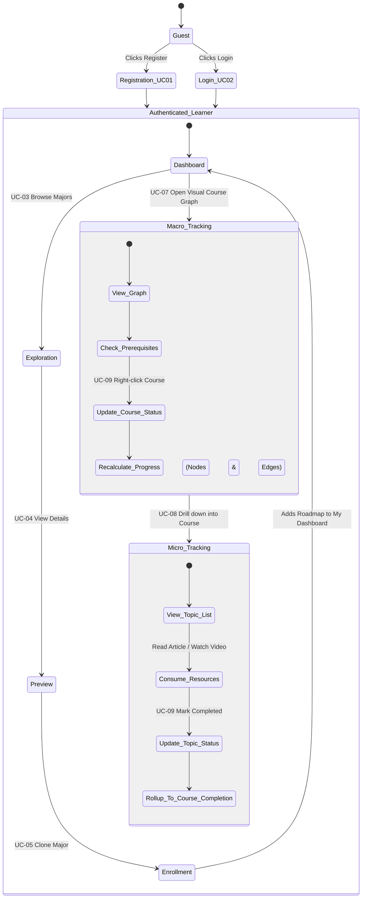

# Business Flow: Learner Journey

This document outlines the end-to-end business flow for the primary user of **IUROADMAP**: the Learner. It covers how a learner explores roadmaps, enrolls in them, tracks their completion progress via visual graphs, and updates their course/topic statuses.

## 1. Learner Journey State Diagram

The following state diagram illustrates the lifecycle of a learner interacting with the platform.

## 2. Business Logic & Constraints

### 2.1 The Enrollment (Cloning) Transaction
When a learner decides to pursue a specific Major, they "Clone" the template roadmap.
- **Atomic Operation:** The backend clones the major template, linking the `majorRoadmapId` to the `userId` in the `user_roadmaps` table.
- **Initialization:** During this clone, the system scans the graph. Any "Root" course nodes (courses that have absolutely *zero* prerequisites) are automatically injected into `user_course_progress` with an `AVAILABLE` status.

### 2.2 Status Color-Coding & Prerequisite Locking
The **IUROADMAP** learner dashboard is highly gamified. The system relies on a rigid color-coded status progression.

| Status | UI Color | Meaning |
| :--- | :--- | :--- |
| **LOCKED** | Gray (Lock Icon) | The learner has not yet completed the prerequisites for this course. |
| **AVAILABLE** | Blue | All prerequisites are met; the course is unlocked and ready to start. |
| **IN_PROGRESS** | Yellow | The learner has actively begun studying the topics within this course. |
| **COMPLETED** | Green | All topics are mastered, and the course credits are earned. |

### 2.3 Status Transition Rules
A learner cannot skip ahead randomly. The backend enforces strict validation when a learner triggers `UC-09: Mark as Completed`.

- **Rule:** If the learner attempts to mark `Course B` as `IN_PROGRESS` or `COMPLETED`, the system checks all incoming edges (`Course A -> Course B`).
- If `Course A.status` is **NOT** `COMPLETED`, the API throws `400 Bad Request: Invalid status transition`. The node remains grayed out and locked in the UI. 

### 2.4 Progress Rollup
1. **Micro-to-Macro:** When a learner marks the final Topic within a Course as `COMPLETED`, the system automatically rolls up and marks the parent Course Node as `COMPLETED` on the macro graph.
2. **Macro-to-Global:** When a Course Node hits `COMPLETED`, the backend dynamically recalculates the `% Overall Progress` on the learner's main Dashboard card (`Completed Courses / Total Courses`).
