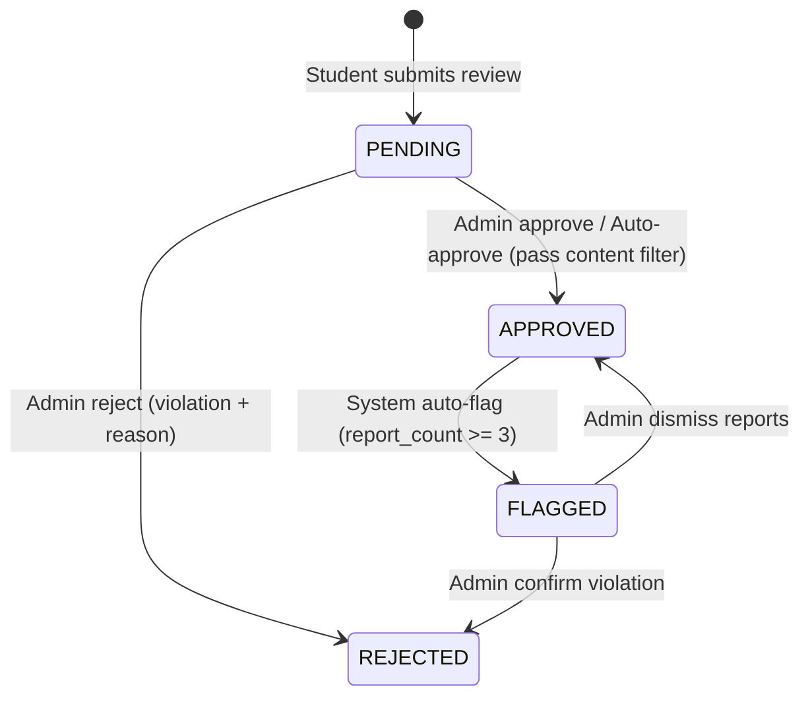
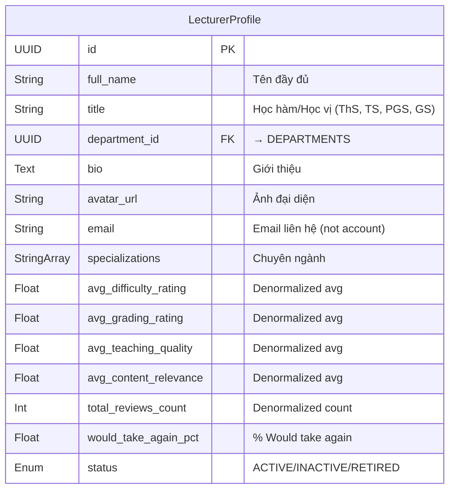
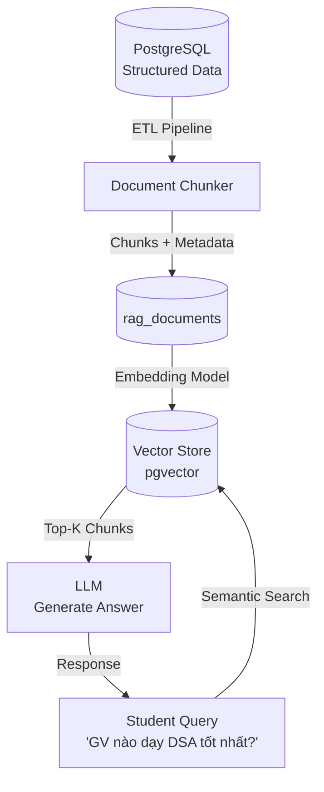

# LR — Lecturer Review & Course Assessment

> ⚠️ **CHƯA implement** — Module mới, mở rộng từ `03-lecture.md` gốc. Cần scaffold backend + frontend hoàn chỉnh.

## 1. Module description

Lecturer Review & Course Assessment là hệ thống cho phép sinh viên đánh giá giảng viên theo từng môn học và học kỳ (tương tự RateMyProfessors). Giảng viên thuộc về department, dạy nhiều course theo từng semester. Mỗi course có **Assessment Criteria** (điều kiện đánh giá: final project weight, midterm weight, inclass weight, etc.) để sinh viên biết yêu cầu trước khi review. Hệ thống cũng tích hợp **System Reviews** (auto-generated insights) và thiết kế **RAG-ready** cho AI chatbot tương lai.

## 2. Tên viết tắt

- **LR** = Lecturer Review & Course Assessment
- Vietnamese: **Đánh giá Giảng viên & Điều kiện Môn học**

## 3. Submodules

| Submodule | Mô tả | URL |
|---|---|---|
| **Lecturer Directory** | Danh sách giảng viên (public, searchable) | `/api/v1/academic/LecturerProfile/GetByIndex` |
| **Lecturer Profile** | Chi tiết GV + teaching history + avg ratings | `/api/v1/academic/LecturerProfile/getById/:id` |
| **Teaching Assignments** | Admin assign GV → Course → Semester | `/api/v1/academic/assignments` |
| **Student Review Submission** | SV submit đánh giá GV | `/api/v1/academic/reviews` |
| **Review Feed** | Feed reviews cho 1 GV (filter by semester) | `/api/v1/academic/reviews/lecturer/:id` |
| **Course Assessment Criteria** | Điều kiện môn học — Admin CRUD | `/api/v1/academic/assessment-criteria` |
| **System Reviews** | AI/Rule-based tổng hợp (RAG-ready) | `/api/v1/academic/system-reviews/:lecturerId` |
| **Review Moderation** | Admin moderate reviews (approve/reject/flag) | `/api/v1/academic/reviews/pending` |
| **Review Analytics** | Dashboard thống kê đánh giá | `/api/v1/academic/analytics/reviews` |
| **Academic Semesters** | Admin CRUD học kỳ | `/api/v1/academic/Semester/GetByIndex` |

## 4. Actors

| Role | Trách nhiệm |
|---|---|
| **Admin** | CRUD Lecturer Profiles, Teaching Assignments, Course Assessment Criteria, Academic Semesters, Moderate reviews |
| **Student/Learner** | Browse lecturers, submit reviews, vote helpful, report reviews |
| **Guest** | Browse lecturers, view reviews (read-only) |
| **System** | Generate aggregated insights, RAG indexing, auto-moderate |

> ⚠️ **Lecturer KHÔNG CÓ tài khoản đăng nhập** — chỉ là data entity do Admin quản lý. Giảng viên được quản lý thông qua `LecturerProfile`, không liên kết với `users` table trong Auth Service.

## 5. Status lifecycle

### ReviewStatus



| From | To | Action | Ai làm | Điều kiện |
|---|---|---|---|---|
| *(new)* | `PENDING` | **Submit Review** | Student | Valid form + not duplicate |
| `PENDING` | `APPROVED` | **Approve** | Admin / Auto | Pass content filter |
| `PENDING` | `REJECTED` | **Reject** | Admin | Violation + mandatory reason |
| `APPROVED` | `FLAGGED` | **Auto-Flag** | System | report_count ≥ 3 |
| `FLAGGED` | `APPROVED` | **Dismiss Reports** | Admin | Reports reviewed |
| `FLAGGED` | `REJECTED` | **Confirm Violation** | Admin | Review violates policy |

### LecturerStatus

| Status | Mô tả |
|---|---|
| `ACTIVE` | Đang giảng dạy — hiển thị trên directory |
| `INACTIVE` | Tạm nghỉ — ẩn khỏi public directory |
| `RETIRED` | Đã nghỉ hưu — chỉ xem lịch sử |

### ReportStatus

| Status | Mô tả |
|---|---|
| `PENDING` | Report chờ xử lý |
| `REVIEWED` | Đã xem xét — action taken |
| `DISMISSED` | Bỏ qua — không vi phạm |

## 6. Data Model

### 6.1. `LecturerProfile` — Hồ sơ Giảng viên



| Cột | Kiểu | Khóa | Null | Mặc định | Mô tả |
|---|---|---|---|---|---|
| `id` | UUID | PK | N | `uuid()` | Khóa chính |
| `full_name` | String | — | N | — | Tên đầy đủ giảng viên |
| `title` | String | — | Y | — | Học hàm/Học vị (ThS, TS, PGS, GS) |
| `department_id` | UUID | FK | N | — | Khoa trực thuộc → `DEPARTMENTS` |
| `bio` | Text | — | Y | — | Giới thiệu bản thân / quá trình công tác |
| `avatar_url` | String | — | Y | — | Link ảnh đại diện |
| `email` | String | — | Y | — | Email liên hệ (KHÔNG phải tài khoản đăng nhập) |
| `specializations` | String[] | — | Y | `[]` | Chuyên ngành: `["AI", "Databases", "Web Dev"]` |
| `avg_difficulty_rating` | Float | — | N | `0.0` | Trung bình độ khó (denormalized, update async) |
| `avg_grading_rating` | Float | — | N | `0.0` | Trung bình độ gắt chấm điểm |
| `avg_teaching_quality` | Float | — | N | `0.0` | Trung bình chất lượng giảng dạy |
| `avg_content_relevance` | Float | — | N | `0.0` | Trung bình độ phù hợp nội dung |
| `total_reviews_count` | Int | — | N | `0` | Tổng số reviews (APPROVED only) |
| `would_take_again_pct` | Float | — | Y | — | % sinh viên muốn học lại với GV |
| `status` | Enum | — | N | `ACTIVE` | `ACTIVE` / `INACTIVE` / `RETIRED` |
| `created_at` | DateTime | — | N | `now()` | Thời điểm tạo |
| `updated_at` | DateTime | — | N | `updatedAt` | Cập nhật cuối |

**Quan hệ:**
- `department_id` → `DEPARTMENTS.id`
- Được tham chiếu bởi: `LecturerCourseAssignment.lecturer_id`

### 6.2. `AcademicSemester` — Học kỳ

| Cột | Kiểu | Khóa | Null | Mặc định | Mô tả |
|---|---|---|---|---|---|
| `id` | UUID | PK | N | `uuid()` | Khóa chính |
| `academic_year` | Int | — | N | — | Năm học (VD: 2025) |
| `semester` | Enum | — | N | — | `SEMESTER_1` / `SEMESTER_2` / `SUMMER` |
| `label` | String | — | N | — | Display label (VD: `"HK1-2025"`) |
| `start_date` | Date | — | Y | — | Ngày bắt đầu học kỳ |
| `end_date` | Date | — | Y | — | Ngày kết thúc |
| `is_current` | Boolean | — | N | `false` | Đánh dấu học kỳ hiện tại |
| `created_at` | DateTime | — | N | `now()` | — |

**Constraint:** `UNIQUE(academic_year, semester)` — Mỗi năm chỉ có 1 HK1, 1 HK2, 1 Summer.

### 6.3. `LecturerCourseAssignment` — Phân công Giảng dạy

| Cột | Kiểu | Khóa | Null | Mặc định | Mô tả |
|---|---|---|---|---|---|
| `id` | UUID | PK | N | `uuid()` | Khóa chính |
| `lecturer_id` | UUID | FK | N | — | → `LecturerProfile` |
| `course_id` | UUID | FK | N | — | → `COURSES` (Admin service) |
| `semester_id` | UUID | FK | N | — | → `AcademicSemester` |
| `section` | String | — | Y | — | Mã lớp/nhóm (VD: `"Section A"`, `"Group 1"`) |
| `avg_difficulty` | Float | — | N | `0.0` | Denormalized avg cho combo GV-Course-Semester |
| `avg_grading` | Float | — | N | `0.0` | Denormalized avg |
| `avg_teaching_quality` | Float | — | N | `0.0` | Denormalized avg |
| `reviews_count` | Int | — | N | `0` | Số reviews cho combo này |
| `created_at` | DateTime | — | N | `now()` | — |
| `updated_at` | DateTime | — | N | `updatedAt` | — |

**Constraint:** `UNIQUE(lecturer_id, course_id, semester_id, section)` — Mỗi GV chỉ 1 record dạy 1 môn trong 1 kỳ (per section).

**Quan hệ:**
- `lecturer_id` → `LecturerProfile.id`
- `course_id` → `COURSES.id`
- `semester_id` → `AcademicSemester.id`
- Được tham chiếu bởi: `StudentReview.assignment_id`

### 6.4. `StudentReview` — Đánh giá của Sinh viên

| Cột | Kiểu | Khóa | Null | Mặc định | Mô tả |
|---|---|---|---|---|---|
| `id` | UUID | PK | N | `uuid()` | Khóa chính |
| `assignment_id` | UUID | FK | N | — | → `LecturerCourseAssignment` (GV-Course-Semester combo) |
| `student_id` | UUID | FK | N | — | → `users` (Auth service, **luôn lưu** dù anonymous) |
| `difficulty_rating` | Int | — | N | — | Đánh giá độ khó môn học (Scale 1-5) |
| `grading_rating` | Int | — | N | — | Đánh giá độ gắt gao chấm điểm (Scale 1-5) |
| `teaching_quality_rating` | Int | — | N | — | Chất lượng giảng dạy (Scale 1-5) |
| `content_relevance_rating` | Int | — | N | — | Nội dung phù hợp, cập nhật (Scale 1-5) |
| `would_take_again` | Boolean | — | N | — | Có muốn học lại với GV này? (Yes/No) |
| `is_anonymous` | Boolean | — | N | `false` | Ẩn danh trên UI (Admin vẫn xem được student_id) |
| `review_text` | Text | — | Y | — | Đánh giá định tính |
| `tags` | String[] | — | Y | `[]` | Preset tags: `["Tough Grader", "Caring", "Clear Explanations", ...]` |
| `grade_received` | String | — | Y | — | Điểm SV nhận được (A, B+, C, ...) — optional |
| `attendance_mandatory` | Boolean | — | Y | — | Điểm danh bắt buộc? |
| `textbook_required` | Boolean | — | Y | — | Sách giáo khoa bắt buộc? |
| `status` | Enum | — | N | `PENDING` | `PENDING` / `APPROVED` / `REJECTED` / `FLAGGED` |
| `moderation_note` | Text | — | Y | — | Ghi chú từ Admin khi moderate |
| `helpful_count` | Int | — | N | `0` | Số lượt "Helpful" (denormalized) |
| `report_count` | Int | — | N | `0` | Số lượt report (denormalized) |
| `created_at` | DateTime | — | N | `now()` | — |
| `updated_at` | DateTime | — | N | `updatedAt` | — |

**Constraint:** `UNIQUE(assignment_id, student_id)` — Mỗi SV chỉ review **1 lần** cho 1 GV-Course-Semester combo.

### 6.5. `ReviewHelpful` — Vote Helpful

| Cột | Kiểu | Khóa | Null | Mô tả |
|---|---|---|---|---|
| `id` | UUID | PK | N | Khóa chính |
| `review_id` | UUID | FK | N | → `StudentReview` |
| `user_id` | UUID | FK | N | → `users` (người vote) |
| `created_at` | DateTime | — | N | — |

**Constraint:** `UNIQUE(review_id, user_id)` — Mỗi user chỉ vote helpful 1 lần/review.

### 6.6. `ReviewReport` — Report Review

| Cột | Kiểu | Khóa | Null | Mô tả |
|---|---|---|---|---|
| `id` | UUID | PK | N | Khóa chính |
| `review_id` | UUID | FK | N | → `StudentReview` |
| `reporter_id` | UUID | FK | N | → `users` (người report) |
| `reason` | String | — | N | Lý do report |
| `status` | Enum | — | N | `PENDING` / `REVIEWED` / `DISMISSED` |
| `created_at` | DateTime | — | N | — |

### 6.7. `CourseAssessmentCriteria` — Điều kiện Đánh giá Môn học

> **Mục đích:** Cho phép Admin định nghĩa cấu trúc đánh giá cho từng môn trong từng học kỳ. VD: "Data Structures and Algorithms (HK2-2025) — Final Project 20%, Midterm 20%, Lab 20%, Final Exam 30%, Participation 10%". Sinh viên xem trước để biết yêu cầu trước khi chọn lớp và review giảng viên.

| Cột | Kiểu | Khóa | Null | Mặc định | Mô tả |
|---|---|---|---|---|---|
| `id` | UUID | PK | N | `uuid()` | Khóa chính |
| `course_id` | UUID | FK | N | — | → `COURSES` |
| `semester_id` | UUID | FK | N | — | → `AcademicSemester` |
| `criteria_name` | String | — | N | — | Tên tiêu chí (VD: `"Final Project"`, `"Midterm Exam"`) |
| `criteria_type` | Enum | — | N | — | `INCLASS` / `MIDTERM` / `FINAL_EXAM` / `FINAL_PROJECT` / `ASSIGNMENT` / `LAB` / `PARTICIPATION` |
| `weight_percent` | Float | — | N | — | Trọng số % (VD: `20.0`) |
| `description` | Text | — | Y | — | Mô tả chi tiết (VD: `"Group project, build a sorting visualizer"`) |
| `is_mandatory` | Boolean | — | N | `true` | Bắt buộc hoàn thành? |
| `min_score_to_pass` | Float | — | Y | — | Điểm tối thiểu để pass component |
| `created_at` | DateTime | — | N | `now()` | — |
| `updated_at` | DateTime | — | N | `updatedAt` | — |

**Constraint:** `UNIQUE(course_id, semester_id, criteria_name)` — Mỗi tiêu chí duy nhất trong 1 môn-1 kỳ.

**Ví dụ dữ liệu:**

| Course | Semester | Criteria | Type | Weight |
|---|---|---|---|---|
| Data Structures & Algorithms | HK2-2025 | Inclass Participation | `PARTICIPATION` | 10% |
| Data Structures & Algorithms | HK2-2025 | Lab Exercises | `LAB` | 20% |
| Data Structures & Algorithms | HK2-2025 | Midterm Exam | `MIDTERM` | 20% |
| Data Structures & Algorithms | HK2-2025 | **Final Project** | `FINAL_PROJECT` | **20%** |
| Data Structures & Algorithms | HK2-2025 | Final Exam | `FINAL_EXAM` | 30% |
| **Total** | | | | **100%** |

### 6.8. `SystemReviewSummary` — Tổng hợp Hệ thống (RAG-ready)

| Cột | Kiểu | Khóa | Null | Mô tả |
|---|---|---|---|---|
| `id` | UUID | PK | N | Khóa chính |
| `lecturer_id` | UUID | FK | N | → `LecturerProfile` |
| `semester_id` | UUID | FK | Y | NULL = tổng hợp toàn bộ lịch sử |
| `summary_text` | Text | — | N | Tổng hợp AI-generated hoặc rule-based |
| `strengths` | String[] | — | Y | Điểm mạnh rút ra từ reviews |
| `weaknesses` | String[] | — | Y | Điểm cần cải thiện |
| `common_tags` | Json | — | Y | `{ "Tough Grader": 45, "Caring": 30, ... }` |
| `generated_at` | DateTime | — | N | Thời điểm tạo summary |
| `source_type` | Enum | — | N | `RULE_BASED` / `AI_GENERATED` |

## 7. Core flows

### Flow 1 — Admin quản lý Academic Semesters (UC-LR00)

1. Admin → View list (`GET /api/v1/academic/Semester/GetByIndex`).
2. View data table: Academic Year, Semester, Label, Start Date, End Date, Is Current.
3. **Create**: academicYear + semester + label + dates → `POST /api/v1/academic/Semester/create`.
4. **Edit**: Modify dates, toggle is_current → `POST /api/v1/academic/Semester/update`.
5. **Set Current**: Khi set `is_current = true` → system tự động `false` cho semester cũ.
6. **Delete**: Chỉ xóa nếu không có assignments hay criteria tham chiếu → `POST /api/v1/academic/Semester/delete/:id`.

### Flow 2 — Admin quản lý Lecturer Profiles (UC-LR01)

1. Admin → View list (`GET /api/v1/academic/LecturerProfile/GetByIndex`).
2. View data table: Full Name, Title, Department, Specializations, Total Reviews, Avg Rating, Status.
3. **Search/Filter**: by name, department dropdown, status dropdown.

**Create:**
4. Click **"Add Lecturer"**.
5. Fill: `Full Name`, `Title` (dropdown: ThS/TS/PGS/GS), `Department` (dropdown), `Bio`, `Avatar`, `Email`, `Specializations` (tag input).
6. `POST /api/v1/academic/LecturerProfile/create`.
7. Backend: validate department_id exists → insert → `"Lecturer created successfully"`.

**Edit:**
8. Click **"Edit"** → populate form → modify → `POST /api/v1/academic/LecturerProfile/update`.
9. `"Lecturer updated successfully"`.

**Soft Delete:**
10. Click **"Deactivate"** → `status → INACTIVE`.
11. Lecturer ẩn khỏi public directory nhưng vẫn giữ data.

### Flow 3 — Admin quản lý Teaching Assignments (UC-LR02)

> **Mục đích**: Xác định chính xác "năm nào, giảng viên nào dạy môn nào" — là key filter cho student review.

1. Admin → `/api/v1/academic/assignments/lecturer/:lecturerId` (UI).
2. View: Course Name, Semester Label, Section, Reviews Count, Avg Ratings.
3. **Filter**: by semester dropdown, course dropdown.

**Create Assignment:**
4. Click **"Add Assignment"**.
5. Select: `Course` (dropdown từ COURSES), `Semester` (dropdown từ AcademicSemesters), `Section` (text, optional).
6. `POST /api/v1/academic/assignments`.
7. Backend: validate unique constraint → insert.
8. `"Teaching assignment created successfully"`.

**Edit:**
9. Click **"Edit"** → modify section/semester → `PATCH /api/v1/academic/assignments/:id`.

**Delete:**
10. Chỉ xóa nếu không có reviews tham chiếu.
11. Nếu có reviews → prompt: `"This assignment has X reviews. Are you sure?"` → soft-archive.

### Flow 4 — Admin quản lý Course Assessment Criteria (UC-LR03)

> **Mục đích**: Cho phép SV biết "môn DSA cần final project chiếm 20% inclass" trước khi review GV.

1. Admin → `/api/v1/academic/courses/:courseId/assessment` (UI).
2. Select semester dropdown → filter criteria cho course trong semester đó.
3. View: Criteria Name, Type, Weight %, Description, Is Mandatory.
4. **Footer bar**: "Total Weight: 80% / 100%" (live calculation).

**Create Criteria:**
5. Click **"Add Criteria"**.
6. Fill: `Criteria Name`, `Type` (dropdown), `Weight %`, `Description`, `Is Mandatory`, `Min Score to Pass`.
7. `POST /api/v1/academic/courses/:courseId/assessment`.
8. **Validation**: `weight_percent > 0` và `weight_percent <= 100`.
9. **Warning**: Nếu tổng weight > 100% → hiển thị warning (soft validate, cho phép lưu nhưng cảnh báo).
10. **Error**: Nếu tổng weight > 100% khi **submit final** → block.

**Clone from Previous Semester:**
11. Click **"Clone from..."** → select source semester.
12. `POST /api/v1/academic/courses/:courseId/assessment/clone`.
13. Backend: copy tất cả criteria từ source semester → target semester.
14. `"Assessment criteria cloned successfully"`.

**Edit/Delete Criteria:**
15. Inline edit or modal → `PATCH /api/v1/academic/assessment/:id`.
16. Delete → confirm → `DELETE /api/v1/academic/assessment/:id`.

### Flow 5 — Public: Browse Lecturer Directory (UC-LR04)

1. User/Guest → Directory UI.
2. System fetch lecturers: `GET /api/v1/academic/LecturerProfile/GetByIndex` (where `status == ACTIVE`).
3. **Search**: by lecturer name (fuzzy match).
4. **Filter**:
   - Department dropdown.
   - Semester dropdown (filter by teaching assignments).
   - Course dropdown (filter by courses taught).
   - Rating range slider (min-max).
5. **Sort**: by avg rating (desc), by total reviews (desc), by name (asc).
6. Display lecturer cards:
   - Avatar, Full Name, Title.
   - Department name.
   - Overall Quality Score (average of 4 dimensions).
   - Total Reviews count.
   - Would Take Again %.
   - Top 3 tags (most common).
7. Click card → `/lecturers/:id`.

### Flow 6 — Public: View Lecturer Profile (UC-LR05)

1. Navigate → `/lecturers/:id` (UI) → fetch: `GET /api/v1/academic/LecturerProfile/getById/:id`.
2. **Header Section**:
   - Avatar, Full Name, Title, Department.
   - 4 dimension ratings: Difficulty, Grading, Teaching Quality, Content Relevance (progress bars/stars).
   - Overall Score (weighted average).
   - Would Take Again % (circular chart).
   - Total Reviews count.

3. **Teaching History** (accordion by semester):
   ```
   ▾ HK2-2025
     📖 Data Structures & Algorithms (4 credits, Section A) — 12 reviews, ★4.2
     📖 Database Management (3 credits, Section B) — 8 reviews, ★3.8
   ▸ HK1-2025
     📖 Introduction to Programming (3 credits) — 15 reviews, ★4.5
   ```

4. **Course Assessment Criteria** (khi click vào course trong teaching history):
   ```
   📖 Data Structures & Algorithms — HK2-2025
   ┌─────────────────────┬──────┬────────┐
   │ Criteria            │ Type │ Weight │
   ├─────────────────────┼──────┼────────┤
   │ Participation       │ IC   │  10%   │
   │ Lab Exercises       │ LAB  │  20%   │
   │ Midterm Exam        │ MID  │  20%   │
   │ Final Project       │ PROJ │  20%   │ ← "Build a sorting visualizer"
   │ Final Exam          │ FIN  │  30%   │
   └─────────────────────┴──────┴────────┘
   ```

5. **Reviews Feed** (tab, paginated):
   - Filter by semester, sort by newest/helpful.
   - Each review card: 4 ratings, tags, review text, grade received, helpful count, date.
   - "Helpful" button (toggle), "Report" button.

6. **Rating Distribution** (bar chart):
   ```
   5★ ████████████ 45%
   4★ ████████     30%
   3★ ████         15%
   2★ ██            7%
   1★ █             3%
   ```

7. **Tag Cloud**: Visual representation of common tags.
   ```
   [Clear Explanations ×45] [Caring ×30] [Tough Grader ×25] [Lots of Homework ×20]
   ```

8. **System Summary** (if available):
   > 🤖 **System Review**: "Dr. Nguyen Van A is highly rated for teaching quality (avg 4.5/5) and clear explanations. Students note strict grading (avg 3.2/5) and significant homework load. 78% would take again."

### Flow 7 — Student Submit Review (UC-LR06)

1. Student (authenticated) → click **"Write a Review"** on lecturer profile.
2. Navigate → `/lecturers/:id/review`.

**Step 1: Select Course & Semester**
3. Dropdown: Select course (from lecturer's teaching assignments).
4. Dropdown: Select semester (auto-filter by selected course).
5. System check: Student chưa review combo này.
   - Nếu đã review → `"You have already reviewed this lecturer for this course and semester"`.

**Step 2: Rate 4 Dimensions (1-5 stars each)**
6. **Difficulty**: "How difficult was this course with this lecturer?"
   - 1★ = Rất dễ, 5★ = Rất khó
7. **Grading**: "How strict was the grading?"
   - 1★ = Rất dễ dãi, 5★ = Rất gắt
8. **Teaching Quality**: "How well did the lecturer teach?"
   - 1★ = Rất kém, 5★ = Xuất sắc
9. **Content Relevance**: "How relevant and up-to-date was the content?"
   - 1★ = Lỗi thời, 5★ = Rất thực tế

**Step 3: Binary & Tags**
10. **Would take again?**: Yes / No toggle.
11. **Select Tags** (multi-select preset, max 5):

| Category | Tags |
|---|---|
| **Positive** | Clear Explanations, Caring, Respected, Inspirational, Graded Fairly, Great Lectures, Accessible Outside Class |
| **Negative** | Tough Grader, Lots of Homework, Skip Class?, Unclear Expectations, Boring Lectures |
| **Neutral** | Attendance Mandatory, Textbook Required, Group Projects, Online Lectures |

**Step 4: Written Review**
12. Textarea: `review_text` (optional nhưng khuyến khích).
    - Min 20 chars nếu provided.
    - Max 2000 chars.

**Step 5: Optional Fields**
13. `Grade Received`: dropdown (A, A-, B+, B, B-, C+, C, C-, D+, D, F).
14. `Attendance Mandatory`: Yes/No.
15. `Textbook Required`: Yes/No.

**Step 6: Anonymous Option**
16. Checkbox: `"Submit anonymously"` — ẩn identity trên UI nhưng Admin vẫn xem được.

**Submit:**
17. `POST /api/v1/academic/reviews`.
18. Backend validations:
    - `assignment_id` tồn tại.
    - `UNIQUE(assignment_id, student_id)` — chưa review.
    - Ratings 1-5 (`@Min(1) @Max(5)`).
    - review_text: min 20 chars nếu non-empty.
    - Content filter: profanity check (basic word list).
19. Insert with `status = PENDING`.
20. **Auto-approve option**: Nếu pass content filter → `APPROVED` ngay.
21. **Denormalize async**: Update `LecturerProfile` + `LecturerCourseAssignment` averages.
22. `"Review submitted successfully. It will be visible after moderation."`.

### Flow 8 — Review Moderation (UC-LR07)

1. Admin → `/api/v1/academic/reviews/pending` (UI).
2. **Filter**: by status (`PENDING` / `FLAGGED` / `ALL`), by lecturer, by semester.
3. View review detail: student info (nếu không anonymous), review content, ratings, tags, reports.

**Approve:**
4. Click **"Approve"** → `PATCH /api/v1/academic/reviews/:id/approve`.
5. Review visible publicly → denormalize averages.

**Reject:**
6. Click **"Reject"** → modal: mandatory `moderation_note`.
7. `PATCH /api/v1/academic/reviews/:id/reject` + `{ moderation_note }`.
8. Review hidden from public → notify student.

**Bulk Actions:**
9. Select multiple reviews → "Approve Selected" / "Reject Selected".

### Flow 9 — Review Interaction (UC-LR08)

**Helpful Vote:**
1. User xem review → click **"👍 Helpful"**.
2. `POST /api/v1/academic/reviews/:id/helpful`.
3. Backend: check `UNIQUE(review_id, user_id)` → insert/toggle.
4. Update `StudentReview.helpful_count` (denormalized).
5. Click lại → remove helpful: `DELETE /api/v1/academic/reviews/:id/helpful`.

**Report:**
6. Click **"🚩 Report"** → modal: mandatory reason text.
7. `POST /api/v1/academic/reviews/:id/report`.
8. Backend: insert `ReviewReport`.
9. Update `StudentReview.report_count`.
10. **Auto-flag rule**: Nếu `report_count >= 3` → `StudentReview.status → FLAGGED`.
11. Notification to Admin.

### Flow 10 — System Review Generation (UC-LR09)

1. **Trigger**: Cron job (daily) hoặc event (khi review count thay đổi đáng kể ≥ 5 mới reviews).
2. **Rule-based generation** (Phase 1):
   - Analyze all APPROVED reviews for lecturer.
   - Strengths = dimensions with avg ≥ 4.0 + top positive tags.
   - Weaknesses = dimensions with avg ≤ 2.5 + top negative tags.
   - Summary = template-generated text.
3. **AI generation** (Phase 2 — RAG):
   - Feed all reviews as context to LLM.
   - Generate natural language summary.
4. Lưu/update `SystemReviewSummary`.
5. Display trên lecturer profile.

## 8. RAG-Ready Architecture

### 8.1. Data Pipeline for RAG



### 8.2. `RagDocument` — Document Chunks cho RAG

| Cột | Kiểu | Khóa | Null | Mô tả |
|---|---|---|---|---|
| `id` | UUID | PK | N | Khóa chính |
| `source_type` | Enum | — | N | `REVIEW` / `LECTURER_PROFILE` / `COURSE` / `ASSESSMENT_CRITERIA` / `SYSTEM_SUMMARY` |
| `source_id` | UUID | — | N | ID của record gốc |
| `chunk_index` | Int | — | N | Thứ tự chunk trong document |
| `content` | Text | — | N | Nội dung chunk đã chuẩn hóa |
| `metadata` | Json | — | N | Rich metadata cho filtering |
| `embedding_model` | String | — | N | Model (VD: `"text-embedding-3-small"`) |
| `embedding_vector` | Vector(1536) | — | N | Embedding vector (pgvector extension) |
| `version` | Int | — | N | Version tracking cho re-indexing |
| `created_at` | DateTime | — | N | — |
| `updated_at` | DateTime | — | N | — |

### 8.3. RAG Document Templates

**Template: Review Document**
```text
[REVIEW] Lecturer: {lecturer_name} ({title}, {department})
Course: {course_name} ({credits} credits)
Semester: {semester_label}
Assessment Criteria: {criteria_summary}
---
Ratings: Difficulty {difficulty}/5, Grading {grading}/5,
         Teaching Quality {teaching_quality}/5, Content Relevance {content_relevance}/5
Would Take Again: {yes/no}
Tags: {tags_comma_separated}
Grade Received: {grade}
Review: "{review_text}"
---
Metadata: { source: "review", lecturer_id, course_id, semester_id, department, avg_rating, tags }
```

**Template: Lecturer Profile Document**
```text
[LECTURER] {full_name}, {title}
Department: {department_name}
Specializations: {specializations}
Bio: {bio}
---
Overall Stats: {total_reviews} reviews, Avg Quality {avg_teaching_quality}/5
Teaching History: {courses_list_with_semesters}
```

**Template: Course Assessment Document**
```text
[ASSESSMENT] Course: {course_name} ({credits} credits)
Semester: {semester_label}
---
Grading Structure:
{criteria_list_with_weights}
Total Weight: {total}%
---
Key Notes: {criteria_descriptions}
```

### 8.4. AI Chatbot Query Examples

Sau khi triển khai RAG, chatbot có thể trả lời:
- 🔍 "Giảng viên nào dạy Data Structures tốt nhất?"
- 🔍 "Môn nào cần làm final project?"
- 🔍 "GV Nguyen Van A có gắt chấm điểm không?"
- 🔍 "So sánh GV A và GV B cho môn Database?"
- 🔍 "Môn DSA semester này có bao nhiêu % project?"
- 🔍 "GV nào hay cho bài tập nhiều?"
- 🔍 "Tôi muốn tìm GV dễ tính cho môn Calculus"

## 9. Rating Dimensions (Chi tiết)

| Dimension | Scale | Mô tả | Labels |
|---|---|---|---|
| **Difficulty** | 1-5 | Độ khó tổng thể của môn khi học với GV | 1=Rất dễ, 2=Dễ, 3=Trung bình, 4=Khó, 5=Rất khó |
| **Grading** | 1-5 | Độ nghiêm ngặt khi chấm điểm | 1=Rất dễ dãi, 2=Dễ dãi, 3=Trung bình, 4=Gắt, 5=Rất gắt |
| **Teaching Quality** | 1-5 | Chất lượng giảng dạy, truyền đạt | 1=Rất kém, 2=Kém, 3=Trung bình, 4=Tốt, 5=Xuất sắc |
| **Content Relevance** | 1-5 | Nội dung phù hợp, cập nhật | 1=Lỗi thời, 2=Ít phù hợp, 3=Trung bình, 4=Phù hợp, 5=Rất thực tế |
| **Would Take Again** | Yes/No | Có muốn học lại với GV? | Binary (hiển thị dạng %) |

> **Note:** `Difficulty` và `Grading` KHÔNG tính vào Overall Quality Score (giống RateMyProfessors). Chỉ `Teaching Quality` và `Content Relevance` tính vào overall.

### Overall Quality Formula:
```
Overall Quality = (teaching_quality_rating + content_relevance_rating) / 2
```

## 10. API Endpoints

### Public Endpoints (Guest + Authenticated)

| Method | Endpoint | Mô tả |
|---|---|---|
| `GET` | `/api/v1/academic/LecturerProfile/GetByIndex` | List/search lecturers (paginated, filtered) |
| `GET` | `/api/v1/academic/LecturerProfile/getById/:id` | Lecturer profile + stats |
| `GET` | `/api/v1/academic/reviews/lecturer/:id` | Paginated reviews (filter by semester, sort by date/helpful) |
| `GET` | `/api/v1/academic/assignments/lecturer/:id` | Teaching assignments grouped by semester |
| `GET` | `/api/v1/academic/system-reviews/:id` | System-generated summary |
| `GET` | `/api/v1/academic/courses/:id/assessment` | Course assessment criteria for a semester |
| `GET` | `/api/v1/academic/Semester/GetByIndex` | List academic semesters |

### Authenticated Endpoints (Student)

| Method | Endpoint | Mô tả |
|---|---|---|
| `POST` | `/api/v1/academic/reviews` | Submit new review |
| `POST` | `/api/v1/academic/reviews/:id/helpful` | Vote review as helpful |
| `DELETE` | `/api/v1/academic/reviews/:id/helpful` | Remove helpful vote |
| `POST` | `/api/v1/academic/reviews/:id/report` | Report review + reason |

### Admin Endpoints

| Method | Endpoint | Mô tả |
|---|---|---|
| `POST` | `/api/v1/academic/LecturerProfile/create` | Create lecturer profile |
| `POST` | `/api/v1/academic/LecturerProfile/update` | Update lecturer |
| `POST` | `/api/v1/academic/LecturerProfile/delete/:id` | Soft delete (status → INACTIVE) |
| `GET` | `/api/v1/academic/LecturerProfile/GetByIndex` | Admin list (includes INACTIVE) |
| `POST` | `/api/v1/academic/assignments` | Create teaching assignment |
| `PATCH` | `/api/v1/academic/assignments/:id` | Update assignment |
| `DELETE` | `/api/v1/academic/assignments/:id` | Delete assignment |
| `POST` | `/api/v1/academic/courses/:id/assessment` | Create assessment criteria |
| `PATCH` | `/api/v1/academic/assessment/:id` | Update criteria |
| `DELETE` | `/api/v1/academic/assessment/:id` | Delete criteria |
| `POST` | `/api/v1/academic/courses/:id/assessment/clone` | Clone criteria from previous semester |
| `POST` | `/api/v1/academic/Semester/create` | Create semester |
| `POST` | `/api/v1/academic/Semester/update` | Update semester |
| `POST` | `/api/v1/academic/Semester/delete/:id` | Delete semester |
| `GET` | `/api/v1/academic/reviews/pending` | List reviews for moderation |
| `PATCH` | `/api/v1/academic/reviews/:id/approve` | Approve review |
| `PATCH` | `/api/v1/academic/reviews/:id/reject` | Reject review + reason |
| `PATCH` | `/api/v1/academic/reviews/bulk-approve` | Bulk approve |
| `PATCH` | `/api/v1/academic/reviews/bulk-reject` | Bulk reject |

## 11. Related modules

- **ROADMAP** — Courses, Departments (source data)
- **AUTH** — Users/students (reviewer identity), Permissions
- **LEARNER** — Course details in roadmap link to assessment criteria
- **RAG/AI** — Future: Vector indexing, AI chat service

## 12. Business Rules

| Rule ID | Rule |
|---|---|
| **BR-LR01** | Mỗi sinh viên chỉ review **1 lần** cho 1 GV-Course-Semester combo (`UNIQUE(assignment_id, student_id)`) |
| **BR-LR02** | Review chỉ submit được cho teaching assignments đã tồn tại trong `LecturerCourseAssignment` |
| **BR-LR03** | `is_anonymous = true` → ẩn student info trên public UI, nhưng Admin vẫn xem được `student_id` |
| **BR-LR04** | Denormalized averages (LecturerProfile + Assignment) cập nhật **async** khi review status = APPROVED |
| **BR-LR05** | `report_count >= 3` → auto flag review (`status → FLAGGED`) for admin moderation |
| **BR-LR06** | Tổng `weight_percent` của assessment criteria cho 1 course + 1 semester phải = **100%** (validated on final submit) |
| **BR-LR07** | Rating values phải trong range `1-5` (`@Min(1) @Max(5)`) |
| **BR-LR08** | `review_text` nếu provided phải `≥ 20 chars` và `≤ 2000 chars` |
| **BR-LR09** | RAG documents auto re-index khi source data thay đổi (event-driven) |
| **BR-LR10** | Student phải authenticated (JWT) để submit review |
| **BR-LR11** | Course assessment criteria có thể clone từ semester trước (copy operation) |
| **BR-LR12** | Overall Quality Score = `(teaching_quality + content_relevance) / 2` — difficulty/grading KHÔNG tính vào |
| **BR-LR13** | Tags giới hạn max 5 per review |

## 13. Notes bổ sung

- **Lecturer không có tài khoản**: Khác với Mentor Portal, giảng viên chỉ là data entity do Admin quản lý. Nếu sau này cần cho GV xem reviews → tạo feature "Lecturer Login" riêng.
- **Assessment Criteria**: Sinh viên xem trước yêu cầu môn học → biết "cần final project 20%" → review GV dựa trên trải nghiệm thực tế.
- **RAG Pipeline**: Phase 1 dùng rule-based summary, Phase 2 tích hợp LLM cho AI chatbot.
- **Content Moderation**: Bắt đầu basic word-list filter, nâng lên AI moderation sau.
- **Denormalization Strategy**: Averages lưu trực tiếp trên LecturerProfile và Assignment để tránh heavy aggregation queries trên mỗi page load.
