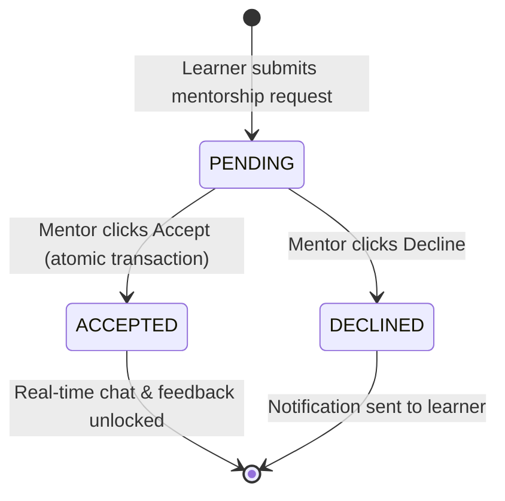

# MENTOR — Mentor Portal

> ✅ **Đã implement** — Mentor Portal đã hoạt động với request management, availability, chat, feedback.

## 1. Module description

Mentor Portal cung cấp giao diện cho Verified Mentors quản lý mentorship requests từ learners, thiết lập lịch availability, giao tiếp real-time qua WebSocket chat, và gửi feedback sau session.

## 2. Tên viết tắt

- **MENTOR** = Mentor Portal
- Vietnamese: **Cổng Cố vấn**

## 3. Submodules

| Submodule | Mô tả | URL |
|---|---|---|
| **Request List** | Inbox mentorship requests (sorted by date) | `/api/v1/mentoring/requests` |
| **Accept Request** | Accept + create connection (atomic) | `POST /api/v1/mentoring/requests/:id/accept` |
| **Decline Request** | Decline request + notify learner | `POST /api/v1/mentoring/requests/:id/decline` |
| **Availability Manager** | Calendar time slot CRUD | `/api/v1/mentoring/availability` |
| **Real-Time Chat** | WebSocket messaging với connected learners | `/api/v1/mentoring/chat/:learnerId` |
| **Give Feedback** | Post-session rating + written feedback | `/api/v1/mentoring/feedback/:learnerId` |

## 4. Actors

| Role | Trách nhiệm |
|---|---|
| **Verified Mentor** | (`role == MENTOR` && `mentor_profiles.status == APPROVED`) — quản lý requests, chat, feedback |
| **Learner** | Gửi mentorship requests, chat, nhận feedback |

> ⚠️ **Gate check**: Mentor Portal chỉ accessible sau khi Admin approve qua `UC-C02` (Config module).

## 5. Status lifecycle

### MentorshipRequest Status

| From | To | Action | Ai làm | Điều kiện |
|---|---|---|---|---|
| *(new)* | `PENDING` | **Submit Request** | Learner | Valid form |
| `PENDING` | `ACCEPTED` | **Accept** | Mentor | Atomic: update request + create connection |
| `PENDING` | `DECLINED` | **Decline** | Mentor | — |

### MentoringConnection Status

| Status | Mô tả |
|---|---|
| `Active` | Chat + feedback enabled |
| `Terminated` | Connection ended — chat locked |

### Availability Slot Status

| Status | Mô tả |
|---|---|
| `AVAILABLE` | Open for booking |
| `BOOKED` | Đã có learner book |
| `BLOCKED` | Mentor block slot (unavailable) |

## 6. Core flows

### Flow 1 — View Request List (UC-M01)

1. Mentor → `/api/v1/mentoring/requests` (UI).
2. System validate: `role == MENTOR` && `mentor_profiles.status == APPROVED`.
3. If unverified → `403 "Unauthorized mentor access"`.
4. `GET /api/v1/mentoring/requests`.
5. Backend: fetch `mentorship_requests` where `mentorId = currentUserId`, sorted `createdAt DESC`.
6. Display request cards:
   - Learner Name, Avatar.
   - Requested roadmap/topic context.
   - Message text.
   - Request date.
   - `PENDING` badge.
   - Actions: **"Accept"** / **"Decline"**.

**Alternative Flows:**
- **A1** – No requests → `"No requests available"`.

### Flow 2 — Accept Request (UC-M02)

1. Click **"Accept"** on a PENDING request.
2. Confirmation prompt: `"Accept connection with this learner?"`.
3. `POST /api/v1/mentoring/requests/:id/accept`.
4. Backend:
   a. Verify `request.status == PENDING`.
   b. If `!= PENDING` → `400 "Request already processed"`.
   c. **Atomic `Prisma.$transaction`**:
      - Update `mentorship_requests.status = ACCEPTED`.
      - Insert `mentoring_connections` (`mentorId`, `learnerId`, `connectedAt`, `status = Active`).
5. Dispatch acceptance notification to learner.
6. `"Request accepted successfully"`.
7. Unlock **"Chat"** button cho learner này.

### Flow 3 — Decline Request (UC-M03)

1. Click **"Decline"** → confirmation prompt.
2. `POST /api/v1/mentoring/requests/:id/decline`.
3. Backend:
   a. Verify `request.status == PENDING`.
   b. Update `mentorship_requests.status = DECLINED`.
4. Send decline notification to learner.
5. `"Request declined successfully"`.
6. Remove card from pending queue.

### Flow 4 — Manage Availability Schedule (UC-M04)

1. Mentor → `/api/v1/mentoring/availability` (UI).
2. System render calendar view (week/month).
3. Display existing slots color-coded: Green (AVAILABLE), Red (BOOKED), Gray (BLOCKED).

**Add Slot:**
4. Click on calendar cell → form: `Date`, `Start Time`, `End Time`.
5. `POST /api/v1/mentoring/availability`.
6. Backend validations:
   a. `endTime > startTime` → else `400 "Invalid time slot"`.
   b. **Overlap check**: query `mentor_availability_slots WHERE mentorId AND date AND startTime < newEndTime AND endTime > newStartTime`.
   c. If intersecting → `400 "Time conflict detected"`.
7. Insert slot → `"Availability updated successfully"`.

**Edit Slot:**
8. Click existing slot → modify times → `PATCH /api/v1/mentoring/availability/:id`.
9. Re-validate overlap.

**Delete Slot:**
10. Click → confirm → `DELETE /api/v1/mentoring/availability/:id`.
11. Only delete nếu slot status != `BOOKED`.

### Flow 5 — Real-Time Chat (UC-M05)

1. Click **"Chat"** on active connection.
2. System open chat window.
3. Load conversation history: `GET /api/v1/chat/history/:learnerId`.
4. Display messages chronologically.

**Send Message:**
5. Mentor types text → click Send.
6. Client validate: text not empty.
7. WebSocket: `ChatGateway` emit `sendMessage`.
8. Backend:
   a. Verify active connection (`mentoring_connections WHERE status == Active`).
   b. If no active connection → `403` — chat locked.
   c. Insert `chat_messages` record.
   d. Emit to learner's socket room.
9. Real-time delivery: `< 500ms` latency.
10. Both parties see updated transcript instantly.

**Read Receipts:**
11. When recipient opens chat → update `isRead = true` for unread messages.

**Alternative Flows:**
- **A1** – Empty message → `"Message cannot be empty"` (client-side block).
- **A2** – Connection lost → `"Connection lost"` + reconnect logic.

### Flow 6 — Give Feedback (UC-M06)

1. Click **"Give Feedback"** on learner profile/session.
2. Display feedback modal:
   - Textarea: mandatory feedback content.
   - Star rating: 1 to 5 (optional but encouraged).
3. Mentor writes: `"Great progress on algorithms! Focus on dynamic programming next."`.
4. Select rating: `4 stars`.
5. `POST /api/v1/mentoring/feedback/:learnerId`.
6. Backend validations:
   a. Verify active `mentoring_connections`.
   b. Feedback content: `@IsNotEmpty()`.
   c. Rating: `@Min(1) @Max(5)` (if provided).
7. Insert `mentoring_feedback` record.
8. Send notification to learner.
9. `"Feedback submitted successfully"`.
10. Rating displayed on learner dashboard.

## 7. Database Schema

Tham chiếu: [`mentor-schema.md`](../schema/mentor-schema.md)

Bảng chính:
- `mentor_profiles` — userId, bio, expertise[], status (PENDING/APPROVED/REJECTED), rejectionReason
- `mentorship_requests` — mentorId, learnerId, message, status (PENDING/ACCEPTED/DECLINED)
- `mentoring_connections` — mentorId, learnerId, connectedAt, status (Active/Terminated)
- `mentor_availability_slots` — mentorId, slotDate, startTime, endTime, status
- `chat_messages` — connectionId, senderId, content, isRead, createdAt
- `mentoring_feedback` — connectionId, mentorId, learnerId, content, rating

## 8. Related modules

- **AUTH** — JWT validation, role guards
- **CONFIG** — Mentor verification workflow (UC-C02)
- **LEARNER** — Learners send requests, receive feedback

## 9. Business Rules

| Rule ID | Rule |
|---|---|
| **BR-MTR-01** | Mentor must have `role == MENTOR` && `mentor_profiles.status == APPROVED` to access portal (`BR-05` master) |
| **BR-MTR-02** | Accept request: atomic transaction — update request + create connection (`BR-07` master) |
| **BR-MTR-03** | Chat + feedback restricted to active connections only (`BR-08` master) |
| **BR-MTR-04** | No duplicate request processing: `status != PENDING` → `400` |
| **BR-MTR-05** | Availability overlap check: real-time interval collision detection (`BR-10` master) |
| **BR-MTR-06** | Chat message + feedback content: `@IsNotEmpty()` (`BR-13` master) |
| **BR-MTR-07** | Feedback rating: integer `1-5` (`BR-14` master) |
| **BR-MTR-08** | WebSocket latency: `< 500ms` for chat delivery |

## 10. Non-Functional Requirements

| NFR | Requirement |
|---|---|
| **WebSocket Latency** | Chat messages delivered `≤ 500ms` |
| **Concurrent Users** | Support 100-1000 concurrent active users |
| **Availability Overlap** | Query must execute `< 100ms` |
| **Chat History** | Paginated loading (50 messages per page) |
