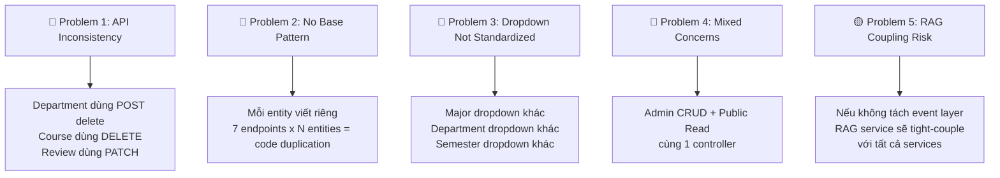
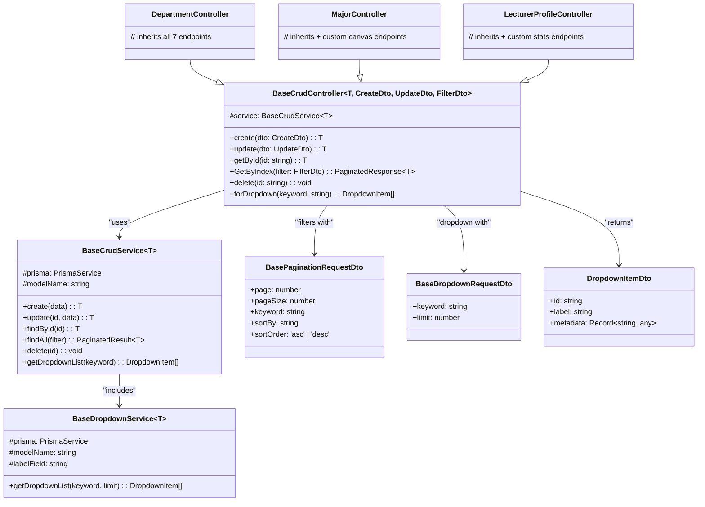
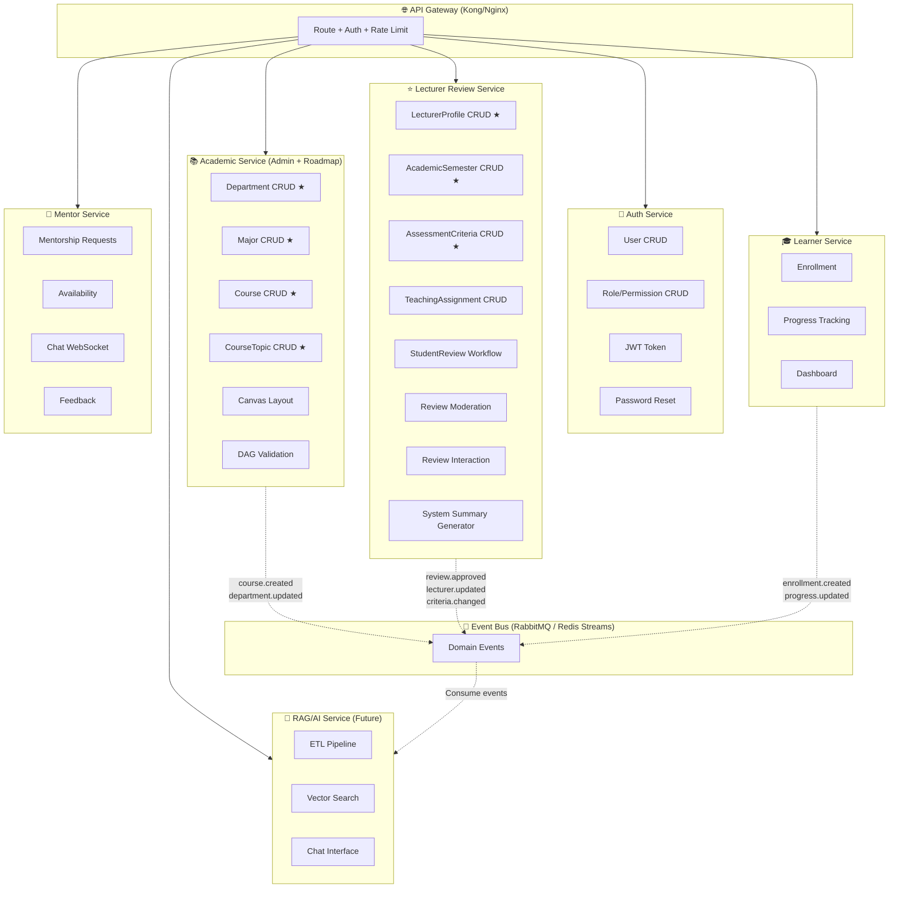
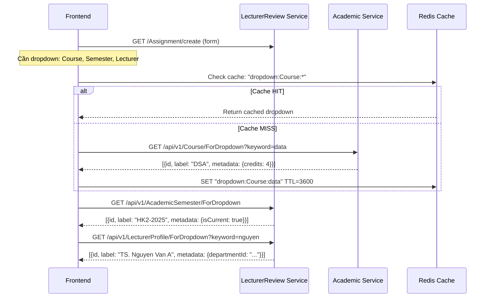
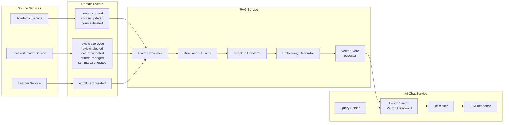
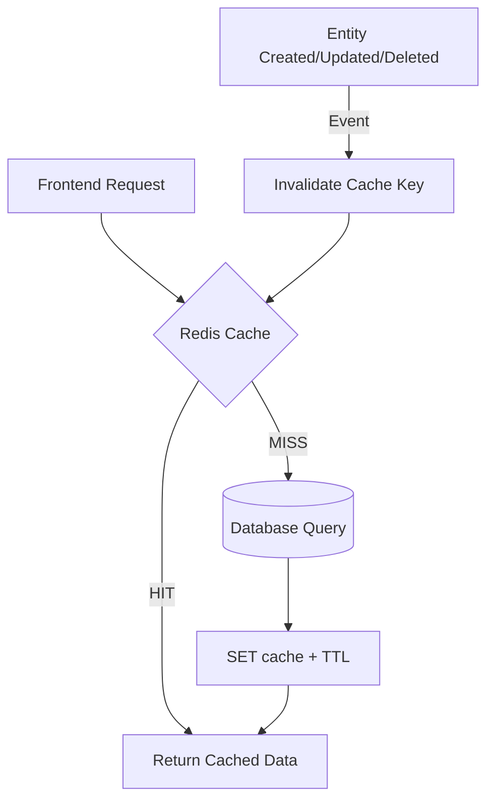

# IUROADMAP — API Architecture Analysis & Reusable Design

> **Author:** Senior Architect & BA Analysis  
> **Scope:** Full system analysis across 6 business flows + 6 schemas  
> **Goal:** Thiết kế API reusable, master data pattern, microservice-ready, RAG-friendly

---

## 1. Current State Assessment

### 1.1 System Inventory — Entities & Services

Sau khi đọc toàn bộ `docs/business-flow/*` và `docs/schema/*`, hệ thống có:

| Service | Entities (Master Data) | Entities (Transactional) | Status |
|---|---|---|---|
| **Auth** | `Role`, `Permission` | `User` | ✅ Implemented |
| **Admin/Roadmap** | `Department`, `Major`, `Course`, `CourseTopic` | `RoadmapCourse`, `CoursePrerequisite`, `CourseTopicEdge` | ✅ Implemented |
| **User/Learner** | — | `UserRoadmapProgress`, `UserNodeProgress` | ✅ Implemented |
| **Lecturer Review** | `LecturerProfile`, `AcademicSemester`, `CourseAssessmentCriteria` | `LecturerCourseAssignment`, `StudentReview`, `ReviewHelpful`, `ReviewReport`, `SystemReviewSummary` | ⚠️ Not yet |
| **Mentor** | — | `MentorProfile`, `MentorshipRequest`, `MentoringConnection`, `AvailabilitySlot`, `ChatMessage`, `MentoringFeedback` | ✅ Implemented |
| **RAG/AI** | — | `RagDocument` | 🔮 Planned |

### 1.2 Current Problems Identified



---

## 2. Entity Classification — Master Data vs Transactional

> [!IMPORTANT]
> **Core Principle:** Master Data = ít thay đổi, dùng chung nhiều service → reuse CRUD base.  
> Transactional = business logic phức tạp, workflow-driven → custom controllers.

### 2.1 Classification Matrix

| Entity | Type | CRUD Base? | Dropdown Base? | RAG Indexable? | Notes |
|---|---|---|---|---|---|
| `Department` | **Master Data** | ✅ Full CRUD | ✅ `{id, name}` | ✅ | Root hierarchy |
| `Major/Roadmap` | **Master Data** | ✅ Full CRUD | ✅ `{id, name, slug}` | ✅ | Thuộc Department |
| `Course` | **Master Data** | ✅ Full CRUD | ✅ `{id, name, credits}` | ✅ | Thư viện gốc |
| `CourseTopic` | **Master Data** | ✅ Full CRUD | ✅ `{id, title}` | ✅ | Thuộc Course |
| `Role` | **Master Data** | ✅ Full CRUD | ✅ `{id, name}` | ❌ | Auth config |
| `Permission` | **Master Data** | ✅ Full CRUD | ✅ `{id, name}` | ❌ | Auth config |
| `LecturerProfile` | **Master Data** | ✅ Full CRUD | ✅ `{id, fullName, title}` | ✅ | GV entity |
| `AcademicSemester` | **Master Data** | ✅ Full CRUD | ✅ `{id, label}` | ✅ | Học kỳ |
| `CourseAssessmentCriteria` | **Semi-Master** | ✅ CRUD + Clone | ❌ | ✅ | Scoped by course+semester |
| `LecturerCourseAssignment` | **Transactional** | ⚠️ Partial CRUD | ✅ `{id, label}` | ✅ | GV-Course-Semester combo |
| `StudentReview` | **Transactional** | ❌ Custom | ❌ | ✅ | Workflow: PENDING→APPROVED |
| `UserRoadmapProgress` | **Transactional** | ❌ Custom | ❌ | ❌ | Learner progress |
| `MentorProfile` | **Transactional** | ❌ Custom | ❌ | ❌ | Approval workflow |
| `RagDocument` | **System** | ❌ Internal | ❌ | N/A | Auto-generated |

---

## 3. Proposed Reusable API Architecture

### 3.1 Layered Base Class Hierarchy



### 3.2 Standard 7 Endpoints — Mọi Master Data Entity PHẢI có

```
POST   /api/v1/{Entity}/create          → Create record
POST   /api/v1/{Entity}/update          → Update record  
GET    /api/v1/{Entity}/getById/:id     → Get detail by ID
GET    /api/v1/{Entity}/GetByIndex      → Paginated list + filter
GET    /api/v1/{Entity}/ForDropdown     → Lightweight dropdown data
POST   /api/v1/{Entity}/delete/:id      → Soft/Hard delete
GET    /api/v1/{Entity}/export          → Export (optional, Phase 2)
```

### 3.3 Dropdown Base — Thiết kế chi tiết

> [!TIP]
> Dropdown là endpoint được call **nhiều nhất** trong hệ thống (mỗi form có N dropdowns).  
> Cần chuẩn hóa response + caching strategy.

#### Dropdown Response Standard

```typescript
// Tất cả dropdown PHẢI return format này
interface DropdownResponse {
  status: 'success';
  data: DropdownItem[];
}

interface DropdownItem {
  id: string;                        // PK
  label: string;                     // Display text
  metadata?: Record<string, any>;    // Optional extra info
}
```

#### Dropdown Registry — Mapping cho từng entity

| Entity | `label` field | `metadata` fields | Cache TTL | Used By |
|---|---|---|---|---|
| `Department` | `name` | — | 1h | Major form |
| `Major` | `name` | `{slug, departmentId}` | 1h | Canvas, Enrollment |
| `Course` | `name` | `{slug, credits}` | 1h | Assignment, Topic |
| `CourseTopic` | `title` | `{courseId}` | 30m | Topic edge editor |
| `Role` | `name` | — | 24h | User form |
| `Permission` | `name` | — | 24h | Role form |
| `LecturerProfile` | `fullName` | `{title, departmentId}` | 30m | Assignment form |
| `AcademicSemester` | `label` | `{isCurrent, academicYear}` | 1h | Assignment, Assessment |
| `LecturerCourseAssignment` | `lecturerName + courseName` | `{semesterLabel}` | 15m | Review form |

#### Dropdown với Cascading Filter (Parent-Child)

```typescript
// Example: Khi chọn Department → filter Majors dropdown
GET /api/v1/Major/ForDropdown?parentId={departmentId}&keyword=software

// Example: Khi chọn Lecturer → filter Assignments dropdown
GET /api/v1/LecturerCourseAssignment/ForDropdown?lecturerId={id}&semesterId={id}
```

---

## 4. Microservice Boundary Design

### 4.1 Service Decomposition (Recommended)



> ★ = Entities dùng BaseCrudController (reuse pattern)

### 4.2 Inter-Service Communication

| From | To | Method | Data | Purpose |
|---|---|---|---|---|
| LecturerReview → Academic | Sync (HTTP) | `GET /Course/ForDropdown` | Dropdown data | Assignment form |
| LecturerReview → Auth | Sync (HTTP) | `GET /User/getById` | Student info | Review display |
| Academic → Event Bus | Async (Event) | `course.created` event | Course payload | RAG re-index |
| LecturerReview → Event Bus | Async (Event) | `review.approved` event | Review payload | RAG re-index |
| RAG ← Event Bus | Async (Consumer) | All entity events | — | Auto-indexing |

### 4.3 Cross-Service Dropdown Strategy



---

## 5. RAG-Ready Architecture — Mở đường cho AI Chatbot

### 5.1 Event-Driven RAG Indexing Pipeline

> [!IMPORTANT]
> **Key Design Decision:** RAG service KHÔNG trực tiếp query database của service khác.  
> Thay vào đó, nó **consume domain events** và tự maintain bảng `rag_documents`.



### 5.2 Domain Event Contract

```typescript
// Mỗi service publish event khi data thay đổi
interface DomainEvent<T> {
  eventType: string;         // "review.approved", "course.created"
  sourceService: string;     // "lecturer-review-service"
  sourceType: RagSourceType; // REVIEW | LECTURER_PROFILE | COURSE | ...
  sourceId: string;          // UUID of the record
  payload: T;                // Full entity data
  timestamp: Date;
  version: number;           // For idempotency
}

// Example event
const event: DomainEvent<StudentReview> = {
  eventType: "review.approved",
  sourceService: "lecturer-review-service",
  sourceType: "REVIEW",
  sourceId: "uuid-review-123",
  payload: { /* full review data + joined lecturer, course, semester */ },
  timestamp: new Date(),
  version: 1,
};
```

### 5.3 RAG Document Generation from Master Data

| Source Entity | RAG Template | Metadata Fields | Re-index Trigger |
|---|---|---|---|
| `StudentReview` | Review chunk template | lecturer, course, semester, ratings, tags | `review.approved`, `review.rejected` |
| `LecturerProfile` | Lecturer profile chunk | name, department, specializations, stats | `lecturer.updated`, `stats.recalculated` |
| `Course` | Course info chunk | name, credits, description, topics | `course.created`, `course.updated` |
| `CourseAssessmentCriteria` | Assessment chunk | course, semester, criteria weights | `criteria.created`, `criteria.updated` |
| `SystemReviewSummary` | System summary chunk | strengths, weaknesses, tags | `summary.generated` |
| `AcademicSemester` | Semester context | year, period, current flag | `semester.created` |

---

## 6. Concrete Implementation — Folder Structure

### 6.1 Shared Package (`services/shared/`)

```
services/shared/src/
├── base/
│   ├── base-crud.controller.ts        # Generic CRUD controller (7 endpoints)
│   ├── base-crud.service.ts           # Generic CRUD service (Prisma)
│   ├── base-dropdown.service.ts       # Dropdown-specific logic
│   └── base-crud.interface.ts         # ICrudService<T> interface
├── dtos/
│   ├── index.ts                       # Barrel exports
│   ├── base.entity.ts                 # BaseEntity (id, createdAt, updatedAt)
│   ├── base-pagination-request.dto.ts # page, pageSize, keyword, sort
│   ├── base-dropdown-request.dto.ts   # keyword, limit, parentId
│   ├── dropdown-response.dto.ts       # DropdownItemDto {id, label, metadata}
│   ├── paginated-response.dto.ts      # PaginatedResponse<T>
│   └── error-response.dto.ts          # Standard error format
├── events/
│   ├── domain-event.interface.ts      # DomainEvent<T> contract
│   ├── event-publisher.service.ts     # Publish events to message bus
│   └── event-types.enum.ts           # All event type constants
├── decorators/
│   ├── api-paginated.decorator.ts     # Swagger decorator for paginated endpoints
│   └── api-dropdown.decorator.ts      # Swagger decorator for dropdown endpoints
├── guards/
│   ├── jwt-auth.guard.ts
│   └── roles.guard.ts
├── interceptors/
│   ├── transform.interceptor.ts       # Standard response wrapping
│   └── cache.interceptor.ts           # Redis cache for dropdowns
└── constants/
    └── cache-ttl.constants.ts         # TTL values per entity type
```

### 6.2 Academic Service Example — Using Base Pattern

```
services/admin-service/src/modules/
├── department/
│   ├── department.module.ts
│   ├── department.controller.ts       # extends BaseCrudController ← 7 endpoints FREE
│   ├── department.service.ts          # extends BaseCrudService
│   └── dtos/
│       ├── create-department.dto.ts
│       ├── update-department.dto.ts
│       └── department-filter.dto.ts   # extends BasePaginationRequestDto
├── major/
│   ├── major.module.ts
│   ├── major.controller.ts           # extends BaseCrudController + custom canvas endpoints
│   ├── major.service.ts              # extends BaseCrudService + DAG validation
│   └── dtos/
│       ├── create-major.dto.ts
│       ├── update-major.dto.ts
│       └── major-filter.dto.ts       # extends BasePaginationRequestDto + departmentId filter
├── course/
│   ├── course.controller.ts          # extends BaseCrudController
│   ├── course.service.ts             # extends BaseCrudService
│   └── dtos/...
└── course-topic/
    ├── course-topic.controller.ts    # extends BaseCrudController
    ├── course-topic.service.ts       # extends BaseCrudService
    └── dtos/...
```

### 6.3 Lecturer Review Service — Mixed Pattern

```
services/lecturer-review-service/src/modules/
├── lecturer-profile/
│   ├── lecturer-profile.controller.ts   # ★ extends BaseCrudController
│   ├── lecturer-profile.service.ts      # ★ extends BaseCrudService + custom stats
│   └── dtos/...
├── academic-semester/
│   ├── academic-semester.controller.ts  # ★ extends BaseCrudController
│   ├── academic-semester.service.ts     # ★ extends BaseCrudService + set-current logic
│   └── dtos/...
├── assessment-criteria/
│   ├── assessment-criteria.controller.ts # ★ extends BaseCrudController + clone endpoint
│   ├── assessment-criteria.service.ts    # ★ extends BaseCrudService + weight validation
│   └── dtos/...
├── teaching-assignment/
│   ├── assignment.controller.ts         # ★ extends BaseCrudController (partial)
│   ├── assignment.service.ts            # ★ extends BaseCrudService
│   └── dtos/...
├── student-review/                      # ❌ Custom controller — workflow-driven
│   ├── review.controller.ts             # Custom endpoints: submit, approve, reject, etc.
│   ├── review.service.ts                # Business logic: moderation, denormalization
│   └── dtos/...
├── review-interaction/                  # ❌ Custom controller
│   ├── interaction.controller.ts        # helpful, report endpoints
│   └── interaction.service.ts
└── system-summary/                      # ❌ Custom controller — auto-generated
    ├── summary.controller.ts
    └── summary.service.ts               # Rule-based + AI generation
```

---

## 7. API Endpoint Inventory — Full Mapping

### 7.1 Master Data APIs (Reuse BaseCrudController)

| # | Service | Entity | Base CRUD? | Extra Endpoints |
|---|---|---|---|---|
| 1 | Auth | `Role` | ✅ 7 endpoints | `POST /permissions` (map) |
| 2 | Auth | `Permission` | ✅ 7 endpoints | — |
| 3 | Academic | `Department` | ✅ 7 endpoints | — |
| 4 | Academic | `Major` | ✅ 7 endpoints | `GET /canvas`, `PUT /layout` |
| 5 | Academic | `Course` | ✅ 7 endpoints | `POST /topics`, `GET /topics/canvas` |
| 6 | Academic | `CourseTopic` | ✅ 7 endpoints | `PUT /layout` |
| 7 | LecturerReview | `LecturerProfile` | ✅ 7 endpoints | `GET /stats`, `GET /teaching-history` |
| 8 | LecturerReview | `AcademicSemester` | ✅ 7 endpoints | `POST /set-current` |
| 9 | LecturerReview | `CourseAssessmentCriteria` | ✅ 7 endpoints | `POST /clone` |
| 10 | LecturerReview | `LecturerCourseAssignment` | ✅ 7 endpoints | — |

**Total reusable: 10 entities × 7 endpoints = 70 endpoints generated from base class**

### 7.2 Transactional APIs (Custom Controllers)

| # | Service | Domain | Custom Endpoints |
|---|---|---|---|
| 1 | Auth | Login/Register | `POST /auth/login`, `POST /auth/register`, `POST /auth/forgot-password`, `POST /auth/reset-password` |
| 2 | Config | User Governance | `GET /iam/User/GetByIndex`, `POST /iam/User/create|update|delete`, `POST /iam/mentors/:id/approve|reject` |
| 3 | Learner | Enrollment | `POST /learner/enrollments/:slug`, `GET /learner/dashboard`, `GET /learner/progress/:id/overview` |
| 4 | Learner | Progress | `PATCH /learner/progress/courses/:id` |
| 5 | LecturerReview | Reviews | `POST /reviews`, `PATCH /reviews/:id/approve|reject`, `PATCH /reviews/bulk-approve|reject` |
| 6 | LecturerReview | Interaction | `POST /reviews/:id/helpful`, `DELETE /reviews/:id/helpful`, `POST /reviews/:id/report` |
| 7 | Mentor | Requests | `POST /mentoring/requests/:id/accept|decline` |
| 8 | Mentor | Chat | WebSocket `ChatGateway` |
| 9 | Mentor | Feedback | `POST /mentoring/feedback/:learnerId` |
| 10 | RAG | Search | `POST /ai/chat`, `POST /ai/search` |

---

## 8. Caching Strategy for Dropdowns



| Cache Key Pattern | TTL | Invalidation Event |
|---|---|---|
| `dropdown:Department:*` | 1 hour | `department.created/updated/deleted` |
| `dropdown:Major:{departmentId}:*` | 1 hour | `major.created/updated/deleted` |
| `dropdown:Course:*` | 1 hour | `course.created/updated/deleted` |
| `dropdown:Semester:*` | 1 hour | `semester.created/updated` |
| `dropdown:LecturerProfile:*` | 30 min | `lecturer.created/updated` |
| `dropdown:Role:*` | 24 hours | `role.created/updated/deleted` |

---

## 9. RAG Query Optimization — Structured Metadata

### 9.1 Hybrid Search Strategy

```typescript
// AI Chatbot Query Flow
async function handleChatQuery(userQuery: string) {
  // Step 1: Parse intent + extract filters
  const parsed = await parseQuery(userQuery);
  // "GV nào dạy DSA tốt nhất?" → { intent: "recommend_lecturer", course: "DSA", sort: "rating_desc" }

  // Step 2: Build metadata filter
  const metadataFilter = {
    source_type: ['REVIEW', 'LECTURER_PROFILE'],
    ...(parsed.course && { 'metadata.course_name': parsed.course }),
    ...(parsed.department && { 'metadata.department': parsed.department }),
  };

  // Step 3: Hybrid search (vector + metadata)
  const chunks = await ragService.hybridSearch({
    query: userQuery,
    filter: metadataFilter,
    topK: 10,
    similarityThreshold: 0.7,
  });

  // Step 4: Feed to LLM with context
  const response = await llm.generate({
    systemPrompt: RAG_SYSTEM_PROMPT,
    context: chunks.map(c => c.content).join('\n---\n'),
    userQuery: userQuery,
  });

  return { answer: response, sources: chunks.map(c => c.metadata) };
}
```

### 9.2 Master Data → RAG Document Pipeline

Khi master data entity thay đổi → event → RAG service re-index:

```
Department.updated("Khoa CNTT") 
  → Event: department.updated
  → RAG: Re-render all lecturer profile chunks in this department
  → RAG: Re-render all course chunks in majors under this department

LecturerProfile.updated("Dr. Nguyen Van A")
  → Event: lecturer.updated  
  → RAG: Re-render lecturer profile chunk
  → RAG: Re-render all review chunks referencing this lecturer
  → RAG: Re-render system summary chunk

Review.approved(review_123)
  → Event: review.approved
  → RAG: Render new review chunk with full context
  → RAG: Queue lecturer stats recalculation
```

---

## 10. Implementation Priority (Phased Rollout)

### Phase 1 — Base Infrastructure (Week 1-2)
- [ ] Implement `BaseCrudController` + `BaseCrudService` in `services/shared`
- [ ] Implement `BaseDropdownService` + standardized `DropdownItemDto`
- [ ] Implement `BasePaginationRequestDto` + `PaginatedResponse<T>`
- [ ] Refactor existing `Department`, `Major`, `Course` controllers to extend base
- [ ] Add Swagger decorators for standard endpoints

### Phase 2 — Lecturer Review Master Data (Week 3-4)
- [ ] Scaffold `LecturerProfile` module extending `BaseCrudController`
- [ ] Scaffold `AcademicSemester` module extending `BaseCrudController`
- [ ] Scaffold `CourseAssessmentCriteria` module extending `BaseCrudController` + clone
- [ ] Scaffold `LecturerCourseAssignment` module extending `BaseCrudController`
- [ ] Implement all dropdown endpoints with cascading filters

### Phase 3 — Review Workflow (Week 5-6)
- [ ] Implement `StudentReview` custom controller (submit, moderate, interact)
- [ ] Implement denormalization async workers
- [ ] Implement `SystemReviewSummary` rule-based generator

### Phase 4 — Event Bus + RAG Preparation (Week 7-8)
- [ ] Set up RabbitMQ/Redis Streams event bus
- [ ] Add domain event publishing to all CRUD services
- [ ] Implement `DomainEvent<T>` contracts
- [ ] Implement RAG ETL consumer (event → chunk → embed → store)
- [ ] Set up pgvector + indexing

### Phase 5 — AI Chatbot (Week 9+)
- [ ] Implement hybrid search endpoint
- [ ] Implement LLM integration
- [ ] Build chat UI interface

---

## Open Questions

> [!IMPORTANT]
> ### Q1: ORM Strategy
> Hiện tại hệ thống dùng **Prisma**. `BaseCrudService` sẽ wrap Prisma client hay dùng generic repository pattern? Prisma không support generics natively nên cần dùng `prisma[modelName]` dynamic access.

> [!IMPORTANT]
> ### Q2: Event Bus Technology  
> Chọn **RabbitMQ** (reliable, message queues) hay **Redis Streams** (lightweight, đã có Redis cho caching)?  
> RabbitMQ phù hợp hơn cho production microservices. Redis Streams đơn giản hơn cho MVP.

> [!WARNING]
> ### Q3: Database per Service vs Shared Database
> Hiện tại mỗi service có Prisma schema riêng (separate DB). Lecturer Review Service cần FK reference đến `COURSES` (Academic Service) và `users` (Auth Service).  
> → Dùng **logical FK** (store ID, validate via API call) hay **shared read-replica**?

> [!IMPORTANT]
> ### Q4: Dropdown Caching
> Implement Redis caching cho dropdowns ngay Phase 1, hay đợi khi có performance issue?

