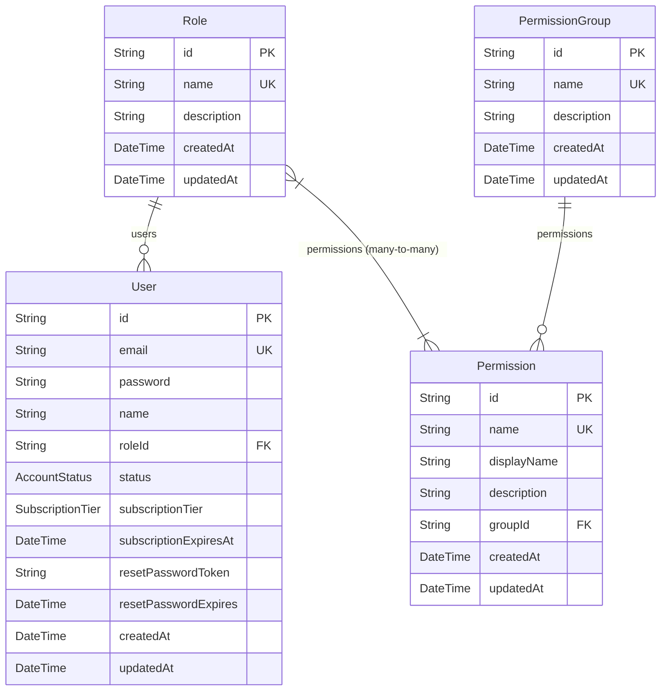
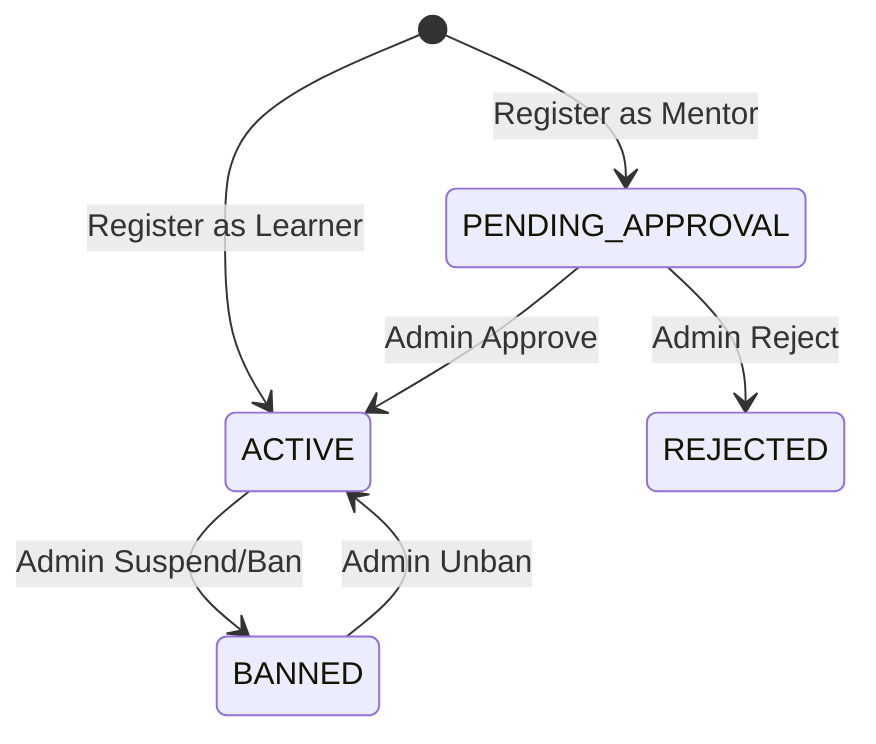

# Auth Service Schema

---

# `User` — Người dùng hệ thống

**Khối:** Auth Service  
**Mục đích:** Bảng gốc quản lý thông tin đăng nhập, trạng thái tài khoản và vai trò (Role). Bảng này là "Source of Truth" cho định danh người dùng.

## Enum liên quan
* `AccountStatus`: `PENDING_APPROVAL`, `ACTIVE`, `BANNED`, `REJECTED`.
* `SubscriptionTier`: `FREE`, `VIP`, `PRO`. Gói cước độc lập với Role (User có thể là `LEARNER` + `PRO` hoặc `MENTOR` + `FREE`).

## Cột (PostgreSQL)

| Cột | Kiểu | Khóa | Null | Mặc định | Mô tả |
|---|---|---|---|---|---|
| `id` | `String` | PK | N | `uuid()` | Khóa chính (UUID) |
| `email` | `String` | UK | N | | Email đăng nhập (duy nhất toàn hệ thống) |
| `password` | `String` | — | N | | Mật khẩu (đã hash bcrypt, work factor ≥ 10) |
| `name` | `String` | — | Y | | Tên hiển thị của người dùng |
| `roleId` | `String` | FK | N | | FK tham chiếu đến `Role.id` |
| `status` | `AccountStatus` | — | N | `ACTIVE` | Trạng thái tài khoản (điều khiển login, UI, feature access) |
| `subscriptionTier` | `SubscriptionTier` | — | N | `FREE` | Gói cước hiện tại (FREE / VIP / PRO) |
| `subscriptionExpiresAt` | `DateTime` | — | Y | | Ngày hết hạn gói cước VIP/PRO |
| `resetPasswordToken` | `String` | — | Y | | Token cấp phát khi quên mật khẩu |
| `resetPasswordExpires` | `DateTime` | — | Y | | Hạn sử dụng token quên mật khẩu |
| `createdAt` | `DateTime` | — | N | `now()` | Thời điểm tạo |
| `updatedAt` | `DateTime` | — | N | `@updatedAt` | Thời điểm cập nhật cuối |

## Quan hệ
**Tham chiếu ra (FK):**
- `roleId` → `Role.id`

## AccountStatus Lifecycle

| From | To | Action | Actor | Business Rule |
|---|---|---|---|---|
| *(new)* | `ACTIVE` | Register as Learner | Guest | — |
| *(new)* | `PENDING_APPROVAL` | Register as Mentor | Guest | — |
| `PENDING_APPROVAL` | `ACTIVE` | Approve Mentor | Admin | — |
| `PENDING_APPROVAL` | `REJECTED` | Reject Mentor | Admin | `BR-CFG-06`: rejection reason bắt buộc |
| `ACTIVE` | `BANNED` | Suspend/Ban | Admin | `BR-CFG-04`: invalidate JWT ngay lập tức |
| `BANNED` | `ACTIVE` | Unban | Admin | — |

## Delete Strategy
- **Soft Delete**: Đổi `status` thành `BANNED` (Admin)
- **Hard Delete**: Chỉ `SUPERADMIN` mới được phép (`BR-CFG-05`). Cascade xóa: `user_roadmaps`, `user_course_progress`, tokens.
- **Self-delete prevention**: Admin không thể xóa tài khoản chính mình (`BR-CFG-03`)

---

# `Role` — Vai trò phân quyền

**Khối:** Auth Service  
**Mục đích:** Lưu trữ các vai trò (VD: ADMIN, LEARNER, MENTOR, SUPERADMIN). Mỗi vai trò được cấp nhiều Permissions thông qua bảng trung gian ẩn `_RoleToPermission` của Prisma.

## Cột (PostgreSQL)

| Cột | Kiểu | Khóa | Null | Mặc định | Mô tả |
|---|---|---|---|---|---|
| `id` | `String` | PK | N | `uuid()` | Khóa chính (UUID) |
| `name` | `String` | UK | N | | Tên vai trò duy nhất (VD: `ADMIN`, `LEARNER`) |
| `description` | `String` | — | Y | | Mô tả chi tiết vai trò |
| `createdAt` | `DateTime` | — | N | `now()` | Thời điểm tạo |
| `updatedAt` | `DateTime` | — | N | `@updatedAt` | Thời điểm cập nhật cuối |

## Quan hệ
- `User[].roleId` → One-to-Many với User
- `Permission[]` → Many-to-Many (Prisma implicit `_RoleToPermission`)

## Default Roles (Seeded)
| Role | Permissions |
|------|-----------|
| `SUPERADMIN` | Tất cả permissions |
| `ADMIN` | Tất cả permissions |
| `LEARNER` | `RM.USER`, `LR.USER` |
| `MENTOR` | `RM.USER`, `LR.USER` |

---

# `PermissionGroup` — Nhóm quyền

**Khối:** Auth Service  
**Mục đích:** Gom nhóm các Permission theo chức năng nghiệp vụ (VD: SYSTEM_MANAGEMENT, USER_MANAGEMENT). Dùng để render Permission Matrix trên giao diện quản lý Role.

## Cột (PostgreSQL)

| Cột | Kiểu | Khóa | Null | Mặc định | Mô tả |
|---|---|---|---|---|---|
| `id` | `String` | PK | N | `uuid()` | Khóa chính (UUID) |
| `name` | `String` | UK | N | | Tên nhóm duy nhất (VD: `SYSTEM_MANAGEMENT`) |
| `description` | `String` | — | Y | | Mô tả nhóm quyền |
| `createdAt` | `DateTime` | — | N | `now()` | Thời điểm tạo |
| `updatedAt` | `DateTime` | — | N | `@updatedAt` | Thời điểm cập nhật cuối |

## Quan hệ
- `Permission[]` → One-to-Many (mỗi Permission thuộc 1 PermissionGroup)

## Default Groups (Seeded from `AppConstant.PMSGroup`)
| Group Name | Constant |
|-----------|----------|
| `SYSTEM_MANAGEMENT` | `AppConstant.PMSGroup.SYSTEM` |
| `USER_MANAGEMENT` | `AppConstant.PMSGroup.USER` |
| `ROADMAP_MANAGEMENT` | `AppConstant.PMSGroup.ROADMAP` |
| `LECTURER_REVIEW_MANAGEMENT` | `AppConstant.PMSGroup.LECTURER` |

---

# `Permission` — Quyền chi tiết

**Khối:** Auth Service  
**Mục đích:** Danh sách các quyền cụ thể theo format `MODULE.LEVEL` (VD: `SYS.AD`, `RM.USER`). Dùng để check quyền trên Backend (encode vào JWT) và toggle giao diện ở Frontend.

## Cột (PostgreSQL)

| Cột | Kiểu | Khóa | Null | Mặc định | Mô tả |
|---|---|---|---|---|---|
| `id` | `String` | PK | N | `uuid()` | Khóa chính (UUID) |
| `name` | `String` | UK | N | | Mã quyền duy nhất (VD: `SYS.AD`, `RM.USER`) |
| `displayName` | `String` | — | Y | | Tên hiển thị trên UI (VD: "Quản trị Roadmap") |
| `description` | `String` | — | Y | | Giải thích chi tiết quyền này |
| `groupId` | `String` | FK | Y | | FK tham chiếu đến `PermissionGroup.id` |
| `createdAt` | `DateTime` | — | N | `now()` | Thời điểm tạo |
| `updatedAt` | `DateTime` | — | N | `@updatedAt` | Thời điểm cập nhật cuối |

## Quan hệ
- `groupId` → `PermissionGroup.id` (Many-to-One)
- `Role[]` → Many-to-Many với Role (Prisma implicit `_RoleToPermission`)

## Default Permissions (Seeded from `APP_PERMISSIONS`)
| Code | Display Name | Group |
|------|-------------|-------|
| `SYS.AD` | Manage System Configuration | `SYSTEM_MANAGEMENT` |
| `RM.USER` | Sử dụng Roadmap (Explore, Clone) | `ROADMAP_MANAGEMENT` |
| `RM.AD` | Quản trị Roadmap | `ROADMAP_MANAGEMENT` |
| `LR.USER` | Xem và đánh giá Giảng viên | `LECTURER_REVIEW_MANAGEMENT` |
| `LR.AD` | Quản trị Đánh giá Giảng viên | `LECTURER_REVIEW_MANAGEMENT` |
| `USER.AD` | Manage Users | `USER_MANAGEMENT` |
