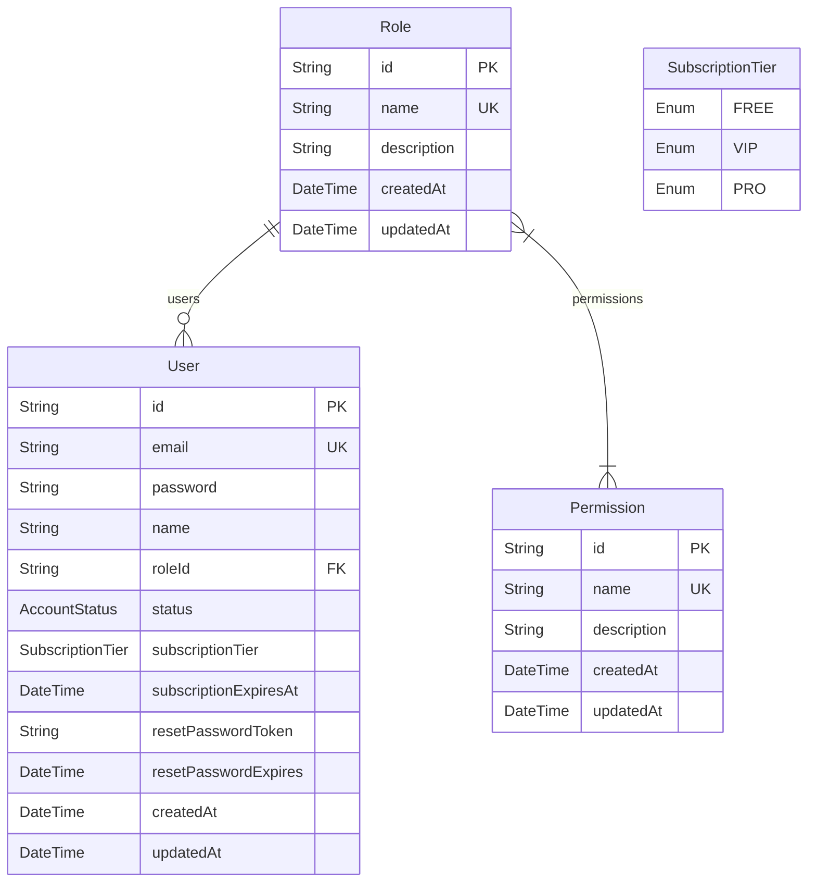

# Auth Service Schema

---

# `User` — Người dùng hệ thống

**Khối:** Auth Service  
**Mục đích:** Bảng gốc quản lý thông tin đăng nhập, trạng thái tài khoản, vai trò (Role) và gói cước (Subscription). Bảng này được gọi là "Source of Truth" cho định danh người dùng.

## Các Enum liên quan
* `AccountStatus`: `PENDING_APPROVAL`, `ACTIVE`, `BANNED`, `REJECTED`.
* `SubscriptionTier`: `FREE`, `VIP`, `PRO`. Trạng thái gói cước độc lập với Role.

## Cột (PostgreSQL)

| Cột | Kiểu | Khóa | Null | Mặc định | Mô tả |
|---|---|---|---|---|---|
| `id` | `String` | PK | N | `uuid()` | Khóa chính (UUID) |
| `email` | `String` | UK | N | | Email đăng nhập (duy nhất) |
| `password` | `String` | — | N | | Mật khẩu (đã hash bcrypt) |
| `name` | `String` | — | Y | | Tên hiển thị của người dùng |
| `roleId` | `String` | FK | N |  | Vai trò phân quyền trong hệ thống |
| `status` | `AccountStatus` | — | N | `ACTIVE` | Trạng thái tài khoản |
| `subscriptionTier`| `SubscriptionTier`| — | N | `FREE` | Gói cước hiện tại của người dùng |
| `subscriptionExpiresAt` | `DateTime` | — | Y | | Ngày hết hạn gói cước VIP/PRO |
| `resetPasswordToken` | `String` | — | Y | | Token cấp phát khi quên mật khẩu |
| `resetPasswordExpires` | `DateTime` | — | Y | | Hạn sử dụng token quên mật khẩu |
| `createdAt` | `DateTime` | — | N | `now()` | Thời điểm tạo |
| `updatedAt` | `DateTime` | — | N | `updatedAt` | Thời điểm cập nhật cuối |

## Quan hệ
**Tham chiếu ra (FK):**
- `roleId` → `Role`

---

# `Role` — Vai trò phân quyền

**Khối:** Auth Service  
**Mục đích:** Lưu trữ các vai trò (VD: Admin, Student, Mentor). Mỗi vai trò sẽ được cấp nhiều Permissions khác nhau thông qua bảng trung gian ẩn của Prisma.

## Cột (PostgreSQL)

| Cột | Kiểu | Khóa | Null | Mặc định | Mô tả |
|---|---|---|---|---|---|
| `id` | `String` | PK | N | `uuid()` | Khóa chính (UUID) |
| `name` | `String` | UK | N | | Tên vai trò duy nhất (VD: `ADMIN`) |
| `description` | `String` | — | Y | | Mô tả chi tiết vai trò này làm được gì |
| `createdAt` | `DateTime` | — | N | `now()` | Thời điểm tạo |
| `updatedAt` | `DateTime` | — | N | `updatedAt` | Thời điểm cập nhật cuối |

## Quan hệ
**Được tham chiếu bởi:**
- `User`.`roleId`
- Quan hệ Many-to-Many với `Permission` (Thông qua bảng trung gian tự động `_RoleToPermission`)

---

# `Permission` — Quyền chi tiết

**Khối:** Auth Service  
**Mục đích:** Danh sách các quyền cụ thể, chi tiết đến từng thao tác (VD: `course:read`, `roadmap:write`). Dùng để check quyền trên Backend và Toggle giao diện ở Frontend.

## Cột (PostgreSQL)

| Cột | Kiểu | Khóa | Null | Mặc định | Mô tả |
|---|---|---|---|---|---|
| `id` | `String` | PK | N | `uuid()` | Khóa chính (UUID) |
| `name` | `String` | UK | N | | Định danh quyền (VD: `roadmap:write`) |
| `description` | `String` | — | Y | | Giải thích chi tiết quyền này |
| `createdAt` | `DateTime` | — | N | `now()` | Thời điểm tạo |
| `updatedAt` | `DateTime` | — | N | `updatedAt` | Thời điểm cập nhật cuối |

## Quan hệ
**Được tham chiếu bởi:**
- Quan hệ Many-to-Many với `Role` (Thông qua bảng trung gian tự động `_RoleToPermission`)
