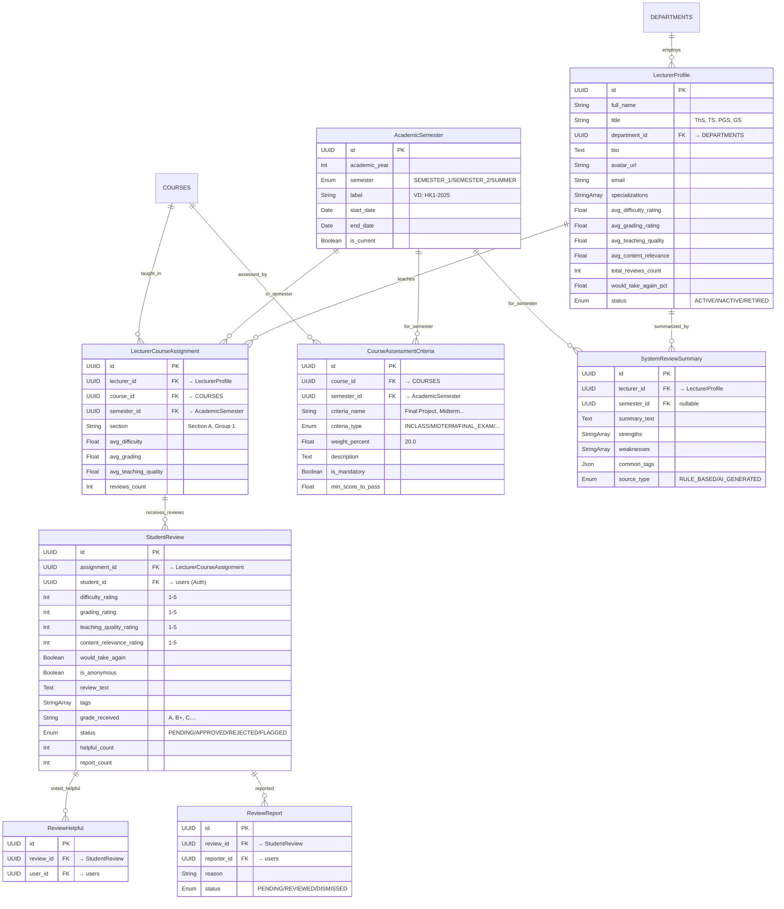

# Lecturer Review Service Schema (Enhanced)

> **Version:** 2.0 — Mở rộng từ `mentor-schema.md` gốc thành hệ thống Đánh giá Giảng viên toàn diện.

---

# `LecturerProfile` — Hồ sơ Giảng viên

**Khối:** Lecturer Review Service
**Mục đích:** Lưu trữ thông tin chi tiết về một giảng viên đại học. Giảng viên KHÔNG CÓ tài khoản đăng nhập (không liên kết với Auth Service), chỉ là một thực thể dữ liệu do Admin quản lý.

## Cột (PostgreSQL)

| Cột | Kiểu | Khóa | Null | Mặc định | Mô tả |
|---|---|---|---|---|---|
| `id` | `UUID` | PK | N | `uuid()` | Khóa chính |
| `full_name` | `String` | — | N | — | Tên đầy đủ giảng viên |
| `title` | `String` | — | Y | — | Học hàm/Học vị (ThS, TS, PGS, GS) |
| `department_id` | `UUID` | FK | N | — | Khoa trực thuộc → `DEPARTMENTS` |
| `bio` | `Text` | — | Y | — | Giới thiệu bản thân / quá trình công tác |
| `avatar_url` | `String` | — | Y | — | Link ảnh đại diện |
| `email` | `String` | — | Y | — | Email liên hệ (KHÔNG phải account) |
| `specializations` | `String[]` | — | Y | `[]` | Chuyên ngành |
| `avg_difficulty_rating` | `Float` | — | N | `0.0` | Denormalized avg (async update) |
| `avg_grading_rating` | `Float` | — | N | `0.0` | Denormalized avg |
| `avg_teaching_quality` | `Float` | — | N | `0.0` | Denormalized avg |
| `avg_content_relevance` | `Float` | — | N | `0.0` | Denormalized avg |
| `total_reviews_count` | `Int` | — | N | `0` | Tổng reviews APPROVED |
| `would_take_again_pct` | `Float` | — | Y | — | % muốn học lại |
| `status` | `LecturerStatus` | — | N | `ACTIVE` | ACTIVE / INACTIVE / RETIRED |
| `created_at` | `DateTime` | — | N | `now()` | — |
| `updated_at` | `DateTime` | — | N | `updatedAt` | — |

## Quan hệ
- `department_id` → `DEPARTMENTS.id`
- Được tham chiếu bởi: `LecturerCourseAssignment.lecturer_id`, `SystemReviewSummary.lecturer_id`

---

# `AcademicSemester` — Học kỳ

**Khối:** Lecturer Review Service
**Mục đích:** Quản lý các học kỳ (HK1, HK2, Hè) theo từng năm học. Dùng để filter teaching assignments, reviews, assessment criteria.

## Cột (PostgreSQL)

| Cột | Kiểu | Khóa | Null | Mặc định | Mô tả |
|---|---|---|---|---|---|
| `id` | `UUID` | PK | N | `uuid()` | Khóa chính |
| `academic_year` | `Int` | — | N | — | Năm học (VD: 2025) |
| `semester` | `SemesterEnum` | — | N | — | SEMESTER_1 / SEMESTER_2 / SUMMER |
| `label` | `String` | — | N | — | Display label (VD: "HK1-2025") |
| `start_date` | `Date` | — | Y | — | Ngày bắt đầu |
| `end_date` | `Date` | — | Y | — | Ngày kết thúc |
| `is_current` | `Boolean` | — | N | `false` | Học kỳ hiện tại |
| `created_at` | `DateTime` | — | N | `now()` | — |

## Ràng buộc
- `UNIQUE(academic_year, semester)`

---

# `LecturerCourseAssignment` — Phân công Giảng dạy

**Khối:** Lecturer Review Service
**Mục đích:** Ghi nhận thông tin một Giảng viên dạy một Môn học cụ thể vào một học kỳ cụ thể. Đây là đối tượng trọng tâm để sinh viên đánh giá — xác định chính xác "năm nào, GV nào dạy môn nào".

## Cột (PostgreSQL)

| Cột | Kiểu | Khóa | Null | Mặc định | Mô tả |
|---|---|---|---|---|---|
| `id` | `UUID` | PK | N | `uuid()` | Khóa chính |
| `lecturer_id` | `UUID` | FK | N | — | → `LecturerProfile` |
| `course_id` | `UUID` | FK | N | — | → `COURSES` (Admin) |
| `semester_id` | `UUID` | FK | N | — | → `AcademicSemester` |
| `section` | `String` | — | Y | — | Mã lớp/nhóm |
| `avg_difficulty` | `Float` | — | N | `0.0` | Denormalized |
| `avg_grading` | `Float` | — | N | `0.0` | Denormalized |
| `avg_teaching_quality` | `Float` | — | N | `0.0` | Denormalized |
| `reviews_count` | `Int` | — | N | `0` | Denormalized |
| `created_at` | `DateTime` | — | N | `now()` | — |
| `updated_at` | `DateTime` | — | N | `updatedAt` | — |

## Ràng buộc
- `UNIQUE(lecturer_id, course_id, semester_id, section)`

---

# `StudentReview` — Đánh giá của Sinh viên

**Khối:** Lecturer Review Service
**Mục đích:** Lưu trữ đánh giá multi-dimensional của sinh viên đối với giảng viên cho một môn học + học kỳ cụ thể.

## Các Enum liên quan
- `ReviewStatus`: `PENDING`, `APPROVED`, `REJECTED`, `FLAGGED`

## Cột (PostgreSQL)

| Cột | Kiểu | Khóa | Null | Mặc định | Mô tả |
|---|---|---|---|---|---|
| `id` | `UUID` | PK | N | `uuid()` | Khóa chính |
| `assignment_id` | `UUID` | FK | N | — | → `LecturerCourseAssignment` |
| `student_id` | `UUID` | FK | N | — | → `users` (Auth, luôn lưu) |
| `difficulty_rating` | `Int` | — | N | — | Scale 1-5 |
| `grading_rating` | `Int` | — | N | — | Scale 1-5 |
| `teaching_quality_rating` | `Int` | — | N | — | Scale 1-5 |
| `content_relevance_rating` | `Int` | — | N | — | Scale 1-5 |
| `would_take_again` | `Boolean` | — | N | — | Yes/No |
| `is_anonymous` | `Boolean` | — | N | `false` | Ẩn danh trên UI |
| `review_text` | `Text` | — | Y | — | Đánh giá định tính |
| `tags` | `String[]` | — | Y | `[]` | Preset tags |
| `grade_received` | `String` | — | Y | — | Điểm nhận (A, B+,...) |
| `attendance_mandatory` | `Boolean` | — | Y | — | Điểm danh bắt buộc? |
| `textbook_required` | `Boolean` | — | Y | — | Sách bắt buộc? |
| `status` | `ReviewStatus` | — | N | `PENDING` | Review status |
| `moderation_note` | `Text` | — | Y | — | Ghi chú Admin |
| `helpful_count` | `Int` | — | N | `0` | Denormalized |
| `report_count` | `Int` | — | N | `0` | Denormalized |
| `created_at` | `DateTime` | — | N | `now()` | — |
| `updated_at` | `DateTime` | — | N | `updatedAt` | — |

## Ràng buộc
- `UNIQUE(assignment_id, student_id)` — 1 SV / 1 GV-Course-Semester

---

# `ReviewHelpful` — Vote Helpful

## Cột
| Cột | Kiểu | Khóa | Null | Mô tả |
|---|---|---|---|---|
| `id` | `UUID` | PK | N | Khóa chính |
| `review_id` | `UUID` | FK | N | → `StudentReview` |
| `user_id` | `UUID` | FK | N | → `users` |
| `created_at` | `DateTime` | — | N | — |

## Ràng buộc
- `UNIQUE(review_id, user_id)`

---

# `ReviewReport` — Report Review

## Cột
| Cột | Kiểu | Khóa | Null | Mô tả |
|---|---|---|---|---|
| `id` | `UUID` | PK | N | Khóa chính |
| `review_id` | `UUID` | FK | N | → `StudentReview` |
| `reporter_id` | `UUID` | FK | N | → `users` |
| `reason` | `String` | — | N | Lý do report |
| `status` | `ReportStatus` | — | N | PENDING/REVIEWED/DISMISSED |
| `created_at` | `DateTime` | — | N | — |

---

# `CourseAssessmentCriteria` — Điều kiện Đánh giá Môn học

**Khối:** Lecturer Review Service
**Mục đích:** Định nghĩa cấu trúc đánh giá (grading weights) cho từng môn trong từng học kỳ. VD: "Data Structures — Final Project 20%, Midterm 20%, Final Exam 30%..."

## Các Enum liên quan
- `CriteriaType`: `INCLASS`, `MIDTERM`, `FINAL_EXAM`, `FINAL_PROJECT`, `ASSIGNMENT`, `LAB`, `PARTICIPATION`

## Cột (PostgreSQL)

| Cột | Kiểu | Khóa | Null | Mặc định | Mô tả |
|---|---|---|---|---|---|
| `id` | `UUID` | PK | N | `uuid()` | Khóa chính |
| `course_id` | `UUID` | FK | N | — | → `COURSES` |
| `semester_id` | `UUID` | FK | N | — | → `AcademicSemester` |
| `criteria_name` | `String` | — | N | — | VD: "Final Project" |
| `criteria_type` | `CriteriaType` | — | N | — | Type enum |
| `weight_percent` | `Float` | — | N | — | VD: 20.0 |
| `description` | `Text` | — | Y | — | VD: "Build a sorting visualizer" |
| `is_mandatory` | `Boolean` | — | N | `true` | Bắt buộc? |
| `min_score_to_pass` | `Float` | — | Y | — | Điểm tối thiểu |
| `created_at` | `DateTime` | — | N | `now()` | — |
| `updated_at` | `DateTime` | — | N | `updatedAt` | — |

## Ràng buộc
- `UNIQUE(course_id, semester_id, criteria_name)`
- Business rule: Tổng weight_percent cho 1 course + 1 semester phải = 100%

---

# `SystemReviewSummary` — Tổng hợp Hệ thống (RAG-ready)

**Khối:** Lecturer Review Service
**Mục đích:** Lưu trữ tổng hợp auto-generated (rule-based hoặc AI) từ reviews.

## Cột
| Cột | Kiểu | Khóa | Null | Mô tả |
|---|---|---|---|---|
| `id` | `UUID` | PK | N | Khóa chính |
| `lecturer_id` | `UUID` | FK | N | → `LecturerProfile` |
| `semester_id` | `UUID` | FK | Y | NULL = tổng hợp toàn bộ |
| `summary_text` | `Text` | — | N | Tổng hợp |
| `strengths` | `String[]` | — | Y | Điểm mạnh |
| `weaknesses` | `String[]` | — | Y | Điểm yếu |
| `common_tags` | `Json` | — | Y | `{ "Tough Grader": 45 }` |
| `generated_at` | `DateTime` | — | N | — |
| `source_type` | `Enum` | — | N | RULE_BASED / AI_GENERATED |
