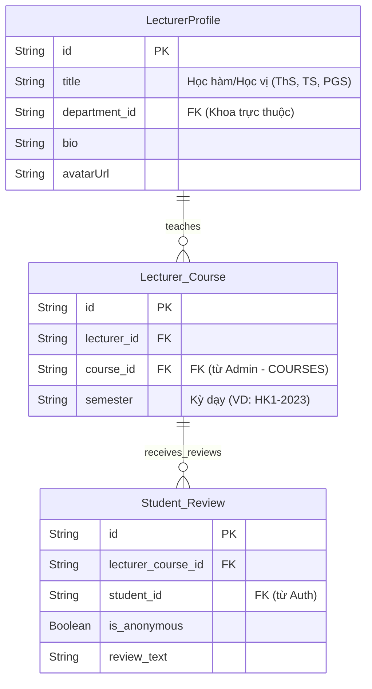

# Lecturer (Review) Service Schema

---

# `LecturerProfile` — Hồ sơ Giảng viên

**Khối:** Lecturer Service (formerly Mentor)  
**Mục đích:** Lưu trữ thông tin chi tiết về một giảng viên đại học. Giảng viên KHÔNG CÓ tài khoản đăng nhập (không liên kết với Auth Service), chỉ là một thực thể dữ liệu do Admin quản lý.

## Cột (PostgreSQL)

| Cột | Kiểu | Khóa | Null | Mặc định | Mô tả |
|---|---|---|---|---|---|
| `id` | `String` | PK | N | `uuid()` | Khóa chính (UUID) |
| `title` | `String` | — | Y | | Học hàm/Học vị (VD: ThS, TS, PGS) |
| `department_id` | `String` | FK | N | | Khoa trực thuộc (Tham chiếu ngầm sang Admin Service - `DEPARTMENTS`) |
| `bio` | `String` | — | Y | | Mô tả giới thiệu bản thân / quá trình công tác |
| `avatarUrl` | `String` | — | Y | | Link ảnh đại diện |
| `createdAt` | `DateTime` | — | N | `now()` | Thời điểm tạo hồ sơ |
| `updatedAt` | `DateTime` | — | N | `updatedAt` | Thời điểm cập nhật cuối |

## Quan hệ
**Được tham chiếu bởi:**
- `Lecturer_Course`.`lecturer_id`

---

# `Lecturer_Course` — Sự phân công Giảng dạy

**Khối:** Lecturer Service  
**Mục đích:** Ghi nhận thông tin một Giảng viên dạy một Môn học cụ thể vào một học kỳ cụ thể. Đây là đối tượng trọng tâm để sinh viên đánh giá (Review).

## Cột (PostgreSQL)

| Cột | Kiểu | Khóa | Null | Mặc định | Mô tả |
|---|---|---|---|---|---|
| `id` | `String` | PK | N | `uuid()` | Khóa chính (UUID) |
| `lecturer_id` | `String` | FK | N | | Giảng viên dạy (Tham chiếu sang `LecturerProfile`) |
| `course_id` | `String` | FK | N | | Môn học (Tham chiếu ngầm sang Admin Service - `COURSES`) |
| `semester` | `String` | — | N | | Học kỳ giảng dạy (VD: `HK1-2023`) |
| `createdAt` | `DateTime` | — | N | `now()` | Thời điểm tạo |
| `updatedAt` | `DateTime` | — | N | `updatedAt` | Thời điểm cập nhật cuối |

## Ràng buộc / chỉ mục
- `UNIQUE(lecturer_id, course_id, semester)` — Mỗi giảng viên chỉ có 1 bản ghi dạy 1 môn trong 1 học kỳ.

## Quan hệ
**Tham chiếu ra (FK):**
- `lecturer_id` → `LecturerProfile`.`id`

**Được tham chiếu bởi:**
- `Student_Review`.`lecturer_course_id`

---

# `Student_Review` — Đánh giá của Sinh viên

**Khối:** Lecturer Service  
**Mục đích:** Lưu trữ các đánh giá (Reviews) của sinh viên đối với một giảng viên trong một môn học cụ thể.

## Cột (PostgreSQL)

| Cột | Kiểu | Khóa | Null | Mặc định | Mô tả |
|---|---|---|---|---|---|
| `id` | `String` | PK | N | `uuid()` | Khóa chính (UUID) |
| `lecturer_course_id`| `String` | FK | N | | Lớp học được đánh giá (Tham chiếu sang `Lecturer_Course`) |
| `student_id` | `String` | FK | N | | Sinh viên đánh giá (Tham chiếu ngầm sang Auth Service) |
| `difficulty_rating` | `Int` | — | N | | Đánh giá độ khó môn học (Scale 1-5) |
| `grading_rating` | `Int` | — | N | | Đánh giá độ gắt gao khi chấm điểm (Scale 1-5) |
| `is_anonymous` | `Boolean`| — | N | `false` | Cờ ẩn danh sinh viên trên UI |
| `review_text` | `String` | — | Y | | Nội dung đánh giá định tính (Text) |
| `createdAt` | `DateTime` | — | N | `now()` | Thời điểm tạo |
| `updatedAt` | `DateTime` | — | N | `updatedAt` | Thời điểm cập nhật cuối |

## Ràng buộc / chỉ mục
- `UNIQUE(lecturer_course_id, student_id)` — Mỗi sinh viên chỉ được đánh giá 1 lần cho 1 tổ hợp Giảng viên - Môn học.

## Quan hệ
**Tham chiếu ra (FK):**
- `lecturer_course_id` → `Lecturer_Course`.`id`
