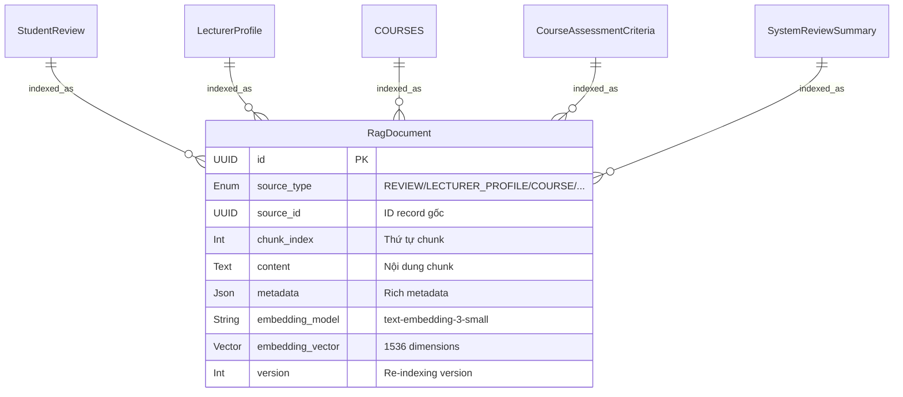

# RAG (Retrieval-Augmented Generation) Schema

> **Status:** Planned — Future Phase
> **Mục đích:** Data layer cho AI chatbot, chuẩn bị sẵn cấu trúc để index structured data từ toàn bộ hệ thống IUROADMAP.



---

# `RagDocument` — Document Chunks cho RAG Pipeline

**Khối:** RAG / AI Service (future)
**Mục đích:** Lưu trữ các document chunks đã được chuẩn hóa, gắn metadata, và embedding vector. Đây là bảng trung tâm cho vector search — cho phép AI chatbot tìm kiếm semantic trên toàn bộ dữ liệu hệ thống.

## Các Enum liên quan
- `RagSourceType`: `REVIEW`, `LECTURER_PROFILE`, `COURSE`, `ASSESSMENT_CRITERIA`, `SYSTEM_SUMMARY`

## Cột (PostgreSQL + pgvector extension)

| Cột | Kiểu | Khóa | Null | Mặc định | Mô tả |
|---|---|---|---|---|---|
| `id` | `UUID` | PK | N | `uuid()` | Khóa chính |
| `source_type` | `RagSourceType` | — | N | — | Loại record gốc |
| `source_id` | `UUID` | — | N | — | ID của record gốc (FK logic, không enforce) |
| `chunk_index` | `Int` | — | N | — | Thứ tự chunk trong document (0-indexed) |
| `content` | `Text` | — | N | — | Nội dung chunk đã chuẩn hóa |
| `metadata` | `Json` | — | N | — | Rich metadata cho hybrid filtering |
| `embedding_model` | `String` | — | N | — | Model name (VD: `"text-embedding-3-small"`) |
| `embedding_vector` | `Vector(1536)` | — | N | — | Embedding vector (pgvector) |
| `version` | `Int` | — | N | `1` | Version tracking cho re-indexing |
| `created_at` | `DateTime` | — | N | `now()` | — |
| `updated_at` | `DateTime` | — | N | `updatedAt` | — |

## Chỉ mục (Indexes)

```sql
-- pgvector index for similarity search
CREATE INDEX idx_rag_embedding ON rag_documents
  USING ivfflat (embedding_vector vector_cosine_ops) WITH (lists = 100);

-- Metadata filtering indexes
CREATE INDEX idx_rag_source ON rag_documents (source_type, source_id);
CREATE INDEX idx_rag_version ON rag_documents (version);

-- GIN index for JSON metadata filtering
CREATE INDEX idx_rag_metadata ON rag_documents USING gin (metadata);
```

---

## Metadata Schema

### Review Document Metadata
```json
{
  "source": "review",
  "lecturer_id": "uuid",
  "lecturer_name": "Dr. Nguyen Van A",
  "course_id": "uuid",
  "course_name": "Data Structures and Algorithms",
  "course_credits": 4,
  "semester_id": "uuid",
  "semester_label": "HK2-2025",
  "department": "Computer Science",
  "difficulty_rating": 4,
  "grading_rating": 3,
  "teaching_quality_rating": 5,
  "content_relevance_rating": 4,
  "would_take_again": true,
  "tags": ["Clear Explanations", "Tough Grader"],
  "grade_received": "B+",
  "is_anonymous": false,
  "avg_rating": 4.0
}
```

### Lecturer Profile Metadata
```json
{
  "source": "lecturer_profile",
  "lecturer_id": "uuid",
  "lecturer_name": "Dr. Nguyen Van A",
  "title": "TS",
  "department": "Computer Science",
  "specializations": ["AI", "Databases"],
  "total_reviews": 45,
  "avg_teaching_quality": 4.5,
  "would_take_again_pct": 78.0
}
```

### Course Assessment Metadata
```json
{
  "source": "assessment_criteria",
  "course_id": "uuid",
  "course_name": "Data Structures and Algorithms",
  "semester_label": "HK2-2025",
  "criteria": [
    { "name": "Final Project", "type": "FINAL_PROJECT", "weight": 20.0 },
    { "name": "Midterm Exam", "type": "MIDTERM", "weight": 20.0 },
    { "name": "Final Exam", "type": "FINAL_EXAM", "weight": 30.0 }
  ]
}
```

---

## Document Templates (Chunking)

### Template 1: Review Chunk
```
[REVIEW] Lecturer: Dr. Nguyen Van A (TS, Khoa CNTT)
Course: Data Structures and Algorithms (4 TC)
Semester: HK2-2025
Assessment: Final Project 20%, Midterm 20%, Final Exam 30%, Lab 20%, Participation 10%
---
Ratings: Difficulty 4/5, Grading 3/5, Teaching Quality 5/5, Content Relevance 4/5
Would Take Again: Yes
Tags: Clear Explanations, Caring, Tough Grader
Grade: B+
Review: "Thầy A giải thích thuật toán rất rõ ràng với ví dụ thực tế. Final project (sorting visualizer) khó nhưng rất bổ ích. Chấm điểm công bằng nhưng khắt khe về code quality."
```

### Template 2: Lecturer Profile Chunk
```
[LECTURER] Dr. Nguyen Van A, Tiến sĩ
Khoa: Công nghệ Thông tin
Chuyên ngành: AI, Databases, Web Development
Giới thiệu: 10 năm kinh nghiệm giảng dạy, nghiên cứu về Machine Learning ứng dụng.
---
Tổng quan: 45 reviews, Avg Teaching Quality 4.5/5, 78% muốn học lại
Các môn đã dạy: DSA (HK2-2025, HK2-2024), Database (HK1-2025), AI (HK1-2024)
```

### Template 3: Assessment Criteria Chunk
```
[ASSESSMENT] Data Structures and Algorithms (4 TC)
Semester: HK2-2025
Cấu trúc đánh giá:
- Participation (Inclass): 10%
- Lab Exercises: 20%
- Midterm Exam: 20%
- Final Project: 20% — "Xây dựng sorting visualizer bằng React"
- Final Exam: 30%
Tổng: 100%
```

---

## RAG Pipeline Architecture

```
┌──────────────────────────────────────────┐
│              ETL Pipeline                 │
│  Trigger: Event-driven (review APPROVED,  │
│  lecturer updated, criteria changed)      │
├──────────────────────────────────────────┤
│  1. Fetch source record from PostgreSQL   │
│  2. Render document using template        │
│  3. Chunk document (recursive splitting)  │
│  4. Enrich metadata                       │
│  5. Generate embedding (OpenAI API)       │
│  6. Upsert into rag_documents             │
└──────────────┬───────────────────────────┘
               │
               ▼
┌──────────────────────────────────────────┐
│           Query Pipeline                  │
│  User: "GV nào dạy DSA tốt nhất?"       │
├──────────────────────────────────────────┤
│  1. Embed user query                      │
│  2. Hybrid search (vector + keyword)      │
│  3. Metadata filter (department, course)  │
│  4. Re-rank top-K chunks                  │
│  5. Feed context to LLM                   │
│  6. Generate answer with citations        │
└──────────────────────────────────────────┘
```

## Yêu cầu kỹ thuật

| Yêu cầu | Giá trị |
|---|---|
| **PostgreSQL Extension** | `pgvector` (CREATE EXTENSION vector) |
| **Embedding Model** | `text-embedding-3-small` (OpenAI) hoặc multilingual model |
| **Vector Dimension** | 1536 (khớp với model) |
| **Search Type** | Hybrid: cosine similarity + BM25 keyword |
| **Chunk Size** | 500-1000 tokens, overlap 100 tokens |
| **Re-indexing** | Event-driven + daily cron job |
