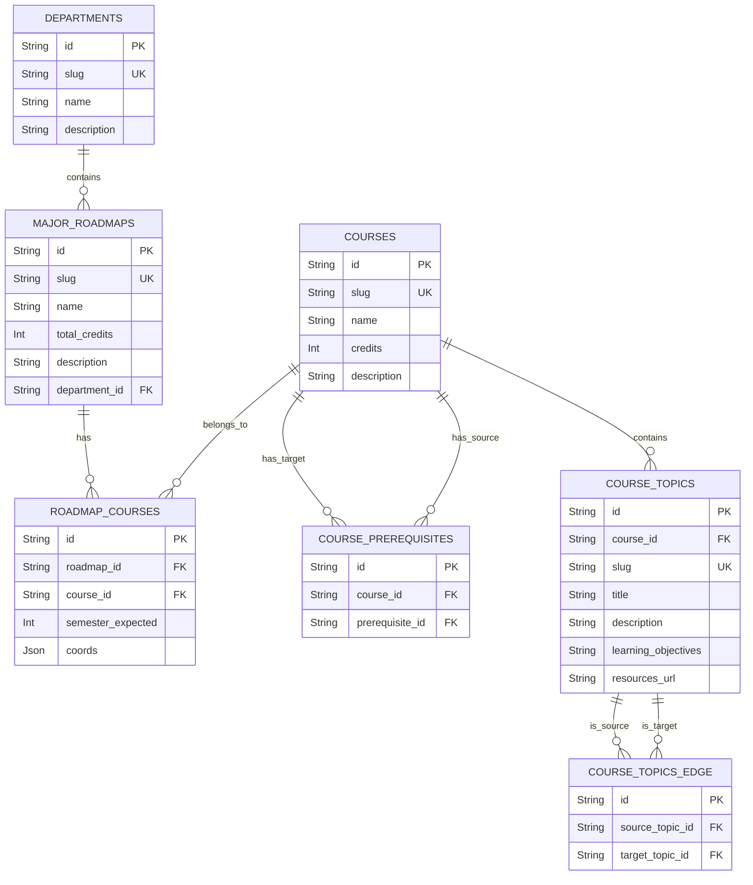

# Admin/Roadmap Service Schema

---

# `DEPARTMENTS` — Khoa / Phòng ban

**Khối:** Admin/Roadmap Service  
**Mục đích:** Lưu trữ danh sách các khoa trong trường (VD: Khoa CNTT, Khoa Kinh tế).

## Cột (PostgreSQL)

| Cột | Kiểu | Khóa | Null | Mặc định | Mô tả |
|---|---|---|---|---|---|
| `id` | `String` | PK | N | `uuid()` | Khóa chính (UUID) |
| `slug` | `String` | UK | N | | Đường dẫn tĩnh (VD: `information-technology`) |
| `name` | `String` | — | N | | Tên khoa |
| `description` | `String` | — | Y | | Mô tả chi tiết về khoa |
| `created_at` | `DateTime` | — | N | `now()` | Thời điểm tạo |
| `updated_at` | `DateTime` | — | N | `updatedAt` | Thời điểm cập nhật cuối |

## Quan hệ
**Được tham chiếu bởi:**
- `MAJOR_ROADMAPS`.`department_id`

---

# `MAJOR_ROADMAPS` — Lộ trình ngành học

**Khối:** Admin/Roadmap Service  
**Mục đích:** Lưu trữ thông tin về một ngành học cụ thể thuộc một khoa.

## Cột (PostgreSQL)

| Cột | Kiểu | Khóa | Null | Mặc định | Mô tả |
|---|---|---|---|---|---|
| `id` | `String` | PK | N | `uuid()` | Khóa chính (UUID) |
| `slug` | `String` | UK | N | | Đường dẫn tĩnh (VD: `software-engineering`) |
| `name` | `String` | — | N | | Tên lộ trình ngành |
| `total_credits` | `Int` | — | N | | Tổng số tín chỉ yêu cầu của ngành |
| `description` | `String` | — | Y | | Mô tả chi tiết lộ trình |
| `department_id` | `String` | FK | N | | Thuộc về khoa nào |
| `created_at` | `DateTime` | — | N | `now()` | Thời điểm tạo |
| `updated_at` | `DateTime` | — | N | `updatedAt` | Thời điểm cập nhật cuối |

## Quan hệ
**Tham chiếu ra (FK):**
- `department_id` → `DEPARTMENTS`

**Được tham chiếu bởi:**
- `ROADMAP_COURSES`.`roadmap_id`

---

# `COURSES` — Thư viện Môn học chung

**Khối:** Admin/Roadmap Service  
**Mục đích:** Thư viện gốc lưu trữ thông tin chung của tất cả các môn học.

## Cột (PostgreSQL)

| Cột | Kiểu | Khóa | Null | Mặc định | Mô tả |
|---|---|---|---|---|---|
| `id` | `String` | PK | N | `uuid()` | Khóa chính (UUID) |
| `slug` | `String` | UK | N | | Mã môn học hoặc đường dẫn tĩnh |
| `name` | `String` | — | N | | Tên môn học |
| `credits` | `Int` | — | N | | Số tín chỉ của môn học |
| `description` | `String` | — | Y | | Mô tả môn học |
| `created_at` | `DateTime` | — | N | `now()` | Thời điểm tạo |
| `updated_at` | `DateTime` | — | N | `updatedAt` | Thời điểm cập nhật cuối |

## Quan hệ
**Được tham chiếu bởi:**
- `ROADMAP_COURSES`.`course_id`
- `COURSE_PREREQUISITES`.`course_id` (Target)
- `COURSE_PREREQUISITES`.`prerequisite_id` (Source)
- `COURSE_TOPICS`.`course_id`

---

# `ROADMAP_COURSES` — Môn học thuộc Lộ trình (N-N)

**Khối:** Admin/Roadmap Service  
**Mục đích:** Bảng trung gian (Junction table) map giữa Môn học và Lộ trình ngành.

## Cột (PostgreSQL)

| Cột | Kiểu | Khóa | Null | Mặc định | Mô tả |
|---|---|---|---|---|---|
| `id` | `String` | PK | N | `uuid()` | Khóa chính (UUID) |
| `roadmap_id` | `String` | FK | N | | Lộ trình ngành tương ứng |
| `course_id` | `String` | FK | N | | Môn học tương ứng |
| `coords` | `Json` | — | Y | | Tọa độ (X, Y) dùng để vẽ node môn học |
| `semester_expected` | `Int` | — | Y | | Học kỳ dự kiến học môn này trong lộ trình |
| `created_at` | `DateTime` | — | N | `now()` | Thời điểm tạo |
| `updated_at` | `DateTime` | — | N | `updatedAt` | Thời điểm cập nhật cuối |

## Ràng buộc / chỉ mục
- `UNIQUE(roadmap_id, course_id)`

## Quan hệ
**Tham chiếu ra (FK):**
- `roadmap_id` → `MAJOR_ROADMAPS`
- `course_id` → `COURSES`

---

# `COURSE_PREREQUISITES` — Môn Tiên quyết

**Khối:** Admin/Roadmap Service  
**Mục đích:** Định nghĩa mối quan hệ môn học tiên quyết.

## Cột (PostgreSQL)

| Cột | Kiểu | Khóa | Null | Mặc định | Mô tả |
|---|---|---|---|---|---|
| `id` | `String` | PK | N | `uuid()` | Khóa chính (UUID) |
| `course_id` | `String` | FK | N | | Môn học chính (Target) |
| `prerequisite_id`| `String` | FK | N | | Môn tiên quyết bắt buộc phải học trước (Source) |
| `created_at` | `DateTime` | — | N | `now()` | Thời điểm tạo |
| `updated_at` | `DateTime` | — | N | `updatedAt` | Thời điểm cập nhật cuối |

## Ràng buộc / chỉ mục
- `UNIQUE(course_id, prerequisite_id)`

## Quan hệ
**Tham chiếu ra (FK):**
- `course_id` → `COURSES`
- `prerequisite_id` → `COURSES`

---

# `COURSE_TOPICS` — Bài học / Chủ đề của môn

**Khối:** Admin/Roadmap Service  
**Mục đích:** Các bài học nhỏ (Topics) bên trong một môn học cụ thể.

## Cột (PostgreSQL)

| Cột | Kiểu | Khóa | Null | Mặc định | Mô tả |
|---|---|---|---|---|---|
| `id` | `String` | PK | N | `uuid()` | Khóa chính (UUID) |
| `course_id` | `String` | FK | N | | Thuộc môn học nào |
| `slug` | `String` | UK | N | | Đường dẫn tĩnh của topic |
| `title` | `String` | — | N | | Tiêu đề bài học |
| `description` | `String` | — | Y | | Mô tả chi tiết |
| `learning_objectives` | `String` | — | Y | | Mục tiêu đầu ra của bài học |
| `resources_url` | `String` | — | Y | | Link tài liệu học tập |
| `created_at` | `DateTime` | — | N | `now()` | Thời điểm tạo |
| `updated_at` | `DateTime` | — | N | `updatedAt` | Thời điểm cập nhật cuối |

## Quan hệ
**Tham chiếu ra (FK):**
- `course_id` → `COURSES`

**Được tham chiếu bởi:**
- `COURSE_TOPICS_EDGE`.`source_topic_id`
- `COURSE_TOPICS_EDGE`.`target_topic_id`

---

# `COURSE_TOPICS_EDGE` — Liên kết các bài học

**Khối:** Admin/Roadmap Service  
**Mục đích:** Quan hệ thứ tự học giữa các Topics trong cùng một môn học.

## Cột (PostgreSQL)

| Cột | Kiểu | Khóa | Null | Mặc định | Mô tả |
|---|---|---|---|---|---|
| `id` | `String` | PK | N | `uuid()` | Khóa chính (UUID) |
| `source_topic_id` | `String` | FK | N | | Bài học trước (Source) |
| `target_topic_id` | `String` | FK | N | | Bài học sau (Target) |
| `created_at` | `DateTime` | — | N | `now()` | Thời điểm tạo |

## Quan hệ
**Tham chiếu ra (FK):**
- `source_topic_id` → `COURSE_TOPICS`
- `target_topic_id` → `COURSE_TOPICS`
