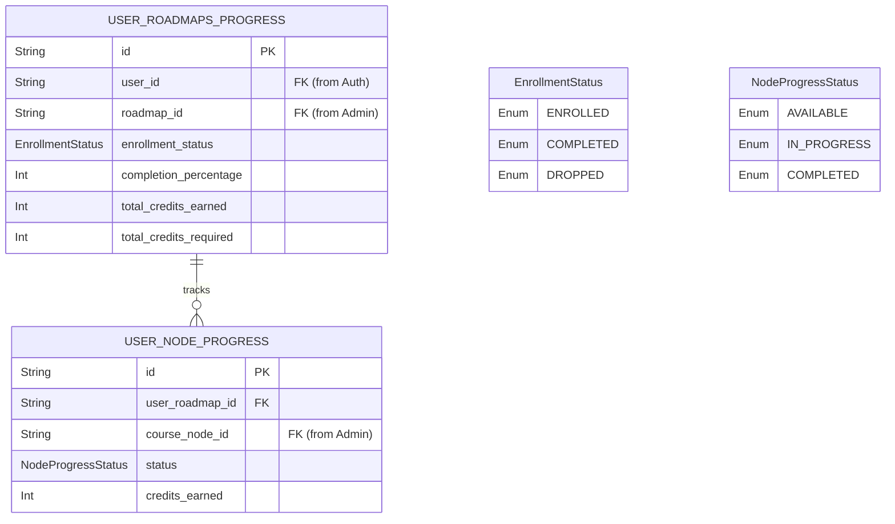

# User Service Schema

---

# `USER_ROADMAPS_PROGRESS` — Tiến độ Lộ trình

**Khối:** User Service  
**Mục đích:** Lưu trữ tiến độ tổng thể của một sinh viên đối với một lộ trình học tập (Roadmap) cụ thể.

## Các Enum liên quan
* `EnrollmentStatus`: `ENROLLED` (Đang học), `COMPLETED` (Hoàn thành), `DROPPED` (Bỏ học).

## Cột (PostgreSQL)

| Cột | Kiểu | Khóa | Null | Mặc định | Mô tả |
|---|---|---|---|---|---|
| `id` | `String` | PK | N | `uuid()` | Khóa chính (UUID) |
| `user_id` | `String` | FK | N | | User học viên (Tham chiếu ngầm sang Auth Service) |
| `roadmap_id` | `String` | FK | N | | Lộ trình đang học (Tham chiếu ngầm sang Admin Service) |
| `enrollment_status` | `EnrollmentStatus` | — | N | | Trạng thái ghi danh |
| `completion_percentage` | `Int` | — | N | | % Tiến độ hoàn thành (0-100) |
| `total_credits_earned`| `Int` | — | N | | Tổng tín chỉ đã đạt được |
| `total_credits_required`| `Int`| — | N | | Tổng tín chỉ yêu cầu của Roadmap này |
| `created_at` | `DateTime` | — | N | `now()` | Thời điểm tạo |
| `updated_at` | `DateTime` | — | N | `updatedAt` | Thời điểm cập nhật cuối |

## Ràng buộc / chỉ mục
- `UNIQUE(user_id, roadmap_id)` — Một user chỉ ghi danh 1 lần vào cùng 1 lộ trình.

## Quan hệ
**Được tham chiếu bởi:**
- `USER_NODE_PROGRESS`.`user_roadmap_id`

---

# `USER_NODE_PROGRESS` — Tiến độ Môn học

**Khối:** User Service  
**Mục đích:** Lưu trữ chi tiết tiến độ của từng môn học (Course Node) bên trong một Lộ trình mà sinh viên đang theo học.

## Các Enum liên quan
* `NodeProgressStatus`: `AVAILABLE` (Đủ điều kiện học), `IN_PROGRESS` (Đang học), `COMPLETED` (Đã qua môn).

## Cột (PostgreSQL)

| Cột | Kiểu | Khóa | Null | Mặc định | Mô tả |
|---|---|---|---|---|---|
| `id` | `String` | PK | N | `uuid()` | Khóa chính (UUID) |
| `user_roadmap_id` | `String` | FK | N | | Thuộc về bản ghi tiến độ Roadmap nào |
| `course_node_id` | `String` | FK | N | | Môn học cụ thể (Tham chiếu ngầm sang Admin Service) |
| `status` | `NodeProgressStatus` | — | N | | Trạng thái học của môn này |
| `credits_earned` | `Int` | — | N | | Tín chỉ lấy được từ môn này (0 nếu chưa qua) |
| `created_at` | `DateTime` | — | N | `now()` | Thời điểm tạo |
| `updated_at` | `DateTime` | — | N | `updatedAt` | Thời điểm cập nhật cuối |

## Ràng buộc / chỉ mục
- `UNIQUE(user_roadmap_id, course_node_id)` — Trong 1 lộ trình, mỗi môn chỉ có 1 bản ghi tiến độ.

## Quan hệ
**Tham chiếu ra (FK):**
- `user_roadmap_id` → `USER_ROADMAPS_PROGRESS`
