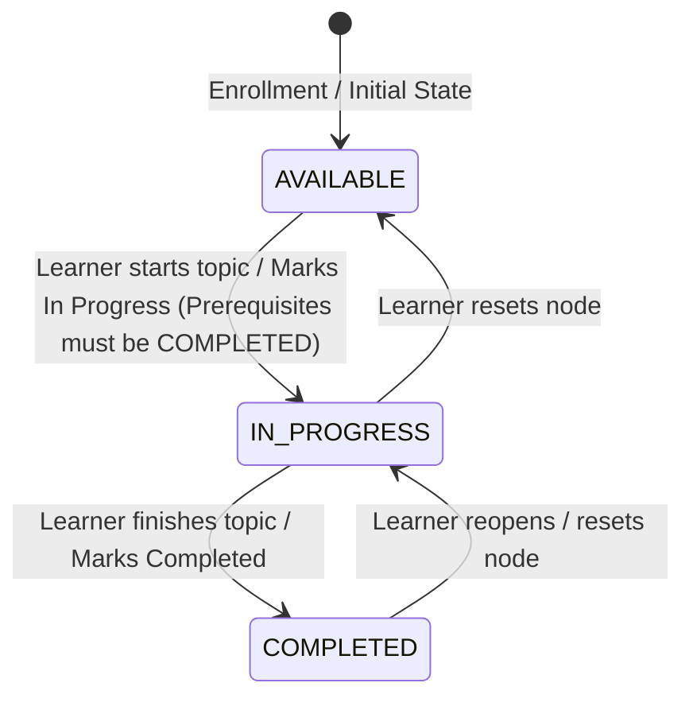
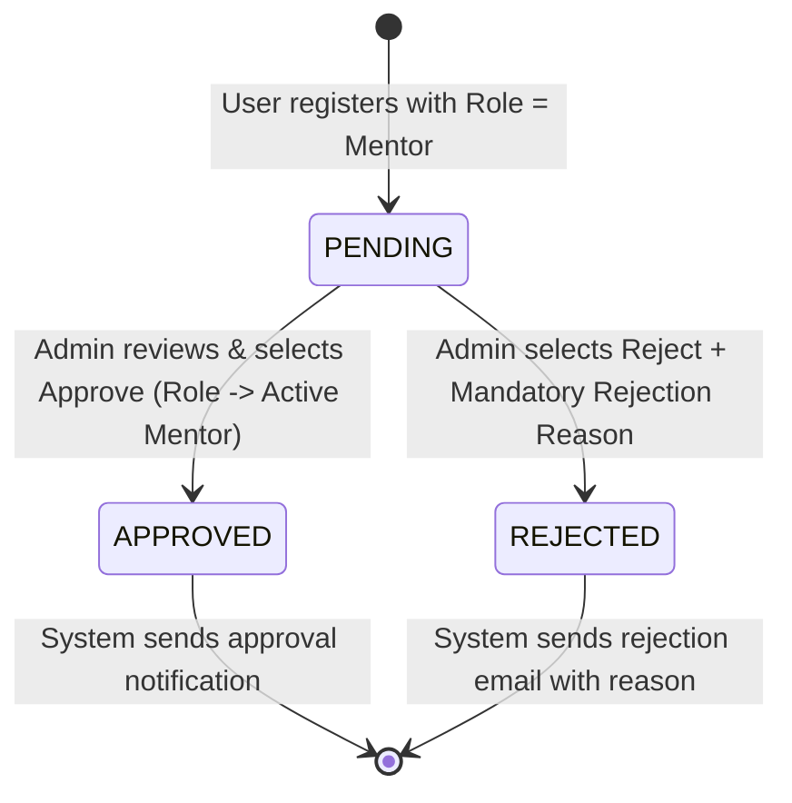
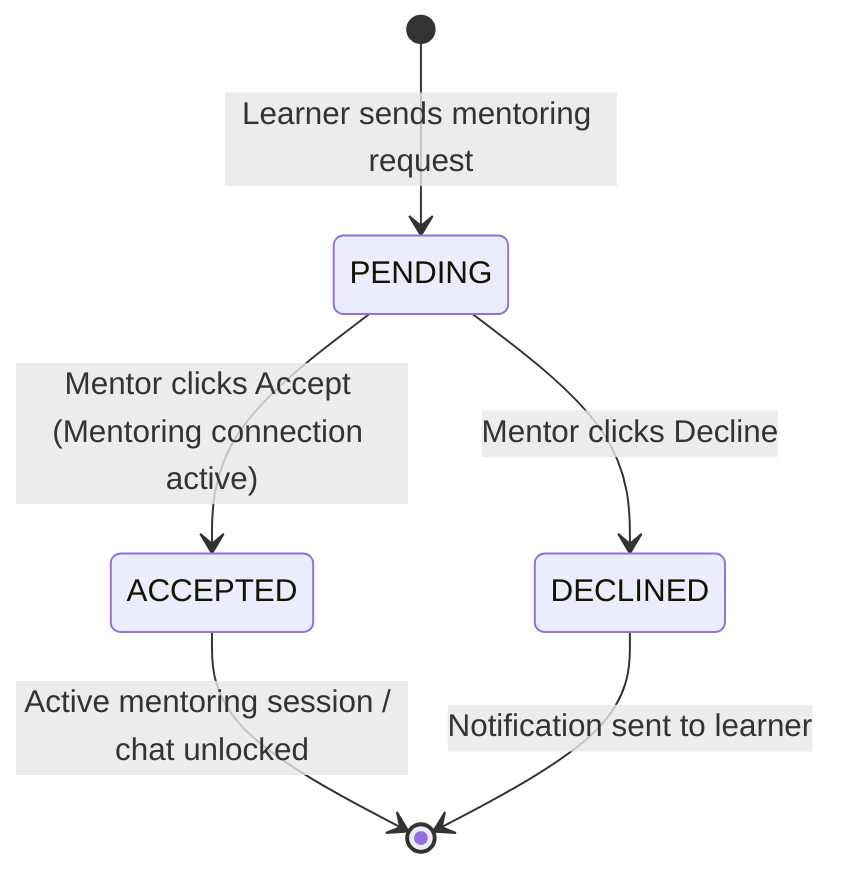

# IUROADMAP — Master Software Requirements Specification (SRS) & System Architecture Overview

**Document Version:** 3.0 (Structured per `documentsv3` modular feature methodology)  
**System Name:** IUROADMAP (AI-Powered Career & Academic Roadmap Platform)  
**Target Audience:** Product Owners, Business Analysts, Quality Assurance Engineers, System Architects, and Software Engineers.

---

## I. PREFACE & PURPOSE

This document serves as the foundational **Software Requirements Specification (SRS)** for the **IUROADMAP** platform. Drawing on the structural rigor of the `documentsv3` methodology, this documentation separates pure business flows, detailed use cases, and functional requirements by core feature modules:
- **Module 01: Learner Portal (`01-learner-portal.md`)** — Onboarding, major exploration, roadmap cloning, and macro/micro progress tracking.
- **Module 02: Admin Management (`02-admin-management.md`)** — Department/Major CRUD, visual node/edge roadmap canvas editors (`UC-A03`, `UC-A04`), user directory governance, and mentor verification.
- **Module 03: Mentor Portal (`03-mentor-portal.md`)** — Incoming request handling (`UC-M01` to `UC-M03`), availability scheduling, real-time messaging (`UC-M05`), and learner feedback (`UC-M06`).

---

## II. SYSTEM INTRODUCTION & SCOPE

**IUROADMAP** is an enterprise-grade educational platform engineered to bridge academic curriculum structures with dynamic, personalized career progression paths. It assists learners in discovering academic majors, cloning structured roadmaps, tracking course dependencies via visual graph networks, and mastering micro-learning topics step-by-step. Simultaneously, it equips educators and administrators with visual drag-and-drop roadmap canvases (`Canvas/Graph API`) and facilitates 1-on-1 mentorship connections.

### Core Microservices Boundaries
1. **`api-gateway`** (`Port 8080`): Central request router, rate limiter, JWT validation proxy, and Swagger hub (`/docs`).
2. **`auth-service`** (`Port 3000`): User authentication, JWT issuance, password resets, and role claims (`Learner`, `Mentor`, `Admin`).
3. **`user-service`** (`Port 4000`): Learner roadmap enrollments, cloned macro/micro graphs, and node progress calculation.
4. **`mentor-service`** (`Port 4001`): Mentor directory, verification workflow, availability slots, chat, and feedback tracking.
5. **`admin-service`** (`Port 4100`): Curriculum definitions, departments, majors, courses, and visual graph layouts (`X/Y` coordinates & prerequisite edges).

---

## III. GLOSSARY & DEFINITIONS

| Term | Definition |
| :--- | :--- |
| **Use Case (UC)** | A structured interaction between an Actor (`Learner`, `Mentor`, `Admin`, `Guest`) and the system to achieve a discrete business goal. Includes Triggers, Inputs, Outputs, Main Flow, Alternative Flows, and Invariants. |
| **Functional Requirement (FR)** | A precise behavioral statement specifying how the software must operate, process user inputs, validate state, and persist domain entities. |
| **Non-Functional Requirement (NFR)** | Quality attributes, performance SLAs, security constraints, and operational standards governing system execution. |
| **Macro Roadmap (Graph)** | The department/major-level visual structure consisting of **Course Nodes** and **Prerequisite Edges** (`UC-07`, `UC-A03`). |
| **Micro Roadmap (Graph)** | The course-level learning progression consisting of **Topic/Module Nodes** and their prerequisite sequences (`UC-08`, `UC-A04`). |
| **Course Status** | The learning state of a course node: `AVAILABLE` (Blue), `IN_PROGRESS` (Yellow), or `COMPLETED` (Green). |
| **Prerequisite Edge** | A directed dependency `(Node A -> Node B)` ensuring `Node B` cannot transition to `IN_PROGRESS` or `COMPLETED` until `Node A` is `COMPLETED`. |

---

## IV. CORE BUSINESS STATE MACHINES

### 1. Course Node Learning State Machine (`UC-07`, `UC-08`, `UC-09`)

*Business Rule:* A node whose prerequisite edges originate from uncompleted nodes (`status != COMPLETED`) is locked and cannot transition directly to `IN_PROGRESS` or `COMPLETED`.

### 2. Mentor Verification State Machine (`UC-A06`)

### 3. Mentoring Request State Machine (`UC-M01`, `UC-M02`, `UC-M03`)

---

## V. NON-FUNCTIONAL REQUIREMENTS (NFR)

### 1. Operational Requirements
- **NFR-OP-01 (Accessibility):** The system shall be accessible across modern web browsers (`Google Chrome`, `Safari`, `Microsoft Edge`, `Firefox`) on both desktop and mobile viewports via responsive layouts (`Expo Router` / React web).
- **NFR-OP-02 (Availability):** The system shall operate with `99.9%` uptime (`24/7/365`), excluding scheduled maintenance windows announced at least 48 hours in advance.
- **NFR-OP-03 (Backup & Recovery):** Automated database snapshots (`Prisma / PostgreSQL`) shall occur at least once every 24 hours with point-in-time recovery (`RPO <= 1 hour`, `RTO <= 4 hours`).
- **NFR-OP-04 (Error Handling):** All unhandled exceptions shall be caught by global NestJS exception filters (`HttpExceptionFilter`), returning standardized JSON `{ data: null, message: "<friendly_error>", statusCode: <int> }` without leaking stack traces.

### 2. Legal & Privacy Requirements
- **NFR-LG-01 (Data Protection):** All personally identifiable information (`PII`: email addresses, full names, medical/profile history) shall be protected at rest and in transit (`TLS 1.3`).
- **NFR-LG-02 (Consent & Third Parties):** User data shall never be sold or transferred to external third-party advertisers without explicit, opt-in user consent.
- **NFR-LG-03 (Right to Erasure):** The system shall support user account deletion requests, anonymizing historical transaction records while deleting direct login credentials and tokens.

### 3. Usability Requirements
- **NFR-US-01 (Simplicity):** First-time learners must be able to complete core onboarding journeys (`Register -> Browse Major -> Clone Roadmap -> View Graph`) in `no more than 3 to 4 logical steps`.
- **NFR-US-02 (Clarity of Messaging):** System messages (`success`, `warning`, `error`) must be written in plain, human-readable language (avoiding SQL error codes or raw HTTP dump strings).
- **NFR-US-03 (Progress Visibility):** Roadmap progress (`Total Credits`, `Completed Courses`, `Percentage Bar`) shall be continuously visible on the learner dashboard and canvas headers.

### 4. Humanity & Ergonomics Requirements
- **NFR-HM-01 (Visual Comfort):** The UI shall support high-contrast typography (`Inter` / `Roboto`), clear visual hierarchy (`H1 -> H6`), and color-accessible node badges (`Blue`, `Yellow`, `Green` plus distinct icon indicators).
- **NFR-HM-02 (Cognitive Load):** The system shall prevent notification fatigue by batching non-urgent progress updates and presenting complex curriculum graphs with smooth zoom/pan controls.

### 5. Performance Requirements
- **NFR-PF-01 (Page & API Response Times):**
  - Standard page loads and dashboard queries: `<= 3.0 seconds` (`95th percentile`).
  - Authentication operations (`Login`, `Register`, `Token Refresh`): `<= 2.0 seconds`.
  - Node status updates (`Mark Topic Completed`, `Drag Node Save`): `<= 1.0 second`.
- **NFR-PF-02 (Concurrency):** The backend microservice cluster (`Redis` + `NestJS`) shall support `100 to 1,000 concurrent active users` without degradation below SLAs.
- **NFR-PF-03 (Real-Time Synchronicity):** Progress changes and chat messages (`UC-M05`) shall propagate to active sessions in real-time or near real-time (`<= 500ms`).

### 6. Maintainability Requirements
- **NFR-MN-01 (Code Quality):** Codebases strictly follow microservice separation, NestJS dependency injection, DTO strict typing (`class-validator`), and automated unit testing (`npm test --workspaces`).
- **NFR-MN-02 (Extensibility):** New service modules must integrate via the API Gateway (`app.setGlobalPrefix('api')`) and declare Swagger schemas (`@nestjs/swagger`) at `/docs`.
- **NFR-MN-03 (Audit Logging):** All administrative mutations (`Create Department`, `Verify Mentor`, `Delete Course`) must generate structured audit log traces.

### 7. Support & Documentation Requirements
- **NFR-SP-01 (User Help):** The system shall expose a self-service FAQ hub and an integrated feedback/hotline submission form.
- **NFR-SP-02 (Developer Docs):** Every microservice must expose live OpenAPI (`v3`) specifications mounted at `http://localhost:<PORT>/docs`.

### 8. Security Requirements
- **NFR-SC-01 (Password Hashing):** User passwords shall be hashed using `bcrypt` (work factor `>= 10`) or `Argon2` before persistence; plain text passwords are never logged or stored.
- **NFR-SC-02 (Authentication & Authorization):** Protected endpoints require valid JWT headers (`Authorization: Bearer <token>`). Role guards (`RolesGuard`) enforce strict separation between `Learner`, `Mentor`, and `Admin` permissions.
- **NFR-SC-03 (Session Expiration):** JWT access tokens expire after configurable intervals (`e.g., 3600s / 1 hour`) with refresh token rotation stored in secure Redis cache.
- **NFR-SC-04 (Vulnerability Mitigation):** Parameterized queries via `Prisma ORM` prevent SQL Injection (`SQLi`). Input sanitization (`whitelist: true, forbidNonWhitelisted: true`) prevents Cross-Site Scripting (`XSS`) and mass assignment attacks.

### 9. Interface Requirements
- **NFR-IF-01 (User Interface):** Responsive, dynamic canvas layouts supporting drag-and-drop course node manipulation (`Canvas/Graph API`) and mobile touch interaction.
- **NFR-IF-02 (System Interface):** Inter-service and client-server communication exclusively over RESTful JSON APIs over HTTP/HTTPS.
- **NFR-IF-03 (Database Interface):** Relational schema management centralized in `libs/shared-db` via `Prisma Client`, ensuring referential integrity across users, departments, roadmaps, courses, and mentoring records.

---

## VI. DOCUMENTATION MATRIX

| Module ID | Document File | Core Scope & Features Covered |
| :--- | :--- | :--- |
| **MOD-01** | [`01-learner-portal.md`](./01-learner-portal.md) | Learner Registration (`UC-01`), Login (`UC-02`), Browse Majors (`UC-03`), Major Details (`UC-04`), Clone Major (`UC-05`), My Roadmaps (`UC-06`), Macro Canvas View (`UC-07`), Micro Course View (`UC-08`), Mark Completed (`UC-09`). |
| **MOD-02** | [`02-admin-management.md`](./02-admin-management.md) | Department CRUD (`UC-A01`), Major CRUD (`UC-A02`), Macro Roadmap Canvas Editor (`UC-A03`), Micro Topic Canvas Editor (`UC-A04`), User Directory CRUD (`UC-A05`), Mentor Verification (`UC-A06`). |
| **MOD-03** | [`03-mentor-portal.md`](./03-mentor-portal.md) | View Request List (`UC-M01`), Accept Request (`UC-M02`), Decline Request (`UC-M03`), Manage Availability Slots (`UC-M04`), Chat with Learner (`UC-M05`), Give Feedback & Rating (`UC-M06`). |
