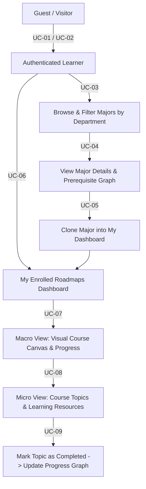

# Module 01: Learner Portal Specification

**Document Version:** 3.0  
**Parent Document:** [`00-master-srs-overview.md`](./00-master-srs-overview.md)  
**Scope:** Covers all guest onboarding, major exploration, roadmap enrollment, and macro/micro progress tracking use cases (`UC-01` to `UC-09`).

---

## 1. Feature Summary & Business Flow

The Learner Portal is the core end-user interface of **IUROADMAP**. It empowers guests and registered learners to onboard, explore academic curricula across departments, clone customized macro-roadmaps into their personal dashboard, visualize prerequisite course graphs, and track topic-level micro-learning milestones.

---

## 2. Use Case Specifications & Separated Requirements

### UC-01: User Registration

#### Identification
| Item | Description |
| :--- | :--- |
| **Use Case ID** | `UC-01` |
| **Name** | User Registration |
| **Actor** | Guest |
| **Description** | User creates a new account to access personalized features such as dashboard, roadmap cloning, and progress tracking. |
| **Trigger** | User selects **"Register"** on the authentication landing screen. |

#### Inputs & Outputs
- **Inputs:** `Email`, `Password`, `Confirm Password`, `Role` (`Learner` or `Mentor`).
- **Outputs:** New user account record created in database; redirection to the Dashboard (`UC-06`) with issued JWT session.
- **Messages:** `"Registration successful"`, `"Email already exists"`, `"Password does not match"`, `"Email format is invalid"`, `"Please fill in all required fields"`, `"System error, please try again"`.

#### Basic Course (Main Flow)
| Step | Actor Action | System Response |
| :---: | :--- | :--- |
| **1** | Click **"Register"** button. | **1.1** Display registration form with email, password, confirm password, and role selector. |
| **2** | Select target role (`Learner` or `Mentor`). | **2.1** System records selected role in local form state. |
| **3** | Enter `Email`, `Password`, and `Confirm Password`. | **3.1** Validate real-time input format and password match. |
| **4** | Submit registration form. | **4.1** Check email uniqueness against `users` table. |
| **5** | — | **5.1** Hash password (`bcrypt`) and create new account with selected role. |
| **6** | View registration result. | **6.1** Show success notification: `"Registration successful"`. |
| **7** | — | **7.1** Issue JWT access/refresh tokens and redirect to Dashboard (`UC-06`). |

#### Alternative Flows
- **A1 – Email Already Exists (Step 4):** If email is already registered, display `"Email already exists"`. User remains on form.
- **A2 – Invalid Email Format (Step 3):** If email fails regex validation, display `"Email format is invalid"`.
- **A3 – Password Mismatch (Step 3):** If `Password != Confirm Password`, display `"Password does not match"`.
- **A4 – Missing Fields (Step 3/4):** If any required field is blank upon submission, display `"Please fill in all required fields"`.
- **A5 – System Error (Step 5):** If database connection or hashing fails, display `"System error, please try again"`.

#### Preconditions & Postconditions
- **Preconditions:** User is not authenticated/logged in.
- **Postconditions (Success):** Account created in `users` table; user logged in; navigated to Dashboard.
- **Postconditions (Failure):** No account created; form state preserved with error highlights.

#### User Story
> *As a guest, I want to register a new account so that I can access personalized learning features and save my roadmap progress.*

#### Separated Functional & Data Requirements (`UC-01`)
1. **The Scope of Work:** Executed during onboarding sprint; requires frontend validation hooks, backend `AuthController.register` endpoint, and DTO class validation.
2. **The Scope of Product:** Core onboarding gate allowing external visitors to join the platform.
3. **Functional & Data Requirements:**
   - **a. Functional Requirements:**
     - `FR-01.1:` The system shall display the registration form requiring `Email`, `Password`, `Confirm Password`, and `Role` (`Learner` / `Mentor`).
     - `FR-01.2:` The system shall check if all required fields are filled and display validation errors if empty.
     - `FR-01.3:` The system shall validate the email format (`@IsEmail()`).
     - `FR-01.4:` The system shall verify that `Password` and `Confirm Password` match precisely before submitting to API.
     - `FR-01.5:` The backend (`auth-service`) shall check uniqueness of the inputted email against the `shared-db` database.
     - `FR-01.6:` The backend shall securely hash the password and insert the user record with the selected role (`LEARNER` / `MENTOR`).
     - `FR-01.7:` Upon creation, the system shall issue a Bearer JWT, display `"Registration successful"`, and redirect to Dashboard (`/dashboard`).
     - `FR-01.8:` The system shall catch any validation or server exception and display the corresponding user-friendly error message.
   - **b. Data Requirements:**
     - `DR-01.1:` `Email` must be unique, valid string format, `max 255 characters`.
     - `DR-01.2:` `Password` must meet complexity rules (`min 8 chars`, at least 1 number and letter).
     - `DR-01.3:` `Role` must be strictly restricted to `LEARNER` or `MENTOR` enum values (`ADMIN` cannot be registered publicly).

---

### UC-02: User Login

#### Identification
| Item | Description |
| :--- | :--- |
| **Use Case ID** | `UC-02` |
| **Name** | User Login |
| **Actor** | Guest |
| **Description** | Registered user authenticates into the system using valid credentials to unlock dashboard, roadmaps, and chat features. |
| **Trigger** | User selects **"Login"** on the top navigation bar. |

#### Inputs & Outputs
- **Inputs:** `Email`, `Password`.
- **Outputs:** Authenticated JWT Bearer token; redirection to target page or Dashboard (`UC-06`).
- **Messages:** `"Login successful"`, `"Invalid email or password"`, `"Email format is invalid"`, `"Please fill in all required fields"`, `"Please log in to continue"`, `"System error, please try again"`.

#### Basic Course (Main Flow)
| Step | Actor Action | System Response |
| :---: | :--- | :--- |
| **1** | Click **"Login"** button. | **1.1** Display login form. |
| **2** | Enter `Email` and `Password`. | **2.1** Validate client-side input format. |
| **3** | Submit login form. | **3.1** Verify credentials against encrypted password in database. |
| **4** | — | **4.1** Generate JWT access and refresh tokens. |
| **5** | View login result. | **5.1** Show notification: `"Login successful"`. |
| **6** | — | **6.1** Redirect to Dashboard (`UC-06`) or previously requested secure route. |

#### Alternative Flows
- **A1 – Invalid Credentials (Step 3):** If email is not found or password hash does not verify, display `"Invalid email or password"`.
- **A2 – Invalid Email Format (Step 2):** If email regex fails, display `"Email format is invalid"`.
- **A3 – Missing Fields (Step 2):** If either email or password is blank, display `"Please fill in all required fields"`.
- **A4 – Unauthorized Access Interception (Trigger):** If unauthenticated user attempts to access a protected URL (`/dashboard`, `/enroll`), redirect to Login screen with prompt: `"Please log in to continue"`.
- **A5 – System Error (Step 3/4):** If auth service or database fails, display `"System error, please try again"`.

#### Preconditions & Postconditions
- **Preconditions:** User already has an active account in the system.
- **Postconditions (Success):** User logged in; JWT token stored securely; redirected to Dashboard.
- **Postconditions (Failure):** User remains unauthenticated on Login screen.

#### User Story
> *As a registered user, I want to log into my account so that I can access my learning roadmaps, track progress, and communicate with mentors.*

#### Separated Functional & Data Requirements (`UC-02`)
1. **The Scope of Work:** Authentication execution phase; requires JWT strategy (`JwtAuthGuard`), Passport module, and login form component.
2. **The Scope of Product:** Primary security checkpoint controlling access to all protected user and roadmap endpoints.
3. **Functional & Data Requirements:**
   - **a. Functional Requirements:**
     - `FR-02.1:` The system shall display the login form requiring `Email` and `Password`.
     - `FR-02.2:` The system shall check if fields are filled and display an error message if empty.
     - `FR-02.3:` The system shall validate the format of the inputted email address.
     - `FR-02.4:` The backend shall verify the inputted email and compare `Password` against stored `bcrypt` hash.
     - `FR-02.5:` The system shall redirect unauthenticated users to the login page with `"Please log in to continue"` if they attempt to access protected endpoints.
     - `FR-02.6:` Upon successful authentication, the system shall return a Bearer JWT, redirect to Dashboard, and display `"Login successful"`.
     - `FR-02.7:` The system shall display `"Invalid email or password"` for incorrect credentials without revealing whether the email or the password was incorrect (security hardening).
   - **b. Data Requirements:**
     - `DR-02.1:` Valid login credential payload matching existing `users` table record.
     - `DR-02.2:` Access token lifespan: `1 hour` (`3600s`); Refresh token lifespan: `7 days`.

---

### UC-03: Browse Majors

#### Identification
| Item | Description |
| :--- | :--- |
| **Use Case ID** | `UC-03` |
| **Name** | Browse Majors |
| **Actor** | Guest / Learner |
| **Description** | User discovers academic roadmaps by browsing, filtering by department, and searching through a catalog of available majors. |
| **Trigger** | User selects **"Explore Majors"** from the navigation menu. |

#### Inputs & Outputs
- **Inputs:** `Department Filter` (one or more department slugs/checkboxes), `Search Keyword` (text query matching major name or description).
- **Outputs:** Grouped list of majors by department (`Department Name -> Majors`). Each major card displays `Name`, `Description`, `Credits`, `Total Courses`, and action links (`View Details`, `Clone Major`).
- **Messages:** `"No majors available"`, `"No matching results"`, `"System error, please try again"`.

#### Basic Course (Main Flow)
| Step | Actor Action | System Response |
| :---: | :--- | :--- |
| **1** | Open **"Explore Majors"** page. | **1.1** Display majors catalog layout with search bar and department filters. |
| **2** | — | **2.1** Fetch all active departments and their child majors (`GET /api/v1/explore/majors`). |
| **3** | View catalog. | **3.1** Display majors grouped accurately by their parent department. |
| **4** | Select a specific department filter. | **4.1** Dynamically filter displayed major cards to match selected department(s). |
| **5** | Enter keyword into search bar. | **5.1** Dynamically filter majors whose name or description contains the keyword. |
| **6** | View filtered results. | **6.1** Display matching major cards with clear credit/course statistics. |
| **7** | Click **"View"** on a major card. | **7.1** Navigate to Major Details view (`UC-04`). |
| **8** | Click **"Clone Major"** on a card. | **8.1** Initiate Roadmap Cloning workflow (`UC-05`). |

#### Alternative Flows
- **A1 – No Majors in System (Step 2):** If database contains zero active majors, display empty state: `"No majors available"`.
- **A2 – No Matching Results (Step 6):** If department filter or search query yields zero matching majors, display `"No matching results"`.
- **A3 – System Error (Step 2/6):** If backend query fails, display `"System error, please try again"`.

#### Preconditions & Postconditions
- **Preconditions:** System contains pre-existing records of academic departments and majors.
- **Postconditions (Success):** User successfully browses, searches, or filters majors; can trigger view or clone actions.
- **Postconditions (Failure):** No major data displayed; error or empty state shown.

#### User Story
> *As a learner, I want to browse majors grouped by department and search by keyword so that I can discover the ideal academic learning roadmap for my career aspirations.*

#### Separated Functional & Data Requirements (`UC-03`)
1. **The Scope of Work:** Exploration catalog implementation; requires API Gateway `ExploreRoadmapsController.getMajorsByDepartment`, Prisma include queries, and responsive card grid.
2. **The Scope of Product:** Discovery engine allowing prospective learners to explore all available academic paths.
3. **Functional & Data Requirements:**
   - **a. Functional Requirements:**
     - `FR-03.1:` The system shall display a list of all academic departments stored in the database.
     - `FR-03.2:` The system shall display majors grouped under their parent departments by default.
     - `FR-03.3:` The system shall provide a text-based search capable of filtering majors by name or description in real-time.
     - `FR-03.4:` The system shall provide a dropdown or checkbox list to allow users to filter by `Department`.
     - `FR-03.5:` The system shall display `Name`, `Description`, `Total Credits Required`, and `Course Count` for every major card.
     - `FR-03.6:` The system shall provide a `"View Details"` navigation link (`/majors/:slug`) on each major card (`UC-04`).
     - `FR-03.7:` The system shall provide a `"Clone Major"` action button on each card (`UC-05`).
     - `FR-03.8:` The system shall display empty states (`"No majors available"` or `"No matching results"`) gracefully.
   - **b. Data Requirements:**
     - `DR-03.1:` Query must perform efficient eager/lazy loading of department relationships (`Prisma: include { majors: { include: { _count: { select: { courses: true } } } } }`).
     - `DR-03.2:` Major entities must have valid `id`, `slug`, `name`, and `creditsRequired >= 0`.

---

### UC-04: View Major Details

#### Identification
| Item | Description |
| :--- | :--- |
| **Use Case ID** | `UC-04` |
| **Name** | View Major Details |
| **Actor** | Guest / Learner |
| **Description** | User views detailed metadata of a selected major, including its complete course structure, credit distribution, and prerequisite learning sequence. |
| **Trigger** | User clicks **"View Details"** from Browse Majors (`UC-03`). |

#### Inputs & Outputs
- **Inputs:** `Major Slug` or `Major ID` (via URL parameter `GET /majors/:slug`).
- **Outputs:** Full major metadata (`Name`, `Description`, `Total Credits`, `Total Courses`); Course Structure List (`Course Name`, `Credits`, `Description`); Prerequisite Learning Graph (`Node A -> Node B`); `"Enroll / Clone"` action button.
- **Messages:** `"Major not found"`, `"No courses available in this major"`, `"System error, please try again"`.

#### Basic Course (Main Flow)
| Step | Actor Action | System Response |
| :---: | :--- | :--- |
| **1** | Click **"View Details"** on a major card. | **1.1** Navigate to Major Details page (`/majors/:slug`). |
| **2** | — | **2.1** Validate `Major Slug/ID` and fetch major metadata (`GET /api/v1/roadmaps/preview/:slug`). |
| **3** | — | **3.1** Load course nodes and prerequisite relationships (`edges`). |
| **4** | View metadata & overview. | **4.1** Display major title, total required credits, and comprehensive description. |
| **5** | View course list & graph. | **5.1** Display ordered list of courses with credit values and description previews. |
| **6** | — | **6.1** Render preview of the visual prerequisite graph network. |
| **7** | Click **"Enroll / Clone Major"**. | **7.1** Navigate to Clone Major confirmation (`UC-05`). |

#### Alternative Flows
- **A1 – Major Not Found (Step 2):** If `Major Slug` does not exist in the database, display `404 Not Found` with message `"Major not found"`.
- **A2 – No Courses Available (Step 3):** If major has no associated course nodes, display overview and warning: `"No courses available in this major"`.
- **A3 – No Prerequisites (Step 3):** If courses exist but have zero prerequisite edges defined, display courses as a flat list without graph arrows.
- **A4 – System Error (Step 2/3):** If database retrieval fails, display `"System error, please try again"`.

#### Preconditions & Postconditions
- **Preconditions:** Major exists in the system database.
- **Postconditions (Success):** User views complete curriculum breakdown and prerequisite sequence; understands learning progression before enrolling.
- **Postconditions (Failure):** Error displayed; user cannot view curriculum details.

#### User Story
> *As a learner, I want to inspect the complete course list and prerequisite dependencies of a major so that I can verify its academic depth before cloning it into my roadmap dashboard.*

#### Separated Functional & Data Requirements (`UC-04`)
1. **The Scope of Work:** Curriculum preview feature; requires API Gateway preview route, graph visualization previewer, and course card layout.
2. **The Scope of Product:** Detailed transparency layer enabling learners to evaluate academic programs.
3. **Functional & Data Requirements:**
   - **a. Functional Requirements:**
     - `FR-04.1:` The system shall validate the provided `Major ID / Slug` and display `"Major not found"` (`404`) if invalid.
     - `FR-04.2:` The system shall retrieve and display core `Major Information` (`Name`, `Description`, `Total credits`, `Total courses`).
     - `FR-04.3:` The system shall retrieve and display the `Course Structure` list (`Course name`, `Credits`, `Description`).
     - `FR-04.4:` The system shall display `"No courses available in this major"` if the selected major has zero assigned courses.
     - `FR-04.5:` The system shall retrieve and visually display the learning sequence based on course prerequisite relationships (`prerequisites / edges`).
     - `FR-04.6:` The system shall display courses as a standard list without dependency connectors if no prerequisite edges exist.
     - `FR-04.7:` The system shall provide an `"Enroll / Clone"` button that triggers `UC-05`.
     - `FR-04.8:` The system shall display `"System error, please try again"` upon any backend failure.
   - **b. Data Requirements:**
     - `DR-04.1:` `Major Slug` must be a valid URL-safe string.
     - `DR-04.2:` Preview query must return public data (`auth token` optional for preview, mandatory for enrollment).

---

### UC-05: Clone Major

#### Identification
| Item | Description |
| :--- | :--- |
| **Use Case ID** | `UC-05` |
| **Name** | Clone Major |
| **Actor** | Authenticated Learner |
| **Description** | Learner clones/enrolls in a major roadmap to establish a personal tracking instance on their dashboard (`user_roadmaps`). |
| **Trigger** | Learner clicks **"Clone Major"** from Browse Majors (`UC-03`) or View Major Details (`UC-04`). |

#### Inputs & Outputs
- **Inputs:** `Major Slug` or `Major ID`, Bearer `Access Token` (`POST /api/v1/roadmaps/:slug/enroll`).
- **Outputs:** Personalized user roadmap record (`user_roadmaps`) initialized with default status (`AVAILABLE`) for all root course nodes; redirection to Dashboard (`UC-06`).
- **Messages:** `"Enrollment successful"`, `"You are already enrolled in this major"`, `"Please log in to continue"`, `"System error, please try again"`.

#### Basic Course (Main Flow)
| Step | Actor Action | System Response |
| :---: | :--- | :--- |
| **1** | Click **"Clone Major"** button. | **1.1** Check client JWT authentication state. |
| **2** | — | **2.1** Prompt login modal / redirect to Login (`UC-02`) if guest. |
| **3** | Confirm enrollment prompt (`"Clone this roadmap to your dashboard?"`). | **3.1** Send `POST /api/v1/roadmaps/:slug/enroll` with Bearer JWT header. |
| **4** | — | **4.1** Validate `Major Slug` and check if user is already enrolled (`user_roadmaps`). |
| **5** | — | **5.1** Create `user_roadmaps` record linked to `userId` and `majorRoadmapId`. |
| **6** | — | **6.1** Initialize node tracking: set all course nodes without prerequisites to `AVAILABLE`. |
| **7** | View result. | **7.1** Display notification: `"Enrollment successful"` (`201 Created`). |
| **8** | — | **8.1** Redirect user to My Roadmaps Dashboard (`UC-06`). |

#### Alternative Flows
- **A1 – User Not Authenticated (Step 1/2):** If access token is missing or expired, display `"Please log in to continue"` and redirect to `UC-02`.
- **A2 – Already Enrolled (Step 4):** If user already has an active `user_roadmaps` entry for this major, return `400 Bad Request` with message: `"You are already enrolled in this major"`.
- **A3 – Major Not Found (Step 4):** If target major slug is invalid, return `404 Not Found`.
- **A4 – System Error (Step 5/6):** If transactional cloning fails, roll back database state and display `"System error, please try again"`.

#### Preconditions & Postconditions
- **Preconditions:** Major exists; learner is authenticated with a valid Bearer token.
- **Postconditions (Success):** Personalized `user_roadmaps` instance created; course node tracking entries established; user redirected to Dashboard.
- **Postconditions (Failure):** No enrollment created; user remains on previous screen with error displayed.

#### User Story
> *As an authenticated learner, I want to clone a major roadmap into my personal workspace so that I can begin tracking my completion status across courses.*

#### Separated Functional & Data Requirements (`UC-05`)
1. **The Scope of Work:** Core enrollment transaction; requires `EnrollmentsController.enroll`, atomic Prisma transaction creating user roadmap and initializing `user_course_progress` records.
2. **The Scope of Product:** Bridge between public academic templates and personalized learner dashboards.
3. **Functional & Data Requirements:**
   - **a. Functional Requirements:**
     - `FR-05.1:` The system shall verify the user's authentication status (`JwtAuthGuard`) when `"Clone Major"` is triggered.
     - `FR-05.2:` The system shall redirect unauthenticated users to Login with `"Please log in to continue"`.
     - `FR-05.3:` The system shall display a confirmation prompt before executing the clone transaction.
     - `FR-05.4:` The backend shall check existing `user_roadmaps` records and return `"You are already enrolled in this major"` if a duplicate enrollment is attempted.
     - `FR-05.5:` The backend shall execute an atomic database transaction linking `majorRoadmapId` to the `userId` in `user_roadmaps`.
     - `FR-05.6:` The system shall automatically copy/initialize the cloned major's course nodes to the user's tracking profile (`AVAILABLE` status for root courses).
     - `FR-05.7:` The system shall display `"Enrollment successful"` (or `"Clone successful"`) upon completion and immediately redirect to Dashboard (`UC-06`).
     - `FR-05.8:` The system shall display `"System error, please try again"` and roll back any partial inserts if database execution fails.
   - **b. Data Requirements:**
     - `DR-05.1:` Transaction must guarantee `ACID` properties.
     - `DR-05.2:` `user_roadmaps` record requires `userId` (foreign key to `users`), `majorRoadmapId` (foreign key to `major_roadmaps`), and `enrolledAt` timestamp.

---

### UC-06: View My Roadmaps

#### Identification
| Item | Description |
| :--- | :--- |
| **Use Case ID** | `UC-06` |
| **Name** | View My Roadmaps |
| **Actor** | Authenticated Learner |
| **Description** | Learner views a personalized dashboard listing all enrolled roadmaps along with dynamically calculated progress percentages and completion statistics. |
| **Trigger** | Learner opens the **"My Roadmaps"** / **"Dashboard"** screen (`GET /user/roadmaps/my`). |

#### Inputs & Outputs
- **Inputs:** Bearer `Access Token` header.
- **Outputs:** List of enrolled roadmaps (`Roadmap Name`, `Total Credits`, `Enrollment Date`); dynamically calculated Progress Summary (`Total Courses`, `Completed Courses`, `Overall Progress Percentage (%)`); `"View Progress"` action button per item.
- **Messages:** `"No enrolled roadmaps"`, `"Please log in to continue"`, `"System error, please try again"`.

#### Basic Course (Main Flow)
| Step | Actor Action | System Response |
| :---: | :--- | :--- |
| **1** | Open **"My Roadmaps"** dashboard. | **1.1** Validate Bearer access token (`JwtAuthGuard`). |
| **2** | — | **2.1** Fetch all `user_roadmaps` linked to `userId` (`GET /api/v1/user/roadmaps/my`). |
| **3** | — | **3.1** Dynamically calculate progress summary for each roadmap based on `user_course_progress` statuses. |
| **4** | View dashboard list. | **4.1** Display roadmap cards showing title, credits, enrollment date, and visual percentage progress bars. |
| **5** | Click **"View Progress"** on a roadmap card. | **5.1** Navigate to Roadmap Learning Progress Macro Canvas (`UC-07`). |

#### Alternative Flows
- **A1 – User Not Authenticated (Step 1):** If token is invalid or missing, display `"Please log in to continue"` and redirect to `UC-02`.
- **A2 – No Enrolled Roadmaps (Step 2):** If user has zero records in `user_roadmaps`, display empty state: `"No enrolled roadmaps"` with an `"Explore Majors"` button (`UC-03`).
- **A3 – System Error (Step 2/3):** If database query fails, display `"System error, please try again"`.

#### Preconditions & Postconditions
- **Preconditions:** Learner is authenticated with valid JWT access token.
- **Postconditions (Success):** Learner views accurate list of enrolled roadmaps and overall progress percentages; can click through to macro canvas view.
- **Postconditions (Failure):** Error or empty state displayed.

#### User Story
> *As a learner, I want to see a unified dashboard of all my enrolled roadmaps with clear completion percentages so that I can quickly evaluate my academic momentum and continue studying.*

#### Separated Functional & Data Requirements (`UC-06`)
1. **The Scope of Work:** Personal dashboard aggregation; requires `UserRoadmapsController.getMyRoadmaps`, dynamic progress aggregation queries, and progress bar components.
2. **The Scope of Product:** Central home base for authenticated learners.
3. **Functional & Data Requirements:**
   - **a. Functional Requirements:**
     - `FR-06.1:` The system shall validate the user's access token when accessing `"My Roadmaps"`.
     - `FR-06.2:` The system shall redirect unauthenticated users to Login with `"Please log in to continue"`.
     - `FR-06.3:` The backend shall retrieve all enrolled roadmaps mapped to the authenticated `userId`.
     - `FR-06.4:` The system shall display `Roadmap Name`, `Total credits`, and `Enrollment date` for each card.
     - `FR-06.5:` The backend shall dynamically calculate and return a `Progress Summary` for each roadmap (`Total courses`, `Completed courses`, `Overall progress %`).
     - `FR-06.6:` The system shall provide a `"View Progress"` navigation action on each roadmap card triggering `UC-07`.
     - `FR-06.7:` The system shall display the empty state `"No enrolled roadmaps"` if the query returns zero entries.
     - `FR-06.8:` The system shall display `"System error, please try again"` if calculation or database fetching fails.
   - **b. Data Requirements:**
     - `DR-06.1:` Progress formula: `Overall Progress % = (Count of Courses where status == COMPLETED / Total Courses in Major) * 100`.
     - `DR-06.2:` Query must return `userRoadmapId` (primary key for navigating to macro view).

---

### UC-07: View Roadmap Learning Progress (Macro View)

#### Identification
| Item | Description |
| :--- | :--- |
| **Use Case ID** | `UC-07` |
| **Name** | View Roadmap Learning Progress (Macro View) |
| **Actor** | Authenticated Learner |
| **Description** | Learner views an enrolled roadmap rendered as an interactive, visual graph network (`nodes` and `edges`) showing course statuses (`AVAILABLE`, `IN_PROGRESS`, `COMPLETED`) and prerequisite dependencies. |
| **Trigger** | Learner selects a roadmap from **"My Roadmaps"** (`UC-06`) (`GET /user/roadmaps/:userRoadmapId/overview`). |

#### Inputs & Outputs
- **Inputs:** `userRoadmapId` URL parameter, Bearer `Access Token`.
- **Outputs:** Roadmap Overview (`Roadmap Name`, `Total Credits`, `Overall Progress %`); Visual Learning Structure Graph (`Course Nodes` with `X, Y` coordinates + `Prerequisite Edges`); Color-coded status badges per node (`Blue: AVAILABLE`, `Yellow: IN_PROGRESS`, `Green: COMPLETED`, plus lock icon for unmet prerequisites); `"View Course Details"` click action.
- **Messages:** `"Roadmap not found"`, `"You are not enrolled in this roadmap"`, `"No courses available"`, `"Please log in to continue"`, `"System error, please try again"`.

#### Basic Course (Main Flow)
| Step | Actor Action | System Response |
| :---: | :--- | :--- |
| **1** | Select a roadmap from My Roadmaps (`/roadmaps/my/:userRoadmapId`). | **1.1** Validate access token and extract `userRoadmapId`. |
| **2** | — | **2.1** Verify that `userRoadmapId` belongs to authenticated `userId`. |
| **3** | — | **3.1** Fetch roadmap overview, course nodes, `X/Y` layout coordinates, prerequisite edges, and user course statuses (`GET /api/v1/user/roadmaps/:id/overview`). |
| **4** | View macro canvas graph. | **4.1** Render interactive 2D canvas displaying course nodes connected by directional arrows (`Edges`). |
| **5** | View course progress status colors. | **5.1** Apply status color-coding: **Blue** (`AVAILABLE`), **Yellow** (`IN_PROGRESS`), **Green** (`COMPLETED`), **Locked Gray** (`Unmet Prerequisites`). |
| **6** | Hover / Left-click on an `AVAILABLE`, `IN_PROGRESS`, or `COMPLETED` course node. | **6.1** Highlight node and display quick summary tooltip (`Course Name`, `Credits`, `Status`). |
| **7** | Click **"View Course Details"** or double-click course node. | **7.1** Navigate to Course Details Micro Learning view (`UC-08`). |
| **8** | Right-click course node on canvas. | **8.1** Open quick context menu to change status directly (`UC-09`). |

#### Alternative Flows
- **A1 – User Not Authenticated (Step 1):** If JWT token is invalid, display `"Please log in to continue"` and redirect to Login (`UC-02`).
- **A2 – Not Enrolled / Access Denied (Step 2):** If `userRoadmapId` belongs to a different learner, return `403 Forbidden` with message: `"You are not enrolled in this roadmap"`.
- **A3 – Roadmap Not Found (Step 2):** If `userRoadmapId` does not exist in database, return `404 Not Found` with message: `"Roadmap not found"`.
- **A4 – No Courses Available (Step 3):** If roadmap has zero course nodes defined, display canvas warning: `"No courses available"`.
- **A5 – System Error (Step 3):** If graph calculation or DB query fails, display `"System error, please try again"`.

#### Preconditions & Postconditions
- **Preconditions:** Learner is authenticated; learner is enrolled in the requested roadmap (`userRoadmapId`).
- **Postconditions (Success):** Learner views exact visual prerequisite graph with real-time status colors; can navigate to micro view (`UC-08`) or right-click to update (`UC-09`).
- **Postconditions (Failure):** Error message shown; graph canvas not rendered.

#### User Story
> *As a learner, I want to view my roadmap as a visual prerequisite graph with color-coded node statuses so that I can see exactly which courses are unlocked (`AVAILABLE`), currently active (`IN_PROGRESS`), or already mastered (`COMPLETED`).*

#### Separated Functional & Data Requirements (`UC-07`)
1. **The Scope of Work:** Graph canvas rendering (`Canvas/Graph API` / `React Flow`), API Gateway `RoadmapsController.getOverview`, node status join query, and prerequisite lock validation logic.
2. **The Scope of Product:** Signature visual differentiator of the **IUROADMAP** experience.
3. **Functional & Data Requirements:**
   - **a. Functional Requirements:**
     - `FR-07.1:` The system shall validate the user's access token and verify that the authenticated user owns `userRoadmapId`.
     - `FR-07.2:` The system shall return `403 Forbidden` (`"You are not enrolled in this roadmap"`) or `404 Not Found` (`"Roadmap not found"`) appropriately.
     - `FR-07.3:` The system shall display `Roadmap Information` (`Name`, `Total credits`, `Overall progress %`).
     - `FR-07.4:` The backend shall retrieve the complete course node list, stored `X/Y` canvas coordinates, and prerequisite edges.
     - `FR-07.5:` The system shall render a visual learning structure graph displaying courses as nodes and prerequisite relationships as directional connecting arrows.
     - `FR-07.6:` The system shall apply strict color-coding to course nodes: **Blue** (`AVAILABLE`), **Yellow** (`IN_PROGRESS`), and **Green** (`COMPLETED`).
     - `FR-07.7:` The system shall visually lock (gray out / lock icon) any course node whose required prerequisite edges originate from non-completed courses (`status != COMPLETED`).
     - `FR-07.8:` The system shall support left-click interaction to open Course Details (`UC-08`) and right-click interaction to open the quick status menu (`UC-09`).
     - `FR-07.9:` The system shall display `"System error, please try again"` if graph rendering or backend fetching fails.
   - **b. Data Requirements:**
     - `DR-07.1:` `user_course_progress` table stores the learner's individual progress (`userId`, `userRoadmapId`, `courseNodeId`, `status: CourseStatusEnum`).
     - `DR-07.2:` Graph payload must include `nodes: Array<{ id, slug, title, credits, position: { x, y }, status }>` and `edges: Array<{ source, target }>`.

---

### UC-08: View Course Details (Micro Learning)

#### Identification
| Item | Description |
| :--- | :--- |
| **Use Case ID** | `UC-08` |
| **Name** | View Course Details (Micro Learning) |
| **Actor** | Authenticated Learner |
| **Description** | Learner drills down into the micro-level view of a selected course to inspect topic lists, learning objectives, and resource URLs (videos/articles) in sequential order. |
| **Trigger** | Learner clicks a course node from Roadmap Learning Progress (`UC-07`) (`GET /roadmaps/micro/:courseNodeId`). |

#### Inputs & Outputs
- **Inputs:** `courseNodeId` URL parameter, Bearer `Access Token`.
- **Outputs:** Course Information (`Course Name`, `Credits`, `Description`); Topic List arranged by learning order (`Topic Title`, `Learning Content`, `Status: AVAILABLE/IN_PROGRESS/COMPLETED`); Topic Detail Panel (`Description`, `Learning Objectives`, `Resource URLs`); `"Mark Topic as Completed"` and `"Next / Previous Topic"` controls.
- **Messages:** `"Course not found"`, `"You are not enrolled in this roadmap"`, `"No topics available for this course"`, `"Please log in to continue"`, `"System error, please try again"`.

#### Basic Course (Main Flow)
| Step | Actor Action | System Response |
| :---: | :--- | :--- |
| **1** | Click a course node on the macro canvas (`/roadmaps/course/:courseNodeId`). | **1.1** Validate access token and verify learner enrollment in parent roadmap. |
| **2** | — | **2.1** Fetch course metadata, child topic/module list ordered by sequence, and user topic progress statuses (`GET /api/v1/roadmaps/micro/:courseNodeId`). |
| **3** | View course overview. | **3.1** Display course title, credit weighting, and course description. |
| **4** | View topic sidebar list. | **4.1** Display ordered list of subtopics (`Topic 1 -> Topic N`) with progress status indicators. |
| **5** | Select a specific topic from the sidebar. | **5.1** Display detailed topic contents in the main right-side panel: `Learning Objectives` list and `Resources` (`Video URLs`, `Documentation links`). |
| **6** | Click **"Next Topic"** / **"Previous Topic"**. | **6.1** Navigate main detail panel to adjacent topic in learning order. |
| **7** | Click **"Mark Topic as Completed"**. | **7.1** Update topic status to `COMPLETED` and update overall course node completion state (`UC-09`). |

#### Alternative Flows
- **A1 – User Not Authenticated (Step 1):** If token is invalid, display `"Please log in to continue"` and redirect to `UC-02`.
- **A2 – Not Enrolled (Step 1):** If learner is not enrolled in parent roadmap, return `403 Forbidden` with `"You are not enrolled in this roadmap"`.
- **A3 – Course Not Found (Step 2):** If `courseNodeId` does not exist, return `404 Not Found` with `"Course not found"`.
- **A4 – No Topics Available (Step 2):** If course has zero subtopics defined by admin (`UC-A04`), display message: `"No topics available for this course"`.
- **A5 – No Prior Progress Found (Step 2):** If learner opens course for the very first time, default all topic statuses to `AVAILABLE`.
- **A6 – System Error (Step 2):** If query fails, display `"System error, please try again"`.

#### Preconditions & Postconditions
- **Preconditions:** Learner is authenticated; learner is enrolled in the parent roadmap; `courseNodeId` exists.
- **Postconditions (Success):** Learner views step-by-step topic materials, objectives, and external resource links; can mark topics completed or navigate sequentially.
- **Postconditions (Failure):** Error shown; topic content panel not loaded.

#### User Story
> *As a learner, I want to view detailed course subtopics, learning objectives, and video/article resource URLs so that I can study step-by-step and master the course material.*

#### Separated Functional & Data Requirements (`UC-08`)
1. **The Scope of Work:** Micro-learning viewer implementation; requires `RoadmapsController.getMicroRoadmap`, topic progress joining, and rich resource layout.
2. **The Scope of Product:** Core instructional delivery interface where actual learning happens.
3. **Functional & Data Requirements:**
   - **a. Functional Requirements:**
     - `FR-08.1:` The system shall validate the access token and redirect unauthenticated users to the Login page (`UC-02`).
     - `FR-08.2:` The system shall verify the learner's enrollment in the parent roadmap before exposing course contents.
     - `FR-08.3:` The system shall return `404 Not Found` (`"Course not found"`) if `courseNodeId` is invalid.
     - `FR-08.4:` The system shall retrieve and display core `Course Information` (`Name`, `Credits`, `Description`).
     - `FR-08.5:` The system shall retrieve and display the list of topics arranged strictly in their designated `learningOrder`.
     - `FR-08.6:` The system shall display `"No topics available for this course"` if the course has zero assigned topics.
     - `FR-08.7:` The system shall retrieve and display the progress status for each topic (`AVAILABLE`, `IN_PROGRESS`, `COMPLETED`), defaulting to `AVAILABLE` if no prior progress record exists.
     - `FR-08.8:` The system shall display a `Topic Detail Panel` rendering `Topic Title`, `Description`, `Learning Objectives` bullet points, and `Resources` (`URLs`, `types: VIDEO / ARTICLE`).
     - `FR-08.9:` The system shall provide navigation controls allowing the user to move smoothly to the next or previous topic.
     - `FR-08.10:` The system shall provide an action allowing the user to explicitly mark a topic as completed (`UC-09`).
     - `FR-08.11:` The system shall display `"System error, please try again"` upon backend exception.
   - **b. Data Requirements:**
     - `DR-08.1:` Topic records must contain `courseNodeId`, `title`, `learningOrder: int`, `objectives: string[]`, and `resources: JSON/Array<{ title, url, type }>`.
     - `DR-08.2:` Micro-roadmap query (`GET /api/v1/roadmaps/micro/:courseNodeId`) must execute in `< 1.0s`.

---

### UC-09: Mark Topic as Completed

#### Identification
| Item | Description |
| :--- | :--- |
| **Use Case ID** | `UC-09` |
| **Name** | Mark Topic as Completed (or Course Status Update) |
| **Actor** | Authenticated Learner |
| **Description** | Learner updates the learning status (`AVAILABLE`, `IN_PROGRESS`, `COMPLETED`) of a course node or topic either directly from the macro graph context menu (`UC-07`) or inside the micro-learning viewer (`UC-08`). |
| **Trigger** | Learner right-clicks on a course node (`UC-07`) or clicks **"Mark Topic as Completed"** (`UC-08`) (`PATCH /user/roadmaps/:userRoadmapId/courses/:courseNodeId`). |

#### Inputs & Outputs
- **Inputs:** `userRoadmapId`, `courseNodeId`, `status` (`AVAILABLE` | `IN_PROGRESS` | `COMPLETED`), `creditsEarned` (number), Bearer `Access Token`.
- **Outputs:** Updated `user_course_progress` record; recalculated overall roadmap progress percentage (`%`); instant UI badge/color update (`Blue -> Yellow -> Green`).
- **Messages:** `"Status updated successfully"`, `"Invalid status transition"`, `"You are not enrolled in this roadmap"`, `"Course not found"`, `"Please log in to continue"`, `"System error, please try again"`.

#### Basic Course (Main Flow)
| Step | Actor Action | System Response |
| :---: | :--- | :--- |
| **1** | Right-click on a course node (`UC-07`) OR click **"Mark as Completed"** (`UC-08`). | **1.1** Display status context menu (`Mark as Completed`, `Mark as In Progress`, `Reset to Available`). |
| **2** | Select target status action (`e.g., COMPLETED`). | **2.1** Validate client Bearer token (`JwtAuthGuard`). |
| **3** | — | **3.1** Send `PATCH /api/v1/user/roadmaps/:userRoadmapId/courses/:courseNodeId` with `{ status: "COMPLETED", creditsEarned: <num> }`. |
| **4** | — | **4.1** Verify learner enrollment and validate `courseNodeId` existence. |
| **5** | — | **5.1** Validate requested status transition against prerequisite rules (ensure all prerequisite courses are `COMPLETED`). |
| **6** | — | **6.1** Update `user_course_progress` record with new `status` and `creditsEarned`. |
| **7** | — | **7.1** Recalculate overall roadmap completion percentage (`%`) across the major. |
| **8** | View result. | **8.1** Display notification: `"Status updated successfully"`. |
| **9** | — | **9.1** Refresh UI: update node badge color (`Green for COMPLETED`) and update top progress bar. |

#### Alternative Flows
- **A1 – User Not Authenticated (Step 2):** If token is missing, display `"Please log in to continue"` and redirect to `UC-02`.
- **A2 – Not Enrolled (Step 4):** If `userRoadmapId` is not owned by learner, return `403 Forbidden` with `"You are not enrolled in this roadmap"`.
- **A3 – Course Not Found (Step 4):** If `courseNodeId` does not exist, return `404 Not Found` with `"Course not found"`.
- **A4 – Invalid Status Transition / Prerequisite Violation (Step 5):** If learner attempts to set `status = IN_PROGRESS` or `COMPLETED` on a course whose prerequisite edges originate from uncompleted nodes, return `400 Bad Request` with message: `"Invalid status transition"`.
- **A5 – System Error (Step 6/7):** If database update fails, rollback state and display `"System error, please try again"`.

#### Preconditions & Postconditions
- **Preconditions:** Learner is authenticated and enrolled in the roadmap; course node exists.
- **Postconditions (Success):** Course/topic status updated in database; overall progress percentage recalculated and persisted; node color updated in UI.
- **Postconditions (Failure):** No database changes applied; node color reverts to previous state.

#### User Story
> *As a learner, I want to right-click on a course node or click 'Mark Completed' inside a topic so that my completion status immediately turns green and my overall roadmap progress percentage increments.*

#### Separated Functional & Data Requirements (`UC-09`)
1. **The Scope of Work:** Real-time progress tracking engine; requires `UserRoadmapsController.updateCourseProgress`, prerequisite validation guard logic, and instant UI state recalculation.
2. **The Scope of Product:** Gamification and milestone tracking core that motivates continuous learning.
3. **Functional & Data Requirements:**
   - **a. Functional Requirements:**
     - `FR-09.1:` The system shall display a context menu with status options (`Mark as Completed`, `Mark as In Progress`, `Reset to Available`) upon right-clicking a course node (`UC-07`).
     - `FR-09.2:` The system shall validate the access token and redirect unauthenticated users to Login (`UC-02`).
     - `FR-09.3:` The backend shall verify the learner's enrollment (`userRoadmapId`) before permitting status mutations.
     - `FR-09.4:` The backend shall validate `courseNodeId` and display `"Course not found"` (`404`) if invalid.
     - `FR-09.5:` The backend shall validate the requested status change against prerequisite dependency rules: if `targetStatus == IN_PROGRESS || COMPLETED`, all parent prerequisite nodes must have `status == COMPLETED`. If violated, return `400 Bad Request` (`"Invalid status transition"`).
     - `FR-09.6:` The backend shall update the `user_course_progress` table with the new `status` (`AVAILABLE`, `IN_PROGRESS`, `COMPLETED`) and `creditsEarned`.
     - `FR-09.7:` The backend shall automatically recalculate and persist the overall roadmap progress percentage upon successful status change.
     - `FR-09.8:` The system shall visually update the color of the selected course node instantly (**Blue** for `AVAILABLE`, **Yellow** for `IN_PROGRESS`, **Green** for `COMPLETED`).
     - `FR-09.9:` The system shall display the success message `"Status updated successfully"`.
     - `FR-09.10:` The system shall catch any transaction failure and display `"System error, please try again"`.
   - **b. Data Requirements:**
     - `DR-09.1:` `PATCH /api/v1/user/roadmaps/:userRoadmapId/courses/:courseNodeId` payload must enforce enum values (`status: 'AVAILABLE' | 'IN_PROGRESS' | 'COMPLETED'`).
     - `DR-09.2:` `creditsEarned` must be `>= 0` and `<= courseNode.credits`.
     - `DR-09.3:` Mutation response SLA: `<= 1.0 second` (`NFR-PF-01`).

---

## 3. Module Verification & Acceptance Criteria
- **Automated Tests:** Verify via `npm test --workspaces` across `user-service`, `api-gateway`, and `auth-service`.
- **E2E Smoke Check:**
  1. Register guest via `POST /api/v1/auth/register-learner` (`UC-01`).
  2. Login via `POST /api/v1/auth/login` (`UC-02`) to acquire Bearer JWT.
  3. Browse majors via `GET /api/v1/explore/majors` (`UC-03`).
  4. Clone a major via `POST /api/v1/roadmaps/:slug/enroll` (`UC-05`).
  5. Verify `GET /api/v1/user/roadmaps/my` returns the newly enrolled roadmap (`UC-06`).
  6. Fetch macro overview via `GET /api/v1/user/roadmaps/:id/overview` (`UC-07`).
  7. Mutate course progress via `PATCH /api/v1/user/roadmaps/:userRoadmapId/courses/:courseNodeId` (`UC-09`) and verify node transitions to `COMPLETED` and progress percentage increments.
