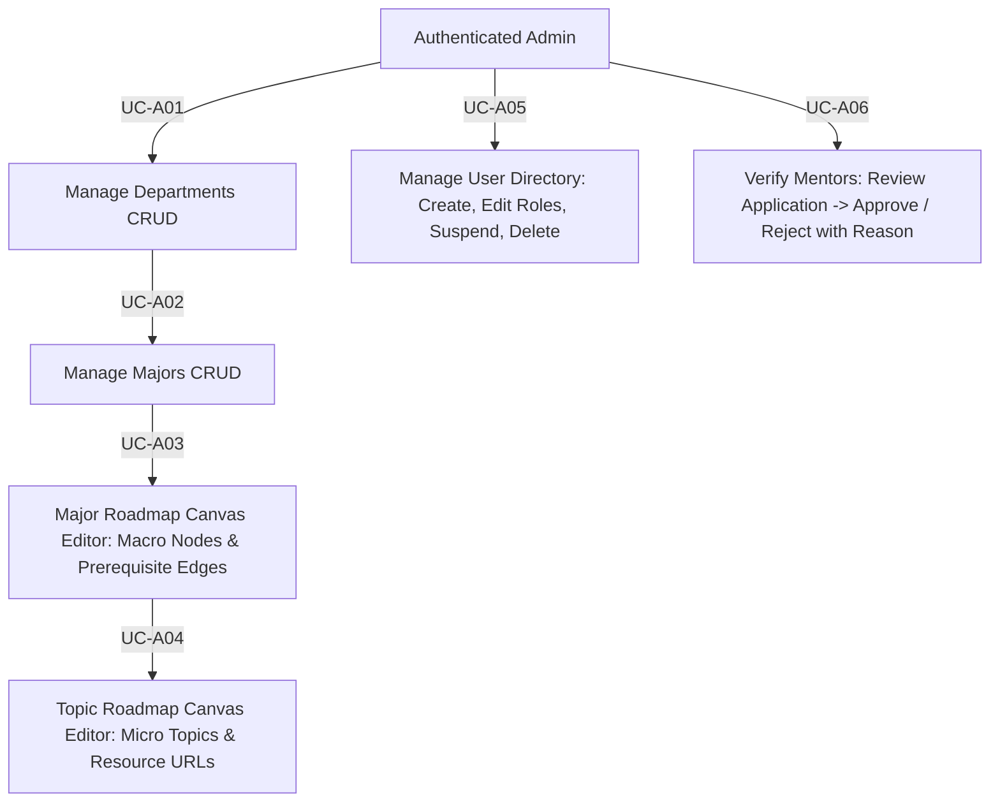

# Module 02: Admin Management & Curriculum Canvas Specification

**Document Version:** 3.0  
**Parent Document:** [`00-master-srs-overview.md`](./00-master-srs-overview.md)  
**Scope:** Covers academic organization CRUD (`UC-A01`, `UC-A02`), visual node/edge roadmap canvas editors (`UC-A03`, `UC-A04`), user directory governance (`UC-A05`), and mentor verification workflow (`UC-A06`).

---

## 1. Feature Summary & Business Flow

The Admin Management portal is the organizational and curriculum authoring spine of **IUROADMAP**. It enables authorized Administrators to maintain academic hierarchies (`Departments -> Majors -> Courses -> Topics`), construct drag-and-drop visual prerequisite graphs (`X/Y coordinates` and `Edges` via Canvas API), govern system user accounts across all roles, and review/verify pending mentor applications.

---

## 2. Use Case Specifications & Separated Requirements

### UC-A01: Manage the Department (CRUD)

#### Identification
| Item | Description |
| :--- | :--- |
| **Use Case ID** | `UC-A01` |
| **Name** | Manage The Department (CRUD) |
| **Actor** | Authenticated Admin |
| **Description** | Admin maintains academic departments by creating new records, viewing the existing directory list, updating department details (`slug`, `name`, `description`), and deleting departments from the system. |
| **Trigger** | Admin selects **"Departments"** on the admin sidebar menu (`GET /admin/departments`). |

#### Inputs & Outputs
- **Inputs:** `Department Name`, `Department Slug`, `Department Description`.
- **Outputs:** Department List (`Name`, `Slug`, `Description`, `Total Majors`, `Actions: Edit/Delete`).
- **Messages:** `"Department created successfully"`, `"Department updated successfully"`, `"Department deleted successfully"`, `"Are you sure you want to delete this department?"`, `"Please fill in all required fields"`, `"System error, please try again"`.

#### Basic Course (Main Flow)
| Step | Actor Action | System Response |
| :---: | :--- | :--- |
| **1** | Click **"Departments"** on sidebar. | **1.1** Validate Admin JWT role and display Manage Departments page with data table. |
| **2** | Fill in `Department Name`, `Slug`, and `Description` in Create form. | **2.1** Validate client-side inputs. |
| **3** | Click **"Create Department"** button. | **3.1** Send `POST /api/v1/admin/departments`. Show: `"Department created successfully"`. |
| **4** | — | **4.1** Refresh department list table. |
| **5** | Click **"Edit"** on a specific department row. | **5.1** Load department data into the edit modal/form. |
| **6** | Modify `Name`, `Slug`, or `Description` and click **"Save Changes"**. | **6.1** Send `PATCH /api/v1/admin/departments/:id`. Show: `"Department updated successfully"`. |
| **7** | — | **7.1** Refresh department list table. |
| **8** | Click **"Delete"** on a department row. | **8.1** Show confirmation prompt: `"Are you sure you want to delete this department?"`. |
| **9** | Confirm deletion. | **9.1** Send `DELETE /api/v1/admin/departments/:id`. Show: `"Department deleted successfully"`. |
| **10** | — | **10.1** Refresh department list table. |

#### Alternative Flows
- **A1 – Missing Required Fields (Step 2/6):** If `Name` or `Slug` is left empty upon submission, display `"Please fill in all required fields"`.
- **A2 – Duplicate Slug / Name (Step 3/6):** If `Slug` already exists in `departments` table, return `400 Bad Request` with validation error.
- **A3 – Cancel Deletion (Step 9):** If Admin clicks **"Cancel"** on the delete confirmation prompt, close the modal; database state remains unchanged.
- **A4 – System Error (Step 3/6/9):** If database operation fails, display `"System error, please try again"`.

#### Preconditions & Postconditions
- **Preconditions:** Admin is authenticated and logged into the system with `Role == ADMIN`.
- **Postconditions (Success):** Department directory is updated accurately; new departments are available for assigning majors (`UC-A02`).
- **Postconditions (Failure):** Database state remains unchanged; Admin stays on Manage Departments screen.

#### User Story
> *As an Admin, I want to manage (`CRUD`) departments so that I can maintain an accurate and up-to-date organizational structure for the system.*

#### Separated Functional & Data Requirements (`UC-A01`)
1. **The Scope of Work:** Organizational foundation sprint; requires API Gateway `DepartmentsController` (`POST`, `GET`, `PATCH`, `DELETE`), `admin-service` microservice handlers, and Prisma CRUD methods.
2. **The Scope of Product:** Administrative spine defining top-level academic categories.
3. **Functional & Data Requirements:**
   - **a. Functional Requirements:**
     - `FR-A01.1:` The system shall verify that the Admin role is authenticated (`RolesGuard` with `Role == ADMIN`) before granting access to Manage Departments.
     - `FR-A01.2:` The system shall display the Department List, showing `name`, `slug`, `description`, and `actions` (`Edit / Delete`).
     - `FR-A01.3:` The system shall provide input forms to capture `Department Name`, `Department Slug`, and `Department Description` for Create and Update operations.
     - `FR-A01.4:` The system shall display `"Please fill in all required fields"` if mandatory inputs (`name`, `slug`) are left empty.
     - `FR-A01.5:` The backend (`admin-service`) shall check slug uniqueness and insert a new department, displaying `"Department created successfully"`.
     - `FR-A01.6:` The system shall populate the edit form when the Admin clicks `"Edit"` and update details, displaying `"Department updated successfully"`.
     - `FR-A01.7:` The system shall display a confirmation prompt (`"Are you sure you want to delete this department?"`) when the Admin clicks `"Delete"`.
     - `FR-A01.8:` The system shall close the confirmation prompt without changes if the Admin clicks `"Cancel"`.
     - `FR-A01.9:` The backend shall delete the department upon confirmation, displaying `"Department deleted successfully"`, and automatically refresh the list table.
     - `FR-A01.10:` The system shall display `"System error, please try again"` if any backend operation fails.
   - **b. Data Requirements:**
     - `DR-A01.1:` `slug` must be URL-friendly (`lowercase alphanumeric + hyphens`) and unique across `departments`.
     - `DR-A01.2:` `name` (`max 255 chars`) required; `description` optional text.

---

### UC-A02: Manage the Major (CRUD)

#### Identification
| Item | Description |
| :--- | :--- |
| **Use Case ID** | `UC-A02` |
| **Name** | Manage The Major (CRUD) |
| **Actor** | Authenticated Admin |
| **Description** | Admin manages academic majors under departments by creating new records, viewing the existing directory list, updating major metadata (`creditsRequired`, `description`), and deleting majors from the platform. |
| **Trigger** | Admin selects **"Major Roadmaps"** on the admin sidebar (`GET /admin/majors`). |

#### Inputs & Outputs
- **Inputs:** `Major Name`, `Major Slug`, `Department ID`, `Total Credits Required`, `Description`.
- **Outputs:** Major List (`Name/Slug`, `Department`, `Credits Required`, `Total Courses`, `Actions: Edit / Delete / Open Canvas`).
- **Messages:** `"Major created successfully"`, `"Major updated successfully"`, `"Major deleted successfully"`, `"Are you sure you want to delete this major?"`, `"Please fill in all required fields"`, `"System error, please try again"`.

#### Basic Course (Main Flow)
| Step | Actor Action | System Response |
| :---: | :--- | :--- |
| **1** | Click **"Major Roadmaps"** on sidebar. | **1.1** Validate Admin role and display Manage Majors data table (`GET /api/v1/admin/majors`). |
| **2** | Fill in `Major Name`, `Slug`, `Department ID`, `Total Credits Required`, and `Description`. | **2.1** Validate client-side form inputs. |
| **3** | Click **"Create Major"** button. | **3.1** Send `POST /api/v1/admin/majors`. Show: `"Major created successfully"`. |
| **4** | — | **4.1** Refresh major list table. |
| **5** | Click **"Edit"** on a specific major row. | **5.1** Load major metadata into the edit modal/form. |
| **6** | Modify `Name`, `Credits Required`, or `Description` and click **"Save Changes"**. | **6.1** Send `PATCH /api/v1/admin/majors/:id`. Show: `"Major updated successfully"`. |
| **7** | — | **7.1** Refresh major list table. |
| **8** | Click **"Delete"** on a major row. | **8.1** Show confirmation prompt: `"Are you sure you want to delete this major?"`. |
| **9** | Confirm deletion. | **9.1** Send `DELETE /api/v1/admin/majors/:id`. Show: `"Major deleted successfully"`. |
| **10** | — | **10.1** Refresh major list table. |

#### Alternative Flows
- **A1 – Missing Required Fields (Step 2/6):** If `Name`, `Slug`, `Department ID`, or `Total Credits Required` is blank, display `"Please fill in all required fields"`.
- **A2 – Invalid Credits Value (Step 2/6):** If `Total Credits Required` is non-numeric or `< 0`, display validation error: `"Credits must be a valid number."`.
- **A3 – Cancel Deletion (Step 9):** If Admin clicks **"Cancel"** on the delete confirmation prompt, close modal without deleting.
- **A4 – System Error (Step 3/6/9):** If database query fails, display `"System error, please try again"`.

#### Preconditions & Postconditions
- **Preconditions:** Admin is authenticated (`Role == ADMIN`); parent `Department ID` exists (`UC-A01`).
- **Postconditions (Success):** Major record created/updated/deleted; metadata ready for visual roadmap canvas creation (`UC-A03`).
- **Postconditions (Failure):** Database state remains unchanged.

#### User Story
> *As an Admin, I want to manage (`CRUD`) majors and edit their basic metadata so that I can prepare the foundational information before opening the roadmap canvas to build out specific courses.*

#### Separated Functional & Data Requirements (`UC-A02`)
1. **The Scope of Work:** Major management module; requires `MajorsController` (`POST`, `GET`, `PATCH`, `DELETE`), DTO validations, and foreign key verification against `departments`.
2. **The Scope of Product:** Metadata spine linking departments to curriculum graphs.
3. **Functional & Data Requirements:**
   - **a. Functional Requirements:**
     - `FR-A02.1:` The system shall enforce Admin role authentication (`RolesGuard` with `Role == ADMIN`).
     - `FR-A02.2:` The system shall display the `Major List`, showing `Name/Slug`, `Credits Required`, `Total Courses`, and available `Actions` (`Edit / Delete / Open Canvas`).
     - `FR-A02.3:` The system shall provide input forms to capture `Major Name`, `Slug`, `Department ID`, `Total Credits Required`, and `Description`.
     - `FR-A02.4:` The system shall display `"Please fill in all required fields"` if mandatory fields are left empty.
     - `FR-A02.5:` The backend shall insert a new major and display `"Major created successfully"` upon valid submission.
     - `FR-A02.6:` The system shall populate the edit form when Admin clicks `"Edit"` and update metadata, displaying `"Major updated successfully"`.
     - `FR-A02.7:` The system shall display a confirmation prompt (`"Are you sure you want to delete this major?"`) when `"Delete"` is clicked.
     - `FR-A02.8:` The system shall close the confirmation prompt without changes if `"Cancel"` is clicked.
     - `FR-A02.9:` The backend shall permanently remove the major upon confirmation, displaying `"Major deleted successfully"`, and refresh the table.
     - `FR-A02.10:` The system shall display `"System error, please try again"` upon any backend exception.
   - **b. Data Requirements:**
     - `DR-A02.1:` `slug` must be unique across `major_roadmaps` (`lowercase alphanumeric + hyphens`).
     - `DR-A02.2:` `creditsRequired` must be strictly validated (`@IsInt() @Min(0)`).
     - `DR-A02.3:` `departmentId` must be a valid foreign key targeting existing `departments` record (`ON DELETE CASCADE`).

---

### UC-A03: Manage the Major Roadmap (Macro Canvas Editor)

#### Identification
| Item | Description |
| :--- | :--- |
| **Use Case ID** | `UC-A03` |
| **Name** | Manage The Major Roadmap (Macro Canvas Editor) |
| **Actor** | Authenticated Admin |
| **Description** | Admin manages the visual graph roadmap for a major using a drag-and-drop canvas (`Canvas/Graph API`). Admin can create/edit/delete course nodes (`slug`, `title`, `credits`, `X/Y coordinates`) and establish directional prerequisite connections (`edges`). |
| **Trigger** | Admin selects the **"Open Roadmap Canvas"** button on a specific major row (`GET /admin/roadmaps/:majorSlug/canvas`). |

#### Inputs & Outputs
- **Inputs:** `Course Node Details` (`Slug`, `Course Name`, `Credits`, `Description`), `Prerequisites` (`Search/Select existing course nodes to create directed edges`), `Node Coordinates` (`X, Y positions from drag-and-drop`).
- **Outputs:** Rendered visual macro graph (`Nodes + Edges`); created/updated/deleted course nodes (`course_nodes`) and edges (`prerequisites`); persisted `X/Y` coordinate layout.
- **Messages:** `"Course node created successfully"`, `"Course node updated successfully"`, `"Course node deleted successfully"`, `"Layout saved successfully"`, `"Please fill in all required fields"`, `"Credits must be a valid number."`, `"System error, please try again"`.

#### Basic Course (Main Flow)
| Step | Actor Action | System Response |
| :---: | :--- | :--- |
| **1** | Open roadmap canvas view for a specific major (`/admin/roadmaps/:majorSlug/canvas`). | **1.1** Render interactive 2D graph canvas displaying existing course nodes (`X/Y positions`) and prerequisite edges. |
| **2** | **[Change Layout]** Drag and drop course nodes across the canvas to reposition them. | **2.1** Update local `X/Y` coordinate state in client memory. |
| **3** | Click **"Save Layout"** button. | **3.1** Send `PUT /api/v1/admin/roadmaps/:majorId/layout` with node coordinates. Show: `"Layout saved successfully"`. |
| **4** | **[Create Node]** Click **"Create Course Node"** button on canvas header. | **4.1** Display `"Create Node"` side drawer / form panel on the right. |
| **5** | Fill in `Slug`, `Course Name`, `Credits`, and `Description`. | **5.1** Validate input format and numeric credit constraints. |
| **6** | Search and select `Prerequisites` (`Source Course Nodes`) from dropdown. | **6.1** Temporarily store selected prerequisite edges in form state. |
| **7** | Click **"Create Node"** in drawer. | **7.1** Send `POST /api/v1/admin/roadmaps/:majorId/courses`. Show: `"Course node created successfully"`. Reload graph canvas. |
| **8** | **[Edit Node]** Left-click an existing course node on canvas. | **8.1** Open `"Edit Node"` right drawer populated with current node data and prerequisite selections. |
| **9** | Modify fields (`Title`, `Credits`), add new prerequisites, or remove existing edges. | **9.1** Validate client inputs. |
| **10** | Click **"Save Changes"** in drawer. | **10.1** Send `PATCH /api/v1/admin/roadmaps/courses/:courseNodeId`. Show: `"Course node updated successfully"`. Reload graph canvas. |
| **11** | **[Delete Node]** Click **"Delete Node"** button inside the Edit drawer. | **11.1** Display confirmation prompt: `"Delete this course node and all its prerequisite connections?"`. |
| **12** | Confirm deletion. | **12.1** Send `DELETE /api/v1/admin/roadmaps/courses/:courseNodeId`. Show: `"Course node deleted successfully"`. Reload graph canvas. |

#### Alternative Flows
- **A1 – Missing Required Fields (Step 5/9):** If `Slug`, `Course Name`, or `Credits` is blank, display `"Please fill in all required fields"`.
- **A2 – Invalid Credits Value (Step 5/9):** If Admin enters a non-numeric or negative string in `Credits` field, display `"Credits must be a valid number."`.
- **A3 – Circular Prerequisite Loop Interception (Step 6/9):** If adding a prerequisite creates a cyclic loop (`Node A -> Node B -> Node A`), backend returns `400 Bad Request`: `"Circular prerequisite dependency detected"`.
- **A4 – System Error (Step 3/7/10/12):** If backend update or coordinate saving fails, display `"System error, please try again"`.

#### Preconditions & Postconditions
- **Preconditions:** Admin is authenticated (`Role == ADMIN`); parent `Major` exists in database (`UC-A02`).
- **Postconditions (Success):** Visual graph layout coordinates (`X, Y`) and prerequisite edge connections persisted in `shared-db`; live learner macro views (`UC-07`) immediately reflect the new curriculum structure.
- **Postconditions (Failure):** Database state unchanged; canvas reverts to last saved snapshot upon page reload.

#### User Story
> *As an Admin, I want to visually manage course nodes and their prerequisite connections on an intuitive drag-and-drop canvas so that I can design and accurately structure the learning roadmap for any academic major.*

#### Separated Functional & Data Requirements (`UC-A03`)
1. **The Scope of Work:** Interactive graph editor (`React Flow` / `Canvas API`), `MajorRoadmapsController` canvas routes, and recursive DAG cycle-detection validation.
2. **The Scope of Product:** Signature visual authoring suite distinguishing **IUROADMAP** from flat-list LMS tools.
3. **Functional & Data Requirements:**
   - **a. Functional Requirements:**
     - `FR-A03.1:` The system shall render a visual roadmap canvas displaying course nodes and their prerequisite connections (`edges`).
     - `FR-A03.2:` The system shall allow the Admin to drag and drop course nodes to reposition them across the `2D coordinate plane` (`X, Y`).
     - `FR-A03.3:` The system shall display a `"Create Node"` panel when `"Create Course Node"` is triggered (`POST /admin/roadmaps/:majorId/courses`).
     - `FR-A03.4:` The system shall provide input fields for `Slug`, `Course Name`, `Credits`, `Description`, and a prerequisite search/dropdown component.
     - `FR-A03.5:` The backend (`admin-service`) shall create the new course node, persist its coordinates, and establish its prerequisite edges (`course_prerequisites` join table) upon valid submission, displaying `"Course node created successfully"`.
     - `FR-A03.6:` The system shall open an `"Edit Node"` panel when a node is clicked and populate it with current data and prerequisite edges.
     - `FR-A03.7:` The backend shall save updated node details and relationships upon valid submission (`PATCH`), displaying `"Course node updated successfully"`, and reload the canvas.
     - `FR-A03.8:` The system shall display a confirmation prompt when `"Delete Node"` is clicked inside the edit drawer.
     - `FR-A03.9:` The backend shall permanently remove the selected course node and all associated prerequisite edges upon confirmation (`DELETE`), displaying `"Course node deleted successfully"`, and reload the canvas.
     - `FR-A03.10:` The system shall display `"Please fill in all required fields"` if mandatory inputs are empty, or `"Credits must be a valid number."` if invalid.
     - `FR-A03.11:` The backend shall validate Directed Acyclic Graph (`DAG`) properties and reject cyclic loops (`400 Bad Request`).
     - `FR-A03.12:` The system shall save dragged coordinates via `"Save Layout"` (`PUT`), displaying `"Layout saved successfully"`.
     - `FR-A03.13:` The system shall display `"System error, please try again"` if any server exception occurs.
   - **b. Data Requirements:**
     - `DR-A03.1:` `course_nodes` records must store `majorRoadmapId`, `slug`, `title`, `credits: int`, `positionX: float`, `positionY: float`.
     - `DR-A03.2:` `course_prerequisites` join table stores `sourceCourseId` (`prerequisite`) and `targetCourseId` (`dependent node`).

---

### UC-A04: Manage the Topic Roadmap (Micro Canvas Editor)

#### Identification
| Item | Description |
| :--- | :--- |
| **Use Case ID** | `UC-A04` |
| **Name** | Manage The Topic Roadmap (Micro Canvas Editor) |
| **Actor** | Authenticated Admin |
| **Description** | Admin manages the micro-level visual roadmap for a specific course by adding subtopic/module nodes (`title`, `estimatedHours`, `description`), defining prerequisite topic sequences (`edges`), embedding rich learning content (`objectives list`, `video/article URLs`), repositioning nodes (`X/Y`), and deleting topics. |
| **Trigger** | Admin selects **"Topic Roadmap / Micro Editor"** on a specific course node (`GET /admin/roadmaps/courses/:courseNodeId/topics/canvas`). |

#### Inputs & Outputs
- **Inputs:** `Topic Node Details` (`Title`, `Estimated Hours`, `Description`), `Learning Content` (`Learning Objectives bullet list`, `Resources: Title, Type (VIDEO/ARTICLE), URL`), `Prerequisites` (`Search/select existing subtopic nodes`), `Node Coordinates` (`X, Y positions`).
- **Outputs:** Rendered visual topic micro graph (`Topics + Edges`); created/updated/deleted topic nodes (`topics`) and their learning resources; saved layout coordinates.
- **Messages:** `"Topic node created successfully"`, `"Topic node updated successfully"`, `"Topic node deleted successfully"`, `"Layout saved successfully"`, `"Please fill in all required fields"`, `"Hours must be a valid number."`, `"System error, please try again"`.

#### Basic Course (Main Flow)
| Step | Actor Action | System Response |
| :---: | :--- | :--- |
| **1** | Open topic roadmap canvas view for a course (`/admin/roadmaps/courses/:courseNodeId/topics`). | **1.1** Render micro roadmap canvas displaying existing topic nodes (`X/Y positions`) and prerequisite connections. |
| **2** | **[Change Layout]** Drag and drop topic nodes across canvas. | **2.1** Update local `X/Y` coordinate state. |
| **3** | Click **"Save Layout"** button. | **3.1** Send `PUT /api/v1/admin/roadmaps/topics/layout`. Show: `"Layout saved successfully"`. |
| **4** | **[Create Topic]** Click **"Create Node"** on micro canvas header. | **4.1** Display `"Create Topic Node"` drawer on the right. |
| **5** | Fill in `Title`, `Estimated Hours`, `Description`, `Objectives` bullet list, and add `Resources` (`URL`, `Type: VIDEO/ARTICLE`). | **5.1** Validate form inputs and URL regex. |
| **6** | Search and select `Prerequisite Topics` from dropdown. | **6.1** Temporarily store selected prerequisites in local state. |
| **7** | Click **"Create Node"** in drawer. | **7.1** Send `POST /api/v1/admin/roadmaps/courses/:courseNodeId/topics`. Show: `"Topic node created successfully"`. Reload micro graph. |
| **8** | **[Edit Topic]** Left-click an existing topic node on canvas. | **8.1** Open `"Edit Topic Node"` right drawer populated with current objectives, resources, and prerequisites. |
| **9** | Modify fields (`Title`, `Hours`, `Objectives`, `Resources`, `Prerequisites`) and click **"Save Changes"**. | **9.1** Send `PATCH /api/v1/admin/roadmaps/topics/:topicId`. Show: `"Topic node updated successfully"`. Reload micro graph. |
| **10** | **[Delete Topic]** Click **"Delete Node"** button in Edit drawer. | **10.1** Show confirmation prompt: `"Delete this topic node and all its resource links?"`. |
| **11** | Confirm deletion. | **11.1** Send `DELETE /api/v1/admin/roadmaps/topics/:topicId`. Show: `"Topic node deleted successfully"`. Reload micro graph. |

#### Alternative Flows
- **A1 – Missing Required Fields (Step 5/9):** If `Title` or `Estimated Hours` is left blank, display `"Please fill in all required fields"`.
- **A2 – Invalid Estimated Hours (Step 5/9):** If `Estimated Hours` is non-numeric or `<= 0`, display `"Hours must be a valid number."`.
- **A3 – Invalid Resource URL (Step 5/9):** If an entered resource URL fails HTTP/HTTPS URL regex validation, display `"Please enter a valid URL."`.
- **A4 – System Error (Step 3/7/9/11):** If backend query fails, display `"System error, please try again"`.

#### Preconditions & Postconditions
- **Preconditions:** Admin is authenticated (`Role == ADMIN`); parent `Course Node` exists (`UC-A03`).
- **Postconditions (Success):** Micro topic graph layout (`X, Y`) and internal instructional materials persisted in database; immediately available in learner drill-down view (`UC-08`).
- **Postconditions (Failure):** Database state unchanged; canvas reverts upon refresh.

#### User Story
> *As an Admin, I want to visually manage subtopics, learning objectives, and video/article resource links on a topic canvas so that I can construct a detailed, step-by-step instructional progression for any course.*

#### Separated Functional & Data Requirements (`UC-A04`)
1. **The Scope of Work:** Micro-curriculum graph editor; requires `TopicsRoadmapsController` canvas routes, JSON resource validation, and prerequisite sequencing.
2. **The Scope of Product:** Instructional design workbench powering learner step-by-step mastery (`UC-08`).
3. **Functional & Data Requirements:**
   - **a. Functional Requirements:**
     - `FR-A04.1:` The system shall render a visual micro roadmap canvas displaying topic nodes and their prerequisite connections.
     - `FR-A04.2:` The system shall allow Admin to drag and drop topic nodes to reposition them across the canvas.
     - `FR-A04.3:` The system shall display a `"Create Node"` panel when `"Create Node"` is triggered (`POST /admin/roadmaps/courses/:courseNodeId/topics`).
     - `FR-A04.4:` The system shall provide input fields for `Title`, `Estimated Hours`, `Description`, `Learning Objectives` list, and `Resources` (`Title`, `Type: VIDEO/ARTICLE`, `URL`).
     - `FR-A04.5:` The system shall provide a search/dropdown component to select existing topic nodes as prerequisites.
     - `FR-A04.6:` The backend (`admin-service`) shall insert the new topic node, persist `objectives` and `resources`, and establish prerequisite edges (`topic_prerequisites`), displaying `"Topic node created successfully"`.
     - `FR-A04.7:` The system shall open an `"Edit Node"` panel when clicked, populated with current metadata, objectives, resources, and prerequisites.
     - `FR-A04.8:` The backend shall save updated topic details and resource arrays (`PATCH`), displaying `"Topic node updated successfully"`, and reload the canvas.
     - `FR-A04.9:` The system shall display a confirmation prompt when `"Delete Node"` is clicked.
     - `FR-A04.10:` The backend shall permanently remove the topic node and all associated resource records (`DELETE`), displaying `"Topic node deleted successfully"`, and reload the canvas.
     - `FR-A04.11:` The system shall display `"Please fill in all required fields"` if mandatory fields are empty, or `"Hours must be a valid number."` if invalid.
     - `FR-A04.12:` The system shall save dragged coordinates via `"Save Layout"` (`PUT`), displaying `"Layout saved successfully"`.
     - `FR-A04.13:` The system shall display `"System error, please try again"` if any backend operation fails.
   - **b. Data Requirements:**
     - `DR-A04.1:` `topics` table stores `courseNodeId`, `title`, `estimatedHours: float`, `description`, `objectives: text[]`, `resources: JSON/Array<{ title, url, type: 'VIDEO' | 'ARTICLE' }>`, `positionX`, `positionY`.
     - `DR-A04.2:` `topic_prerequisites` join table stores `sourceTopicId` and `targetTopicId`.

---

### UC-A05: Manage User Directory & Accounts (CRUD)

#### Identification
| Item | Description |
| :--- | :--- |
| **Use Case ID** | `UC-A05` |
| **Name** | Manage Users (CRUD & Governance) |
| **Actor** | Authenticated Admin |
| **Description** | Admin manages system users by viewing the user directory data table, filtering by role/status, manually creating new user accounts, modifying user details/roles (`LEARNER`, `MENTOR`, `ADMIN`), suspending violating accounts, and permanently deleting user records. |
| **Trigger** | Admin selects **"Users"** on the admin navigation sidebar (`GET /admin/users`). |

#### Inputs & Outputs
- **Inputs:** `Filters/Search` (`Name`, `Email`, `Role`, `Status`), `User Details (Create/Update)` (`Full Name`, `Email Address`, `Password for creation`, `Role: LEARNER/MENTOR/ADMIN`, `Status: ACTIVE/SUSPENDED/BLOCKED`).
- **Outputs:** User Directory Table (`Name`, `Email`, `Role`, `Status`, `Registration Date`, `Actions: Edit / Delete / Suspend`).
- **Messages:** `"User account created successfully"`, `"User updated successfully"`, `"User account has been suspended"`, `"User deleted successfully"`, `"Are you sure you want to delete this user? This action cannot be undone."`, `"Email already exists in the system"`, `"Please fill in all required fields"`, `"System error, please try again"`.

#### Basic Course (Main Flow)
| Step | Actor Action | System Response |
| :---: | :--- | :--- |
| **1** | Click **"Users"** on sidebar. | **1.1** Display Manage Users page with data table (`GET /api/v1/admin/users`). |
| **2** | Use search bar (`Name/Email`) or dropdown filters (`Role/Status`). | **2.1** Filter the user directory list dynamically based on inputs. |
| **3** | Click **"Add New User"** button. | **3.1** Display user creation form / modal. |
| **4** | Fill in `Full Name`, `Email`, `Password`, `Role`, and `Status`. | **4.1** Validate input format. |
| **5** | Click **"Create User"** button. | **5.1** Check email uniqueness against `users` table (`POST /api/v1/admin/users`). Show: `"User account created successfully"`. Refresh table. |
| **6** | Click **"Edit"** action on a specific user row. | **6.1** Display edit form populated with current user profile, role, and status. |
| **7** | Modify fields (`Role -> MENTOR` or `Status -> SUSPENDED`) and click **"Save Changes"**. | **7.1** Send `PATCH /api/v1/admin/users/:id`. Show: `"User updated successfully"` (or `"User account has been suspended"`). Refresh table. |
| **8** | Click **"Delete"** action on a user row. | **8.1** Show confirmation prompt: `"Are you sure you want to delete this user? This action cannot be undone."`. |
| **9** | Confirm deletion. | **9.1** Send `DELETE /api/v1/admin/users/:id`. Show: `"User deleted successfully"`. Refresh table. |

#### Alternative Flows
- **A1 – Missing Required Fields (Step 4/7):** If required fields (`Email`, `Role`, `Status`) are blank, display `"Please fill in all required fields"`.
- **A2 – Email Already Exists (Step 5):** If email already belongs to another account, display `"Email already exists in the system"`.
- **A3 – Self-Deletion Prevention (Step 8):** If Admin attempts to delete their own active logged-in account (`userId == currentAdminId`), return `400 Bad Request` with message: `"Cannot delete your own administrative account."`.
- **A4 – Cancel Deletion (Step 9):** If Admin clicks **"Cancel"**, close prompt without deleting.
- **A5 – System Error (Step 5/7/9):** If database operation fails, display `"System error, please try again"`.

#### Preconditions & Postconditions
- **Preconditions:** Admin is authenticated and logged into the system (`Role == ADMIN`).
- **Postconditions (Success):** User directory accurately updated; new accounts can login immediately (`UC-02`); suspended accounts are locked from authentication (`JwtStrategy` validation check); deleted records permanently removed (`ON DELETE CASCADE` for roadmaps/tokens).
- **Postconditions (Failure):** Database state remains unchanged.

#### User Story
> *As an Admin, I want to view, create, update, and remove system users across all roles so that I can provide account assistance, manage access privileges, and suspend violating accounts to maintain platform security.*

#### Separated Functional & Data Requirements (`UC-A05`)
1. **The Scope of Work:** User directory governance module; requires `UsersController` (`POST`, `GET`, `PATCH`, `DELETE`), DTO class-validator rules, and `users` table pagination/filtering queries.
2. **The Scope of Product:** Central administrative security & identity management dashboard.
3. **Functional & Data Requirements:**
   - **a. Functional Requirements:**
     - `FR-A05.1:` The system shall display the Manage Users directory table showing `Name`, `Email`, `Role`, `Status`, `Registration Date`, and `Actions`.
     - `FR-A05.2:` The system shall filter the user list dynamically based on search bar inputs (`name`, `email`) and selected dropdown filters (`Role`, `Status`).
     - `FR-A05.3:` The system shall display a user creation form when `"Add New User"` is clicked (`POST /admin/users`).
     - `FR-A05.4:` The system shall provide input fields for `Full Name`, `Email Address`, `Password`, `Role` (`LEARNER`, `MENTOR`, `ADMIN`), and `Account Status` (`ACTIVE`, `SUSPENDED`, `BLOCKED`).
     - `FR-A05.5:` The backend (`auth/user service`) shall check email uniqueness, hash the password (`bcrypt`), insert the user record, and display `"User account created successfully"`.
     - `FR-A05.6:` The system shall display an edit form populated with current data when `"Edit"` is clicked (`PATCH /admin/users/:id`).
     - `FR-A05.7:` The backend shall modify user details, role, or account status (`e.g., SUSPENDED`), displaying `"User updated successfully"` or `"User account has been suspended"`, and refresh the table.
     - `FR-A05.8:` The system shall display a confirmation prompt (`"Are you sure you want to delete this user? This action cannot be undone."`) when `"Delete"` is clicked (`DELETE /admin/users/:id`).
     - `FR-A05.9:` The system shall close the prompt without changes if `"Cancel"` is clicked.
     - `FR-A05.10:` The backend shall delete the user record upon confirmation, displaying `"User deleted successfully"`, and automatically refresh the directory.
     - `FR-A05.11:` The system shall display `"Please fill in all required fields"` if mandatory inputs are empty, or `"Email already exists in the system"` if duplicate.
     - `FR-A05.12:` The system shall prevent an Admin from deleting their own active session (`400 Bad Request`).
     - `FR-A05.13:` The system shall display `"System error, please try again"` upon backend exception.
   - **b. Data Requirements:**
     - `DR-A05.1:` `users` table requires `email` (unique index), `passwordHash`, `role` (`RoleEnum`), `status` (`UserStatusEnum: ACTIVE | SUSPENDED | BLOCKED`), and `createdAt`.
     - `DR-A05.2:` Deleting a user must cascade to their `refresh_tokens`, `user_roadmaps`, and `user_course_progress` records (`ON DELETE CASCADE`).

---

### UC-A06: Verify Mentors (Application Review Workflow)

#### Identification
| Item | Description |
| :--- | :--- |
| **Use Case ID** | `UC-A06` |
| **Name** | Verify Mentor (Application Review Workflow) |
| **Actor** | Authenticated Admin |
| **Description** | Admin reviews pending mentor applications submitted during onboarding (`UC-01` with `Role == PENDING_MENTOR` / `MENTOR`), evaluates their profile credentials (`bio`, `expertise`, `LinkedIn/GitHub URLs`), and either approves (`Role -> Active MENTOR`) or rejects (`Application -> REJECTED` with mandatory rejection reason) their request. |
| **Trigger** | Admin selects **"Mentor Verification"** on the sidebar (`GET /admin/mentors/pending`). |

#### Inputs & Outputs
- **Inputs:** `Verification Action` (`Approve` or `Reject`), `Rejection Reason` (Mandatory text input only when selecting `Reject`).
- **Outputs:** Updated pending mentors list; updated `users.role` and `mentor_profiles.status` in database (`APPROVED` / `REJECTED`); automated email notification dispatched to the applicant.
- **Messages:** `"Mentor application approved successfully"`, `"Mentor application rejected"`, `"Are you sure you want to approve this mentor?"`, `"Please provide a reason for rejection"`, `"System error, please try again"`.

#### Basic Course (Main Flow)
| Step | Actor Action | System Response |
| :---: | :--- | :--- |
| **1** | Navigate to **"Mentors Verification"** page. | **1.1** Display directory table of pending mentor applicants (`GET /api/v1/admin/mentors/pending`). |
| **2** | Click **"View Details"** on an applicant row. | **2.1** Load and display detailed applicant profile (`Full Name`, `Email`, `Bio`, `Expertise Skills`, `Portfolio/LinkedIn URLs`). |
| **3** | Click **"Approve"** button. | **3.1** Show confirmation prompt: `"Are you sure you want to approve this mentor?"`. |
| **4** | Confirm approval. | **4.1** Send `POST /api/v1/admin/mentors/:id/approve`. Update `users.role = MENTOR` and `mentor_profiles.status = APPROVED`. |
| **5** | — | **5.1** Trigger automated approval success notification/email to user. Show: `"Mentor application approved successfully"`. Refresh pending list table. |
| **6** | **[Reject Action]** Click **"Reject"** button on applicant row/details. | **6.1** Display rejection modal requiring **"Rejection Reason"** text box (`Mandatory`). |
| **7** | Enter rejection reason and click **"Submit Rejection"**. | **7.1** Validate `Rejection Reason` input. Send `POST /api/v1/admin/mentors/:id/reject` with `{ reason: "<text>" }`. |
| **8** | — | **8.1** Update `mentor_profiles.status = REJECTED` and `users.role = LEARNER`. |
| **9** | — | **9.1** Trigger automated rejection email to applicant containing the rejection reason. Show: `"Mentor application rejected"`. Refresh pending list table. |

#### Alternative Flows
- **A1 – Missing Rejection Reason (Step 7):** If Admin submits rejection modal with an empty reason text box, display `"Please provide a reason for rejection"` and keep the modal open.
- **A2 – Cancel Action (Step 4/7):** If Admin clicks **"Cancel"** inside either the approval prompt or rejection modal, close dialog; database application status remains `PENDING`.
- **A3 – System Error (Step 4/7):** If database update or email dispatch fails, display `"System error, please try again"`.

#### Preconditions & Postconditions
- **Preconditions:** Admin is authenticated (`Role == ADMIN`); at least one user has registered with mentor intent (`status == PENDING`).
- **Postconditions (Success):** Applicant's profile status updated (`APPROVED` or `REJECTED`); if approved, user immediately gains access to Mentor Portal (`UC-M01` to `UC-M06`); email dispatched.
- **Postconditions (Failure):** Application status remains `PENDING`; no email sent.

#### User Story
> *As an Admin, I want to review submitted credentials and approve or reject pending mentor applications so that I can ensure only qualified, high-quality professionals are permitted to provide mentoring guidance to learners on the platform.*

#### Separated Functional & Data Requirements (`UC-A06`)
1. **The Scope of Work:** Verification workflow sprint; requires `ManagementController.verifyMentor` / `DepartmentsController` in `admin-service`, state transition handlers, and email notification trigger hooks.
2. **The Scope of Product:** Quality control gate governing the **IUROADMAP** mentoring network.
3. **Functional & Data Requirements:**
   - **a. Functional Requirements:**
     - `FR-A06.1:` The system shall verify Admin role authorization (`RolesGuard`) before granting access to Mentors Verification (`/admin/mentors/pending`).
     - `FR-A06.2:` The system shall display the `"Mentors Verification"` page showing a list of all pending mentor applicants (`mentor_profiles where status == PENDING`).
     - `FR-A06.3:` The system shall load and display the applicant's detailed profile and submitted credentials (`bio`, `skills`, `links`) upon clicking `"View Details"`.
     - `FR-A06.4:` The system shall display a confirmation prompt (`"Are you sure you want to approve this mentor?"`) when Admin clicks `"Approve"`.
     - `FR-A06.5:` The backend (`admin-service` / `mentor-service`) shall update `users.role = MENTOR` and `mentor_profiles.status = APPROVED` upon approval confirmation (`POST /admin/mentors/:id/approve`), trigger an approval email, display `"Mentor application approved successfully"`, and refresh the table.
     - `FR-A06.6:` The system shall display a modal with a mandatory `"Rejection Reason"` input box when `"Reject"` is clicked.
     - `FR-A06.7:` The system shall display `"Please provide a reason for rejection"` and keep the modal open if Admin attempts to submit rejection with an empty text box.
     - `FR-A06.8:` The backend shall update `mentor_profiles.status = REJECTED` and `mentor_profiles.rejectionReason` upon valid rejection submission (`POST /admin/mentors/:id/reject`), trigger a rejection email containing the reason, display `"Mentor application rejected"`, and refresh the list table.
     - `FR-A06.9:` The system shall close any prompt or modal without changes if `"Cancel"` is clicked.
     - `FR-A06.10:` The system shall catch server errors and display `"System error, please try again"`.
   - **b. Data Requirements:**
     - `DR-A06.1:` `mentor_profiles` table must store `userId`, `bio`, `expertise: string[]`, `status` (`MentorStatusEnum: PENDING | APPROVED | REJECTED`), and `rejectionReason: string?`.
     - `DR-A06.2:` Rejection reason validation: `@IsString() @IsNotEmpty()` required strictly when `status == REJECTED`.

---

## 3. Module Verification & Acceptance Criteria
- **Automated Tests:** Run `npm test --workspaces` across `admin-service` and `api-gateway`.
- **E2E Smoke Check:**
  1. Login as Admin (`POST /api/v1/auth/login`).
  2. Create a department via `POST /api/v1/admin/departments` (`UC-A01`).
  3. Create a major under the department via `POST /api/v1/admin/majors` (`UC-A02`).
  4. Create 3 course nodes (`Course A`, `Course B`, `Course C`) and set coordinate positions via `POST /api/v1/admin/roadmaps/:majorId/courses` (`UC-A03`).
  5. Establish prerequisite edge `(Course A -> Course B)` via `PATCH /api/v1/admin/roadmaps/courses/:courseNodeId` (`UC-A03`).
  6. Attempt to add cyclic edge `(Course B -> Course A)` and confirm `400 Bad Request` (`Circular prerequisite dependency detected`).
  7. Open `Course A` micro editor and create 2 topic nodes (`Topic 1`, `Topic 2`) with `VIDEO` and `ARTICLE` resource arrays via `POST /api/v1/admin/roadmaps/courses/:courseNodeId/topics` (`UC-A04`).
  8. Review pending mentor application (`GET /api/v1/admin/mentors/pending`) and approve via `POST /api/v1/admin/mentors/:id/approve` (`UC-A06`). Confirm `users.role` changes to `MENTOR`.
