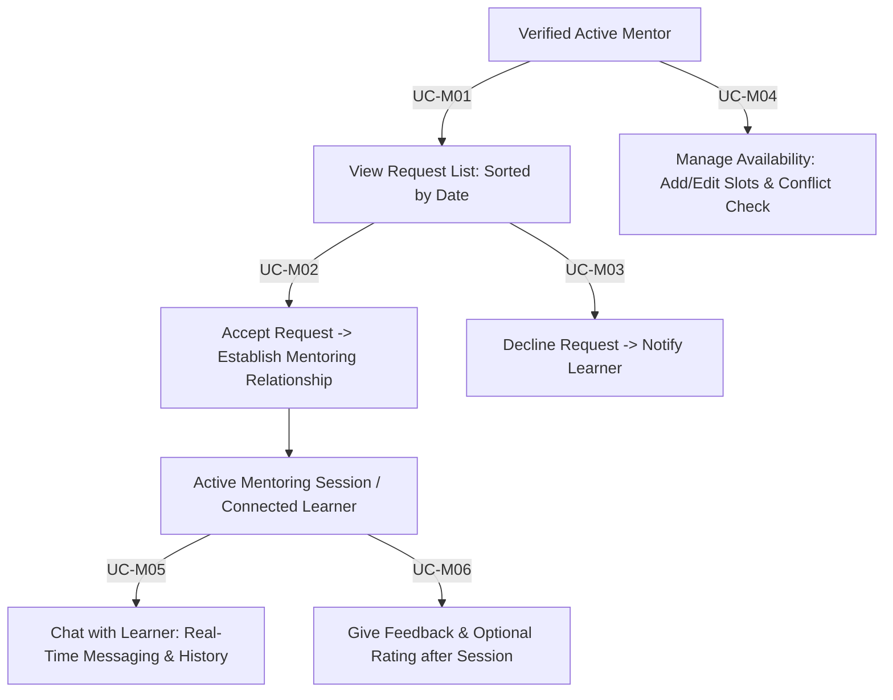

# Module 03: Mentor Portal Specification

**Document Version:** 3.0  
**Parent Document:** [`00-master-srs-overview.md`](./00-master-srs-overview.md)  
**Scope:** Covers incoming request management (`UC-M01` to `UC-M03`), availability slot scheduling (`UC-M04`), real-time chat communication (`UC-M05`), and learner session feedback (`UC-M06`).

---

## 1. Feature Summary & Business Flow

The Mentor Portal is the specialized guidance environment within **IUROADMAP** dedicated to verified educators and industry professionals (`Role == MENTOR` and `mentor_profiles.status == APPROVED`). It allows mentors to review incoming mentorship applications from learners, accept or decline connections, define available mentoring calendar schedules (`slots`), engage in real-time 1-on-1 chat, and log constructive post-session feedback.

---

## 2. Use Case Specifications & Separated Requirements

### UC-M01: View Request List

#### Identification
| Item | Description |
| :--- | :--- |
| **Use Case ID** | `UC-M01` |
| **Name** | View Request List |
| **Actor** | Authenticated Mentor |
| **Description** | Mentor views and manages incoming mentoring requests submitted by learners across the platform. |
| **Trigger** | Mentor selects **"Request List"** / **"Mentorship Requests"** from the navigation menu (`GET /mentors/requests`). |

#### Inputs & Outputs
- **Inputs:** Bearer `Access Token` header.
- **Outputs:** Sorted list of incoming mentorship requests (`Learner Name`, `Learner Email`, `Requested Roadmap/Topic`, `Request Date`, `Message`, `Status: PENDING / ACCEPTED / DECLINED`); available actions per row (`Accept Request`, `Decline Request`, `View Learner Profile`).
- **Messages:** `"No requests available"`, `"Please log in to continue"`, `"System error, please try again"`.

#### Basic Course (Main Flow)
| Step | Actor Action | System Response |
| :---: | :--- | :--- |
| **1** | Open **"Request List"** page (`/mentors/requests`). | **1.1** Validate access token (`RolesGuard` with `Role == MENTOR`). |
| **2** | — | **2.1** Verify that the mentor account exists and `mentor_profiles.status == APPROVED`. |
| **3** | — | **3.1** Retrieve incoming mentorship requests from `mentorship_requests` table targeting `mentorId` (`GET /api/v1/mentors/requests`). |
| **4** | — | **4.1** Sort request records descending by request date (`latest first`). |
| **5** | View request directory. | **5.1** Display request cards/rows showing learner summary, requested topic/roadmap, submitted note, and `PENDING` badge. |
| **6** | Select a specific request row. | **6.1** Display detailed request drawer including full learner bio/progress summary (`View Learner Profile`). |
| **7** | — | **7.1** Render action buttons on pending items: **"Accept"** (`UC-M02`) and **"Decline"** (`UC-M03`). |

#### Alternative Flows
- **A1 – User Not Authenticated (Step 1):** If token is missing/expired, display `"Please log in to continue"` and redirect to Login (`UC-02`).
- **A2 – Mentor Not Approved / Unauthorized (Step 2):** If user role is not `MENTOR` or profile status is `PENDING`/`REJECTED`, return `403 Forbidden` with `"Unauthorized mentor access"`.
- **A3 – No Requests Available (Step 3):** If database returns zero entries for `mentorId`, display empty state: `"No requests available"`.
- **A4 – System Error (Step 3/4):** If database retrieval fails, display `"System error, please try again"`.

#### Preconditions & Postconditions
- **Preconditions:** Mentor is authenticated; mentor profile status is `APPROVED`.
- **Postconditions (Success):** Mentor views accurate, chronologically sorted list of incoming requests and can execute accept or decline workflows.
- **Postconditions (Failure):** Error shown; request directory not loaded.

#### User Story
> *As an active mentor, I want to view and sort all incoming mentoring requests from learners so that I can evaluate their needs and decide whether to accept or decline their connection.*

#### Separated Functional & Data Requirements (`UC-M01`)
1. **The Scope of Work:** Mentor inbox implementation; requires API Gateway `MentorSearchController` / `MentorProfileController.getRequests`, relational join queries to `users` and `user_roadmaps`, and inbox UI layout.
2. **The Scope of Product:** Hub for initiating professional mentoring connections.
3. **Functional & Data Requirements:**
   - **a. Functional Requirements:**
     - `FR-M01.1:` The system shall validate the mentor's access token (`RolesGuard`) and redirect unauthenticated users to the Login page (`UC-02`).
     - `FR-M01.2:` The backend shall verify that `users.role == MENTOR` and `mentor_profiles.status == APPROVED` before granting access.
     - `FR-M01.3:` The backend shall retrieve the list of incoming mentoring requests associated with the authenticated mentor's `mentorId` (`GET /api/v1/mentors/requests`).
     - `FR-M01.4:` The backend shall sort the retrieved requests descending by `requestDate` (`ORDER BY createdAt DESC`).
     - `FR-M01.5:` The system shall display the `Request List`, showing `Learner name`, `Learner email`, `Requested roadmap/topic`, `Request date`, `Message`, and `Status` (`PENDING | ACCEPTED | DECLINED`) for each item.
     - `FR-M01.6:` The system shall display `"No requests available"` if no mentoring requests are found for the mentor.
     - `FR-M01.7:` The system shall display detailed information of a specific request (`View learner profile` + roadmap progress) when selected by the mentor.
     - `FR-M01.8:` The system shall provide `"Accept request"` (`UC-M02`) and `"Decline request"` (`UC-M03`) action buttons for every `PENDING` request.
     - `FR-M01.9:` The system shall display `"System error, please try again"` upon any database failure.
   - **b. Data Requirements:**
     - `DR-M01.1:` `mentorship_requests` table stores `id`, `mentorId`, `learnerId`, `userRoadmapId?`, `topicId?`, `message: string?`, `status: MentorshipRequestStatusEnum (`PENDING | ACCEPTED | DECLINED`)`, `createdAt`.
     - `DR-M01.2:` Query SLA: `< 1.0 second` (`NFR-PF-01`).

---

### UC-M02: Accept Request

#### Identification
| Item | Description |
| :--- | :--- |
| **Use Case ID** | `UC-M02` |
| **Name** | Accept Request |
| **Actor** | Authenticated Mentor |
| **Description** | Mentor accepts a pending mentoring request from a learner to establish an active mentoring connection, unlocking direct real-time chat (`UC-M05`) and feedback capabilities (`UC-M06`). |
| **Trigger** | Mentor selects **"Accept"** on a pending request inside Request List (`UC-M01`) (`POST /mentors/requests/:requestId/accept`). |

#### Inputs & Outputs
- **Inputs:** `requestId` URL parameter, Bearer `Access Token`.
- **Outputs:** Request status updated to `ACCEPTED`; new `mentoring_connections` record created; learner added to mentor's active learners list; notification dispatched to learner.
- **Messages:** `"Request accepted successfully"`, `"Request not found"`, `"Request already processed"`, `"Please log in to continue"`, `"System error, please try again"`.

#### Basic Course (Main Flow)
| Step | Actor Action | System Response |
| :---: | :--- | :--- |
| **1** | Click **"Accept"** button on a `PENDING` request row (`/mentors/requests/:id/accept`). | **1.1** Validate mentor JWT Bearer token (`RolesGuard`). |
| **2** | — | **2.1** Verify mentor authentication and check if `requestId` exists in `mentorship_requests`. |
| **3** | — | **3.1** Validate `request.status`. If not `PENDING`, throw `400 Bad Request` (`"Request already processed"`). |
| **4** | Confirm acceptance prompt (`"Accept connection with this learner?"`). | **4.1** Send `POST /api/v1/mentors/requests/:requestId/accept`. |
| **5** | — | **5.1** Execute atomic transaction: update `mentorship_requests.status = ACCEPTED`. |
| **6** | — | **6.1** Inside same transaction: create `mentoring_connections` record linking `mentorId` and `learnerId`. |
| **7** | — | **7.1** Dispatch automated notification / push alert to inform learner of acceptance. |
| **8** | View result. | **8.1** Show notification: `"Request accepted successfully"`. |
| **9** | — | **9.1** Refresh Request List (`UC-M01`) and unlock Chat button (`UC-M05`) for this learner. |

#### Alternative Flows
- **A1 – User Not Authenticated (Step 1):** If access token is invalid, display `"Please log in to continue"` and redirect to Login (`UC-02`).
- **A2 – Request Not Found (Step 2):** If `requestId` does not exist in database, return `404 Not Found` with message: `"Request not found"`.
- **A3 – Request Already Processed (Step 3):** If `request.status == ACCEPTED || DECLINED`, return `400 Bad Request` with message: `"Request already processed"`.
- **A4 – System Error (Step 5/6):** If database transaction fails during link creation, rollback and display `"System error, please try again"`.

#### Preconditions & Postconditions
- **Preconditions:** Mentor is authenticated; request exists and is in `PENDING` status.
- **Postconditions (Success):** Request status changed to `ACCEPTED`; `mentoring_connections` record persisted; real-time chat (`UC-M05`) unlocked between mentor and learner.
- **Postconditions (Failure):** Request remains `PENDING`; no connection created.

#### User Story
> *As a mentor, I want to accept a pending mentorship request so that I can establish a formal 1-on-1 guidance connection with the learner and open our communication channel.*

#### Separated Functional & Data Requirements (`UC-M02`)
1. **The Scope of Work:** Connection acceptance transaction; requires `MentorSearchController.acceptRequest`, atomic Prisma transaction, and WebSocket/Notification emitter.
2. **The Scope of Product:** Handshake establishing active mentorship.
3. **Functional & Data Requirements:**
   - **a. Functional Requirements:**
     - `FR-M02.1:` The system shall validate the mentor's access token (`RolesGuard`) and redirect unauthenticated users (`"Please log in to continue"`).
     - `FR-M02.2:` The backend shall display `"Request not found"` (`404`) if `Request ID` does not exist in `mentorship_requests`.
     - `FR-M02.3:` The backend shall verify the current status of the request and return `400 Bad Request` (`"Request already processed"`) if the status is not `PENDING`.
     - `FR-M02.4:` The backend shall execute an atomic transaction updating `mentorship_requests.status = ACCEPTED`.
     - `FR-M02.5:` The backend shall automatically create and persist a new `mentoring_connections` record linking the mentor and learner inside the same transaction.
     - `FR-M02.6:` The system shall trigger a system notification (`email / push / notification table`) to inform the learner that their request has been accepted.
     - `FR-M02.7:` The system shall display the success message `"Request accepted successfully"` to the mentor and refresh the directory (`UC-M01`).
     - `FR-M02.8:` The system shall catch any database exception and display `"System error, please try again"`.
   - **b. Data Requirements:**
     - `DR-M02.1:` Transaction atomic check (`Prisma.$transaction([updateRequest, createConnection])`).
     - `DR-M02.2:` `mentoring_connections` record stores `mentorId`, `learnerId`, `connectedAt`, `status: Active`.

---

### UC-M03: Decline Request

#### Identification
| Item | Description |
| :--- | :--- |
| **Use Case ID** | `UC-M03` |
| **Name** | Decline Request |
| **Actor** | Authenticated Mentor |
| **Description** | Mentor declines an incoming mentoring request from a learner when capacity is full or expertise does not align. |
| **Trigger** | Mentor selects **"Decline"** on a pending request inside Request List (`UC-M01`) (`POST /mentors/requests/:requestId/decline`). |

#### Inputs & Outputs
- **Inputs:** `requestId` URL parameter, Bearer `Access Token`.
- **Outputs:** Request status updated to `DECLINED`; notification dispatched to learner.
- **Messages:** `"Request declined successfully"`, `"Request not found"`, `"Request already processed"`, `"Please log in to continue"`, `"System error, please try again"`.

#### Basic Course (Main Flow)
| Step | Actor Action | System Response |
| :---: | :--- | :--- |
| **1** | Click **"Decline"** button on a `PENDING` request row (`/mentors/requests/:id/decline`). | **1.1** Validate mentor access token (`RolesGuard`). |
| **2** | — | **2.1** Verify authentication and check if `requestId` exists in database. |
| **3** | — | **3.1** Validate `request.status`. If not `PENDING`, return `400 Bad Request` (`"Request already processed"`). |
| **4** | Confirm decline action (`"Decline this mentoring request?"`). | **4.1** Send `POST /api/v1/mentors/requests/:requestId/decline`. |
| **5** | — | **5.1** Update `mentorship_requests.status = DECLINED` in database. |
| **6** | — | **6.1** Dispatch automated system notification informing the learner that their request was declined. |
| **7** | View result. | **7.1** Show notification: `"Request declined successfully"`. |
| **8** | — | **8.1** Refresh Request List (`UC-M01`). |

#### Alternative Flows
- **A1 – User Not Authenticated (Step 1):** If token invalid, display `"Please log in to continue"` and redirect to `UC-02`.
- **A2 – Request Not Found (Step 2):** If `requestId` does not exist, return `404 Not Found` (`"Request not found"`).
- **A3 – Request Already Processed (Step 3):** If request is already `ACCEPTED` or `DECLINED`, return `400 Bad Request` (`"Request already processed"`).
- **A4 – System Error (Step 5/6):** If database update fails, display `"System error, please try again"`.

#### Preconditions & Postconditions
- **Preconditions:** Mentor is authenticated; request exists with `status == PENDING`.
- **Postconditions (Success):** Request status set to `DECLINED`; learner notified; request removed from pending queue.
- **Postconditions (Failure):** Request remains `PENDING`.

#### User Story
> *As a mentor, I want to decline pending mentoring requests that I cannot accommodate so that I can effectively manage my guidance workload and maintain high availability for active learners.*

#### Separated Functional & Data Requirements (`UC-M03`)
1. **The Scope of Work:** Decline handler implementation; requires `MentorSearchController.declineRequest` endpoint, status update logic, and notification trigger.
2. **The Scope of Product:** Professional closure mechanism for unaccommodated mentorship inquiries.
3. **Functional & Data Requirements:**
   - **a. Functional Requirements:**
     - `FR-M03.1:` The system shall validate the mentor's access token (`RolesGuard`) and handle unauthenticated access attempts (`"Please log in to continue"`).
     - `FR-M03.2:` The backend shall display `"Request not found"` (`404`) if `Request ID` does not exist in the database.
     - `FR-M03.3:` The backend shall verify the current status of the request and return `400 Bad Request` (`"Request already processed"`) if not `PENDING`.
     - `FR-M03.4:` The backend shall update the `mentorship_requests.status` field to `DECLINED`.
     - `FR-M03.5:` The system shall trigger a system notification to inform the learner that their request has been declined.
     - `FR-M03.6:` The system shall display the success message `"Request declined successfully"` to the mentor and refresh the Request List (`UC-M01`).
     - `FR-M03.7:` The system shall catch database exceptions and display `"System error, please try again"`.
   - **b. Data Requirements:**
     - `DR-M03.1:` `mentorship_requests.status` set strictly to `DECLINED` enum value.

---

### UC-M04: Manage Availability (Schedule & Time Slots)

#### Identification
| Item | Description |
| :--- | :--- |
| **Use Case ID** | `UC-M04` |
| **Name** | Manage Availability (Schedule & Time Slots) |
| **Actor** | Authenticated Mentor |
| **Description** | Mentor sets, updates, or deletes available calendar time slots (`date`, `startTime`, `endTime`) to indicate precisely when they are available for mentoring sessions with learners. |
| **Trigger** | Mentor opens **"Manage Availability"** from the sidebar (`GET /mentors/availability`). |

#### Inputs & Outputs
- **Inputs:** `Time Slots` (`Date`, `Start Time`, `End Time`, `IsRecurring?`), `Availability Status` (`AVAILABLE`, `BOOKED`, `BLOCKED`).
- **Outputs:** Updated mentor availability schedule (`mentor_availability_slots` table); conflict-free calendar view shown to learners.
- **Messages:** `"Availability updated successfully"`, `"Invalid time slot"`, `"Time conflict detected"`, `"System error, please try again"`.

#### Basic Course (Main Flow)
| Step | Actor Action | System Response |
| :---: | :--- | :--- |
| **1** | Open **"Manage Availability"** calendar screen (`/mentors/availability`). | **1.1** Validate mentor JWT access token (`RolesGuard`). |
| **2** | — | **2.1** Fetch current `mentor_availability_slots` mapped to `mentorId` (`GET /api/v1/mentors/availability`). |
| **3** | Click **"Add Time Slot"** / select calendar range. | **3.1** Display availability input form (`Date`, `Start Time`, `End Time`). |
| **4** | Enter `Date`, `Start Time`, and `End Time`. | **4.1** Validate time format (`HH:mm`) and logic (`End Time > Start Time`). |
| **5** | Click **"Save Time Slot"** button. | **5.1** Send `POST /api/v1/mentors/availability` with slot details. |
| **6** | — | **6.1** Check for overlapping schedules against existing time slots (`Time conflict check`). |
| **7** | — | **7.1** Insert/update schedule record in `mentor_availability_slots`. |
| **8** | View result. | **8.1** Show notification: `"Availability updated successfully"`. Refresh calendar view. |

#### Alternative Flows
- **A1 – Invalid Time Slot Logic (Step 4/5):** If `End Time <= Start Time` or date is in the past, display validation error: `"Invalid time slot"`.
- **A2 – Time Conflict / Overlap (Step 6):** If new slot overlaps with an existing `AVAILABLE` or `BOOKED` slot `(newStart < existingEnd && newEnd > existingStart)`, return `400 Bad Request` with message: `"Time conflict detected"`.
- **A3 – Delete / Block Existing Slot (Step 3):** If mentor clicks **"Delete"** on an open slot (`DELETE /mentors/availability/:slotId`), remove slot from calendar. If slot is already `BOOKED`, require session cancellation confirmation first.
- **A4 – System Error (Step 5/7):** If database insertion fails, display `"System error, please try again"`.

#### Preconditions & Postconditions
- **Preconditions:** Mentor is authenticated with `Role == MENTOR`.
- **Postconditions (Success):** Availability schedule persisted; time slots immediately visible on mentor's public profile for learners.
- **Postconditions (Failure):** Database state unchanged; conflicting or invalid slot rejected.

#### User Story
> *As a mentor, I want to manage my calendar availability slots (`date`, `startTime`, `endTime`) so that learners can clearly see when I am open for 1-on-1 mentoring sessions.*

#### Separated Functional & Data Requirements (`UC-M04`)
1. **The Scope of Work:** Calendar scheduling module; requires `MentorProfileController.manageAvailability`, interval overlap checking query, and schedule UI.
2. **The Scope of Product:** Time management infrastructure synchronizing mentor availability with learner bookings.
3. **Functional & Data Requirements:**
   - **a. Functional Requirements:**
     - `FR-M04.1:` The system shall validate the mentor's access token (`RolesGuard`) and handle unauthenticated access attempts (`"Please log in to continue"`).
     - `FR-M04.2:` The backend shall retrieve and display the mentor's current availability schedule (`GET /admin/mentors/availability`).
     - `FR-M04.3:` The system shall provide input fields for the mentor to add or edit time slots, including `Date`, `Start Time`, `End Time`, and `Availability status`.
     - `FR-M04.4:` The backend shall validate the format and logic of the inputted time slots (`endTime > startTime`) and display `"Invalid time slot"` (`400 Bad Request`) if validation fails.
     - `FR-M04.5:` The backend shall execute an overlap interval query (`where: { mentorId, date, startTime: { lt: newEnd }, endTime: { gt: newStart } }`) and display `"Time conflict detected"` if an overlap exists.
     - `FR-M04.6:` The backend shall update and save the modified availability schedule upon valid submission (`POST/PATCH`).
     - `FR-M04.7:` The system shall display the success message `"Availability updated successfully"` to the mentor and refresh the calendar.
     - `FR-M04.8:` The system shall catch any server exception and display `"System error, please try again"`.
   - **b. Data Requirements:**
     - `DR-M04.1:` `mentor_availability_slots` table stores `id`, `mentorId`, `slotDate: date`, `startTime: time`, `endTime: time`, `status` (`SlotStatusEnum: AVAILABLE | BOOKED | BLOCKED`).
     - `DR-M04.2:` Overlap checking query must execute in `< 500ms`.

---

### UC-M05: Chat with Learner (Real-Time Messaging)

#### Identification
| Item | Description |
| :--- | :--- |
| **Use Case ID** | `UC-M05` |
| **Name** | Chat with Learner (Real-Time Messaging) |
| **Actor** | Authenticated Mentor |
| **Description** | Mentor communicates directly with connected learners via real-time WebSocket messaging (`Socket.IO` / `Gateway`) to provide instant academic feedback, roadmap guidance, and answers to questions. |
| **Trigger** | Mentor clicks **"Chat"** on an active learner connection (`GET /mentors/chat/:learnerId`). |

#### Inputs & Outputs
- **Inputs:** `Access Token`, `learnerId` parameter, `Message Content` (text string).
- **Outputs:** Sent and received messages displayed in real-time (`WebSocket payload`); message persisted to `chat_messages` table; updated conversation history list.
- **Messages:** `"Message sent"`, `"Message cannot be empty"`, `"Message failed to send"`, `"Connection lost"`, `"Please log in to continue"`, `"System error, please try again"`.

#### Basic Course (Main Flow)
| Step | Actor Action | System Response |
| :---: | :--- | :--- |
| **1** | Open chat conversation window with a learner (`/mentors/chat/:learnerId`). | **1.1** Validate access token and check active mentoring connection (`mentoring_connections`). |
| **2** | — | **2.1** Load existing persistent conversation history between `mentorId` and `learnerId` (`GET /api/v1/chat/history/:learnerId`). |
| **3** | Type message into text box. | **3.1** Check input length (`Message Content != empty`). |
| **4** | Press **Enter** or click **"Send"** button. | **4.1** Emit `sendMessage` WebSocket event to `api-gateway` (or send `POST /api/v1/chat/messages`). |
| **5** | — | **5.1** Validate message payload. Deliver message to learner in real-time (`emit to learner socket room`). |
| **6** | — | **6.1** Save message record to `chat_messages` table in database. |
| **7** | View chat window. | **7.1** Display newly sent message (`"Message sent"`) and append received replies in real-time (`6.1 Display updated conversation`). |

#### Alternative Flows
- **A1 – Empty Message (Step 3/4):** If mentor attempts to send a blank or whitespace-only message, prevent emission and display `"Message cannot be empty"`.
- **A2 – No Active Mentoring Connection (Step 1):** If mentor and learner do not have an active record in `mentoring_connections` (`status == Active`), return `403 Forbidden` (`"Must accept mentoring request before chatting"`).
- **A3 – WebSocket / Network Connection Lost (Step 4/5):** If WebSocket socket disconnects during transmission, attempt auto-reconnect and display `"Connection lost"`.
- **A4 – Message Send Failure (Step 5/6):** If database insertion or room emission fails, display `"Message failed to send"`.
- **A5 – System Error (Step 2):** If history loading fails, display `"System error, please try again"`.

#### Preconditions & Postconditions
- **Preconditions:** Mentor is authenticated; mentor and learner have an active accepted mentoring connection (`UC-M02`).
- **Postconditions (Success):** Message delivered in real-time (`< 500ms`); persisted permanently to `chat_messages` table; both parties see updated chat transcript.
- **Postconditions (Failure):** Message not sent or stored; error shown.

#### User Story
> *As an active mentor, I want to exchange real-time chat messages with my connected learners so that I can provide prompt academic advice and answer specific course questions when they get stuck.*

#### Separated Functional & Data Requirements (`UC-M05`)
1. **The Scope of Work:** Real-time messaging engine; requires NestJS `WebSocketGateway` (`Socket.IO`), `ChatController` REST fallback, `ChatGateway.handleMessage`, and `chat_messages` persistence.
2. **The Scope of Product:** Communication lifeline connecting learners with expert mentors.
3. **Functional & Data Requirements:**
   - **a. Functional Requirements:**
     - `FR-M05.1:` The system shall validate the mentor's access token (`RolesGuard` / `WsJwtGuard`) and handle unauthenticated access (`"Please log in to continue"`).
     - `FR-M05.2:` The backend shall verify the existence of an active mentoring connection (`mentoring_connections where status == Active`) before allowing chat.
     - `FR-M05.3:` The system shall retrieve and display the existing conversation history when the chat window is opened (`GET /api/v1/chat/history/:learnerId`).
     - `FR-M05.4:` The client and server shall validate typed message content to ensure it is not empty (`@IsNotEmpty() @IsString()`).
     - `FR-M05.5:` The system shall display `"Message cannot be empty"` if the user attempts to send a blank message.
     - `FR-M05.6:` The backend (`WebSocketGateway`) shall deliver the valid message to the target learner in real-time (`emit('receiveMessage', payload)`).
     - `FR-M05.7:` The backend shall persist the message to the `chat_messages` database table (`senderId`, `receiverId`, `content`, `timestamp`).
     - `FR-M05.8:` The system shall immediately display newly sent and received messages inside the chat window.
     - `FR-M05.9:` The system shall display `"Message failed to send"` if the delivery process encounters a network or database error.
     - `FR-M05.10:` The system shall display `"Connection lost"` when socket disconnection occurs and `"System error, please try again"` upon fatal server errors.
   - **b. Data Requirements:**
     - `DR-M05.1:` `chat_messages` table stores `id`, `connectionId`, `senderId`, `receiverId`, `content: text`, `isRead: boolean`, `createdAt`.
     - `DR-M05.2:` Real-time WebSocket latency SLA: `< 500ms` (`NFR-PF-03`).

---

### UC-M06: Give Feedback (Session Assessment & Rating)

#### Identification
| Item | Description |
| :--- | :--- |
| **Use Case ID** | `UC-M06` |
| **Name** | Give Feedback (Session Assessment & Rating) |
| **Actor** | Authenticated Mentor |
| **Description** | Mentor provides formal post-session feedback (`content` string and optional `rating: 1-5 stars`) to learners after completing a mentoring session to highlight strengths, areas for improvement, and next roadmap milestones. |
| **Trigger** | Mentor selects **"Give Feedback"** on an active or completed learner connection (`GET /mentors/feedback/:learnerId`). |

#### Inputs & Outputs
- **Inputs:** `Access Token`, `Learner ID`, `Feedback Content` (mandatory text), `Rating` (`optional integer: 1 to 5 stars`).
- **Outputs:** Persisted feedback record in `mentoring_feedback` table; feedback and rating displayed on the learner's profile / dashboard.
- **Messages:** `"Feedback submitted successfully"`, `"Please enter feedback"`, `"Invalid rating value"`, `"Please log in to continue"`, `"System error, please try again"`.

#### Basic Course (Main Flow)
| Step | Actor Action | System Response |
| :---: | :--- | :--- |
| **1** | Click **"Give Feedback"** button on a learner connection (`/mentors/feedback/:learnerId`). | **1.1** Validate mentor access token (`RolesGuard`). |
| **2** | — | **2.1** Display feedback submission modal / form (`Content text area`, `Star Rating 1-5`). |
| **3** | Enter `Feedback Content` and select optional `Rating`. | **3.1** Validate that `Feedback Content` is not empty. |
| **4** | Click **"Submit Feedback"** button. | **4.1** Send `POST /api/v1/mentors/feedback/:learnerId` with `{ content: "<text>", rating: <int> }`. |
| **5** | — | **5.1** Verify mentoring relationship and validate rating range (`1-5`). |
| **6** | — | **6.1** Save submitted feedback and rating to `mentoring_feedback` table. |
| **7** | View result. | **7.1** Show notification: `"Feedback submitted successfully"`. Close modal. |

#### Alternative Flows
- **A1 – Empty Feedback Content (Step 3/4):** If mentor attempts to submit without text in `Feedback Content`, display validation error: `"Please enter feedback"` and keep modal open.
- **A2 – Invalid Rating Range (Step 4/5):** If rating is outside `1 to 5` range, display `"Invalid rating value"`.
- **A3 – Unauthorized / No Relationship (Step 5):** If mentor has never had an accepted relationship with `Learner ID`, return `403 Forbidden`.
- **A4 – System Error (Step 5/6):** If database insertion fails, display `"System error, please try again"`.

#### Preconditions & Postconditions
- **Preconditions:** Mentor is authenticated; mentor has completed or has an active session/connection with the learner.
- **Postconditions (Success):** Feedback stored in `mentoring_feedback` table; learner receives assessment report on their personal dashboard.
- **Postconditions (Failure):** Feedback not stored; modal remains open.

#### User Story
> *As an active mentor, I want to submit written feedback and an optional star rating after a mentoring session so that the learner receives structured, actionable guidance on how to improve their academic progress.*

#### Separated Functional & Data Requirements (`UC-M06`)
1. **The Scope of Work:** Feedback module; requires `MentorProfileController.giveFeedback`, `mentoring_feedback` table insertion, and learner notification alert.
2. **The Scope of Product:** Assessment loop closing the 1-on-1 mentoring lifecycle.
3. **Functional & Data Requirements:**
   - **a. Functional Requirements:**
     - `FR-M06.1:` The system shall display a feedback form containing input fields for `Feedback content` (text area) and an optional `Rating` (`1 to 5 stars`).
     - `FR-M06.2:` The system shall validate the feedback content to ensure it is not empty (`@IsNotEmpty() @IsString()`) before allowing submission.
     - `FR-M06.3:` The system shall display `"Please enter feedback"` if the mentor attempts to submit an empty feedback form.
     - `FR-M06.4:` The backend shall verify the `Access token` (`RolesGuard`) and check that a valid `Learner ID` relationship exists (`DR-M06.1`).
     - `FR-M06.5:` The backend shall save the submitted feedback and rating to the `mentoring_feedback` table, linking `mentorId` and `learnerId`.
     - `FR-M06.6:` The system shall display the success message `"Feedback submitted successfully"` and close the feedback form upon completion.
     - `FR-M06.7:` The system shall display `"System error, please try again"` if the database insertion encounters an exception.
   - **b. Data Requirements:**
     - `DR-M06.1:` `mentoring_feedback` table stores `id`, `mentorId`, `learnerId`, `content: text`, `rating: int? (@Min(1) @Max(5))`, `createdAt`.
     - `DR-M06.2:` Both `mentorId` and `learnerId` must be valid foreign keys targeting `users` (`ON DELETE CASCADE`).

---

## 3. Module Verification & Acceptance Criteria
- **Automated Tests:** Run `npm test --workspaces` across `mentor-service` and `api-gateway`.
- **E2E Smoke Check:**
  1. Login as an Approved Mentor (`POST /api/v1/auth/login`).
  2. View incoming request list (`GET /api/v1/mentors/requests`) (`UC-M01`).
  3. Accept a pending request from a learner via `POST /api/v1/mentors/requests/:requestId/accept` (`UC-M02`). Confirm `mentoring_connections` record is created.
  4. Set calendar availability via `POST /api/v1/mentors/availability` (`UC-M04`). Verify overlapping slots (`10:00-11:00` vs `10:30-11:30`) return `Time conflict detected`.
  5. Open real-time chat (`UC-M05`) with connected learner via `WebSocket` / `POST /api/v1/chat/messages`. Verify message is emitted and saved in `chat_messages`.
  6. Submit post-session feedback and rating (`4 stars`) via `POST /api/v1/mentors/feedback/:learnerId` (`UC-M06`). Verify `"Feedback submitted successfully"`.
