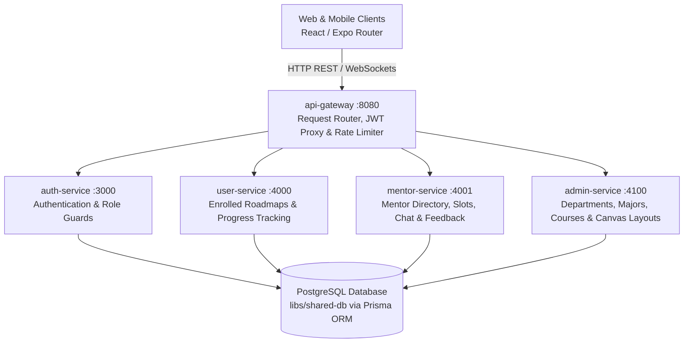
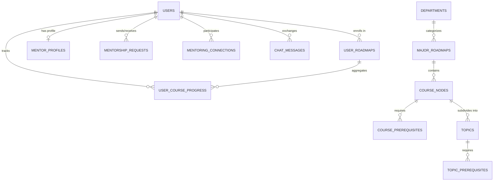
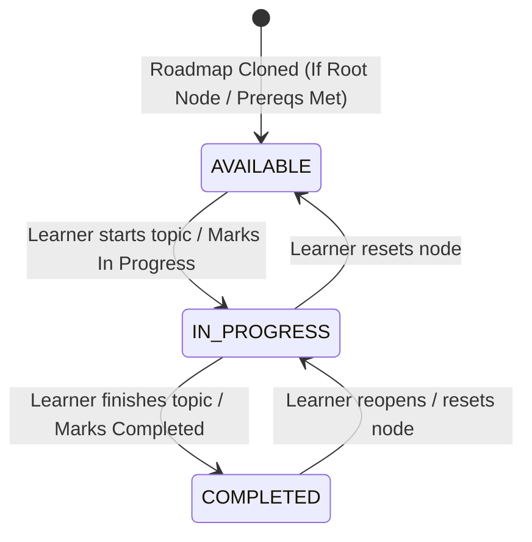
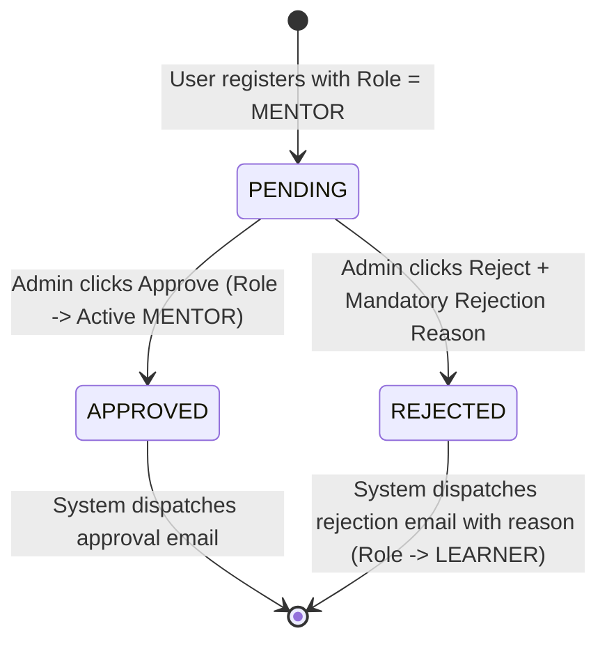
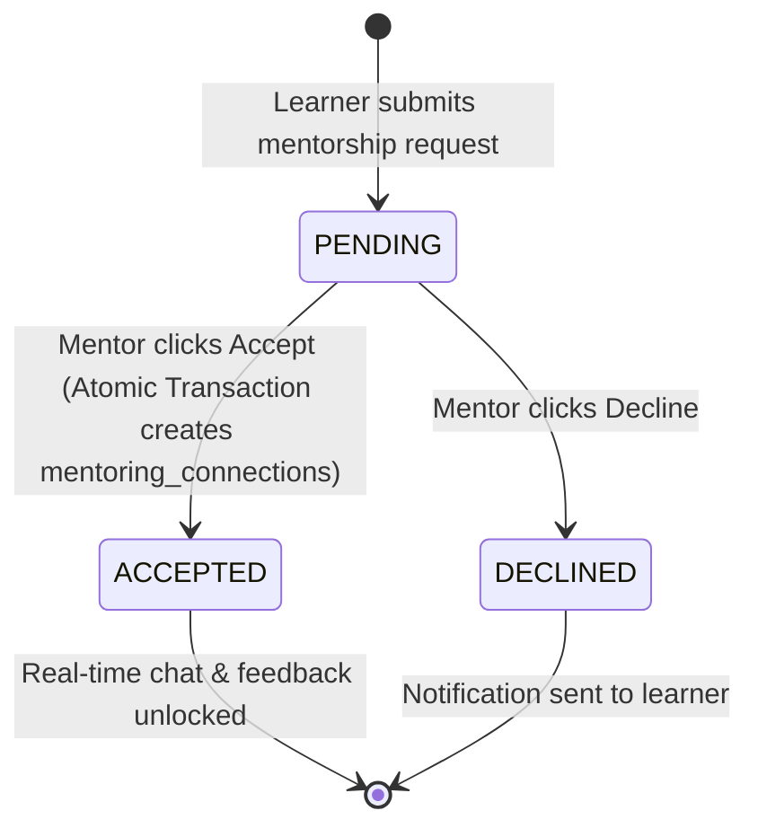

# IUROADMAP — Master Software Requirements Specification (IEEE 830-1998 Adapted for Agile)

**Document Version:** 4.0 (Single Consolidated Document)  
**System Name:** IUROADMAP (AI-Powered Career & Academic Roadmap Platform)  
**Methodology:** IEEE 830-1998 Standard Adapted for Agile Development (10-Chapter Specification Structure)

---

## Chapter 1 (ChÆ°Æ¡ng 1): Introduction

### 1.1 Purpose
This Software Requirements Specification (SRS) provides the complete, authoritative, single-document technical definition of the **IUROADMAP** system. It specifies the functional requirements, use cases, architectural boundaries, data models, state transitions, and non-functional quality attributes governing the entire platform.

### 1.2 Document Conventions & Agile Adaptation
This document follows the **IEEE 830-1998** standard structure, specifically adapted for modern **Agile microservices development**. Rather than separating functional descriptions from user flows, this document merges user stories, step-by-step basic courses, alternative flows, and discrete Functional/Data Requirements (`FR/DR`) directly inside the Use Case specifications (Chapter 4).

### 1.3 Intended Audience
- **Product Owners & Business Analysts:** For backlog prioritization and requirement verification.
- **Software Engineers (Frontend & Backend):** For API contracts, DTO constraints, and graph layout logic.
- **Quality Assurance Engineers:** For creating automated unit, integration, and E2E smoke tests (`npm test --workspaces`).
- **System Architects:** For maintaining microservice boundaries and shared database schemas (`libs/shared-db`).

### 1.4 Project Scope & Boundaries
**IUROADMAP** bridges university academic structures with dynamic, personalized career progression roadmaps. The system delivers:
1. **Learner Portal:** Onboarding, major exploration, roadmap cloning, macro node/edge prerequisite visualization, and topic-level micro-learning tracking.
2. **Admin Management & Canvas Editors:** Department/Major CRUD, visual drag-and-drop roadmap canvases (`Canvas/Graph API`), user directory governance, and mentor verification.
3. **Mentor Portal:** Incoming mentorship request handling, availability scheduling, real-time 1-on-1 WebSocket chat, and post-session feedback.

### 1.5 Document Organization
This specification is organized into 10 comprehensive chapters:
- **Chapter 1:** Introduction & Scope
- **Chapter 2:** System Overview & Operating Environment
- **Chapter 3:** Features & Functional Requirements Summary by Module
- **Chapter 4:** Detailed Use Case Specifications (`UC-01` to `UC-09`, `UC-A01` to `UC-A06`, `UC-M01` to `UC-M06`)
- **Chapter 5:** Interface Requirements (UI, Hardware, Software, Communications)
- **Chapter 6:** Non-Functional Requirements (`NFR-OP`, `NFR-LG`, `NFR-US`, `NFR-HM`, `NFR-PF`, `NFR-MN`, `NFR-SP`, `NFR-SC`)
- **Chapter 7:** Data Specifications & ERD Schema
- **Chapter 8:** Business Rules & Policies
- **Chapter 9:** State Machines & Transitions
- **Chapter 10:** System Notifications & Message Catalog

---

## Chapter 2 (ChÆ°Æ¡ng 2): System Overview

### 2.1 Product Perspective & Microservice Architecture
**IUROADMAP** is a cloud-native, multi-tier distributed web application operating over five core NestJS backend services communicating via an API Gateway and persisting domain data to a centralized PostgreSQL database (`libs/shared-db` with Prisma ORM):

### 2.2 User Classes & Characteristics
1. **Guest / External Visitor:** Unauthenticated user capable of registering (`UC-01`), logging in (`UC-02`), and exploring public academic majors (`UC-03`, `UC-04`).
2. **Authenticated Learner:** Student with active `LEARNER` role who can clone major roadmaps (`UC-05`), track macro/micro progress (`UC-07`, `UC-08`), mark topics completed (`UC-09`), and connect with mentors.
3. **Verified Mentor:** Faculty member or industry professional with `MENTOR` role and `APPROVED` profile status (`UC-A06`) who can manage incoming requests (`UC-M01` to `UC-M03`), set availability schedules (`UC-M04`), chat in real-time (`UC-M05`), and give feedback (`UC-M06`).
4. **System Administrator:** Superuser (`ADMIN` role) responsible for academic hierarchy (`UC-A01`, `UC-A02`), constructing macro/micro visual canvases (`UC-A03`, `UC-A04`), governing user accounts (`UC-A05`), and verifying mentors (`UC-A06`).

### 2.3 Operating Environment
- **Client Side:** Responsive HTML5/CSS3/TS web interfaces running on desktop and mobile viewports (`Expo / React`).
- **Server Side:** Node.js (`v20+`), NestJS microservice architecture running on Docker containers / Render platform.
- **Database Layer:** PostgreSQL (`v15+`) managed via `Prisma ORM` (`libs/shared-db`).
- **Caching & Real-Time:** Redis for token caching and `Socket.IO` (`WebSocketGateway`) for instant messaging.

### 2.4 Design & Implementation Constraints
- **Strict Microservice Separation:** Business logic must not reside in `api-gateway`; the gateway solely routes requests, rate limits (`ThrottlerModule`), and enforces JWT authentication proxies.
- **Single Database Truth:** All relational migrations and models must be centralized in `libs/shared-db`. Microservices must import the generated `@iuroadmap/shared-db` client.
- **Strict Typing:** TypeScript strict mode required (`any` types forbidden). DTOs must use `class-validator` decorators.

### 2.5 Assumptions & Dependencies
- Users possess stable internet connectivity (`HTTP/HTTPS` over TLS 1.3).
- JWT tokens (`Bearer <token>`) are attached by the client in the `Authorization` header for all protected endpoints.
- External dependencies (such as email service providers or SMTP relays) handle background notification delivery asynchronously without blocking primary database transactions.

---

## Chapter 3 (ChÆ°Æ¡ng 3): Features & Functional Requirements Summary

| Module | Core Features Covered | Primary Use Cases |
| :--- | :--- | :--- |
| **Module 01: Learner Portal** | Guest registration/login, major catalog exploration, prerequisite inspection, roadmap cloning into user dashboard, interactive 2D macro canvas rendering (`AVAILABLE`, `IN_PROGRESS`, `COMPLETED`), micro topic viewer, and real-time completion status mutations. | `UC-01` to `UC-09` |
| **Module 02: Admin Management** | Academic department & major CRUD, drag-and-drop visual roadmap canvas editors (`X/Y` coordinate persistence & directed prerequisite edge creation), Directed Acyclic Graph (`DAG`) validation, user directory governance (`Create, Edit, Suspend, Delete`), and mentor profile verification review. | `UC-A01` to `UC-A06` |
| **Module 03: Mentor Portal** | Mentorship request inbox (`Sort by date`, `Accept / Decline` with atomic transaction linking), calendar availability slot manager (`Date, Start/End Time` with real-time interval overlap conflict checking), real-time WebSocket messaging (`< 500ms`), and post-session star rating & feedback. | `UC-M01` to `UC-M06` |

---

## Chapter 4 (ChÆ°Æ¡ng 4): Detailed Use Case Specifications

### 4.1 Module 01: Learner Portal Use Cases (`UC-01` to `UC-09`)

#### UC-01: User Registration
- **Actor:** Guest
- **Description:** User creates a new account with role `LEARNER` or `MENTOR` to access personalized features.
- **Trigger:** User clicks **"Register"** on the landing screen (`POST /api/v1/auth/register-learner`).
- **Inputs:** `Email`, `Password`, `Confirm Password`, `Role` (`Learner` or `Mentor`).
- **Outputs:** Database user record created; JWT issued; redirect to Dashboard (`UC-06`).
- **System Messages:** `"Registration successful"`, `"Email already exists"`, `"Password does not match"`, `"Email format is invalid"`, `"Please fill in all required fields"`.
- **Basic Course (Main Flow):**
  1. Actor clicks **"Register"** button and selects role (`LEARNER` / `MENTOR`).
  2. Actor enters email and matching passwords.
  3. System validates format (`@IsEmail()`) and password confirmation equality.
  4. Backend verifies email uniqueness in `users` table, hashes password (`bcrypt >= 10`), and stores user.
  5. System returns Bearer JWT, displays `"Registration successful"`, and redirects to `/dashboard`.
- **Alternative Flows:**
  - *A1 (Duplicate Email):* Backend returns `400 Bad Request`. Display `"Email already exists"`.
  - *A2 (Mismatch/Empty):* Display `"Password does not match"` or `"Please fill in all required fields"`.
- **Separated Requirements (`FR / DR`):**
  - `FR-01.1:` The system shall validate all required fields and confirm password equality before API submission.
  - `FR-01.2:` The backend (`auth-service`) shall enforce unique email registration and `bcrypt` password hashing.
  - `DR-01.1:` `users.email` `max 255 chars`, unique index; `role` strictly `LEARNER | MENTOR`.

#### UC-02: User Login
- **Actor:** Guest
- **Description:** Registered user authenticates using valid credentials to acquire a JWT Bearer token.
- **Trigger:** User clicks **"Login"** (`POST /api/v1/auth/login`).
- **Inputs:** `Email`, `Password`.
- **Outputs:** JWT access/refresh tokens; redirect to Dashboard.
- **System Messages:** `"Login successful"`, `"Invalid email or password"`, `"Please log in to continue"`.
- **Basic Course (Main Flow):**
  1. Actor enters credentials and submits login form.
  2. Backend compares `Email` and `bcrypt.compare(password, hash)`.
  3. System returns JWT token payload, displays `"Login successful"`, and redirects to Dashboard.
- **Alternative Flows:**
  - *A1 (Invalid Credentials):* Display `"Invalid email or password"` without leaking which field failed.
  - *A2 (Interception):* Unauthenticated access to protected route redirects here with `"Please log in to continue"`.
- **Separated Requirements (`FR / DR`):**
  - `FR-02.1:` The system shall verify `email` and `password` and return `401 Unauthorized` for mismatches.
  - `DR-02.1:` Access token expiry: `3600s` (`1 hour`); Refresh token: `7 days`.

#### UC-03: Browse Majors
- **Actor:** Guest / Learner
- **Description:** User explores available academic majors grouped by department and searches by keyword (`GET /api/v1/explore/majors`).
- **Trigger:** User selects **"Explore Majors"** from navigation menu.
- **Inputs:** `Department Checkbox/Slug Filter`, `Search Keyword`.
- **Outputs:** Grouped catalog of major cards displaying `Name`, `Description`, `Credits`, `Course Count`.
- **System Messages:** `"No majors available"`, `"No matching results"`.
- **Basic Course (Main Flow):**
  1. Actor opens Explore Majors catalog.
  2. Backend returns all active departments eagerly including child majors (`include: { majors: true }`).
  3. Actor applies department filters or types keywords. System dynamically filters cards.
  4. Actor clicks **"View Details"** (`UC-04`) or **"Clone Major"** (`UC-05`).
- **Separated Requirements (`FR / DR`):**
  - `FR-03.1:` The system shall display majors grouped by department and support real-time search/filtering.
  - `DR-03.1:` Query must return total course count per major via `_count: { courses: true }`.

#### UC-04: View Major Details
- **Actor:** Guest / Learner
- **Description:** User inspects a major's metadata, full course breakdown, and prerequisite sequence graph (`GET /api/v1/roadmaps/preview/:slug`).
- **Trigger:** User clicks **"View Details"** on a major card.
- **Inputs:** `Major Slug` or `Major ID`.
- **Outputs:** Course structure list (`Title`, `Credits`, `Description`) and prerequisite visual preview.
- **System Messages:** `"Major not found"`, `"No courses available in this major"`.
- **Basic Course (Main Flow):**
  1. Actor navigates to `/majors/:slug`.
  2. Backend fetches major info, ordered course nodes, and prerequisite edges.
  3. System renders complete course catalog and preview of the prerequisite learning sequence.
- **Separated Requirements (`FR / DR`):**
  - `FR-04.1:` The system shall validate `slug` (`404` if missing) and render both list and graph previews.
  - `DR-04.1:` Public preview endpoint accessible without Bearer token.

#### UC-05: Clone Major
- **Actor:** Authenticated Learner
- **Description:** Learner enrolls in a major roadmap, initializing a personal tracking instance on their dashboard (`POST /api/v1/roadmaps/:slug/enroll`).
- **Trigger:** Learner clicks **"Clone Major"** button.
- **Inputs:** `Major Slug`, Bearer `Access Token`.
- **Outputs:** `user_roadmaps` record created; root nodes set to `AVAILABLE`; redirect to Dashboard (`UC-06`).
- **System Messages:** `"Enrollment successful"`, `"You are already enrolled in this major"`, `"Please log in to continue"`.
- **Basic Course (Main Flow):**
  1. System checks authentication (`JwtAuthGuard`). Redirects guest to Login if unauthenticated.
  2. Actor confirms `"Clone this roadmap to your dashboard?"`.
  3. Backend verifies no existing duplicate enrollment, executes atomic transaction inserting `user_roadmaps` and initializing course node progress records (`AVAILABLE` for root courses without prerequisites).
  4. System displays `"Enrollment successful"` and navigates to Dashboard (`UC-06`).
- **Alternative Flows:**
  - *A1 (Duplicate Enrollment):* Backend returns `400 Bad Request`. Display `"You are already enrolled in this major"`.
- **Separated Requirements (`FR / DR`):**
  - `FR-05.1:` The backend shall execute an atomic `Prisma.$transaction` linking `userId` to `majorRoadmapId`.
  - `DR-05.1:` `user_roadmaps` table requires `userId`, `majorRoadmapId`, `enrolledAt`.

#### UC-06: View My Roadmaps
- **Actor:** Authenticated Learner
- **Description:** Learner views personal dashboard listing enrolled roadmaps and calculated progress percentages (`GET /api/v1/user/roadmaps/my`).
- **Trigger:** Learner opens **"My Roadmaps"** dashboard.
- **Inputs:** Bearer `Access Token`.
- **Outputs:** Roadmap cards showing `Title`, `Credits`, `Enrollment Date`, and `Overall Progress %`.
- **System Messages:** `"No enrolled roadmaps"`.
- **Basic Course (Main Flow):**
  1. System validates access token and retrieves all `user_roadmaps` for `userId`.
  2. Backend dynamically calculates progress: `(Completed Courses / Total Courses) * 100`.
  3. System renders roadmap cards with percentage bars and `"View Progress"` navigation (`UC-07`).
- **Separated Requirements (`FR / DR`):**
  - `FR-06.1:` The backend shall calculate and return progress statistics across all courses in the enrolled roadmap.
  - `DR-06.1:` Progress calculation formula must handle division by zero (`0%` if `Total Courses == 0`).

#### UC-07: View Roadmap Learning Progress (Macro Canvas View)
- **Actor:** Authenticated Learner
- **Description:** Learner interacts with a 2D graph canvas displaying course nodes (`X/Y positions`), prerequisite arrows (`edges`), and status colors (`GET /api/v1/user/roadmaps/:id/overview`).
- **Trigger:** Learner clicks **"View Progress"** from Dashboard.
- **Inputs:** `userRoadmapId`, Bearer `Access Token`.
- **Outputs:** Rendered 2D graph (`React Flow` / `Canvas API`); nodes color-coded: **Blue** (`AVAILABLE`), **Yellow** (`IN_PROGRESS`), **Green** (`COMPLETED`), **Locked Gray** (`Unmet prerequisites`).
- **System Messages:** `"Roadmap not found"`, `"You are not enrolled in this roadmap"`.
- **Basic Course (Main Flow):**
  1. Backend verifies ownership (`userId == user_roadmaps.userId`). Returns `403` if unauthorized.
  2. Backend retrieves nodes, `X/Y` coordinate positions, edges, and user course statuses.
  3. System renders interactive graph. Applies strict badge colors based on node status and prerequisite completion.
  4. Actor left-clicks a node to open Micro View (`UC-08`) or right-clicks to open status context menu (`UC-09`).
- **Separated Requirements (`FR / DR`):**
  - `FR-07.1:` The system shall render directional prerequisite edges and visually lock (`gray out`) nodes whose parent prerequisites are `!= COMPLETED`.
  - `DR-07.1:` Payload: `nodes: Array<{ id, title, position: { x, y }, status }>`, `edges: Array<{ source, target }>`.

#### UC-08: View Course Details (Micro Learning Viewer)
- **Actor:** Authenticated Learner
- **Description:** Learner drills down into sequential course subtopics, learning objectives, and resource links (`GET /api/v1/roadmaps/micro/:courseNodeId`).
- **Trigger:** Learner clicks a course node on the macro canvas.
- **Inputs:** `courseNodeId`, Bearer `Access Token`.
- **Outputs:** Ordered topic sidebar (`learningOrder`), topic objectives bullet points, and resource URLs (`VIDEO / ARTICLE`).
- **System Messages:** `"Course not found"`, `"No topics available for this course"`.
- **Basic Course (Main Flow):**
  1. Backend validates enrollment and returns topics sorted by `learningOrder ASC`.
  2. System renders topic sidebar and right-side detail panel (`Objectives` + `Video/Article URLs`).
  3. Actor navigates via `"Next/Previous Topic"` buttons or clicks `"Mark Topic as Completed"` (`UC-09`).
- **Separated Requirements (`FR / DR`):**
  - `FR-08.1:` The system shall display topics strictly ordered by `learningOrder` and render embedded resource URLs.
  - `DR-08.1:` `topics.resources` stored as JSON array: `Array<{ title, url, type: 'VIDEO' | 'ARTICLE' }>`.

#### UC-09: Mark Topic as Completed
- **Actor:** Authenticated Learner
- **Description:** Learner updates status (`AVAILABLE`, `IN_PROGRESS`, `COMPLETED`) via context menu (`UC-07`) or micro viewer (`UC-08`) (`PATCH /api/v1/user/roadmaps/:id/courses/:courseNodeId`).
- **Trigger:** Learner right-clicks node or clicks **"Mark Completed"**.
- **Inputs:** `status` enum (`AVAILABLE | IN_PROGRESS | COMPLETED`), `creditsEarned`, Bearer `Access Token`.
- **Outputs:** Updated `user_course_progress` record; recalculated roadmap progress (`%`); instant UI badge color update.
- **System Messages:** `"Status updated successfully"`, `"Invalid status transition"`.
- **Basic Course (Main Flow):**
  1. Actor selects target status (`COMPLETED`).
  2. Backend validates prerequisite invariants: if `targetStatus == IN_PROGRESS || COMPLETED`, all parent prerequisite nodes must have `status == COMPLETED`. If violated, returns `400 Bad Request` (`"Invalid status transition"`).
  3. Backend updates `user_course_progress`, recalculates overall `%`, and returns `200 OK`.
  4. System displays `"Status updated successfully"` and updates node color to Green.
- **Separated Requirements (`FR / DR`):**
  - `FR-09.1:` The backend shall strictly enforce prerequisite locking invariants during progress mutations.
  - `DR-09.1:` `creditsEarned` validated: `>= 0` and `<= courseNode.credits`.
### 4.2 Module 02: Admin Management Use Cases (`UC-A01` to `UC-A06`)

#### UC-A01: Manage Department CRUD
- **Actor:** Authenticated Admin (`Role == ADMIN`)
- **Description:** Admin maintains academic departments (`Create, Read, Update, Delete`) (`POST/GET/PATCH/DELETE /api/v1/admin/departments`).
- **Trigger:** Admin selects **"Departments"** on sidebar.
- **Inputs:** `Department Name`, `Department Slug`, `Description`.
- **Outputs:** Updated department directory list.
- **System Messages:** `"Department created successfully"`, `"Department updated successfully"`, `"Department deleted successfully"`, `"Are you sure you want to delete this department?"`.
- **Basic Course (Main Flow):**
  1. System checks Admin role authorization (`RolesGuard`).
  2. Actor submits create or edit form with `Name`, `Slug`, and `Description`.
  3. Backend checks slug uniqueness and inserts/updates record. Displays success message.
  4. For deletion, Actor clicks `"Delete"`, confirms prompt, and backend removes department (`ON DELETE CASCADE` to majors/courses).
- **Separated Requirements (`FR / DR`):**
  - `FR-A01.1:` The backend shall enforce `Role == ADMIN` authorization and reject non-admin requests (`403 Forbidden`).
  - `DR-A01.1:` `departments.slug` unique index, `max 255 chars`, URL-friendly format.

#### UC-A02: Manage Major CRUD
- **Actor:** Authenticated Admin (`Role == ADMIN`)
- **Description:** Admin manages academic majors under departments (`POST/GET/PATCH/DELETE /api/v1/admin/majors`).
- **Trigger:** Admin selects **"Major Roadmaps"** on sidebar.
- **Inputs:** `Major Name`, `Slug`, `Department ID`, `Total Credits Required`, `Description`.
- **Outputs:** Updated major catalog; metadata ready for visual canvas editor (`UC-A03`).
- **System Messages:** `"Major created successfully"`, `"Major updated successfully"`, `"Major deleted successfully"`.
- **Basic Course (Main Flow):**
  1. Actor fills major details and selects parent `Department ID`.
  2. Backend validates numeric credits (`@IsInt() @Min(0)`) and verifies `Department ID` existence.
  3. Backend persists major record, refreshes directory table, and displays success message.
- **Separated Requirements (`FR / DR`):**
  - `FR-A02.1:` The system shall provide an `"Open Canvas"` button for every major row triggering `UC-A03`.
  - `DR-A02.1:` `major_roadmaps.departmentId` foreign key with `ON DELETE CASCADE`.

#### UC-A03: Manage Major Roadmap (Macro Canvas Editor)
- **Actor:** Authenticated Admin (`Role == ADMIN`)
- **Description:** Admin constructs visual graph roadmaps using a drag-and-drop canvas (`Canvas/Graph API`). Manages course nodes (`X/Y positions`) and directional prerequisite connections (`edges`).
- **Trigger:** Admin clicks **"Open Roadmap Canvas"** (`GET /api/v1/admin/roadmaps/:majorSlug/canvas`).
- **Inputs:** `Course Node Details` (`Slug`, `Title`, `Credits`), `Prerequisites` (`Source course nodes`), `Node Coordinates` (`X, Y`).
- **Outputs:** Persisted `X/Y` layout (`PUT /api/v1/admin/roadmaps/:id/layout`); course nodes and prerequisite edges (`course_prerequisites`).
- **System Messages:** `"Course node created successfully"`, `"Course node updated successfully"`, `"Layout saved successfully"`, `"Circular prerequisite dependency detected"`.
- **Basic Course (Main Flow):**
  1. System renders 2D graph canvas displaying existing course nodes (`positionX`, `positionY`) and prerequisite edges.
  2. Actor drags nodes to reposition. Clicks **"Save Layout"**. Backend saves `X/Y` coordinate array.
  3. Actor clicks **"Create Course Node"**, inputs details, and selects prerequisite courses from dropdown (`POST /api/v1/admin/roadmaps/:majorId/courses`).
  4. Backend verifies Directed Acyclic Graph (`DAG`) rules. If cyclic loop detected (`Node A -> Node B -> Node A`), returns `400 Bad Request` (`"Circular prerequisite dependency detected"`). Otherwise, inserts node and edges.
  5. Actor clicks existing node to edit or delete (`DELETE /api/v1/admin/roadmaps/courses/:courseNodeId`).
- **Separated Requirements (`FR / DR`):**
  - `FR-A03.1:` The backend shall execute recursive DAG validation before persisting prerequisite join rows.
  - `DR-A03.1:` `course_nodes` table requires `positionX: Float`, `positionY: Float`, `credits: Int`.

#### UC-A04: Manage Topic Roadmap (Micro Canvas Editor)
- **Actor:** Authenticated Admin (`Role == ADMIN`)
- **Description:** Admin manages subtopics for a specific course by defining nodes (`Estimated Hours`, `Objectives list`), resource links (`VIDEO / ARTICLE URLs`), and prerequisite topic sequences (`GET /api/v1/admin/roadmaps/courses/:id/topics/canvas`).
- **Trigger:** Admin clicks **"Topic Roadmap / Micro Editor"** on a course node.
- **Inputs:** `Topic Title`, `Estimated Hours`, `Objectives` bullet list, `Resources` (`Title`, `Type: VIDEO|ARTICLE`, `URL`), `Prerequisites`, `Coordinates` (`X, Y`).
- **Outputs:** Persisted topic nodes, `learningOrder` sequencing, and resource arrays (`POST/PATCH /api/v1/admin/roadmaps/topics/:id`).
- **System Messages:** `"Topic node created successfully"`, `"Layout saved successfully"`, `"Hours must be a valid number."`.
- **Basic Course (Main Flow):**
  1. System renders micro canvas graph for the selected course node.
  2. Actor drags topic nodes and clicks `"Save Layout"` (`PUT`).
  3. Actor creates/edits topics, adding bulleted `objectives` and external `VIDEO / ARTICLE` resource URLs.
  4. Backend validates URL format (`regex`), stores topic details and resources, and reloads micro canvas.
- **Separated Requirements (`FR / DR`):**
  - `FR-A04.1:` The system shall allow Admin to attach multiple `VIDEO` and `ARTICLE` resources to each topic node.
  - `DR-A04.1:` `topics.estimatedHours` stored as `Float` (`@Min(0.1)`).

#### UC-A05: Manage User Directory & Accounts CRUD
- **Actor:** Authenticated Admin (`Role == ADMIN`)
- **Description:** Admin manages system users, filters by role/status, creates accounts manually, modifies roles (`LEARNER | MENTOR | ADMIN`), suspends violating users (`SUSPENDED`), and deletes records (`POST/GET/PATCH/DELETE /api/v1/admin/users`).
- **Trigger:** Admin selects **"Users"** on sidebar.
- **Inputs:** `Filters/Search` (`Name`, `Email`, `Role`, `Status`), `User Details` (`Full Name`, `Email`, `Password`, `Role`, `Status`).
- **Outputs:** Updated user directory data table.
- **System Messages:** `"User account created successfully"`, `"User updated successfully"`, `"User account has been suspended"`, `"Cannot delete your own administrative account."`.
- **Basic Course (Main Flow):**
  1. System renders User Directory table with search bar and role/status dropdown filters.
  2. Actor clicks `"Add New User"`, inputs details and role, and backend creates account (`bcrypt`).
  3. Actor edits existing user (`e.g., Status -> SUSPENDED`). Backend updates user record (`PATCH`). Suspended user immediately blocked from login by `JwtStrategy`.
  4. Actor clicks `"Delete"`. Backend checks `userId != currentAdminId` (`400 Bad Request` if self-deletion attempted) and cascades deletion across `user_roadmaps` and tokens.
- **Separated Requirements (`FR / DR`):**
  - `FR-A05.1:` The backend shall prevent Admins from deleting or suspending their own active session.
  - `DR-A05.1:` `users.status` enum strictly `ACTIVE | SUSPENDED | BLOCKED`.

#### UC-A06: Verify Mentors (Application Review Workflow)
- **Actor:** Authenticated Admin (`Role == ADMIN`)
- **Description:** Admin reviews pending mentor onboarding applications (`mentor_profiles where status == PENDING`), inspects bio/credentials/LinkedIn URLs, and either approves (`Role -> MENTOR`) or rejects (`Mandatory Rejection Reason required`) (`POST /api/v1/admin/mentors/:id/approve` or `/reject`).
- **Trigger:** Admin selects **"Mentor Verification"** on sidebar (`GET /api/v1/admin/mentors/pending`).
- **Inputs:** `Verification Action` (`Approve` | `Reject`), `Rejection Reason` (Mandatory text string only when selecting `Reject`).
- **Outputs:** Updated `users.role` (`MENTOR` or `LEARNER`), `mentor_profiles.status` (`APPROVED` | `REJECTED`); automated email notification dispatched.
- **System Messages:** `"Mentor application approved successfully"`, `"Mentor application rejected"`, `"Please provide a reason for rejection"`.
- **Basic Course (Main Flow):**
  1. System displays table of pending mentor applicants (`status == PENDING`).
  2. Actor clicks `"View Details"` to inspect bio, expertise skills array, and portfolio/LinkedIn links.
  3. **[Approval Flow]** Actor clicks `"Approve"` and confirms prompt. Backend updates `users.role = MENTOR` and `mentor_profiles.status = APPROVED`, sends approval email, and displays `"Mentor application approved successfully"`.
  4. **[Rejection Flow]** Actor clicks `"Reject"`. System displays rejection modal requiring **Mandatory Rejection Reason**. Actor enters text and submits. Backend verifies reason is non-empty (`@IsNotEmpty()`), updates `mentor_profiles.status = REJECTED` and `rejectionReason = text`, downgrades `users.role = LEARNER`, sends rejection email containing the reason, and displays `"Mentor application rejected"`.
- **Separated Requirements (`FR / DR`):**
  - `FR-A06.1:` The system shall block rejection submission and display `"Please provide a reason for rejection"` if the rejection reason text box is empty.
  - `DR-A06.1:` `mentor_profiles.status` enum strictly `PENDING | APPROVED | REJECTED`; `rejectionReason: String?`.

---

### 4.3 Module 03: Mentor Portal Use Cases (`UC-M01` to `UC-M06`)

#### UC-M01: View Request List
- **Actor:** Authenticated Mentor (`Role == MENTOR`, profile `status == APPROVED`)
- **Description:** Mentor reviews incoming mentorship requests from learners sorted descending by date (`GET /api/v1/mentors/requests`).
- **Trigger:** Mentor opens **"Request List"** menu.
- **Inputs:** Bearer `Access Token`.
- **Outputs:** Chronologically sorted request directory (`Learner summary`, `Requested roadmap/topic`, `Request date`, `Message`, `PENDING badge`).
- **System Messages:** `"No requests available"`, `"Unauthorized mentor access"`.
- **Basic Course (Main Flow):**
  1. System validates token and checks `users.role == MENTOR && mentor_profiles.status == APPROVED`. Returns `403` if unverified.
  2. Backend retrieves all `mentorship_requests` targeting `mentorId` sorted by `createdAt DESC`.
  3. System renders request cards with `"Accept"` (`UC-M02`) and `"Decline"` (`UC-M03`) action buttons.
- **Separated Requirements (`FR / DR`):**
  - `FR-M01.1:` The backend shall sort incoming requests by `createdAt DESC` (`latest first`).
  - `DR-M01.1:` `mentorship_requests` table requires `mentorId`, `learnerId`, `status: PENDING | ACCEPTED | DECLINED`.

#### UC-M02: Accept Request
- **Actor:** Authenticated Mentor
- **Description:** Mentor accepts a pending mentorship request, establishing an active connection (`mentoring_connections`) and unlocking real-time chat (`POST /api/v1/mentors/requests/:id/accept`).
- **Trigger:** Mentor clicks **"Accept"** button.
- **Inputs:** `requestId`, Bearer `Access Token`.
- **Outputs:** `mentorship_requests.status` set to `ACCEPTED`; new `mentoring_connections` record created; learner notification sent.
- **System Messages:** `"Request accepted successfully"`, `"Request not found"`, `"Request already processed"`.
- **Basic Course (Main Flow):**
  1. Actor confirms `"Accept connection with this learner?"`.
  2. Backend validates `request.status == PENDING`. If `!= PENDING`, returns `400 Bad Request` (`"Request already processed"`).
  3. Backend executes atomic `Prisma.$transaction`: updates request status to `ACCEPTED` and inserts `mentoring_connections` (`status = Active`).
  4. System dispatches acceptance notification to learner, displays `"Request accepted successfully"`, and unlocks chat button (`UC-M05`).
- **Separated Requirements (`FR / DR`):**
  - `FR-M02.1:` The backend shall atomically create the `mentoring_connections` record inside the acceptance transaction.
  - `DR-M02.1:` `mentoring_connections` table requires `mentorId`, `learnerId`, `connectedAt`, `status: Active`.

#### UC-M03: Decline Request
- **Actor:** Authenticated Mentor
- **Description:** Mentor declines a pending request (`POST /api/v1/mentors/requests/:id/decline`).
- **Trigger:** Mentor clicks **"Decline"** button.
- **Inputs:** `requestId`, Bearer `Access Token`.
- **Outputs:** `mentorship_requests.status` set to `DECLINED`; notification sent to learner.
- **System Messages:** `"Request declined successfully"`, `"Request already processed"`.
- **Basic Course (Main Flow):**
  1. Actor confirms decline action.
  2. Backend verifies `request.status == PENDING` and updates status to `DECLINED`.
  3. System sends decline alert to learner and removes card from pending queue.
- **Separated Requirements (`FR / DR`):**
  - `FR-M03.1:` The system shall update request status to `DECLINED` and notify the learner.
  - `DR-M03.1:` `status` strictly restricted to `DECLINED` enum value.

#### UC-M04: Manage Availability (Schedule & Time Slots)
- **Actor:** Authenticated Mentor
- **Description:** Mentor sets, edits, or deletes available calendar slots (`slotDate`, `startTime`, `endTime`). Backend checks for time overlaps (`POST/GET/PATCH/DELETE /api/v1/mentors/availability`).
- **Trigger:** Mentor opens **"Manage Availability"** calendar.
- **Inputs:** `Date`, `Start Time`, `End Time`, `Status` (`AVAILABLE | BOOKED | BLOCKED`).
- **Outputs:** Persisted schedule in `mentor_availability_slots`; conflict-free calendar view for learners.
- **System Messages:** `"Availability updated successfully"`, `"Invalid time slot"`, `"Time conflict detected"`.
- **Basic Course (Main Flow):**
  1. System displays mentor's calendar schedule.
  2. Actor inputs `Date`, `Start Time` (`10:00`), and `End Time` (`11:30`).
  3. Backend validates time logic (`endTime > startTime`). If invalid, returns `400 Bad Request` (`"Invalid time slot"`).
  4. Backend executes interval overlap query (`where: { mentorId, date, startTime: { lt: newEnd }, endTime: { gt: newStart } }`). If intersecting slot found, returns `400 Bad Request` (`"Time conflict detected"`).
  5. Otherwise, backend persists slot, refreshes calendar, and displays `"Availability updated successfully"`.
- **Separated Requirements (`FR / DR`):**
  - `FR-M04.1:` The backend shall execute real-time interval overlap checks and reject conflicting schedules.
  - `DR-M04.1:` `mentor_availability_slots` requires `slotDate: Date`, `startTime: String/Time`, `endTime: String/Time`.

#### UC-M05: Chat with Learner (Real-Time Messaging)
- **Actor:** Authenticated Mentor
- **Description:** Mentor communicates with connected learners via bidirectional WebSockets (`Socket.IO` / NestJS `WebSocketGateway`) (`GET /api/v1/chat/history/:learnerId`).
- **Trigger:** Mentor clicks **"Chat"** on an active connection.
- **Inputs:** Bearer `Access Token` / WebSocket JWT, `learnerId`, `Message Content` text.
- **Outputs:** Real-time WebSocket emission (`receiveMessage`); message record persisted to `chat_messages` table.
- **System Messages:** `"Message sent"`, `"Message cannot be empty"`, `"Connection lost"`.
- **Basic Course (Main Flow):**
  1. System opens chat window and fetches persistent conversation history (`GET /chat/history/:learnerId`).
  2. Actor types text and hits Send. Client checks non-empty string.
  3. `ChatGateway` verifies active connection (`mentoring_connections where status == Active`). Returns `403` if disconnected.
  4. Gateway emits `sendMessage` payload to learner's socket room in real-time (`< 500ms`) and inserts record into `chat_messages` table.
  5. Both parties see updated chat transcript instantly.
- **Separated Requirements (`FR / DR`):**
  - `FR-M05.1:` The backend shall verify active mentoring relationship before allowing socket message emission.
  - `DR-M05.1:` `chat_messages` table stores `connectionId`, `senderId`, `receiverId`, `content: Text`, `isRead: Boolean`, `createdAt`.

#### UC-M06: Give Feedback (Session Assessment & Rating)
- **Actor:** Authenticated Mentor
- **Description:** Mentor submits written post-session feedback and optional star rating (`1 to 5 stars`) for a connected learner (`POST /api/v1/mentors/feedback/:learnerId`).
- **Trigger:** Mentor clicks **"Give Feedback"** on learner profile/session.
- **Inputs:** `Learner ID`, `Feedback Content` (mandatory text), `Rating` (`optional int: 1-5`).
- **Outputs:** Record inserted into `mentoring_feedback` table; rating displayed on learner dashboard.
- **System Messages:** `"Feedback submitted successfully"`, `"Please enter feedback"`, `"Invalid rating value"`.
- **Basic Course (Main Flow):**
  1. System opens feedback modal (`Text area` + `Star rating 1-5`).
  2. Actor enters feedback text (`"Great progress on algorithms!"`) and selects `4 stars`.
  3. Backend verifies `Feedback Content` is not empty (`@IsNotEmpty()`) and checks `1 <= rating <= 5`.
  4. Backend persists record in `mentoring_feedback` table, sends alert to learner, displays `"Feedback submitted successfully"`, and closes modal.
- **Separated Requirements (`FR / DR`):**
  - `FR-M06.1:` The system shall validate that `Feedback Content` is non-empty before permitting submission.
  - `DR-M06.1:` `mentoring_feedback.rating` restricted to integer values `1, 2, 3, 4, 5`.
---

## Chapter 5 (ChÆ°Æ¡ng 5): Interface Requirements

### 5.1 User Interfaces (UI & Canvas Graph API)
- **Responsive Layout:** All screens must adapt smoothly between desktop (`1920x1080`, `1366x768`), tablet (`1024x768`), and mobile viewports (`375x667+`) using modern UI tokens and high-contrast typography (`Inter` / `Roboto`).
- **Interactive Roadmap Canvases (`React Flow` / `Canvas API`):**
  - **Macro Canvas View (`UC-07`, `UC-A03`):** 2D plane displaying course nodes at (`positionX`, `positionY`) connected by directional arrows (`edges`). Supports smooth zoom, pan, and right-click context menus.
  - **Micro Canvas View (`UC-08`, `UC-A04`):** Step-by-step topic graph editor and learner resource drill-down viewer.

### 5.2 Hardware & Mobile Interfaces
- **Touch & Drag Interaction:** Touch gestures (`pinch-to-zoom`, `finger drag for nodes`) fully supported across iOS and Android browsers via `Expo Router` / mobile web wrappers.

### 5.3 Software Interfaces & Microservice Gateway
- **Central API Gateway (`Port 8080`):** Single ingress point for all external client traffic. Mounts `/api/v1/*` routes and exposes global Swagger OpenAPI documentation at `/docs`.
- **JWT Authorization Header Protocol:** All protected endpoints require `Authorization: Bearer <token>`. The Gateway verifies token signatures (`auth-service`) before proxying requests to downstream microservices (`user-service`, `mentor-service`, `admin-service`).

### 5.4 Communication Interfaces & WebSockets
- **REST over HTTPS:** Standard JSON request/response payloads (`{ data: <payload>, message: "<status>", statusCode: <int> }`).
- **Bidirectional WebSockets (`Socket.IO`):** Persistent full-duplex TCP/IP connections established with `api-gateway` / `chat-service` for real-time chat (`UC-M05`) and instant status synchronization (`< 500ms` latency).

---

## Chapter 6 (ChÆ°Æ¡ng 6): Non-Functional Requirements

### 6.1 Operational Requirements (`NFR-OP`)
- **NFR-OP-01 (Accessibility):** Operable across Chrome, Safari, Edge, and Firefox without plugin dependencies.
- **NFR-OP-02 (Availability):** `99.9%` uptime (`24/7/365`) excluding scheduled maintenance windows (`>= 48h notice`).
- **NFR-OP-03 (Backup & Recovery):** Automated daily PostgreSQL snapshots (`RPO <= 1h`, `RTO <= 4h`).
- **NFR-OP-04 (Exception Handling):** Global NestJS `HttpExceptionFilter` intercepts unhandled exceptions, returning standardized JSON `{ data: null, message: "<error>", statusCode: <int> }` without stack trace leakage.

### 6.2 Legal & Privacy Requirements (`NFR-LG`)
- **NFR-LG-01 (Data Protection):** Personally Identifiable Information (`PII`: email, full name, profile history) encrypted in transit (`TLS 1.3`) and protected at rest.
- **NFR-LG-02 (Consent):** Zero unauthorized third-party data transfers without explicit opt-in user consent.
- **NFR-LG-03 (Right to Erasure):** Supports user account deletion requests (`ON DELETE CASCADE` or anonymization).

### 6.3 Usability Requirements (`NFR-US`)
- **NFR-US-01 (Simplicity):** Guest onboarding journeys (`Register -> Browse Major -> Clone Roadmap -> View Graph`) completable in `<= 4 logical steps`.
- **NFR-US-02 (Clarity):** Error messages written in plain human language (`"Invalid email or password"`) instead of SQL/stack dumps.

### 6.4 Humanity & Ergonomics Requirements (`NFR-HM`)
- **NFR-HM-01 (Visual Comfort):** Accessible color contrast ratios (`WCAG 2.1 AA`) for course status badges (**Blue** `AVAILABLE`, **Yellow** `IN_PROGRESS`, **Green** `COMPLETED`, plus lock icon).
- **NFR-HM-02 (Cognitive Load):** Batch notifications to prevent fatigue and support smooth zoom controls on complex graphs.

### 6.5 Performance Requirements (`NFR-PF`)
- **NFR-PF-01 (Page & API Response Times):**
  - Standard queries & dashboard loads: `<= 3.0 seconds` (`95th percentile`).
  - Authentication operations (`Login, Register`): `<= 2.0 seconds`.
  - Node progress status mutations (`Mark Completed`): `<= 1.0 second`.
- **NFR-PF-02 (Concurrency):** Microservice cluster (`Redis + NestJS`) supports `100 to 1,000 concurrent active users` without SLA degradation.
- **NFR-PF-03 (Real-Time Latency):** WebSocket chat messages (`UC-M05`) delivered within `<= 500ms`.

### 6.6 Maintainability Requirements (`NFR-MN`)
- **NFR-MN-01 (Code Quality):** Strict NestJS dependency injection, `class-validator` DTO typing, and full automated unit testing (`npm test --workspaces`).
- **NFR-MN-02 (Extensibility):** Centralized database migrations via `libs/shared-db` (`Prisma ORM`).

### 6.7 Support & Documentation Requirements (`NFR-SP`)
- **NFR-SP-01 (Developer Specs):** Every microservice exposes interactive Swagger specs (`v3`) mounted at `http://localhost:<PORT>/docs`.

### 6.8 Security Requirements (`NFR-SC`)
- **NFR-SC-01 (Password Hashing):** Passwords hashed via `bcrypt` (work factor `>= 10`) before DB insertion.
- **NFR-SC-02 (Role Guards):** `RolesGuard` strictly isolates `LEARNER`, `MENTOR`, and `ADMIN` endpoints.
- **NFR-SC-03 (Token Security):** Access token `1h` expiration (`3600s`) with secure refresh token rotation stored in Redis.
- **NFR-SC-04 (Vulnerability Mitigation):** Parameterized queries (`Prisma`) prevent SQLi; DTO sanitization (`whitelist: true`) prevents XSS and mass assignment.

---

## Chapter 7 (ChÆ°Æ¡ng 7): Data Specifications & Domain Entities

### 7.1 Domain Entities & Schema (`libs/shared-db`)
The relational schema is centralized in `libs/shared-db/prisma/schema.prisma`:

### 7.2 Referential Integrity & Data Dictionary

| Table Name | Primary Key | Foreign Keys | Core Fields & Data Types | Cascading Behavior |
| :--- | :--- | :--- | :--- | :--- |
| **`users`** | `id` (UUID) | — | `email` (String, Unique), `passwordHash` (String), `role` (`RoleEnum: LEARNER/MENTOR/ADMIN`), `status` (`ACTIVE/SUSPENDED/BLOCKED`), `createdAt` | Deletion cascades to profiles, enrollments, and tokens. |
| **`departments`** | `id` (UUID) | — | `name` (String), `slug` (String, Unique), `description` (Text), `createdAt` | `ON DELETE CASCADE` to child `major_roadmaps`. |
| **`major_roadmaps`** | `id` (UUID) | `departmentId` $\rightarrow$ `departments.id` | `name` (String), `slug` (String, Unique), `creditsRequired` (Int), `description` (Text) | `ON DELETE CASCADE` to child `course_nodes`. |
| **`course_nodes`** | `id` (UUID) | `majorRoadmapId` $\rightarrow$ `major_roadmaps.id` | `slug` (String), `title` (String), `credits` (Int), `positionX` (Float), `positionY` (Float) | `ON DELETE CASCADE` to `topics` and `prerequisites`. |
| **`course_prerequisites`**| `id` (UUID) | `sourceCourseId` $\rightarrow$ `course_nodes.id` `targetCourseId` $\rightarrow$ `course_nodes.id` | Directed dependency edge `(source -> target)` | Enforces DAG rules; deleted if either node is removed. |
| **`topics`** | `id` (UUID) | `courseNodeId` $\rightarrow$ `course_nodes.id` | `title` (String), `learningOrder` (Int), `estimatedHours` (Float), `objectives` (Text[]), `resources` (JSON) | `ON DELETE CASCADE` to progress records. |
| **`user_roadmaps`** | `id` (UUID) | `userId` $\rightarrow$ `users.id` `majorRoadmapId` $\rightarrow$ `major_roadmaps.id` | `enrolledAt` (DateTime), `progressPercentage` (Float) | Unique constraint `(userId, majorRoadmapId)`. |
| **`user_course_progress`**| `id` (UUID) | `userId` $\rightarrow$ `users.id` `userRoadmapId` $\rightarrow$ `user_roadmaps.id` `courseNodeId` $\rightarrow$ `course_nodes.id` | `status` (`CourseStatusEnum: AVAILABLE/IN_PROGRESS/COMPLETED`), `creditsEarned` (Int), `updatedAt` | Recalculates `user_roadmaps.progressPercentage` on mutation. |
| **`mentor_profiles`** | `id` (UUID) | `userId` $\rightarrow$ `users.id` | `bio` (Text), `expertise` (String[]), `status` (`MentorStatusEnum: PENDING/APPROVED/REJECTED`), `rejectionReason` (String?) | `ON DELETE CASCADE` when user deleted. |
| **`mentorship_requests`**| `id` (UUID) | `mentorId` $\rightarrow$ `users.id` `learnerId` $\rightarrow$ `users.id` | `message` (Text), `status` (`RequestStatusEnum: PENDING/ACCEPTED/DECLINED`), `createdAt` | Updated by `UC-M02` / `UC-M03`. |
| **`mentoring_connections`**| `id` (UUID)| `mentorId` $\rightarrow$ `users.id` `learnerId` $\rightarrow$ `users.id` | `connectedAt` (DateTime), `status` (`Active/Terminated`) | Created atomically upon request acceptance (`UC-M02`). |
| **`chat_messages`** | `id` (UUID) | `connectionId` $\rightarrow$ `mentoring_connections.id` `senderId` $\rightarrow$ `users.id` | `content` (Text), `isRead` (Boolean), `createdAt` | Real-time WebSocket persistence (`UC-M05`). |

---

## Chapter 8 (ChÆ°Æ¡ng 8): Business Rules & Policies

| Rule ID | Rule Category | Strict Policy & Invariant Definition | Associated Use Cases |
| :--- | :--- | :--- | :--- |
| **BR-01** | **Unique Identity** | Every user account must possess a unique email address across the entire platform. | `UC-01`, `UC-A05` |
| **BR-02** | **Prerequisite Locking** | A course node cannot transition to `IN_PROGRESS` or `COMPLETED` unless all parent prerequisite course nodes (`course_prerequisites.sourceCourseId`) have `status == COMPLETED`. | `UC-07`, `UC-08`, `UC-09` |
| **BR-03** | **Root Node Unlocking** | Upon cloning a major roadmap (`UC-05`), all root course nodes (nodes with zero incoming prerequisite edges) are automatically initialized with `status = AVAILABLE`. | `UC-05` |
| **BR-04** | **DAG Non-Cyclicity** | The macro roadmap canvas (`course_prerequisites`) and micro canvas (`topic_prerequisites`) must form a Directed Acyclic Graph (`DAG`). Circular prerequisite loops (`A -> B -> A`) are strictly forbidden (`400 Bad Request`). | `UC-A03`, `UC-A04` |
| **BR-05** | **Mentor Approval Gate** | Users registering as mentors (`PENDING`) cannot access the Mentor Portal (`UC-M01` to `UC-M06`) until an Admin explicitly sets `mentor_profiles.status = APPROVED` (`UC-A06`). | `UC-01`, `UC-A06`, `UC-M01` |
| **BR-06** | **Mandatory Rejection Reason** | When an Admin rejects a mentor application (`UC-A06`), the `Rejection Reason` input is mandatory (`@IsNotEmpty()`). The system must store this text and email it to the applicant. | `UC-A06` |
| **BR-07** | **Atomic Request Handshake** | Accepting a mentorship request (`UC-M02`) must execute inside an atomic database transaction that updates `mentorship_requests.status = ACCEPTED` and inserts `mentoring_connections`. | `UC-M02` |
| **BR-08** | **Active Connection Guard** | Real-time chat (`UC-M05`) and post-session feedback (`UC-M06`) are strictly restricted to mentor-learner pairs with an active `mentoring_connections` record. | `UC-M05`, `UC-M06` |
| **BR-09** | **No Duplicate Enrollments** | A learner cannot clone/enroll in the same `majorRoadmapId` more than once (`400 You are already enrolled in this major`). | `UC-05` |
| **BR-10** | **Real-Time Overlap Check** | When a mentor adds or updates a calendar availability slot (`UC-M04`), the backend must query intersecting intervals (`startTime < newEnd && endTime > newStart`) and reject overlaps (`400 Time conflict detected`). | `UC-M04` |
| **BR-11** | **Self-Deletion Prevention**| An Admin (`Role == ADMIN`) is strictly prevented from deleting or suspending their own active user account (`400 Cannot delete your own administrative account`). | `UC-A05` |
| **BR-12** | **Cascading Deletion** | Deleting a department (`UC-A01`), major (`UC-A02`), or course node (`UC-A03`) must cascade to delete all dependent sub-elements (`majors, courses, topics, prerequisites`). | `UC-A01`, `UC-A02`, `UC-A03` |
| **BR-13** | **Non-Empty Chat & Feedback**| WebSocket chat messages (`UC-M05`) and post-session feedback (`UC-M06`) cannot be blank or whitespace (`@IsNotEmpty()`). | `UC-M05`, `UC-M06` |
| **BR-14** | **Rating Range Constraint**| Star ratings submitted in feedback (`UC-M06`) must be integers between `1 and 5` inclusive (`@Min(1) @Max(5)`). | `UC-M06` |
| **BR-15** | **Dynamic Progress Formula**| Roadmap progress `%` equals `(Count of courses where status == COMPLETED / Total courses in major) * 100`, updated dynamically upon any `user_course_progress` mutation (`UC-09`). | `UC-06`, `UC-07`, `UC-09` |

---

## Chapter 9 (ChÆ°Æ¡ng 9): State Machines & Transitions

### 9.1 Course Node Learning State Machine (`UC-07`, `UC-08`, `UC-09`)
Governs the progression lifecycle of individual courses within a learner's cloned roadmap:

*Transition Rule (`BR-02`):* Nodes remain locked (`status = Unmet Prerequisites / Gray`) and cannot enter `AVAILABLE` until all inbound prerequisite edges originate from `COMPLETED` nodes.

### 9.2 Mentor Application Verification State Machine (`UC-A06`)
Governs how educator credentials are reviewed by System Administrators:

### 9.3 Mentoring Request State Machine (`UC-M01`, `UC-M02`, `UC-M03`)
Governs the connection lifecycle between a Learner and a Mentor:

---

## Chapter 10 (ChÆ°Æ¡ng 10): System Notifications & Message Catalog

### 10.1 Standardized UI Success Messages (`HTTP 200 / 201`)
| Message Text | Trigger & Context | Associated Use Cases |
| :--- | :--- | :--- |
| `"Registration successful"` | Account created in database and JWT issued (`201 Created`). | `UC-01` |
| `"Login successful"` | Credentials verified against `bcrypt` hash (`200 OK`). | `UC-02` |
| `"Enrollment successful"` | Major roadmap cloned into `user_roadmaps` (`201 Created`). | `UC-05` |
| `"Status updated successfully"` | Course node status mutated (`PATCH /courses/:id`). | `UC-09` |
| `"Department created successfully"` | Department inserted into `departments` (`201 Created`). | `UC-A01` |
| `"Major created successfully"` | Major inserted into `major_roadmaps` (`201 Created`). | `UC-A02` |
| `"Course node created successfully"`| Course node and prerequisites persisted on canvas (`201 Created`). | `UC-A03` |
| `"Layout saved successfully"` | Node coordinate `X/Y` layout saved (`PUT /layout`). | `UC-A03`, `UC-A04` |
| `"User account created successfully"`| Manual user insertion by Admin (`201 Created`). | `UC-A05` |
| `"User updated successfully"` | Admin modifies user profile or role (`PATCH /users/:id`). | `UC-A05` |
| `"Mentor application approved successfully"` | Admin approves pending mentor (`POST /mentors/:id/approve`). | `UC-A06` |
| `"Mentor application rejected"` | Admin rejects mentor with reason (`POST /mentors/:id/reject`). | `UC-A06` |
| `"Request accepted successfully"` | Mentor accepts mentorship inquiry (`POST /requests/:id/accept`). | `UC-M02` |
| `"Request declined successfully"` | Mentor declines mentorship inquiry (`POST /requests/:id/decline`). | `UC-M03` |
| `"Availability updated successfully"`| Calendar time slot saved/updated (`POST/PATCH /availability`).| `UC-M04` |
| `"Message sent"` | WebSocket chat message emitted and saved to `chat_messages`. | `UC-M05` |
| `"Feedback submitted successfully"` | Post-session feedback saved (`POST /feedback/:learnerId`). | `UC-M06` |

### 10.2 Client & Server Error Catalog (`HTTP 400 / 401 / 403 / 404 / 500`)
| Message Text | Severity & HTTP Status | Trigger & Invariant Violation | Associated Use Cases |
| :--- | :--- | :--- | :--- |
| `"Email already exists"` | `400 Bad Request` | Registration submitted with duplicate email (`BR-01`). | `UC-01`, `UC-A05` |
| `"Password does not match"` | `400 Bad Request` | `Password != Confirm Password` on form submission. | `UC-01` |
| `"Invalid email or password"` | `401 Unauthorized` | Login credential check failed against database. | `UC-02` |
| `"Please log in to continue"` | `401 Unauthorized` | Unauthenticated access to protected route intercepted by guard. | `UC-02`, `UC-05` to `UC-09` |
| `"You are already enrolled in this major"`| `400 Bad Request` | Learner attempts to clone duplicate `majorRoadmapId` (`BR-09`). | `UC-05` |
| `"Invalid status transition"` | `400 Bad Request` | Attempted `IN_PROGRESS/COMPLETED` when prerequisite not completed (`BR-02`). | `UC-09` |
| `"Circular prerequisite dependency detected"`| `400 Bad Request` | Admin adds cyclic edge loop (`A -> B -> A`) on canvas (`BR-04`). | `UC-A03`, `UC-A04` |
| `"Please provide a reason for rejection"`| `400 Bad Request` | Admin submits rejection modal with empty reason box (`BR-06`). | `UC-A06` |
| `"Time conflict detected"` | `400 Bad Request` | Mentor adds availability slot overlapping existing interval (`BR-10`).| `UC-M04` |
| `"Cannot delete your own administrative account."`| `400 Bad Request` | Admin attempts self-deletion (`BR-11`). | `UC-A05` |
| `"Request already processed"` | `400 Bad Request` | Mentor accepts/declines a request that is no longer `PENDING`. | `UC-M02`, `UC-M03` |
| `"Message cannot be empty"` | `400 Bad Request` | Blank chat message emission blocked (`BR-13`). | `UC-M05` |
| `"Invalid rating value"` | `400 Bad Request` | Feedback rating outside `1-5` integer bounds (`BR-14`). | `UC-M06` |
| `"Unauthorized mentor access"` | `403 Forbidden` | User role `!= MENTOR` or status `!= APPROVED` (`BR-05`). | `UC-M01` |
| `"Roadmap not found"` / `"Course not found"` | `404 Not Found` | Requested UUID/Slug does not exist in relational database. | `UC-04`, `UC-07`, `UC-08` |
| `"System error, please try again"` | `500 Internal Server Error`| Unhandled database disconnection, network timeout, or server crash. | All Use Cases |

---

## 🏁 Document Verification & Acceptance Sign-Off
This single consolidated SRS document (`IUROADMAP_Master_SRS_IEEE830.md`) satisfies all 10 chapters required by the adapted IEEE 830-1998 Agile specification. It serves as the canonical contract between the Business Analysis team, System Architecture team, and Software Development team (`npm test --workspaces`).
