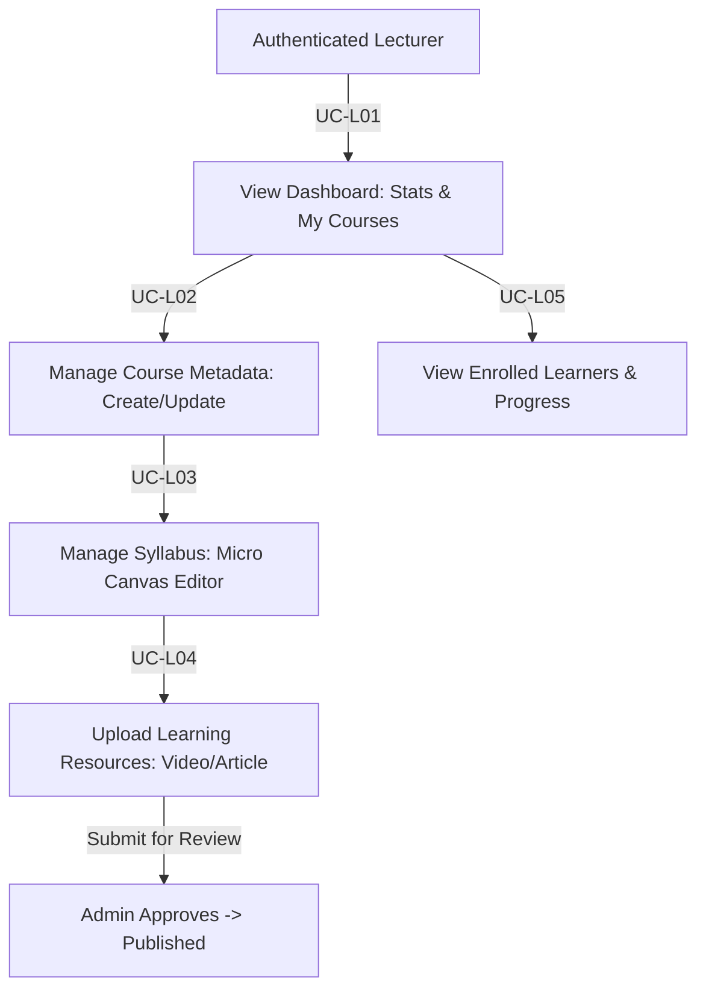

# Module 03: Lecturer Portal Specification

**Document Version:** 1.0  
**Parent Document:** [`00-master-srs-overview.md`](./00-master-srs-overview.md)  
**Scope:** Covers the Lecturer dashboard (`UC-L01`), course metadata management (`UC-L02`), syllabus construction via micro canvas (`UC-L03`), learning resource uploading (`UC-L04`), and tracking enrolled learners (`UC-L05`).

---

## 1. Feature Summary & Business Flow

The Lecturer Portal is the specialized environment within **IUROADMAP** dedicated to instructors, contributors, and teaching assistants (`Role == LECTURER`). It empowers educators to create their own standalone courses, design instructional roadmaps using the micro canvas editor, attach learning materials (videos, articles), and monitor the progress of enrolled learners. Courses created by Lecturers are submitted for Admin approval before being published to the public learner catalog.

---

## 2. Use Case Specifications & Separated Requirements

### UC-L01: View Lecturer Dashboard

#### Identification
| Item | Description |
| :--- | :--- |
| **Use Case ID** | `UC-L01` |
| **Name** | View Lecturer Dashboard |
| **Actor** | Authenticated Lecturer |
| **Description** | Lecturer views a summary dashboard showing total enrolled learners, average course ratings, and a list of all courses they have authored (Draft, Pending, Published). |
| **Trigger** | Lecturer logs in and is routed to the Lecturer dashboard (`GET /lecturer/dashboard`). |

#### Inputs & Outputs
- **Inputs:** Bearer `Access Token` header.
- **Outputs:** Dashboard statistics (`Total Students`, `Total Revenue/Points`, `Average Rating`); list of `My Courses`.
- **Messages:** `"System error, please try again"`.

#### Basic Course (Main Flow)
| Step | Actor Action | System Response |
| :---: | :--- | :--- |
| **1** | Navigate to the Lecturer Portal. | **1.1** Validate access token (`RolesGuard` with `Role == LECTURER`). |
| **2** | — | **2.1** Retrieve aggregated statistics for courses where `authorId == currentUserId`. |
| **3** | — | **2.2** Retrieve list of authored courses (`GET /api/v1/lecturer/courses`). |
| **4** | View dashboard. | **4.1** Render statistics widgets and the course directory table. |

#### Preconditions & Postconditions
- **Preconditions:** User is authenticated with `Role == LECTURER`.
- **Postconditions (Success):** Dashboard rendered accurately.

#### Separated Functional & Data Requirements (`UC-L01`)
1. **The Scope of Work:** Lecturer landing page; requires API Gateway `LecturerDashboardController` and aggregation queries.
2. **Functional & Data Requirements:**
   - `FR-L01.1:` The system shall validate the `LECTURER` role before granting access.
   - `FR-L01.2:` The backend shall aggregate and return total enrolled learners and average ratings for all courses authored by the user.

---

### UC-L02: Manage Course Metadata (CRUD)

#### Identification
| Item | Description |
| :--- | :--- |
| **Use Case ID** | `UC-L02` |
| **Name** | Manage Course Metadata (CRUD) |
| **Actor** | Authenticated Lecturer |
| **Description** | Lecturer creates or updates the basic details of a course (Title, Thumbnail, Description, Price, Category) and submits it for admin approval. |
| **Trigger** | Lecturer clicks **"Create Course"** or **"Edit"** on the dashboard. |

#### Inputs & Outputs
- **Inputs:** `Course Title`, `Slug`, `Description`, `Thumbnail Image`, `Price`, `Category ID`.
- **Outputs:** Persisted course record with status `DRAFT`.
- **Messages:** `"Course saved successfully"`, `"Please fill in all required fields"`.

#### Basic Course (Main Flow)
| Step | Actor Action | System Response |
| :---: | :--- | :--- |
| **1** | Click **"Create Course"**. | **1.1** Display course metadata form. |
| **2** | Fill in `Title`, `Slug`, `Description`, `Price` and upload `Thumbnail`. | **2.1** Validate inputs on client-side. |
| **3** | Click **"Save Course"**. | **3.1** Send `POST /api/v1/lecturer/courses`. |
| **4** | — | **4.1** Validate inputs. Insert new course with `status = DRAFT` and `authorId = currentUserId`. |
| **5** | View result. | **5.1** Display `"Course saved successfully"`. |

#### Separated Functional & Data Requirements (`UC-L02`)
- **a. Functional Requirements:**
  - `FR-L02.1:` The system shall provide a form for course metadata (Title, Slug, Description, Thumbnail, Price).
  - `FR-L02.2:` The backend shall enforce uniqueness on the course `slug`.
  - `FR-L02.3:` The backend shall automatically assign `authorId` to the authenticated user's ID.
  - `FR-L02.4:` The backend shall default new courses to a `DRAFT` status.

---

### UC-L03: Manage Course Syllabus (Micro Canvas Editor)

#### Identification
| Item | Description |
| :--- | :--- |
| **Use Case ID** | `UC-L03` |
| **Name** | Manage Course Syllabus (Micro Canvas Editor) |
| **Actor** | Authenticated Lecturer |
| **Description** | Lecturer designs the learning path by adding Topic Nodes and linking them with prerequisite edges on a drag-and-drop canvas. |
| **Trigger** | Lecturer clicks **"Curriculum Editor"** for a specific course. |

*(Note: The flow and requirements for this Use Case exactly mirror `UC-A04` from Module 02, but are scoped strictly to courses authored by the Lecturer).*

#### Basic Course (Main Flow)
| Step | Actor Action | System Response |
| :---: | :--- | :--- |
| **1** | Open curriculum canvas (`/lecturer/courses/:courseId/canvas`). | **1.1** Verify `authorId == currentUserId`. Render visual roadmap canvas. |
| **2** | Drag and drop topic nodes; define prerequisites. | **2.1** Update local `X/Y` coordinate state. |
| **3** | Click **"Save Layout"**. | **3.1** Send `PUT /api/v1/lecturer/courses/:courseId/layout`. Show: `"Layout saved successfully"`. |

---

### UC-L04: Manage Learning Resources

#### Identification
| Item | Description |
| :--- | :--- |
| **Use Case ID** | `UC-L04` |
| **Name** | Manage Learning Resources |
| **Actor** | Authenticated Lecturer |
| **Description** | Lecturer uploads videos, PDFs, or links external articles to specific Topic Nodes in the syllabus. |

#### Basic Course (Main Flow)
| Step | Actor Action | System Response |
| :---: | :--- | :--- |
| **1** | Click on a specific Topic Node in the Canvas. | **1.1** Open `"Edit Topic"` drawer. |
| **2** | Navigate to the **"Resources"** tab. | **2.1** Display current resource list. |
| **3** | Add a new resource (`Title`, `Type: VIDEO/ARTICLE`, `URL`). | **3.1** Validate URL format. |
| **4** | Click **"Save Resources"**. | **4.1** Send `PATCH /api/v1/lecturer/topics/:topicId/resources`. |

---

### UC-L05: View Enrolled Learners

#### Identification
| Item | Description |
| :--- | :--- |
| **Use Case ID** | `UC-L05` |
| **Name** | View Enrolled Learners |
| **Actor** | Authenticated Lecturer |
| **Description** | Lecturer views a list of all learners who have enrolled in their courses to track their progression. |

#### Basic Course (Main Flow)
| Step | Actor Action | System Response |
| :---: | :--- | :--- |
| **1** | Click **"Learners"** tab inside a specific course dashboard. | **1.1** Send `GET /api/v1/lecturer/courses/:courseId/learners`. |
| **2** | — | **2.1** Query `user_roadmaps` joining `users` where `courseId` matches. |
| **3** | View table. | **3.1** Display Learner Name, Enrollment Date, and Completion Percentage (%). |

---

## 3. Module Verification & Acceptance Criteria
- **E2E Smoke Check:**
  1. Login as a Lecturer (`Role == LECTURER`).
  2. Create a new course via `POST /api/v1/lecturer/courses` (`UC-L02`).
  3. Verify the course appears in the dashboard with `DRAFT` status (`UC-L01`).
  4. Open the Curriculum Editor and create 2 Topic Nodes with prerequisite links (`UC-L03`).
  5. Add a `VIDEO` resource URL to one of the topics (`UC-L04`).
  6. Submit the course for Admin approval.
