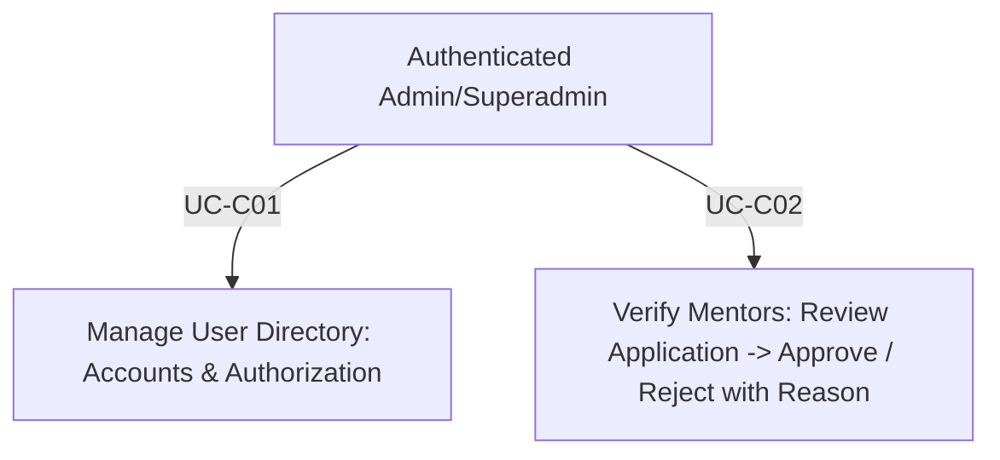

# Module 04: Admin Configuration & User Governance

**Document Version:** 1.0  
**Parent Document:** [`00-master-srs-overview.md`](./00-master-srs-overview.md)  
**Scope:** Covers user directory governance (`UC-C01`) and mentor verification workflow (`UC-C02`). These features are strictly reserved for `Admin` and `Superadmin` roles.

---

## 1. Feature Summary & Business Flow

The Admin Configuration portal allows authorized system administrators to manage human resources and user accounts across the platform. This includes assigning roles (such as delegating course creation to Collaborators), enforcing access controls, reviewing mentor applications, and suspending violating accounts.

---

## 2. Use Case Specifications & Separated Requirements

### UC-C01: Manage User Directory (Accounts & Authorization)

#### Identification
| Item | Description |
| :--- | :--- |
| **Use Case ID** | `UC-C01` |
| **Name** | Manage Users (Accounts & Authorization) |
| **Actor** | `Admin`, `Superadmin` |
| **Description** | Admin manages system users by viewing the user directory data table, filtering by multiple criteria (role, subscription tier, etc.), manually creating new user accounts, modifying user details/roles (e.g., assigning a user to be a `Collaborator`), suspending violating accounts, and permanently deleting user records (Superadmin only). |
| **Trigger** | Admin selects **"Configuration > Accounts & Authorization"** on the admin navigation sidebar (`GET /admin/users`). |

#### Inputs & Outputs
- **Inputs:** `Filters/Search` (`Name`, `Email`, `Role`, `SubscriptionTier`, `SubscriptionExpiresAt`), `User Details (Create/Update)` (`Full Name`, `Email Address`, `Password for creation`, `Role`, `Status`).
- **Outputs:** User Directory Table (`Name`, `Email`, `Role`, `Status`, `SubscriptionTier`, `SubscriptionExpiresAt`, `Actions: Edit / Suspend`).
- **Messages:** `"User account created successfully"`, `"User updated successfully"`, `"User account has been suspended"`, `"User deleted successfully"`, `"Email already exists in the system"`, `"Please fill in all required fields"`, `"System error, please try again"`.

#### Basic Course (Main Flow)
| Step | Actor Action | System Response |
| :---: | :--- | :--- |
| **1** | Click **"Configuration > Accounts"** on sidebar. | **1.1** Display Manage Users page with data table (`GET /api/v1/admin/users`). |
| **2** | Use search bar (`Name/Email`) or dropdown filters (`Role`, `SubscriptionTier`). | **2.1** Filter the user directory list dynamically based on inputs. |
| **3** | Click **"Add New User"** button. | **3.1** Display user creation form / modal. |
| **4** | Fill in `Name`, `Email`, `Password`, and `Role`. | **4.1** Validate input format. |
| **5** | Click **"Create User"** button. | **5.1** Check email uniqueness. Show: `"User account created successfully"`. Refresh table. |
| **6** | Click **"Edit"** action on a specific user row. | **6.1** Display edit form populated with current user profile, role, and status. |
| **7** | Modify fields (e.g., change `Role` to `Collaborator`) and click **"Save Changes"**. | **7.1** Send `PATCH /api/v1/admin/users/:id`. Show: `"User updated successfully"`. Refresh table. |
| **8** | Click **"Delete"** action (Superadmin only) or **"Suspend"**. | **8.1** Show confirmation prompt. |
| **9** | Confirm action. | **9.1** Send `DELETE` or `PATCH` request. Show success message. Refresh table. |

#### Separated Functional & Data Requirements (`UC-C01`)
1. **The Scope of Work:** User directory governance module; requires `UsersController` (`POST`, `GET`, `PATCH`, `DELETE`), DTO class-validator rules, and `users` table pagination/filtering queries.
2. **The Scope of Product:** Central administrative security & identity management dashboard.
3. **Functional & Data Requirements:**
   - **a. Functional Requirements:**
     - `FR-C01.1:` The system shall verify `Admin` or `Superadmin` role authorization before granting access to the Configuration module.
     - `FR-C01.2:` The system shall display the Manage Users directory table showing `Name`, `Email`, `Role`, `Status`, `SubscriptionTier`, `SubscriptionExpiresAt`, and `Actions`.
     - `FR-C01.3:` The system shall filter the user list dynamically based on search bar inputs (`name`, `email`) and selected dropdown filters (`Role`, `SubscriptionTier`).
     - `FR-C01.4:` The system shall allow exact match filtering for `subscriptionTier` (`FREE`, `VIP`, `PRO`) and date range filtering for `subscriptionExpiresAt`.
     - `FR-C01.5:` The system shall provide a user creation form requiring `Email`, `Name`, `Password`, and `Role`.
     - `FR-C01.6:` The backend shall check email uniqueness, hash the password, insert the user record, and display `"User account created successfully"`.
     - `FR-C01.7:` The backend shall modify user details, role (Authorization), or account status (`e.g., BANNED/SUSPENDED`), and refresh the table.
     - `FR-C01.8:` **Business Rule:** An `Admin` cannot change the role of a `Superadmin`, nor can they downgrade their own role. Only a `Superadmin` can perform a Hard Delete on an account.
     - `FR-C01.9:` Changing a user's status to `BANNED` shall immediately invalidate their session token and prevent new logins.
   - **b. Data Requirements:**
     - `DR-C01.1:` `users` table requires `email` (unique index), `password` (hashed), `roleId`, `status`, `subscriptionTier`, and `subscriptionExpiresAt`.

---

### UC-C02: Verify Mentors (Application Review Workflow)

#### Identification
| Item | Description |
| :--- | :--- |
| **Use Case ID** | `UC-C02` |
| **Name** | Verify Mentor (Application Review Workflow) |
| **Actor** | Authenticated Admin |
| **Description** | Admin reviews pending mentor applications submitted during onboarding, evaluates their profile credentials (`bio`, `expertise`, `LinkedIn/GitHub URLs`), and either approves or rejects their request. |
| **Trigger** | Admin selects **"Configuration > Mentor Verification"** on the sidebar (`GET /admin/mentors/pending`). |

#### Separated Functional & Data Requirements (`UC-C02`)
1. **The Scope of Work:** Verification workflow sprint; requires `ManagementController.verifyMentor` in `admin-service`, state transition handlers, and email notification trigger hooks.
2. **The Scope of Product:** Quality control gate governing the **IUROADMAP** mentoring network.
3. **Functional & Data Requirements:**
   - **a. Functional Requirements:**
     - `FR-C02.1:` The system shall display the `"Mentors Verification"` page showing a list of all pending mentor applicants (`mentor_profiles where status == PENDING`).
     - `FR-C02.2:` The system shall load and display the applicant's detailed profile and submitted credentials (`bio`, `skills`, `links`) upon clicking `"View Details"`.
     - `FR-C02.3:` The backend shall update the user's role to `MENTOR` and `mentor_profiles.status = APPROVED` upon approval confirmation, trigger an approval email, and refresh the table.
     - `FR-C02.4:` The system shall display a modal with a mandatory `"Rejection Reason"` input box when `"Reject"` is clicked.
     - `FR-C02.5:` The backend shall update `mentor_profiles.status = REJECTED` and `mentor_profiles.rejectionReason` upon valid rejection submission, trigger a rejection email containing the reason, and refresh the list table.
   - **b. Data Requirements:**
     - `DR-C02.1:` `mentor_profiles` table must store `userId`, `bio`, `expertise: string[]`, `status` (`MentorStatusEnum: PENDING | APPROVED | REJECTED`), and `rejectionReason: string?`.
     - `DR-C02.2:` Rejection reason validation: `@IsString() @IsNotEmpty()` required strictly when `status == REJECTED`.

---

## 3. Module Verification & Acceptance Criteria
- **E2E Smoke Check:**
  1. Login as Admin (`POST /api/v1/auth/login`).
  2. Navigate to `GET /api/v1/admin/users`.
  3. Filter users by `SubscriptionTier = VIP`.
  4. Edit a user's role and change it to `Collaborator`.
  5. Review pending mentor application (`GET /api/v1/admin/mentors/pending`) and approve via `POST /api/v1/admin/mentors/:id/approve` (`UC-C02`). Confirm user's role changes to `MENTOR`.
