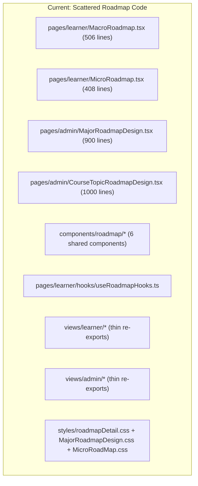

# Roadmap Module — Architecture Analysis & Restructuring Plan

## Current State Analysis

Your roadmap-related code is currently **scattered across 3 organizational layers** with no clear module boundary:



### Problems with the current structure

| Problem | Impact |
|---------|--------|
| Roadmap logic lives in both `pages/learner/` and `pages/admin/` | Hard to find things; no single ownership |
| `components/roadmap/` is separate from the pages that use them | Shared components disconnected from their context |
| Admin roadmap designer (900-1000 line files) uses **legacy patterns** (`adminService`, `Header`, `ConfirmDialog`) while learner pages use the new `@iuroadmap/api-gen` hooks | Two different paradigms for the same domain |
| Hooks buried inside `pages/learner/hooks/` | Not discoverable or reusable by admin pages |
| CSS styles scattered in `styles/` directory with no module grouping | Hard to maintain |

---

## Proposed Architecture

I recommend **Option B below** (separating user-facing roadmap from admin config), following your existing `config/` module pattern. Here are both options for your review:

### Option A: One Big `roadmap/` Module

```
views/roadmap/
├── explore/                    # Explore/browse roadmaps (public-ish)
│   ├── exploreMajorsPage.tsx
│   └── components/
├── my-roadmap/                 # Learner's enrolled roadmaps
│   ├── macroRoadmapPage.tsx
│   ├── microRoadmapPage.tsx
│   └── components/
├── config/                     # Admin CRUD for roadmap design
│   ├── roadmapListPage.tsx
│   ├── roadmapDesignPage.tsx
│   ├── courseTopicDesignPage.tsx
│   └── components/
├── shared/                     # Reusable roadmap components
│   ├── RoadmapNode.tsx
│   ├── RoadmapToolbar.tsx
│   ├── RoadmapDrawer.tsx
│   ├── MicroTopicPanel.tsx
│   └── MicroRoadmapNodeCard.tsx
└── hooks/
    ├── useRoadmapMutations.ts
    └── useRoadmapQueries.ts
```

**Pros**: Everything roadmap is together. Easy to find.  
**Cons**: Mixes admin-only and learner-only concerns. Role-based access gets tangled.

---

### Option B (Recommended): Separate User-Facing from Admin Config

```
views/roadmap/                          # User-facing roadmap experience
├── explore/                            
│   ├── exploreMajorsPage.tsx           # Browse available majors/roadmaps
│   └── components/
│       └── majorCard.tsx
├── viewer/                             # View/interact with roadmaps
│   ├── macroRoadmapPage.tsx            # Macro view (course-level graph)
│   ├── microRoadmapPage.tsx            # Micro view (topic-level for a course)
│   └── components/
│       └── roadmapContextMenu.tsx
├── my-courses/                         
│   ├── myCoursesPage.tsx               # Learner's enrolled courses
│   └── components/
├── shared/                             # ★ Reusable across user + admin
│   ├── RoadmapNode.tsx
│   ├── RoadmapToolbar.tsx
│   ├── RoadmapDrawer.tsx
│   ├── NodeEditorDrawer.tsx
│   ├── MicroTopicPanel.tsx
│   └── MicroRoadmapNodeCard.tsx
├── hooks/                              # ★ Shared hooks
│   ├── useRoadmapMutations.ts
│   └── useRoadmapQueries.ts
└── styles/
    ├── roadmapDetail.css
    └── microRoadmap.css

views/config/roadmap/                   # Admin roadmap management
├── roadmapListPage.tsx                 # List all roadmaps (CRUD table)
├── roadmapDesignPage.tsx               # ReactFlow editor for macro roadmap
├── courseTopicDesignPage.tsx            # ReactFlow editor for micro topics
├── components/
│   ├── roadmapDesignToolbar.tsx
│   ├── nodeFormPanel.tsx
│   └── edgeEditor.tsx
└── styles/
    └── majorRoadmapDesign.css
```

**Pros**:
- Follows your existing `config/` module pattern exactly (list → create → edit)
- Clear role separation: `views/roadmap/` = any authenticated user, `views/config/roadmap/` = admin only
- The `shared/` folder in `views/roadmap/` makes components importable by BOTH user and admin pages
- Easy to add route guards per module

**Cons**: Two places to look for "roadmap" code (but they serve clearly different purposes)

---

## Why Option B is Better for Your Case

1. **Follows established pattern**: Your `config/` module already organizes admin CRUD (user, role, department, major). Roadmap config naturally belongs there.

2. **Reusability**: The `views/roadmap/shared/` components (`RoadmapNode`, `RoadmapToolbar`, etc.) can be imported by both:
   - `views/roadmap/viewer/macroRoadmapPage.tsx` (learner viewing)
   - `views/config/roadmap/roadmapDesignPage.tsx` (admin designing)

3. **Route organization maps cleanly**:
   ```
   /dashboard/explore         → views/roadmap/explore/
   /dashboard/my-courses      → views/roadmap/my-courses/
   /dashboard/roadmap/:id     → views/roadmap/viewer/macro
   /dashboard/roadmap/:id/micro/:courseNodeId → views/roadmap/viewer/micro
   /dashboard/config/roadmaps              → views/config/roadmap/list
   /dashboard/config/roadmaps/design/:slug → views/config/roadmap/design
   /dashboard/config/roadmaps/:courseNodeId/topics → views/config/roadmap/topics
   ```

4. **Navigation sidebar maps cleanly**: The sidebar already groups "Roadmap" menu (explore, my courses) separately from "Config" menu (users, roles, departments, **+ roadmap config**).

---

## Router Changes

```diff
 // router/roadmap.routes.tsx — User-facing
- import ExploreMajors from '../views/learner/ExploreMajors';
- import MacroRoadmap from '../views/learner/MacroRoadmap';
+ import { ExploreMajorsPage } from '../views/roadmap/explore/exploreMajorsPage';
+ import { MacroRoadmapPage } from '../views/roadmap/viewer/macroRoadmapPage';
+ import { MicroRoadmapPage } from '../views/roadmap/viewer/microRoadmapPage';
+ import { MyCoursesPage } from '../views/roadmap/my-courses/myCoursesPage';
```

```diff
 // router/config.routes.tsx — Add admin roadmap routes
+ import { RoadmapListPage } from '../views/config/roadmap/roadmapListPage';
+ import { RoadmapDesignPage } from '../views/config/roadmap/roadmapDesignPage';
+ import { CourseTopicDesignPage } from '../views/config/roadmap/courseTopicDesignPage';

 const configRoutes: RouteObject[] = [
   // ... existing user, role, department, major routes
+  // Roadmap config routes
+  { path: RoutePaths.web.config.roadmap.root, element: <RoadmapListPage /> },
+  { path: RoutePaths.web.config.roadmap.design, element: <RoadmapDesignPage /> },
+  { path: RoutePaths.web.config.roadmap.courseTopics, element: <CourseTopicDesignPage /> },
 ];
```

---

## Migration Priorities

> [!IMPORTANT]
> The admin pages (`MajorRoadmapDesign.tsx` — 900 lines, `CourseTopicRoadmapDesign.tsx` — 1000 lines) still use legacy `adminService` instead of `@iuroadmap/api-gen` hooks. These need to be migrated to the new pattern as part of this restructuring.

### Phase 1: Structure + Shared Components
1. Create `views/roadmap/` folder structure
2. Extract shared components into `views/roadmap/shared/`
3. Move hooks to `views/roadmap/hooks/`
4. Move CSS to module-level `styles/` folders

### Phase 2: Migrate User-Facing Pages
1. Move `ExploreMajors` → `views/roadmap/explore/`
2. Move `MacroRoadmap` → `views/roadmap/viewer/`
3. Move `MicroRoadmap` → `views/roadmap/viewer/`
4. Move `MyCourses` → `views/roadmap/my-courses/`
5. Convert from default exports to named exports (matching config pattern)

### Phase 3: Migrate Admin Pages to Config Module
1. Create `views/config/roadmap/` following the config pattern
2. Migrate `MajorRoadmapDesign.tsx` → `roadmapDesignPage.tsx` (refactor from `adminService` to `@iuroadmap/api-gen`)
3. Migrate `CourseTopicRoadmapDesign.tsx` → `courseTopicDesignPage.tsx`
4. Create `roadmapListPage.tsx` (CRUD table like department/role list)
5. Update routes and navigation

### Phase 4: Cleanup
1. Remove old `pages/admin/` and `pages/learner/` roadmap files
2. Remove old `views/admin/` and `views/learner/` re-export files
3. Remove `components/roadmap/` (now in `views/roadmap/shared/`)
4. Update all imports

---

## Open Questions

> [!IMPORTANT]
> **Q1**: Do you want to keep the `pages/` → `views/` re-export pattern (current approach), or move to direct page components in `views/` like the config module does? The config module has no `pages/` layer — everything is directly in `views/config/`. I recommend matching the config pattern (no `pages/` indirection).

> [!IMPORTANT]
> **Q2**: Should `ExploreMajors` and `MyCourses` stay in the roadmap module, or do you consider them separate enough to be their own top-level modules? They are roadmap-adjacent but not strictly roadmap viewing.

> [!WARNING]
> **Q3**: The admin roadmap pages use `adminService` (legacy service layer) while learner pages use `@iuroadmap/api-gen`. Should we migrate the admin pages to `@iuroadmap/api-gen` as part of this restructuring, or keep the legacy service for now and do that separately?

---

## Verification Plan

### Automated Tests
- `npm run build` to verify all imports resolve after restructuring
- TypeScript compilation check (`tsc --noEmit`)

### Manual Verification
- Verify all roadmap routes work: explore, macro view, micro view, my courses
- Verify admin roadmap design routes work
- Verify navigation sidebar links are correct
- Verify shared components render correctly in both user and admin contexts
