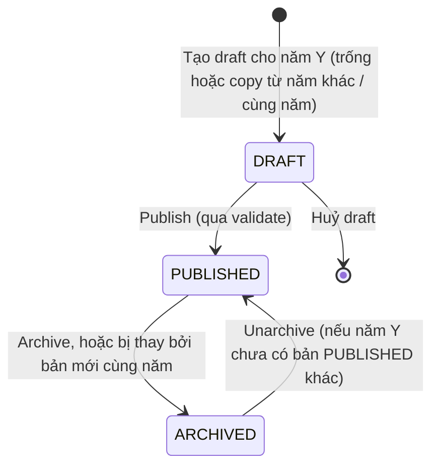

# Roadmap v2 — Lộ trình theo học kỳ & Roadmap cá nhân dạng Overlay

> **Loại tài liệu:** Design / Analysis (kiến trúc)
> **Version:** 1.0 (Roadmap v2)
> **Ngày:** 2026-09-26
> **Trạng thái:** 📝 Proposed — cần chốt các quyết định ở [§14](#14-quyết-định-cần-chốt)
> **Áp dụng cho:** FL-RDM (Admin), FL-LRN (Learner)

## Liên kết chéo

- Yêu cầu Admin → [`FL-RDM-roadmap-management.md`](../srs/features/FL-RDM-roadmap-management.md)
- Yêu cầu Learner → [`FL-LRN-learner-portal.md`](../srs/features/FL-LRN-learner-portal.md)
- Business flow → [`02-roadmap-management.md`](../business-flow/02-roadmap-management.md), [`01-learner-portal.md`](../business-flow/01-learner-portal.md)
- Schema đích → [`roadmap-schema.md`](../schema/roadmap-schema.md)
- Kế hoạch implement (danh sách file theo phase) → [`roadmap-v2-implementation-plan.md`](roadmap-v2-implementation-plan.md)

---

## 1. Bài toán

| # | Yêu cầu nghiệp vụ mới | Hệ quả thiết kế |
|---|---|---|
| R1 | Roadmap luôn map vào **học kỳ 1 → 8**, giống sơ đồ CTĐT "Curriculum – Computer Science" | Vị trí node = `(học kỳ, hàng)`, bỏ toạ độ tự do |
| R2 | Admin kéo/thả node, node **tự căn giữa cột học kỳ** | Snap theo cột; toạ độ pixel do FE tính |
| R3 | Learner clone về **My Roadmap** và được sửa: thêm node, nối edge | Mỗi learner có cấu trúc riêng |
| R4 | Learner **click tiêu đề học kỳ** để nhập điểm, giống bảng điểm "Học kỳ 1 – Năm học 2025-2026" | Lưu kết quả từng môn, tính GPA học kỳ và tích luỹ |
| R5 | Không nhân bản dữ liệu khi clone, **chỉ lưu phần learner thay đổi** | Overlay (copy-on-write) trên một bản template bất biến |

Sơ đồ CTĐT mẫu còn có một số yếu tố mà v1 chưa mô hình hoá. v2 đưa chúng vào:

- 3 loại quan hệ: **prerequisites** (nét liền), **previous** (nét đứt), **co-requisites**.
- Tín chỉ dạng `(LT, TH)`, ví dụ `IT089 (3,1)` = 4 tín chỉ trên bảng điểm.
- Cột **Summer** (IT082 Internship) và cột **Elective**.
- Ô **"Elective CS1 (3,1)"**: một slot chờ learner chọn môn tự chọn.
- **Nhánh điều kiện** ở HK8: `GPA ≥ 70` → IT058 Thesis, `GPA < 70` → IT168 Special Study 2 + elective.
- Tiêu đề cột có tổng tín chỉ: `Semester 4 (16+3)`.

Bảng điểm mẫu còn cho thấy một điểm quan trọng. Học kỳ thực tế của learner **không khớp** CTĐT: HK1 2025-2026 gồm IT153 (CTĐT HK2), IT154 (HK3), IT089 và IT093 (HK4), PE017 (HK5), IT159 (HK6). Vì vậy learner **bắt buộc** phải dời được môn giữa các kỳ, và "cột học kỳ" trên My Roadmap chính là học kỳ thực tế của họ.

---

## 2. Hiện trạng v1 (khảo sát code ngày 2026-09-26)

| # | Phát hiện | Vị trí | Ảnh hưởng tới v2 |
|---|---|---|---|
| G1 | Node lưu `coords {x,y}` tự do, không có khái niệm học kỳ | `roadmap-service/prisma/schema.prisma` → `COURSE_NODES.coords` | Thay bằng `term + row_index` |
| G2 | Chỉ có 1 loại quan hệ. Chiều lưu bị ngược: `course_node_id` là môn sau, `prerequisite_node_id` là môn trước, nên UI phải đảo lại | `COURSE_NODE_PREREQUISITES`, `admin_roadmaps.service.ts#getRoadmapGraph` | Edge có `type`, chiều `source (A) → target (B)` rõ ràng |
| G3 | `credits` là 1 số, trong khi CTĐT dùng `(LT, TH)` | `COURSE_NODES.credits` | Tách `theory_credits`, `lab_credits` |
| G4 | Môn học gắn cứng vào 1 roadmap (`COURSE_NODES.roadmap_id`), topic gắn vào node, nên cùng một môn ở 2 ngành phải nhập 2 lần. `roadmap-schema.md` cũ lại mô tả thư viện `COURSES` + `ROADMAP_COURSES`, tức tài liệu lệch với code | roadmap-service | Khôi phục thư viện `COURSES` dùng chung |
| G5 | Enroll tạo `1 + N` dòng `USER_NODE_PROGRESS`, tất cả `AVAILABLE`, dù trạng thái này suy ra được | `user-service/src/roadmaps/services/user-roadmaps.service.ts` | Không lưu trạng thái suy ra được |
| G6 | Learner không sửa được cấu trúc và chưa có điểm | — | Overlay + kết quả học tập |
| G7 | Lớp ghép template với tiến độ (orchestrator) từng nằm ở `api-gateway/src/modules/roadmaps/` nhưng đã bị xoá trong refactor `5acc76f5`. Web vẫn gọi `/roadmaps/my`, `/roadmaps/{id}`, `/roadmaps/{slug}/enroll` qua api-gen cũ, nên **luồng learner hiện không có backend** | `packages/api-gen/.../endpoints/roadmaps/roadmaps.ts` | v2 phải chọn lại nơi ghép (§10) |
| G8 | Trang admin canvas `roadmapDesignPage.tsx` đang bị comment gần như toàn bộ | `apps/web/src/views/config/roadmap/` | Viết lại theo v2 |
| G9 | user-service lấy userId từ header `x-user-id`, không dùng `JwtGuard` + `@CurrentUser` | `user-roadmaps.controller.ts` | v2 dùng guard chuẩn |
| G10 | Controller `majors` (roadmap-service) **không có prefix** trong `api-gateway/src/config/routes.config.ts`, nên đi qua gateway sẽ không tới được | gateway | Sửa khi làm v2 |

---

## 3. Thuật ngữ

| Thuật ngữ | Nghĩa |
|---|---|
| **Program** | Ngành học, tức bảng `MAJOR_ROADMAPS` |
| **CTĐT theo năm** (Curriculum Version) | CTĐT của một ngành cho một năm/khoá, ví dụ "K2023 – 89/QĐ-ĐHQT". Định danh bởi `(ngành, cohort_year)`. **Bất biến** sau khi publish; muốn sửa thì ban hành lại (`revision_no` + 1). Bảng DB vẫn tên `ROADMAP_VERSIONS` |
| **Term (lane)** | Một cột trên canvas: `REGULAR` (Semester n), `SUMMER`, `ELECTIVE_POOL` |
| **Node** | Một ô trên canvas: `COURSE` (môn cụ thể) hoặc `ELECTIVE_SLOT` (ô chờ chọn môn tự chọn) |
| **Relation** | Edge có hướng A → B, thuộc một trong các loại `PREREQUISITE`, `PREVIOUS`, `COREQUISITE` |
| **Student Roadmap** | Roadmap của 1 learner = Version gốc (base) + Overlay + Kết quả học tập |
| **Overlay (delta)** | Các dòng mô tả điểm khác so với base. **Không có dòng nghĩa là giống base** |
| **Merged view** | Kết quả ghép base + overlay + điểm, được tính mỗi khi đọc |
| **Key ổn định** | `term_key`, `node_key`, `edge_key` (UUID), giữ nguyên qua các version, để overlay và điểm không bị "mồ côi" khi learner nâng version |
| **Course (môn)** | Danh mục ổn định: mã, tên, tín chỉ, nhóm môn, kiểu chấm. Dùng chung cho mọi ngành và mọi năm |
| **Course Offering** | Môn **mở trong một năm học** `(course_id, academic_year)`: giảng viên, đề cương, trọng số, project, lưu ý cho SV, topic. Sửa được sau publish. Tương ứng *Schedule of Classes* trong hệ SIS (§15) |
| **Năm học (`academic_year`)** | Năm bắt đầu: `2024` = năm học 2024-2025. Khác với **khoá** (`cohort_year`) của CTĐT: sinh viên K2023 học IT069 trong năm học 2024 |

---

## 4. Bố cục theo học kỳ

### 4.1 Vị trí logic thay cho toạ độ

Backend chỉ lưu `(term, thứ tự trong cột)`: CTĐT lưu `row_index` (số nguyên), overlay của learner lưu `row_order` (số thực, §4.2). FE chạy hàm bố cục ra `visualRow` rồi quy đổi ra pixel:

```
x = CANVAS_PADDING + laneIndex × LANE_WIDTH + (LANE_WIDTH − NODE_WIDTH) / 2   ← luôn nằm giữa cột
y = HEADER_HEIGHT  + visualRow × ROW_HEIGHT
```

Các hằng số `LANE_WIDTH`, `NODE_WIDTH`, `ROW_HEIGHT`, `HEADER_HEIGHT` đặt trong `@iuroadmap/core` và không lưu DB.

Lợi ích:

- Node luôn nằm giữa cột (R2).
- Admin và learner thấy cùng một bố cục trên mọi kích thước màn hình.
- Đổi kích thước node không cần migrate dữ liệu.
- Các hàng thẳng giúp edge nằm ngang (MA001 → MA003 → MA026 cùng hàng như ảnh mẫu).

### 4.2 Kéo thả có chừa chỗ (chèn + đẩy xuống)

Khi kéo, các node trong cột đích **tách ra chừa chỗ** cho node đang kéo; thả vào giữa hai node là **chèn vào giữa**. Admin và learner dùng chung logic này.

**Thứ tự trong cột (`order`).** Mỗi node có một số thứ tự trong cột:
- Node của CTĐT: `order = row_index` (số nguyên, admin lưu).
- Node learner dời hoặc thêm: `order = row_order` (số thực, lưu trong delta).

**Hàm bố cục** (dùng cho cả lúc kéo và lúc hiển thị): sắp các node trong cột theo `order`, rồi gán hàng hiển thị

```
visualRow[i] = max(ceil(order[i]), visualRow[i − 1] + 1)      // visualRow[−1] = −1
```

Nhờ vậy node chèn vào đẩy các node bên dưới xuống, **nhưng chỉ tới hàng trống gần nhất**: node ở dưới hàng trống giữ nguyên hàng, nên edge ngang giữa các cột vẫn thẳng.

```
onNodeDrag(node, pointer):                      // chạy liên tục khi đang kéo
  hit = hitTest(pointer)
  if hit.kind == GAP:                           // khe giữa 2 cột
      showPhantomLane(after = hit.leftLane)     // cột mờ "＋ Kỳ mới"
      return
  slot  = max(0, round((pointer.y − HEADER_HEIGHT) / ROW_HEIGHT))
  order = orderForSlot(hit.lane, slot, excluding = node)
  render(layout(hit.lane.nodes − node + {node, order}))   // các node trượt xuống, có animation

onNodeDragStop(node, pointer):
  if hit.kind == GAP: ops += [ADD_TERM(afterTermKey = hit.leftLane), MOVE_NODE(node, newTerm, 0)]
  else:               ops += [MOVE_NODE(node, hit.lane, order)]
  validatePlacement(node)                       // admin: tô đỏ edge vi phạm; learner: gợi ý (§4.4)

orderForSlot(lane, slot):
  if không node nào có visualRow == slot: return slot                      // ô trống: lấy số nguyên, giữ thẳng hàng
  next = node đang ở visualRow == slot;  prev = node ngay trên next (nếu có)
  return prev ? (prev.order + next.order) / 2 : next.order − 1             // chèn trước next
```

Ví dụ: cột Semester 5 có IT089 (order 1) và IT093 (order 2). Learner thả IT153 vào giữa → `order = 1.5`. Khi hiển thị: IT089 hàng 1, IT153 hàng 2, IT093 hàng 3. **Chỉ IT153 có dòng delta**; IT093 trượt xuống là do hàm bố cục, không lưu.

- **Admin** lưu full state, nên khi Save, FE đổi `visualRow` thành `row_index` số nguyên cho mọi node. `ROADMAP_NODES` luôn là số nguyên.
- **Learner** chỉ lưu `row_order` của node được kéo (§6.6).
- **Hết chỗ giữa hai số** (chèn liên tục vào cùng một khe, khoảng cách < `1e-6`): FE chia đều lại `row_order` của các node learner nằm giữa hai node CTĐT liền kề. Chỉ các delta đó bị ghi lại; node CTĐT không đổi. Rất hiếm khi xảy ra.

Kéo một môn từ sidebar **Course catalog** vào cột cũng chèn theo đúng cách trên.

React Flow v11 (package `reactflow`) không có lớp nền riêng. Vì vậy mỗi cột được render thành một node `type: 'lane'` với `draggable: false`, `selectable: false`, `zIndex: -1`, rộng `LANE_WIDTH` và cao theo số hàng lớn nhất.

### 4.3 Tiêu đề cột

- `Semester 4 (16+3)`: **16** là tổng tín chỉ các môn cụ thể (node `COURSE`) trong cột; **3** là tổng tín chỉ các ô tự chọn (`ELECTIVE_SLOT`, ví dụ "Elective CS1"), tức phần sinh viên sẽ tự chọn môn sau. Kỳ đó học tổng cộng 19 tín chỉ. Tách hai số để người xem biết bao nhiêu tín chỉ đã cố định và bao nhiêu còn phải chọn, giống sơ đồ CTĐT giấy. Cột không có slot chỉ hiện `(16)`.
- Cột `SUMMER` hiển thị `Summer (3)`.
- Cột `ELECTIVE_POOL` không tính tín chỉ.
- Tổng tín chỉ được FE tính từ dữ liệu, không lưu DB.
- Trên My Roadmap, tiêu đề cột bấm được để mở bảng điểm (§9).

### 4.4 Quan hệ và ràng buộc xếp kỳ

Chiều quy ước: **A = môn trước (source), B = môn sau (target)**. `order(X)` là thứ tự cột (`order_index`) chứa X.

| Loại | Hiển thị (theo chú thích ảnh mẫu) | Nghĩa | Ràng buộc xếp kỳ (admin) | Gợi ý cho learner (không chặn) |
|---|---|---|---|---|
| `PREREQUISITE` | Nét liền, có mũi tên | Học B sau khi **đã qua** A | `order(A) < order(B)` | B đứng trước/cùng kỳ A, hoặc A chưa `PASSED` mà B đã có kết quả |
| `PREVIOUS` | Nét đứt, có mũi tên | Học B sau A, **không cần qua** A | `order(A) < order(B)` | B đứng trước/cùng kỳ A |
| `COREQUISITE` | Nét liền, không mũi tên, nhãn "co-req" | Học A **trước hoặc cùng kỳ** với B | `order(A) ≤ order(B)` | B đứng trước A |

- Node đang ở `ELECTIVE_POOL` chưa có thứ tự, nên được bỏ qua khi kiểm tra ràng buộc cho tới khi được xếp vào một kỳ.
- **Admin (CTĐT chính thức):** toàn đồ thị phải là **DAG**. Vi phạm xếp kỳ vẫn được lưu draft, nhưng **bị chặn khi publish**.
- **Learner:** quan hệ **chỉ để hiển thị**. Learner dời môn, thêm, ẩn hay đổi loại quan hệ tuỳ ý. Sai thứ tự hay có vòng đều chỉ là gợi ý (icon ⚠ + panel *Gợi ý*), không chặn lưu, không khoá môn. Không còn trạng thái `LOCKED`/`AVAILABLE`.

---

## 5. CTĐT theo năm

**Quản lý theo năm, không theo số version.** CTĐT thực tế của IU ban hành theo khoá (ảnh mẫu ghi "89/QĐ-ĐHQT.07.03.2022 — 2023"), nên admin và learner nghĩ theo "CTĐT 2023", "CTĐT 2024". Vì vậy định danh nghiệp vụ là `(ngành, cohort_year)`, không phải `version_no`.

**Vẫn cần bất biến bên trong một năm.** Overlay lưu "khác gì so với base", nên base phải đứng yên. Nếu admin sửa thẳng CTĐT 2023 mà learner đã clone:

- Dời MA003 sang HK3 sẽ âm thầm đổi kế hoạch của mọi learner khoá 2023.
- Xoá một node làm overlay và điểm của learner mất chỗ bám.

Vì vậy mỗi năm vẫn đi qua draft → publish. Khi cần sửa CTĐT 2023 đã publish, admin tạo draft **cùng năm**, publish bản đó (`revision_no` = 2), và bản cũ tự archive. Learner đang dùng bản cũ được mời cập nhật (§6.5), không bị đổi ngầm. Nếu admin không bao giờ ban hành lại thì mỗi năm chỉ có đúng 1 bản, và `revision_no` không hiện ra UI.



- Mỗi `(ngành, năm)` có tối đa **1 DRAFT** và tối đa **1 PUBLISHED**. Các năm khác nhau có thể có draft song song.
- `total_credits` nằm ở CTĐT của từng năm, vì mỗi khoá có thể có số tín chỉ tốt nghiệp khác nhau.
- Tạo draft từ CTĐT của năm khác sẽ copy toàn bộ term, node, edge và **giữ nguyên key**, nên learner đổi năm (§6.5) vẫn giữ được overlay.
- Learner clone được CTĐT `PUBLISHED` của **bất kỳ năm nào**, mặc định là năm của khoá mình. Learner lỡ xoá hẳn roadmap vẫn clone lại được năm đó, nhưng overlay và điểm cũ đã mất; muốn tạm ngừng thì Drop (dữ liệu được giữ).
- `ARCHIVED` bị ẩn khỏi danh sách clone, nhưng các roadmap đã clone vẫn chạy bình thường. Chỉ archive năm không còn sinh viên theo học.
- CTĐT đã publish được cache vĩnh viễn (bất biến nên không cần invalidate).

---

## 6. Roadmap cá nhân dạng overlay

### 6.1 Nguyên tắc

1. **Clone = 1 dòng** `STUDENT_ROADMAPS` gồm user, ngành, version và revision. Không copy node, edge hay tiến độ.
2. **Chỉ lưu khác biệt ở dạng trạng thái cuối:** mỗi phần tử bị đổi chiếm 1 dòng, không ghi log từng thao tác. Kéo một node 10 lần vẫn chỉ là 1 dòng.
3. **Không lưu những gì suy ra được:** trạng thái `PLANNED`, gợi ý về quan hệ, tín chỉ học kỳ, GPA và % tiến độ đều được tính khi đọc.
4. **Chuẩn hoá:** nếu một override trở về đúng trạng thái base (ví dụ kéo node về chỗ cũ), dòng override bị xoá.
5. **Kết quả học tập** là dữ liệu gốc của learner, không suy ra được, nên phải lưu. Tuy vậy chỉ tạo dòng **khi có điểm hoặc đang học** (dữ liệu thưa).

### 6.2 Bảng overlay (chi tiết ở [`roadmap-schema.md`](../schema/roadmap-schema.md))

| Bảng | 1 dòng nghĩa là | Ví dụ |
|---|---|---|
| `STUDENT_TERM_DELTAS` | Chèn một kỳ ở bất kỳ vị trí nào (IE0/IE1/IE2 trước Semester 1, Semester 9, Summer phụ) hoặc gắn nhãn năm học cho một kỳ | "IE1 – Tiếng Anh tăng cường" trước Semester 1; Kỳ 5 → "HK1 2025-2026" |
| `STUDENT_NODE_DELTAS` | `origin = BASE`: node CTĐT bị dời (`term_key`, `row_order`) hoặc slot được điền môn. `origin = CUSTOM`: node do learner tự thêm. **Không có** trạng thái "xoá/ẩn" node CTĐT | IT153 dời từ HK2 sang HK5, `row_order = 1.5` |
| `STUDENT_EDGE_DELTAS` | Edge learner tự nối. Edge của CTĐT không xoá được nên không bao giờ có dòng ở đây (BR-LRN-08) | IT013 → IT159 (PREVIOUS) |
| `STUDENT_COURSE_RESULTS` | Điểm hoặc trạng thái "đang học" của 1 node | IT089IU: 30/30/40, 95/58/70 |

Mọi overlay tham chiếu base bằng **key ổn định** (`term_key`, `node_key`), không dùng id theo version.

### 6.3 Thuật toán ghép (read path)

```ts
function buildMergedRoadmap(sr: StudentRoadmap): MergedRoadmap {
  const base = versionCache.get(sr.versionId);                 // bất biến → cache vĩnh viễn
  const [termD, nodeD, edgeD, results] = loadOverlay(sr.id);   // 4 query theo student_roadmap_id (có index)

  const terms = applyTermDeltas(base.terms, termD);            // thêm kỳ custom, gắn nhãn năm học
  const nodes = new Map(base.nodes.map((n) => [n.nodeKey, n]));

  for (const d of nodeD) {
    if (d.origin === 'CUSTOM') { nodes.set(d.nodeKey, toCustomNode(d)); continue; }
    const n = nodes.get(d.nodeKey);
    if (!n) { reportOrphan(d); continue; }                     // chỉ xảy ra khi đổi version (§6.5)
    nodes.set(d.nodeKey, {
      ...n,
      termKey: d.termKey ?? n.termKey,
      order: d.rowOrder ?? n.rowIndex,                         // số thực, §4.2
      course: d.courseId ? catalog.get(d.courseId) : n.course, // điền ELECTIVE_SLOT
    });
  }

  const edges = [...base.edges, ...edgeD.map(toCustomEdge)]   // edge CTĐT luôn còn (BR-LRN-08)
    .filter((e) => nodes.has(e.sourceKey) && nodes.has(e.targetKey)); // edge của node custom đã xoá tự rơi

  layoutRows(terms, nodes);           // §4.2: gán visualRow theo order, đẩy xuống tới hàng trống gần nhất
  attachResults(nodes, results);
  return derive(terms, nodes, edges); // status, gợi ý (không chặn), tín chỉ/kỳ, GPA, % tiến độ
}
```

Chi phí là `O(|base| + |overlay|)`, khoảng vài trăm object mỗi lần đọc, và chỉ cần 4 query nhỏ vì base đã nằm trong cache.

### 6.4 Write path

FE gom các thao tác lại rồi gửi **1 batch**: `POST /student-roadmaps/{id}/changes { revision, ops[] }`.

| Op | Tác động lên overlay |
|---|---|
| `MOVE_NODE { nodeKey, termKey, rowOrder }` | Upsert 1 dòng `STUDENT_NODE_DELTAS` của **đúng node đó**, rồi chuẩn hoá. Các node bị đẩy xuống không sinh dòng (§4.2) |
| `ADD_NODE { courseId \| custom{code,name,theory,lab}, termKey, rowOrder }` | Insert 1 dòng `CUSTOM` với `node_key` mới |
| `REMOVE_NODE { nodeKey }` | **Chỉ node `CUSTOM`**: xoá dòng. Node CTĐT → `400` (BR-LRN-08) |
| `FILL_SLOT { nodeKey, courseId }` / `CLEAR_SLOT { nodeKey }` | Upsert hoặc xoá `course_id` trên delta của slot |
| `RESET_NODE { nodeKey }` | Xoá delta của node CTĐT, đưa node về vị trí gốc (không đụng tới điểm) |
| `ADD_EDGE { sourceKey, targetKey, type }` / `REMOVE_EDGE { edgeKey }` | Insert dòng; `REMOVE_EDGE` **chỉ với edge learner đã thêm**. Edge CTĐT → `400` |
| `ADD_TERM { kind, afterTermKey \| null, label }` / `MOVE_TERM { termKey, afterTermKey \| null }` / `UPDATE_TERM { termKey, label?, academicYear?, termInYear? }` / `REMOVE_TERM { termKey }` | Upsert hoặc xoá `STUDENT_TERM_DELTAS`; `afterTermKey = null` = chèn trước kỳ đầu tiên. Chỉ kỳ custom được dời/xoá; nối lại chuỗi `after_term_key` (schema) |

Server xử lý toàn bộ batch trong **1 transaction**:

1. Kiểm tra `revision` (optimistic lock). Sai revision → `409`, ví dụ khi mở 2 tab.
2. Áp dụng từng op lên bảng overlay.
3. Chuẩn hoá (§6.1-4).
4. Kiểm tra toàn vẹn dữ liệu (môn trùng, xoá node/edge của CTĐT, xoá node có điểm, số kỳ tối đa) → lỗi thì `409`/`400` và rollback cả batch. Quan hệ giữa môn **không** bị validate: sai thứ tự hay có vòng vẫn lưu và trả về dạng `hints`.
5. Tăng `revision` thêm 1.
6. Trả về merged view.

### 6.5 Cập nhật / đổi CTĐT (rebase)

Hai trường hợp dùng chung thuật toán:

- **Bản mới cùng năm:** learner đang ở CTĐT 2023 (bản 1), admin ban hành lại 2023 (bản 2). My Roadmap hiện banner.
- **Đổi năm:** learner đang ở 2023 muốn theo 2024 (ví dụ bảo lưu). Learner chủ động chọn.

Learner chọn **"Cập nhật CTĐT"** hoặc **"Đổi CTĐT"**:

1. **Preview (dry-run):** với mỗi dòng overlay và mỗi kết quả, tìm lại key của nó trong version đích.
   - Key vẫn còn → giữ nguyên.
   - `node_key` không còn nhưng `course_id` có ở một node khác → remap sang `node_key` mới.
   - Không tìm thấy: override bị bỏ và learner được báo "môn X đã bị bỏ khỏi CTĐT". Nếu node đó **đã có điểm**, nó được chuyển thành node `CUSTOM` và **giữ nguyên điểm**.
2. **Confirm:** cập nhật `version_id` và ghi lại các dòng bị ảnh hưởng trong 1 transaction.

Hệ thống **không bao giờ tự động** nâng version.

---

### 6.6 Ví dụ: lưu thay đổi khi learner thêm và dời node

Learner khoá 2023, CTĐT có Semester 1..8. Trong một lần chỉnh sửa, learner:

1. Chèn kỳ "IE1" trước Semester 1.
2. Kéo IT153 từ Semester 2 sang Semester 5, thả vào giữa IT089 (hàng 1) và IT093 (hàng 2).
3. Kéo IT153 thêm lần nữa, lên đầu cột Semester 5.
4. Thêm môn ENTP01 từ catalog vào kỳ IE1.
5. Nối edge IT013 → IT159 (PREVIOUS).
6. Bấm **Lưu**.

**Phía FE:** mọi thao tác chỉ đổi state cục bộ (có undo/redo). Bấm Lưu thì FE gửi **1 request**; hai lần kéo IT153 được gộp thành trạng thái cuối:

```json
POST /student-roadmaps/42/changes
{ "revision": 7, "ops": [
  { "op": "ADD_TERM",  "termKey": "t-ie1", "kind": "REGULAR", "afterTermKey": null, "label": "IE1" },
  { "op": "MOVE_NODE", "nodeKey": "n-it153", "termKey": "t-sem5", "rowOrder": 0 },
  { "op": "ADD_NODE",  "nodeKey": "n-new1", "courseId": 901, "termKey": "t-ie1", "rowOrder": 0 },
  { "op": "ADD_EDGE",  "edgeKey": "e-new1", "sourceKey": "n-it013", "targetKey": "n-it159", "type": "PREVIOUS" }
]}
```

**Phía server** (1 transaction): kiểm tra `revision = 7` → áp dụng op → chuẩn hoá → kiểm tra toàn vẹn → `revision = 8`. Dữ liệu được ghi:

| Bảng | Dòng được ghi | Ghi chú |
|---|---|---|
| `STUDENT_TERM_DELTAS` | `{ term_key: t-ie1, origin: CUSTOM, kind: REGULAR, after_term_key: null, custom_label: "IE1" }` | 1 dòng |
| `STUDENT_NODE_DELTAS` | `{ node_key: n-it153, origin: BASE, term_key: t-sem5, row_order: 0 }` | 1 dòng, dù kéo 2 lần. Dòng này được **upsert** theo `(student_roadmap_id, node_key)` |
| `STUDENT_NODE_DELTAS` | `{ node_key: n-new1, origin: CUSTOM, course_id: 901, term_key: t-ie1, row_order: 0 }` | 1 dòng |
| `STUDENT_EDGE_DELTAS` | `{ edge_key: e-new1, source: n-it013, target: n-it159, type: PREVIOUS }` | 1 dòng |

Tổng cộng **4 dòng**. Những gì **không** được ghi:

- **IT089, IT093 và các node khác trong Semester 5** bị đẩy xuống khi hiển thị, nhưng không có dòng nào: vị trí của chúng được tính lại bởi hàm bố cục (§4.2).
- **Semester 1..8 bị dịch sang phải** vì có IE1 chèn trước, nhưng không có dòng nào: thứ tự cột suy ra từ chuỗi `after_term_key`.
- **Semester 2 bị trống một ô** (chỗ IT153 cũ): không có dòng nào.

**Những lần sửa sau:**

| Learner làm | Dữ liệu thay đổi |
|---|---|
| Kéo IT153 sang Semester 6 | **Sửa** dòng của IT153 (`term_key`, `row_order`), không thêm dòng |
| Kéo IT153 về đúng chỗ cũ (Semester 2, hàng gốc) | **Xoá** dòng của IT153 (chuẩn hoá: giống CTĐT thì không lưu) |
| Bấm "Reset" trên IT153 | Xoá dòng của IT153 |
| Xoá ENTP01 (node learner tự thêm, chưa có điểm) | Xoá dòng `n-new1` |
| Thử xoá IT089 (node CTĐT) | Không có nút xoá; gọi API thì `400` |

**Khi đọc** (§6.3): lấy CTĐT từ cache, đọc 4 bảng overlay theo `student_roadmap_id`, ghép, rồi chạy hàm bố cục để ra hàng hiển thị.

## 7. Ước tính lưu trữ

Giả định: 1 version có khoảng 10 cột, 75 node, 45 edge; 4.000 learner đang hoạt động; mỗi learner dời hoặc đổi trung bình khoảng 12 phần tử.

| Cách làm | Số dòng ghi khi clone | Dòng cấu trúc / learner | Tổng dòng cấu trúc (4.000 learner) |
|---|---|---|---|
| Deep copy (copy node + edge + progress) | 1 + 75 + 45 + 75 = **196** | 120 | **~480.000** |
| v1 hiện tại (chỉ copy progress, không sửa được cấu trúc) | 1 + 75 = **76** | 0, nhưng có 75 dòng progress `AVAILABLE` vô nghĩa | ~300.000 dòng progress |
| **v2 overlay** | **1** | **~12** | **~48.000**, cộng ~130 dòng mỗi version dùng chung |

- **Điểm học tập** tốn như nhau ở mọi cách (tối đa 1 dòng mỗi môn đã học), vì đó là dữ liệu thật. v2 chỉ tạo dòng khi thực sự có điểm.
- **Kết luận:** dữ liệu cấu trúc giảm khoảng 90%, clone từ `O(n)` xuống `O(1)`, và không còn dòng `AVAILABLE` vô nghĩa.
- **Cái giá phải trả:** mỗi lần đọc phải ghép (rẻ, xem §6.3), và code merge/rebase phức tạp hơn deep copy.
- **Lợi ích phụ:** bảng delta cho khoa thêm tín hiệu. Câu hỏi "bao nhiêu learner dời IT013 sang HK5?" chỉ cần một query `GROUP BY` (FR-RDM.07.5).

---

## 8. Phương án đã cân nhắc

| Phương án | Ưu | Nhược | Kết luận |
|---|---|---|---|
| A. Deep copy khi clone | Đọc đơn giản | Nhân bản dữ liệu (trái R5), không nhận được bản sửa CTĐT, clone chậm | Loại |
| B. Overlay trên template "sống" (không có version) | Ít bảng nhất | Admin sửa là kế hoạch learner đổi ngầm; xoá node làm mồ côi điểm | Loại |
| **C. Overlay trên version bất biến** | Đúng R5, an toàn, cache được, khớp với CTĐT theo khoá | Thêm vòng đời version và luồng rebase | **Chọn** |
| D. Event log (lưu mọi thao tác kéo thả) | Có lịch sử đầy đủ | Phình theo số lần kéo, cần snapshot | Loại (không cần lịch sử kéo thả) |
| E. 1 cột JSONB overlay cho mỗi learner | 1 dòng, ghi atomic | Không có FK tới `COURSES`, khó query và thống kê, mỗi lần ghi phải ghi lại cả khối | Loại cho cấu trúc |

---

## 9. Kết quả học tập & GPA

### 9.1 Nhập điểm một môn

- **Trọng số** QT/GK/CK (%) lấy mặc định từ offering của năm học của kỳ (`COURSE_OFFERINGS`). Learner được sửa theo đề cương thực tế (ví dụ PE017 là 30/20/50, IT153 là 25/30/45). Tổng phải bằng 100.
- **Điểm thành phần** nằm trong khoảng 0–100.
- `total = round_half_up(Σ wᵢ·sᵢ / 100)`, làm tròn tới số nguyên, nếu có đủ 3 điểm thành phần. Nếu không đủ, learner nhập thẳng `total`.
- `letter` và `grade_point` tra từ `GRADE_SCALES` **khi đọc** (không lưu). Môn được tính `PASSED` nếu band tương ứng có `is_passing` (ngưỡng đạt 50).
- **Môn `PASS_FAIL`** (ví dụ ENTP01, ENTP02-1): learner chỉ chọn Đạt/Không đạt (`is_passed`); không có điểm, không có chữ và hệ 4, không tính GPA. Môn IE còn có `counts_toward_credits = false` nên không cộng vào tín chỉ đạt và tích luỹ.

### 9.2 Tổng hợp theo cột học kỳ trên My Roadmap

Trong các công thức dưới đây, `tc = theory_credits + lab_credits`.

- **Điểm TB học kỳ hệ 100** = `Σ(total × tc) / Σ tc`, làm tròn 1 chữ số thập phân.
- **Điểm TB học kỳ hệ 4** = `Σ(grade_point × tc) / Σ tc`, làm tròn 2 chữ số thập phân.
- Chỉ tính những môn `SCORE` có `counts_toward_gpa = true` và đã có điểm, **kể cả môn trượt** (xác nhận ở Ảnh 3 bên dưới).
- **Số tín chỉ đạt** = `Σ tc` của các môn `PASSED` trong kỳ có `counts_toward_credits = true`.
- **Tích luỹ:** dùng các công thức trên cho mọi kỳ có `order ≤` kỳ đang xem. Mỗi môn chỉ xuất hiện 1 lần trong kế hoạch (BR-LRN-09), nên không bị tính trùng.
- **Xếp loại:** tra `ACADEMIC_CLASSIFICATIONS` theo **GPA hệ 100** (sổ tay IU 2022).

### 9.3 Kiểm chứng với bảng điểm mẫu

| Môn | TC | Trọng số | QT / GK / CK | Tổng tính được | Làm tròn | Chữ | Hệ 4 |
|---|---|---|---|---|---|---|---|
| IT089IU | 4 | 30/30/40 | 95 / 58 / 70 | 73.9 | **74** | B+ | 3.0 |
| IT093IU | 4 | 30/30/40 | 88 / 88 / 89 | 88.4 | **88** | A | 3.5 |
| IT159IU | 4 | 30/30/40 | 96 / 65 / 73 | 77.5 | **78** | B+ | 3.0 |
| PE017IU | 2 | 30/20/50 | 100 / 85 / 70 | 82.0 | **82** | A | 3.5 |
| IT153IU | 3 | 25/30/45 | 100 / 90 / 100 | 97.0 | **97** | A+ | 4.0 |
| IT154IU | 3 | 30/30/40 | 100 / 90 / 95 | 95.0 | **95** | A+ | 4.0 |

Kết quả **khớp 100%** với bảng điểm:

- TB học kỳ hệ 100 = 1700 / 20 = **85.0**.
- TB học kỳ hệ 4 = 69 / 20 = **3.45**.
- Tín chỉ đạt = **20**.
- Xếp loại **Giỏi**.
- Trường hợp IT159 (77.5 → 78) xác nhận quy tắc làm tròn *half-up* tới số nguyên.

**Mẫu thứ hai (Ảnh 3, HK1–HK2 2023-2024)** có môn trượt và môn tiếng Anh tăng cường:

| Kỳ | Môn | TC | Tổng | Chữ | Hệ 4 | Ghi chú |
|---|---|---|---|---|---|---|
| HK1 | ENTP02-1 Intensive English 02 | 13 | P | P | P | `PASS_FAIL`, không tính tín chỉ và GPA |
| HK1 | ENTP01 Intensive English 1 | 17 | P | P | P | `PASS_FAIL`, không tính tín chỉ và GPA |
| HK2 | MA001IU | 4 | 81 | A | 3.5 | |
| HK2 | IT116IU | 4 | 74 | B+ | 3.0 | |
| HK2 | EN007IU | 2 | 45 | D+ | 1.5 | **Trượt** (< 50) nhưng vẫn tính vào TB |
| HK2 | EN008IU | 2 | 68 | B | 2.5 | |
| HK2 | IT064IU | 3 | 86 | A | 3.5 | |
| HK2 | PH013IU | 2 | 76 | B+ | 3.0 | |

- TB HK2 hệ 100 = 1256 / 17 = 73.88 → **73.9** ✓ (tính cả EN007 45 điểm).
- TB HK2 hệ 4 = 50.5 / 17 = **2.97** ✓. Đây là cách suy ra B = 2.5 và D+ = 1.5.
- Tín chỉ đạt = 17 − 2 (EN007 trượt) = **15** ✓, nên **ngưỡng đạt là 50** (D+ 45 không đạt).
- Tích luỹ sau HK2 = **73.9 / 2.97 / 15 tín chỉ** ✓, bằng đúng HK2, nghĩa là HK1 (chỉ có 2 môn IE chấm P) không đóng góp vào GPA hay tín chỉ tích luỹ.
- Xếp loại **Khá** (2.97) ✓.

Phần nào đã chắc chắn, phần nào cần xác nhận:

- **Đã xác nhận từ mẫu:** A+ ≥ 90 → 4.0; A 80–89 → 3.5; B+ 70–79 → 3.0; B (68) → 2.5; D+ (45) → 1.5 và trượt; ngưỡng đạt 50; môn trượt vẫn tính vào TB; môn IE chấm P không tính.
- **Giả định, cần đối chiếu quy chế IU (D4):** cận dưới của B (60) và D+ (40); C 50–59 → 2.0 (có thể IU tách C+/C); D 30–39 → 1.0; F < 30. Seed vào `GRADE_SCALES` kèm comment "cần xác nhận", **không hard-code** (bảng đầy đủ ở `roadmap-schema.md`).
- **Xếp loại (sổ tay IU 2022, theo GPA hệ 100):** Xuất sắc 90–100; Giỏi 80–<90; Khá 70–<80; Trung bình khá 60–<70; Trung bình 50–<60; Yếu <50 (giả định). Hai mẫu: 85.0 → Giỏi ✓, 73.9 → Khá ✓. Xếp theo hệ 4 sẽ sai với mẫu 1 (3.45 < 3.5).
- **Sổ tay 2022 xác nhận thêm:** B 60–<70 → 2.5, C 50–<60 → 2.0.

### 9.4 Nhánh điều kiện (Could)

Ảnh mẫu có ở HK8: `GPA ≥ 70` → IT058 Thesis; `GPA < 70` → IT168 Special Study 2 + 2 elective.

Cách mô hình hoá trong v2:

- Node có thêm `choice_group` và `condition`. `condition` chỉ nhận một dạng giới hạn: `CUM_GPA100 >= n` hoặc `CUM_GPA100 < n`.
- Merged view dựa vào GPA tích luỹ để đánh dấu nhánh phù hợp.

---

## 10. Đặt ở service nào

**Khuyến nghị:** tạo module mới `student-roadmap` trong **roadmap-service**, và ngừng dùng `USER_ROADMAPS` / `USER_NODE_PROGRESS` ở user-service.

**Lý do:**

- Việc ghép và validate (DAG, xếp kỳ) cần base và overlay trong **cùng 1 transaction**. Rebase còn cần 2 version cùng overlay.
- Có **FK thật** tới `COURSES` và `ROADMAP_VERSIONS`. Nếu đặt ở DB khác thì không làm được.
- Đường đọc chính không phải gọi chéo service, nên không cần orchestrator ở gateway. Orchestrator cũ đã bị xoá (G7), và rule backend cũng cấm đặt business logic ở gateway.
- user-service hiện chỉ có enroll/progress với dữ liệu test.

**Phương án B:** giữ ở user-service, lấy version qua HTTP client kèm cache (version bất biến nên cache dễ). Nhược điểm:

- Validate DAG và xếp kỳ ở user-service phải kéo base qua mạng.
- Không có FK.
- Rebase bị phân tán qua 2 service.

**Gateway:** thêm prefix `student-roadmaps` và `majors` (sửa G10) trỏ tới `ROADMAP_SERVICE`.

---

## 11. API tổng quan

Mọi mutation dùng `POST` theo convention. Khi đi qua gateway, các path bên dưới có thêm tiền tố `/api`.

| Nhóm | Endpoint | Quyền |
|---|---|---|
| Course catalog | `courses/create`, `courses/update`, `courses/getById/:id`, `courses/GetByIndex`, `courses/ForDropdown`, `courses/delete/:id` | `RM.AD` (GET dropdown: `RM.USER`) |
| Nhóm môn | `course-categories/{create,update,getById/:id,GetByIndex,ForDropdown,delete/:id}` | `RM.AD` (GET dropdown: Guest, để preview tô màu) |
| CTĐT theo năm | `GET admin/roadmaps/:roadmapId/versions`, `POST admin/roadmaps/:roadmapId/versions/create`, `POST admin/roadmap-versions/:id/{update,publish,archive,unarchive}`, `POST admin/roadmap-versions/delete/:id` | `RM.AD` |
| Canvas | `GET admin/roadmap-versions/:id/canvas`, `POST admin/roadmap-versions/:id/canvas/save` | `RM.AD` |
| Course Offering | `admin/course-offerings/{create,update,getById/:id,GetByIndex,delete/:id,publish/:id}` | `RM.AD` |
| Giảng viên | `lecturers/{create,update,getById/:id,GetByIndex,ForDropdown,delete/:id}` | `RM.AD` (GET dropdown: Guest, cho bộ lọc) |
| Topic (micro) | `GET admin/course-offerings/:id/topics-graph` + các endpoint topic hiện có, chuyển từ node sang offering | `RM.AD` |
| Course Explorer | `GET explore/courses` (lọc khoa, ngành, năm học, giảng viên, tín chỉ, project, nhóm môn), `GET explore/courses/:courseId?academicYear=`, `GET explore/courses/:courseId/curricula`, `GET explore/courses/:courseId/topics?academicYear=`, `GET explore/courses/academic-years` | Guest |
| Thang điểm | `admin/grade-scales/*`, `admin/academic-classifications/*` | `RM.AD` |
| Explore CTĐT (public) | `GET explore/roadmaps?departmentId=&majorId=&cohortYear=&keyword=`, `GET explore/roadmaps/:majorSlug?cohortYear=` | Guest |
| Student roadmap | `POST student-roadmaps/clone`, `GET student-roadmaps/my`, `GET student-roadmaps/:id`, `POST student-roadmaps/:id/changes`, `POST student-roadmaps/:id/reset` | `RM.USER` + owner |
| Kết quả | `GET student-roadmaps/:id/terms/:termKey/results`, `POST student-roadmaps/:id/terms/:termKey/results/save` | `RM.USER` + owner |
| Rebase | `GET student-roadmaps/:id/upgrade-preview?targetVersionId=`, `POST student-roadmaps/:id/upgrade` | `RM.USER` + owner |
| Vòng đời | `POST student-roadmaps/:id/drop`, `POST student-roadmaps/:id/reactivate` | `RM.USER` + owner |
| Bình luận | `GET explore/courses/:courseId/comments`, `POST course-comments/{create,update,delete/:id}`, `POST course-comments/:id/report` | GET: Guest; POST: `RM.USER` (sửa/xoá: tác giả) |
| Kiểm duyệt | `GET admin/course-comments/{GetByIndex,getById/:id}`, `POST admin/course-comments/:id/{hide,restore,dismiss-reports}` | `RM.AD` |

---

## 12. Migration từ v1

1. **COURSE_CATEGORIES + COURSES:** seed 6 nhóm môn. Tạo `COURSES` từ `DISTINCT COURSE_NODES` theo `slug`, với `code = slug`, `theory_credits = credits`, `lab_credits = 0`, `category_id = MAJOR`. Admin chỉnh lại code, tín chỉ và nhóm sau.
2. **CTĐT:** mỗi `MAJOR_ROADMAPS` được tạo 1 **DRAFT** với `cohort_year` = năm hiện tại và `total_credits` = `MAJOR_ROADMAPS.total_credits` cũ (sau đó drop cột này), gồm 8 `REGULAR` + 1 `ELECTIVE_POOL`. Node được xếp vào cột theo `coords.x` (chia bucket theo `LANE_WIDTH`); node không có coords thì đưa vào pool. Admin review rồi publish.
3. **Edge:** `COURSE_NODE_PREREQUISITES` chuyển thành `ROADMAP_EDGES` với `type = PREREQUISITE`, **đảo chiều** cho đúng: `source = prerequisite_node_id`, `target = course_node_id`.
4. **Topic:** tạo 1 `COURSE_OFFERINGS` (`DRAFT`, năm học hiện tại) cho mỗi môn đã có topic, rồi chuyển `COURSE_TOPICS_NODE.course_node_id` thành `offering_id`.
5. **user-service:** dữ liệu `USER_ROADMAPS` / `USER_NODE_PROGRESS` là dữ liệu test nên không migrate, learner clone lại (D5). Drop 2 bảng này sau khi web đã chuyển sang API mới.
6. **Dọn dẹp:** drop `COURSE_NODES` và `COURSE_NODE_PREREQUISITES` sau khi đã xác nhận migrate xong. Chạy `migration-checker` trước khi deploy.

---

## 13. Lộ trình triển khai

| Phase | Nội dung | Cách kiểm tra |
|---|---|---|
| P1 | Schema v2 cho roadmap-service, CRUD `COURSES`, seed thang điểm và xếp loại | `prisma migrate`, unit test DTO |
| P2 | Vòng đời version, canvas API (load/save/publish), validator DAG + xếp kỳ | Unit test validator (`*.unit.spec.ts`) |
| P3 | Web admin: Semester canvas (lane, snap, sidebar catalog, 3 loại edge, panel Issues) | Playwright e2e kéo thả |
| P4 | Student roadmap: clone `O(1)`, merged view, ops batch, gateway prefix | Unit test merge + Playwright `api/` |
| P5 | Web learner: My Roadmap, chế độ chỉnh sửa, cảnh báo | Playwright e2e |
| P6 | Kết quả học tập, GPA, xếp loại (click tiêu đề học kỳ) | Unit test tái hiện đúng bảng §9.3 |
| P7 | Rebase version, nhánh điều kiện, thống kê delta cho khoa | Unit test rebase |
| P8 | Bình luận môn học + kiểm duyệt (FL-LRN-10, FL-RDM-10) | Unit test ngưỡng report + rate limit, Playwright `api/` |
| P9 | Course Offering theo năm học, giảng viên, topic theo offering (FL-RDM-08) và Course Explorer (FL-LRN-11) | Unit test chọn offering theo năm (fallback), Playwright e2e bộ lọc |

> Offering và topic theo năm (FL-RDM-08) là phần của **schema P1**, vì topic v1 phải migrate thẳng sang offering. P9 là phần giao diện tra cứu và quản trị offering.

---

## 14. Quyết định cần chốt

| # | Câu hỏi | Đề xuất |
|---|---|---|
| D1 | Student roadmap đặt ở roadmap-service hay user-service? | roadmap-service (§10) |
| D2 | Có dùng Curriculum Version (draft/publish) không? | Có. Đây là điều kiện để overlay an toàn (§5) |
| D3 | Có tách thư viện `COURSES` khỏi roadmap không? | Có (G4). Topic chuyển theo course |
| D4 | Thang điểm đầy đủ, ngưỡng qua môn, những môn không tính GPA (PT, …), ngưỡng xếp loại | ✅ **Một phần (2026-09-26):** ngưỡng đạt 50; A+, A, B+, B, D+ xác nhận từ 2 bảng điểm (§9.3). Các band C, D, F và ranh giới chính xác seed theo giả định, gắn "cần xác nhận" |
| D5 | Có được bỏ dữ liệu enroll v1 (dữ liệu test) không? | Bỏ, learner clone lại |
| D6 | Learner có được ẩn node bắt buộc của CTĐT không (ví dụ môn được miễn)? | ✅ **Chốt 2026-09-26 (đổi):** **không**. Learner chỉ được thêm, dời node và chèn kỳ; chỉ xoá được node do mình thêm. Môn được miễn: trạng thái `EXEMPTED` (Could) |
| D7 | Learner có được xoá edge của CTĐT không? | ✅ **Chốt 2026-09-26 (đổi):** **không**. Learner chỉ thêm edge, và chỉ xoá được edge do mình thêm. Quan hệ vẫn chỉ để hiển thị, không khoá môn, không chặn lưu (BR-LRN-01, BR-LRN-08, BR-LRN-12) |
| D8 | Quản lý CTĐT theo năm hay theo version? | ✅ **Chốt:** theo năm `(ngành, cohort_year)`. Bên trong vẫn draft → publish, ban hành lại cùng năm thì `revision_no` + 1 (§5) |
| D9 | `total_credits` đặt ở đâu, có giới hạn 100% không? | ✅ **Chốt:** ở CTĐT từng năm. Hiển thị `đạt / total_credits`, không giới hạn 100% vì learner được học vượt |
| D10 | Xoá khoa / ngành | ✅ **Chốt:** không cascade. Khoa còn ngành → `409`. Ngành có CTĐT từng publish → `409` (BR-RM-02) |
| D11 | Quan hệ môn ↔ ngành | ✅ **Chốt:** N:N, suy ra qua `ROADMAP_NODES`, không có bảng nối riêng |
| D12 | Màu theo nhóm môn | ✅ **Chốt:** master data `COURSE_CATEGORIES`, admin tự sửa màu |
| D13 | Admin có cần chặn publish khi vi phạm xếp kỳ không, hay cũng chỉ cảnh báo như learner? | ✅ **Chốt 2026-09-26:** chặn. Phía admin, quan hệ là ràng buộc cứng; phía learner tự do, kể cả chèn kỳ tuỳ ý (ví dụ IE0/IE1/IE2 trước Semester 1) |
| D14 | Có làm bình luận của sinh viên về môn học (admin kiểm duyệt) không? | ✅ **Chốt 2026-09-26:** có, mức Should, phase P8. Hậu kiểm, trả lời 1 cấp, giới hạn tần suất, ngưỡng report dùng chung với FL-LR (FL-LRN-10, FL-RDM-10) |
| D15 | Môn tiếng Anh tăng cường (IE0/IE1/IE2) tính tín chỉ thế nào? | ✅ **Chốt 2026-09-26:** không tính tín chỉ. Môn IE là `PASS_FAIL`, `counts_toward_credits = false`, `counts_toward_gpa = false` (Ảnh 3: ENTP01 17 TC, ENTP02-1 13 TC chấm P, không vào tích luỹ) |
| D16 | Môn học có cần theo năm không? | ✅ **Chốt 2026-09-26:** có. Tách `COURSES` (ổn định) và `COURSE_OFFERINGS` (theo năm học: giảng viên, đề cương, trọng số, project, lưu ý, topic), theo mô hình chuẩn của các trường (§15) |
| D17 | Giảng viên lưu ở đâu? FL-LR đã thiết kế `LecturerProfile` và `LecturerCourseAssignment` riêng | ✅ **Chốt 2026-09-26:** `LECTURERS` + `COURSE_OFFERING_LECTURERS` ở roadmap-service (cùng DB với `COURSES`, `DEPARTMENTS`, có FK thật). FL-LR dùng lại và chỉ thêm phần review (`lecturer-review-schema.md` đã ghi chú) |
| D18 | Tên tác giả bình luận lấy từ đâu? | ✅ **Chốt:** claim `name` trong JWT (auth đã ký sẵn; `IJwtPayload` đã khai báo `name`). `User.name` có thể null thì dùng phần trước `@` của email |
| D19 | Kiểu dữ liệu user id | ✅ **Chốt:** `String` UUID ở mọi bảng v2 (`auth.User.id` là `uuid()`). Lưu ý: `IJwtPayload.userId` đang khai `number`, user-service và mentor-service đang lưu `Int`. Đây là lỗi sẵn có, sửa riêng |
| D20 | Lưu vị trí khi learner chèn node vào giữa cột thế nào để không phải ghi lại các node bị đẩy xuống? | ✅ **Chốt:** thứ tự trong cột dạng số thực (`row_order`), chèn giữa = trung bình hai node kề; hàng hiển thị do hàm bố cục tính (§4.2). Mỗi lần dời chỉ ghi 1 dòng (§6.6) |

---

## 15. Tham khảo: trang tra cứu môn học của các trường

Khảo sát ngày 2026-09-26, phục vụ FL-LRN-11 (Course Explorer), FL-RDM-08 (Course Offering) và FL-LRN-10 (bình luận).

### 15.1 Các hệ thống đã xem

| Hệ thống | Trường | Điểm đáng học | Áp dụng vào IUROADMAP |
|---|---|---|---|
| **PeopleSoft Campus Solutions** (hệ SIS dùng ở nhiều trường Mỹ) | CSU, Cal Poly, … | Tách **Course** (danh mục, ổn định) khỏi **Class / Schedule of Classes** (lần mở trong một học kỳ: ai dạy, khi nào). Class kế thừa thông tin từ Course và có thêm dữ liệu riêng của kỳ đó | `COURSES` + `COURSE_OFFERINGS` (D16). IUROADMAP gom theo **năm học** thay vì từng lớp/section, vì mục tiêu là định hướng chứ không phải đăng ký học |
| **Stanford ExploreCourses** | Stanford | Chọn **năm học** (`academicYear=20252026`); lọc theo quý, số units, yêu cầu GER, loại lớp; mỗi môn hiện giảng viên theo quý | Dropdown năm học trên trang môn; lọc tín chỉ, giảng viên; giảng viên gắn `term_in_year` |
| **NUSMods** (do sinh viên làm) | NUS Singapore | Dữ liệu môn **theo năm học** (`acadYear`); có khoa; **cây tiên quyết** (môn trước và môn phụ thuộc); có phần **review và thảo luận** ngay trên trang môn; lọc môn khi xếp lịch | Tab "Trong CTĐT" (môn trước/sau); tab Bình luận ngay trên trang môn; bình luận gắn năm học |
| **Berkeleytime** (do sinh viên làm) | UC Berkeley | Lọc và sắp xếp theo yêu cầu tốt nghiệp, điểm trung bình, chỗ trống; **phân bố điểm theo học kỳ và giảng viên**; theo dõi đăng ký | Có thể mở rộng: thống kê điểm ẩn danh từ `STUDENT_COURSE_RESULTS` theo năm học (Could, cần cân nhắc quyền riêng tư) |
| **UW Flow** (do sinh viên làm) | Waterloo | Review môn và giảng viên; sắp xếp theo độ dễ, độ thích, độ phổ biến | Sắp xếp theo số bình luận; nút "Hữu ích" (FR-LRN.10.11); đánh giá giảng viên để cho FL-LR |
| **Cornell Class Roster + CU Reviews** | Cornell | Roster chính thức **theo từng học kỳ** (mô tả, tiên quyết, mã phân loại) do phòng đào tạo quản lý; review nằm ở một trang riêng do sinh viên làm | Thông tin chính thức (offering) do admin quản lý và tách khỏi nội dung sinh viên viết (bình luận) |
| **Harvard Q Guide** | Harvard | Đánh giá môn chính thức; câu hỏi "Bạn muốn nói gì với sinh viên khoá sau về môn này?" được hiển thị nguyên văn cho sinh viên | Gợi ý cho ô nhập bình luận: placeholder "Chia sẻ với khoá sau về môn này…" |

### 15.2 Rút ra

1. **Tách môn và lần mở môn là chuẩn chung.** Mọi hệ thống chính thức đều tách thông tin ổn định (mã, tên, tín chỉ) khỏi thông tin theo kỳ hoặc năm (giảng viên, đề cương, lịch). Việc bạn muốn "khoá học cũng nên có năm" khớp với mô hình này.
2. **Năm học là bộ lọc hàng đầu.** Stanford và NUSMods đều cho chọn năm học trước, rồi mới hiện nội dung của năm đó.
3. **Review và thông tin chính thức nên nằm cạnh nhau nhưng tách nguồn.** NUSMods đặt thảo luận ngay trên trang môn. Cornell và Harvard tách nội dung chính thức khỏi ý kiến sinh viên. IUROADMAP đặt hai tab cạnh nhau: Tổng quan (admin) và Bình luận (sinh viên, có kiểm duyệt).
4. **Quan hệ tiên quyết là thông tin quan trọng nhất khi chọn môn** (cây tiên quyết của NUSMods). IUROADMAP đã có sẵn trong CTĐT; tab "Trong CTĐT" hiện lại cho từng ngành.
5. **Chưa làm ở v2:** lịch học, section, đăng ký môn và chỗ trống. Đây là phần của hệ thống đăng ký học chính thức, không thuộc phạm vi định hướng lộ trình.

### 15.3 Nguồn

- PeopleSoft Course vs Class: [Cal Poly – Understanding Courses and Classes in PeopleSoft](https://content-calpoly-edu.s3.amazonaws.com/registrar/1/documents/Summit/Lets%20Get%20Technical.pdf), [Oracle – Setting Up Catalog and Schedule Options](https://docs.oracle.com/en/applications/peoplesoft/campus-solutions/9.2.038/student-records/setting-catalog-schedule-options.html)
- [Stanford ExploreCourses](https://explorecourses.stanford.edu/about), [Stanford GER filters](https://advising.stanford.edu/current-students/choosing-courses/gers)
- [NUSMods](https://nusmods.com/modules/), [NUSMods module types (acadYear, prereqTree)](https://github.com/nusmodifications/nusmods/blob/master/scrapers/nus-v2/src/types/modules.ts), [NUSMods guide (NUS OSA)](https://nus.edu.sg/osa/docs/librariesprovider9/freshmen-101-(academic-essentials)/nusmods-guide.pdf?sfvrsn=8d631f8e_2)
- [Berkeleytime](https://berkeleytime.com/grades), [Berkeleytime releases](https://berkeleytime.com/releases)
- [UW Flow](https://uwflow.com/)
- [Cornell Class Roster FAQ](https://classes.cornell.edu/content/FA25/faq), [CU Reviews](https://www.cureviews.org/)
- [Harvard Q Guide – About](https://q.fas.harvard.edu/about), [Harvard Q – FAQ](https://q.fas.harvard.edu/faq-overview)
