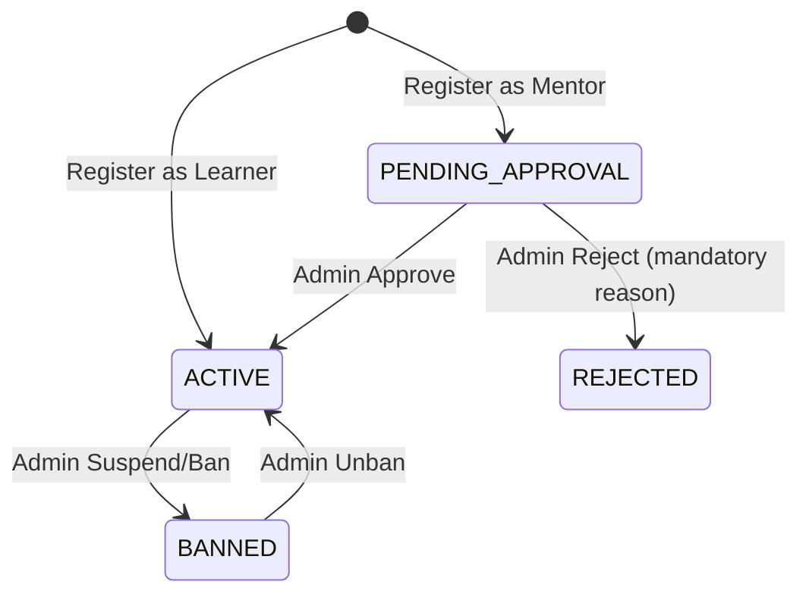

# AUTH — Authentication & Role-Based Access Control

> ✅ **Đã implement** — Auth service đã hoạt động với JWT Bearer token, RBAC dynamic, Role-Permission mapping.

## 1. Module description

AUTH quản lý toàn bộ vòng đời xác thực người dùng: đăng ký, đăng nhập, phân quyền động. Sử dụng JWT Bearer token với permissions được encode trực tiếp vào payload. RBAC model database-driven (Role → Permission mapping) cho phép Admin tạo/xoá Role và Permission tùy ý.

## 2. Tên viết tắt

- **AUTH** = Authentication & Authorization
- Vietnamese: **Xác thực & Phân quyền**

## 3. Submodules

### 3.1. Authentication Module (`/api/v1/auth`)
Quản lý luồng đăng nhập, đăng ký, phiên làm việc và tài khoản cá nhân.

| Endpoint | Method | Mô tả |
|---|---|---|
| `/register/learner` | `POST` | Đăng ký tài khoản học viên |
| `/register/mentor` | `POST` | Đăng ký tài khoản mentor (cần duyệt) |
| `/login` | `POST` | Đăng nhập hệ thống (trả về JWT) |
| `/logout` | `POST` | Đăng xuất |
| `/forgot-password`| `POST` | Yêu cầu cấp lại mật khẩu (nhận 6-digit code) |
| `/reset-password` | `POST` | Đặt lại mật khẩu mới |
| `/me` | `GET` | Lấy thông tin profile user hiện tại (thông qua JWT) |
| `/:id` | `GET` | Lấy thông tin user bằng ID |

### 3.2. IAM - Roles Module (`/api/v1/iam/Role`)
Quản lý nhóm quyền (Role) và danh sách quyền hạn (Permission) - dành cho Admin.

| Endpoint | Method | Mô tả |
|---|---|---|
| `/GetByIndex` | `GET` | Phân trang danh sách Roles |
| `/getById/:id` | `GET` | Xem chi tiết một Role |
| `/create` | `POST` | Tạo Role mới (kèm mảng permissions) |
| `/update` | `POST` | Cập nhật Role và permissions |
| `/delete/:id` | `POST` | Xóa Role |
| `/GetAllPermission`| `GET` | Lấy toàn bộ danh sách Permissions hệ thống |
| `/ForDropdown` | `GET` | Dữ liệu Roles rút gọn để hiển thị dropdown |

### 3.3. IAM - Users Module (`/api/v1/iam/User`)
Quản lý User Directory, thực hiện các thao tác CRUD lên danh sách người dùng - dành cho Admin/Superadmin.

| Endpoint | Method | Mô tả |
|---|---|---|
| `/GetByIndex` | `GET` | Phân trang danh sách Users |
| `/getById/:id` | `GET` | Xem chi tiết một User |
| `/create` | `POST` | Tạo User thủ công (Admin) |
| `/update` | `POST` | Cập nhật thông tin User |
| `/softDelete/:id` | `POST` | Khóa User (chuyển status thành BANNED) |
| `/delete/:id` | `POST` | Xóa cứng User khỏi database (Superadmin) |

## 4. Actors

| Role | Trách nhiệm |
|---|---|
| **Guest** | Đăng ký, đăng nhập |
| **Authenticated User** | Truy cập resources theo permissions trong JWT |
| **Admin** | Quản lý Role, Permission, User directory |
| **Superadmin** | Toàn quyền hệ thống, hard delete |

## 5. Status lifecycle

### AccountStatus

| Status | Mô tả |
|---|---|
| `ACTIVE` | Tài khoản hoạt động bình thường |
| `PENDING_APPROVAL` | Đang chờ duyệt (khi đăng ký Mentor) |
| `BANNED` | Bị cấm — không thể đăng nhập |
| `REJECTED` | Đơn mentor bị từ chối |

### State transitions



| From | To | Action | Ai làm | Điều kiện |
|---|---|---|---|---|
| *(new)* | `ACTIVE` | **Register as Learner** | Guest | Valid form |
| *(new)* | `PENDING_APPROVAL` | **Register as Mentor** | Guest | Valid form + mentor profile |
| `PENDING_APPROVAL` | `ACTIVE` | **Approve Mentor** | Admin | Review credentials |
| `PENDING_APPROVAL` | `REJECTED` | **Reject Mentor** | Admin | Mandatory rejection reason |
| `ACTIVE` | `BANNED` | **Suspend/Ban** | Admin | Policy violation |
| `BANNED` | `ACTIVE` | **Unban** | Admin | Issue resolved |

## 6. Core flows

### Flow 1 — User Registration (UC-01)

1. Guest gọi endpoint `/api/v1/auth/register/learner` hoặc `/api/v1/auth/register/mentor`.
2. Truyền payload tương ứng `LearnerRegisterRequestDto` hoặc `MentorRegisterRequestDto`.
3. Fill form: `email`, `password`, `name`, ...
4. System validate:
   - Email format.
   - Email uniqueness against `users` table.
5. Backend hash password (`bcrypt`, work factor = 10).
6. Insert `users` record với role tương ứng (`LEARNER` được tạo mặc định nếu chưa có). Nếu là mentor, sẽ kích hoạt `RegisterMentorSaga` để xử lý thêm profile mentor.
7. Trả về thông tin user an toàn (không chứa mật khẩu). Sau đó client có thể redirect to Login.

**Alternative Flows:**
- **A1** – Email đã tồn tại → `"Email already exists"`.
- **A2** – Password không match → `"Password does not match"`.
- **A3** – Fields trống → `"Please fill in all required fields"`.

### Flow 2 — User Login (UC-02)

1. Guest gọi endpoint `/api/v1/auth/login`.
2. Fill: `email`, `password`.
3. System verify: email exists, `bcrypt.compare(password, hash)`.
4. Generate JWT payload:
   ```json
   {
     "sub": "user-uuid",
     "userId": "user-uuid",
     "email": "admin@iuroadmap.com",
     "role": "ADMIN",
     "permissions": ["roadmap:read", "roadmap:write", "user:manage", "configuration:manage"],
     "deptId": null,
     "job": null,
     "iat": 1723528255,
     "exp": 1723614655
   }
   ```
5. Return Bearer access_token (hết hạn trong 24h), redirect to Dashboard.

**Alternative Flows:**
- **A1** – Invalid credentials → `"Invalid email or password"` (không tiết lộ field nào sai).
- **A2** – Unauthenticated access protected route → redirect to Login + `"Please log in to continue"`.

### Flow 3 — Dynamic Role Management (Admin)

1. Admin → View Roles (`GET /api/v1/iam/Role/GetByIndex`).
2. **View Permissions**: `GET /api/v1/iam/Role/GetAllPermission`.
3. **Create Role**: name, permissions (gán lúc tạo) → `POST /api/v1/iam/Role/create`.
4. **Edit Role**: cập nhật name, permissions → `POST /api/v1/iam/Role/update`.
5. **Delete Role**: `POST /api/v1/iam/Role/delete/:id`.
6. Thay đổi reflect trong JWT payload ở lần login kế tiếp của user.

### Flow 4 — Password Reset

1. User → forgot password view.
2. Fill email → `POST /api/v1/auth/forgot-password`.
3. Backend: generate mã code 6 số ngẫu nhiên (`resetPasswordToken`) + `resetPasswordExpires` (15 phút).
4. Send email containing the 6-digit code.
5. User nhập mã code + new password → `POST /api/v1/auth/reset-password`.
6. Validate token (còn hạn) + update password hash + xóa token cũ.

### Flow 5 — User Directory Management (Admin/Superadmin)

1. Admin → View Users (`GET /api/v1/iam/User/GetByIndex`).
2. **View Detail**: `GET /api/v1/iam/User/getById/:id`.
3. **Create/Update User**: `POST /api/v1/iam/User/create` & `POST /api/v1/iam/User/update`.
4. **Soft Delete (Ban)**: `POST /api/v1/iam/User/softDelete/:id` → Đổi AccountStatus thành BANNED (JWT token hiện tại của user sẽ bị chặn).
5. **Hard Delete**: `POST /api/v1/iam/User/delete/:id` (Chỉ Superadmin thực hiện).

## 7. Database Schema

Tham chiếu: [`auth-schema.md`](../schema/auth-schema.md)

Bảng chính:
- `users` — id, email, password, name, roleId, status, subscriptionTier, resetPasswordToken
- `roles` — id, name, description
- `permissions` — id, name, description
- `_RoleToPermission` — Prisma implicit many-to-many

## 8. Related modules

- **CONFIG** (UC-C01) — User Directory management
- **CONFIG** (UC-C02) — Mentor Verification workflow
- **LEARNER** — JWT auth guard cho mọi protected route
- **MENTOR** — Role + profile status check

## 9. Business Rules

| Rule ID | Rule |
|---|---|
| **BR-AUTH-01** | Email unique across platform (`BR-01` master) |
| **BR-AUTH-02** | Password hash bcrypt work factor ≥ 10 |
| **BR-AUTH-03** | Access token expiry: 24h|
| **BR-AUTH-04** | Admin role cannot be registered publicly — chỉ Admin tạo |
| **BR-AUTH-05** | BANNED status → immediate JWT invalidation |
| **BR-AUTH-06** | Frontend decode JWT payload để toggle UI features |

## 10. SubscriptionTier (Parallel Concept)

| Tier | Mô tả |
|---|---|
| `FREE` | Gói miễn phí — features cơ bản |
| `VIP` | Gói VIP — features nâng cao |
| `PRO` | Gói PRO — toàn bộ features |

> Subscription tier độc lập với Role. User có thể là `LEARNER` + `PRO` hoặc `MENTOR` + `FREE`.
