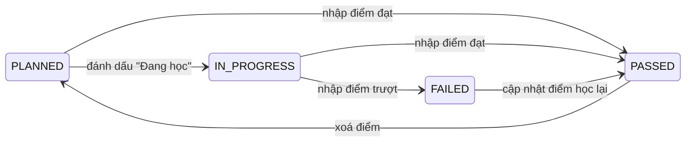
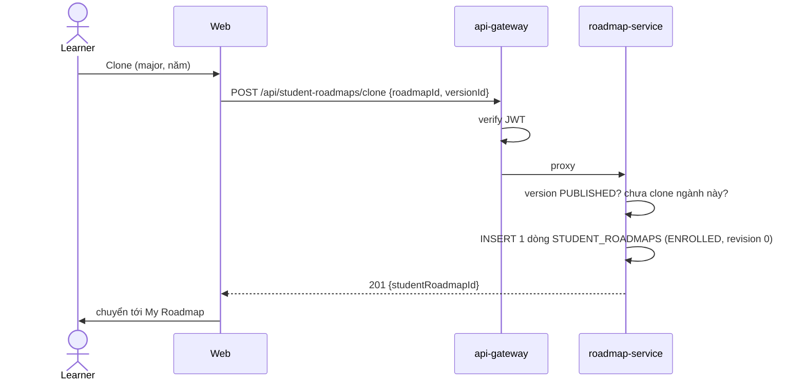

# LEARNER — Learner Portal v2 (My Roadmap + Kết quả học tập)

> **Version:** v2, 2026-09-26. 🔲 **Planned.** Backend learner của v1 (orchestrator ở gateway) đã bị gỡ trong refactor `5acc76f5`, nên v2 xây lại trong roadmap-service.
> Yêu cầu chi tiết: [`FL-LRN`](../srs/features/FL-LRN-learner-portal.md). Thiết kế: [`roadmap-v2-design.md`](../architecture/roadmap-v2-design.md). Schema: [`roadmap-schema.md`](../schema/roadmap-schema.md).

## 1. Module description

Learner Portal cho phép sinh viên:

- Khám phá CTĐT theo học kỳ.
- **Clone** một CTĐT thành **My Roadmap**.
- **Sửa kế hoạch** cho khớp học kỳ thực tế: dời môn, thêm môn, nối quan hệ, thêm kỳ.
- **Bấm tiêu đề học kỳ để nhập điểm**, và xem GPA học kỳ, GPA tích luỹ, xếp loại như trên bảng điểm của trường.

Mọi dữ liệu của learner được lưu dưới dạng **overlay**: chỉ phần khác so với CTĐT gốc, cùng với điểm.

## 2. Tên viết tắt

- **LEARNER** = Learner Portal
- Vietnamese: **Cổng Học viên**

## 3. Submodules

| Submodule | Mô tả | API (qua gateway, thêm tiền tố `/api`) |
|---|---|---|
| Explore CTĐT | Lọc CTĐT theo khoa, ngành, năm | `GET /explore/roadmaps` |
| Preview CTĐT | Xem CTĐT theo học kỳ (chỉ đọc) | `GET /explore/roadmaps/:majorSlug?cohortYear=` |
| Course Explorer | Tra cứu môn: lọc khoa, ngành, năm học, giảng viên, tín chỉ, project; trang chi tiết theo năm học | `GET /explore/courses`, `GET /explore/courses/:courseId?academicYear=` |
| Clone | Tạo My Roadmap (1 dòng) | `POST /student-roadmaps/clone` |
| My Roadmaps | Danh sách roadmap cá nhân | `GET /student-roadmaps/my` |
| My Roadmap | Merged view: CTĐT + overlay + điểm | `GET /student-roadmaps/:id` |
| Personalize | Batch thay đổi cấu trúc | `POST /student-roadmaps/:id/changes`, `/reset` |
| Semester Results | Bảng điểm theo học kỳ | `GET/POST /student-roadmaps/:id/terms/:termKey/results[/save]` |
| Upgrade | Nâng lên version CTĐT mới | `GET .../upgrade-preview`, `POST .../upgrade` |
| Micro Learning | Topic của môn theo năm học | `GET /explore/courses/:courseId/topics?academicYear=` |
| Course Comments | Bình luận, trả lời, báo cáo | `GET /explore/courses/:courseId/comments`, `POST /course-comments/*` |

Gateway cần thêm prefix `student-roadmaps` và `course-comments` trỏ tới `ROADMAP_SERVICE`.

## 4. Actors

| Role | Trách nhiệm |
|---|---|
| **Guest** | Browse, preview CTĐT, xem topic |
| **Learner** (`RM.USER`) | Clone, sửa My Roadmap, nhập điểm, nâng version, drop |
| **System** | Ghép base + overlay, suy ra trạng thái, tính GPA và tiến độ |

## 5. Status

### 5.1 Trạng thái node (suy ra khi đọc)

Quan hệ giữa môn **không** khoá môn nào (BR-LRN-01): learner được đánh dấu đang học hoặc nhập điểm cho bất kỳ môn nào.

| Trạng thái | Màu | Được lưu? |
|---|---|---|
| `PLANNED` | Màu nhóm môn | Không (không có dòng kết quả) |
| `IN_PROGRESS` | Vàng | Có (`STUDENT_COURSE_RESULTS.status`) |
| `PASSED` / `FAILED` | Xanh lá / Đỏ | Chỉ lưu điểm; chữ và đạt/trượt tra `GRADE_SCALES` |

### 5.2 Trạng thái Student Roadmap

| Status | Mô tả |
|---|---|
| `ENROLLED` | Đang theo lộ trình |
| `COMPLETED` | Đủ tín chỉ và đã qua mọi môn bắt buộc (tự động) |
| `DROPPED` | Learner ngừng theo; dữ liệu vẫn được giữ |

## 6. Core flows

### Flow 1 — Browse & Preview (UC-03, UC-04)

1. Mở **Explore → CTĐT** → `GET /explore/roadmaps` với bộ lọc **khoa → ngành → năm** và từ khoá. Mỗi thẻ là một CTĐT (ngành, năm).
2. Chọn một thẻ → `GET /explore/roadmaps/:majorSlug?cohortYear=`. Chọn ngành mà không chọn năm thì lấy năm mới nhất đang `PUBLISHED`.
3. Hiển thị canvas theo học kỳ ở chế độ chỉ đọc (giống sơ đồ CTĐT), có chú thích quan hệ, chú thích màu nhóm môn và dropdown **Năm** để chuyển.
4. Click một môn → trang môn học (Flow 11) dạng panel, với năm học ước tính cho kỳ đó của khoá.
5. Bấm **Clone to My Roadmap** → Flow 2.

**Alternative flows:**
- **A1:** Ngành chưa có CTĐT năm nào được publish → "Chương trình đào tạo đang được cập nhật".
- **A2:** Slug không tồn tại → `404`.

### Flow 2 — Clone (UC-05)

1. Guest → chuyển tới Login, đăng nhập xong quay lại.
2. Hộp xác nhận "Clone CTĐT năm 2023 vào My Roadmap?", mặc định chọn năm theo khoá của learner; learner đổi được sang năm khác.
3. Backend chỉ tạo **1 dòng**; không copy môn, quan hệ hay tiến độ (BR-LRN-06).
4. Learner lỡ xoá hẳn roadmap vẫn clone lại được CTĐT năm đó (miễn là năm đó còn `PUBLISHED`), nhưng phần chỉnh sửa và điểm cũ không khôi phục được. Muốn tạm ngừng thì dùng **Drop** (Flow 9) để giữ dữ liệu.

**Alternative flows:**
- **A1:** Đã clone ngành này → `409 ALREADY_CLONED`. Nếu roadmap cũ đang `DROPPED` thì UI gợi ý Re-activate.
- **A2:** CTĐT không còn `PUBLISHED` → `400`.

### Flow 3 — My Roadmaps dashboard (UC-06)

1. `GET /student-roadmaps/my` trả về danh sách thẻ: tên ngành, năm CTĐT, tín chỉ đạt / `total_credits` (không giới hạn, ví dụ `145 / 140`), % tiến độ, GPA tích luỹ.
2. Không có roadmap nào → "Chưa có roadmap" kèm nút **Explore Majors**.

### Flow 4 — My Roadmap (UC-07)

1. `GET /student-roadmaps/:id`. Backend xử lý:
   - Kiểm tra quyền sở hữu (BR-LRN-14).
   - Lấy CTĐT từ cache (bất biến).
   - Chạy 4 query overlay theo `student_roadmap_id`.
   - Ghép dữ liệu (design §6.3), suy ra trạng thái, tính tín chỉ, GPA và gợi ý.
2. Canvas theo học kỳ, node căn giữa cột. Tiêu đề cột dạng `Semester 5 · HK1 2025-2026 · 20 TC · GPA 3.45` và **bấm được** (Flow 6).
3. Thanh tổng quan: tín chỉ đạt / `total_credits`, % tiến độ (không giới hạn 100%), GPA tích luỹ (hệ 100 và hệ 4), xếp loại.
4. Hover node → tooltip. Click node → panel: kết quả của learner và trang môn học (Flow 11) **của đúng năm học của kỳ chứa môn**: thông tin cho sinh viên, giảng viên, project, topic (Flow 8).
5. Panel **Gợi ý** (chỉ tham khảo, không chặn): môn đứng trước môn tiên quyết, môn tiên quyết bị trượt, thiếu tín chỉ.

**Alternative flows:**
- **A1:** Không phải chủ sở hữu → `403`.
- **A2:** Không tồn tại → `404`.

### Flow 5 — Cá nhân hoá cấu trúc (UC-10, mới)

1. Bấm **Chỉnh sửa**. Canvas cho kéo thả, sidebar hiện catalog môn.
2. Learner thực hiện các thao tác (được gom ở client):
   - Kéo node sang kỳ khác, ví dụ IT153 từ Semester 2 sang Semester 5 cho khớp HK1 2025-2026. Trong lúc kéo, các node trong cột đích **tách ra chừa chỗ**; thả vào giữa hai node là chèn vào giữa (design §4.2).
   - Kéo node vào khe giữa hai cột → hiện cột mờ "＋ Kỳ mới"; thả vào đó là vừa chèn kỳ vừa dời node.
   - Thêm môn từ catalog, hoặc tự nhập môn ngoài catalog.
   - **Không xoá được** môn hay quan hệ của CTĐT. Chỉ xoá được môn/edge do chính mình thêm (môn đã có điểm thì không xoá được).
   - Chọn môn cho elective slot.
   - Nối edge mới (3 loại) (BR-LRN-08).
   - **Chèn kỳ ở bất kỳ vị trí nào** và tự đặt tên. Ví dụ sinh viên quốc tế chèn "IE0", "IE1", "IE2" (tiếng Anh tăng cường) trước Semester 1 rồi thêm các môn IE vào; hoặc thêm Semester 9, Summer phụ. Gắn nhãn năm học cho kỳ.
3. Bấm **Lưu** → `POST /student-roadmaps/:id/changes { revision, ops[] }`.
4. Backend xử lý trong 1 transaction:
   - Kiểm tra `revision`.
   - Áp dụng các op thành upsert/delete trên overlay.
   - **Chuẩn hoá:** xoá override nào trùng với base (BR-LRN-07).
   - Validate toàn vẹn dữ liệu (môn trùng, node có điểm). Quan hệ giữa môn không bị validate: sai thứ tự hay có vòng vẫn lưu và trả về `hints` (BR-LRN-12).
   - Tăng `revision`, trả merged view mới.
5. **Reset:** reset 1 node (về vị trí CTĐT) hoặc toàn bộ → `POST /student-roadmaps/:id/reset`.

**Alternative flows:**
- **A1:** Sai `revision` → `409`, UI tải lại.
- **A2:** Thêm môn đã có trong kế hoạch → `409 DUPLICATE_COURSE_IN_PLAN`.
- **A3:** Ẩn node đã có điểm → `409 NODE_HAS_RESULT`.
- **A4:** Rời trang mà chưa lưu → hộp xác nhận.

### Flow 6 — Nhập kết quả học kỳ (UC-11, mới)

1. Bấm tiêu đề cột học kỳ → `GET /student-roadmaps/:id/terms/:termKey/results`.
2. Drawer hiện bảng giống bảng điểm của trường: STT, Mã MH, Tên MH, TC, %QT, %GK, %CK, QT, GK, CK, Tổng, Điểm chữ, Hệ 4.
3. Learner nhập:
   - Trọng số (mặc định lấy từ offering của năm học của kỳ).
   - Môn chấm Đạt/Không đạt (ví dụ ENTP01 Intensive English 1) chỉ có ô chọn **Đạt / Không đạt**, không nhập điểm.
   - Điểm thành phần; khi đủ 3 thì Tổng tự tính theo `round_half_up(Σw·s/100)`.
   - Hoặc nhập thẳng Tổng.
   - Hoặc chỉ đánh dấu **Đang học**.
4. Chân bảng cập nhật trực tiếp: TB học kỳ hệ 100 và hệ 4, TB tích luỹ, tín chỉ đạt, tín chỉ tích luỹ, xếp loại.
5. **Lưu** → `POST .../results/save { revision, items[] }`. Backend validate (BR-LRN-05), upsert hoặc xoá `STUDENT_COURSE_RESULTS`, tăng `revision`.
6. Canvas đổi màu node theo kết quả mới.

**Ví dụ kiểm chứng** (bảng điểm HK1 2025-2026): 6 môn / 20 TC → TB 85.0, hệ 4 3.45, xếp loại **Giỏi** (design §9.3).

**Alternative flows:**
- **A1:** Tổng trọng số ≠ 100 → `400 INVALID_WEIGHTS`.
- **A2:** Điểm ngoài khoảng 0–100 → `400`.
- **A3:** Kỳ chưa có môn nào → "Chưa có môn trong học kỳ này. Kéo môn vào cột để bắt đầu".

### Flow 7 — Cập nhật / đổi CTĐT (UC-12, mới)

1. Hai cách vào:
   - Admin ban hành lại CTĐT của năm learner đang dùng → banner "CTĐT 2023 có bản cập nhật".
   - Learner chủ động chọn **Đổi CTĐT** sang năm khác (ví dụ bảo lưu, theo khoá 2024).
2. **Xem thay đổi** → `GET .../upgrade-preview?targetVersionId=` trả danh sách: giữ nguyên / remap / bị bỏ / chuyển thành môn tự thêm (giữ điểm).
3. **Cập nhật** → `POST .../upgrade { targetVersionId, revision }` → xử lý trong 1 transaction (BR-LRN-11).

### Flow 8 — Micro learning (UC-08)

1. Từ tab **Nội dung** của trang môn → `GET /explore/courses/:courseId/topics?academicYear=`.
2. Hiển thị topic **của năm học đó** theo thứ tự, learning objectives, resources, kèm Next/Previous. Năm đó chưa có nội dung thì lấy năm gần nhất trước đó và ghi rõ "Nội dung năm 2024-2025".

### Flow 9 — Drop / Re-activate (UC-13)

- **Drop** → `DROPPED`, roadmap bị ẩn khỏi dashboard mặc định, dữ liệu được giữ.
- **Re-activate** → `ENROLLED`.

### Flow 10 — Bình luận môn học (UC-14, mới)

1. Mở panel môn (từ preview hoặc My Roadmap) → tab **Bình luận** → `GET /explore/courses/:courseId/comments`. Guest đọc được.
2. **Viết:** learner đã đăng nhập nhập văn bản → `POST /course-comments/create { courseId, content }`. Bình luận **hiện ngay** (hậu kiểm).
3. **Trả lời:** bấm "Trả lời" dưới một bình luận gốc → `create { courseId, parentId, content }`. Chỉ 1 cấp (BR-LRN-16).
4. **Sửa / xoá** bình luận của mình → `POST /course-comments/update`, `POST /course-comments/delete/:id` (xoá mềm).
5. **Báo cáo** bình luận của người khác → chọn lý do → `POST /course-comments/:id/report`. Đủ ngưỡng report thì bình luận tạm ẩn chờ admin (BR-LRN-17), admin xử lý ở FL-RDM-10.

**Alternative flows:**
- **A1:** Chưa đăng nhập mà bấm Viết → chuyển tới Login, xong quay lại.
- **A2:** Vượt giới hạn tần suất → `429 COMMENT_RATE_LIMITED`, UI hiện thời gian chờ.
- **A3:** Báo cáo lần hai → `409 ALREADY_REPORTED`.
- **A4:** Sửa bình luận đang chờ kiểm duyệt hoặc đã bị ẩn → `409 COMMENT_NOT_EDITABLE`.

### Flow 11 — Tra cứu môn học / Course Explorer (UC-15, mới)

1. Mở **Explore → Môn học** → `GET /explore/courses`. Guest xem được.
2. Lọc theo **khoa → ngành**, **năm học**, **giảng viên**, **số tín chỉ**, **có project**, nhóm môn, kiểu chấm, từ khoá. Bộ lọc giữ trên URL.
3. Mỗi thẻ môn: `code (LT,TH)`, tên, màu nhóm môn, giảng viên năm đó, badge "Có project", số bình luận.
4. Click một môn → `GET /explore/courses/:courseId?academicYear=`. Trang chi tiết có dropdown **Năm học** và các tab:
   - **Tổng quan:** mô tả, thông tin cho sinh viên (ví dụ thủ tục Internship, xin drop), đề cương, trọng số, project, giảng viên theo học kỳ.
   - **Nội dung:** topic của năm học đó (Flow 8).
   - **Trong CTĐT:** ngành và năm nào có môn này, ở kỳ mấy, môn trước và sau.
   - **Bình luận:** Flow 10, mặc định lọc theo năm đang xem.
5. Đổi năm học → Tổng quan và Nội dung đổi theo.

**Alternative flows:**
- **A1:** Môn chưa có offering nào được publish → chỉ hiện thông tin chung và Bình luận.
- **A2:** Không có kết quả phù hợp bộ lọc → "Không tìm thấy môn học" kèm nút xoá bộ lọc.

## 7. Database schema

Tham chiếu [`roadmap-schema.md`](../schema/roadmap-schema.md):

- `STUDENT_ROADMAPS`
- `STUDENT_TERM_DELTAS`, `STUDENT_NODE_DELTAS`, `STUDENT_EDGE_DELTAS`
- `STUDENT_COURSE_RESULTS`
- `COURSE_COMMENTS`, `COURSE_COMMENT_REPORTS`

Các bảng v1 `USER_ROADMAPS` và `USER_NODE_PROGRESS` (user-service) **bị thay thế**, không migrate vì là dữ liệu test.

## 8. Related modules

- **ROADMAP:** CTĐT theo năm đã publish, catalog môn, nhóm môn, thang điểm.
- **AUTH:** JWT, permission `RM.USER`, `@CurrentUser('userId')`.
- **LECTURER REVIEW:** từ panel môn mở review giảng viên.

## 9. Business Rules

| Rule ID | Rule |
|---|---|
| **BR-LRN-01** | **Quan hệ chỉ để hiển thị:** ở phía learner, `PREREQUISITE`/`PREVIOUS`/`COREQUISITE` không khoá môn và không chặn thao tác nào. Hệ thống chỉ đưa ra gợi ý, ví dụ `PREREQUISITE` mà A chưa `PASSED` trong khi B đã có kết quả hoặc nằm cùng/trước kỳ của A (thay `BR-02` master) |
| **BR-LRN-02** | **Không lưu trạng thái suy ra được:** node chưa có kết quả là `PLANNED`; clone không tạo dòng tiến độ (thay `BR-03` master) |
| **BR-LRN-03** | **Không trùng:** mỗi learner có 1 Student Roadmap cho mỗi ngành, unique `(user_id, roadmap_id)` (`BR-09` master) |
| **BR-LRN-04** | **Tiến độ:** `floor(tín chỉ đạt / total_credits × 100)`, `total_credits` lấy từ CTĐT learner đang dùng. **Không giới hạn 100%**, vì learner được học vượt; UI hiện `tín chỉ đạt / total_credits`. `total_credits = 0` → 0% (`BR-15` master, đổi từ đếm môn sang đếm tín chỉ) |
| **BR-LRN-05** | **Điểm:** thành phần và tổng nằm trong 0–100 (thành phần tối đa 1 chữ số thập phân); trọng số hoặc để trống cả 3, hoặc tổng = 100 |
| **BR-LRN-06** | **Clone `O(1)`:** clone chỉ insert 1 dòng `STUDENT_ROADMAPS` |
| **BR-LRN-07** | **Overlay tối thiểu:** chỉ lưu phần khác so với base, mỗi phần tử 1 dòng trạng thái cuối; override trùng base thì bị xoá |
| **BR-LRN-08** | **Chỉ thêm và dời, không xoá CTĐT:** learner thêm node, thêm edge, dời node qua các kỳ, chèn kỳ. Không xoá, ẩn hay đổi loại node/edge của CTĐT; chỉ xoá được node/edge/kỳ do chính mình thêm. Quan hệ vẫn chỉ để hiển thị, không khoá môn (BR-LRN-01) |
| **BR-LRN-09** | **Một môn xuất hiện 1 lần** trong kế hoạch đã ghép (tính cả base, custom và slot đã điền) |
| **BR-LRN-10** | **Bảo toàn điểm:** không xoá node (do learner thêm) đã có kết quả; chỉ kỳ `REGULAR`/`SUMMER` nhận kết quả (không nhận ở `ELECTIVE_POOL`) |
| **BR-LRN-11** | **CTĐT cố định:** roadmap giữ nguyên CTĐT đã clone; chỉ learner được chủ động cập nhật (bản mới cùng năm) hoặc đổi sang năm khác; rebase không bao giờ làm mất điểm |
| **BR-LRN-12** | **Kế hoạch do learner quyết định:** vi phạm xếp kỳ và vòng quan hệ chỉ là gợi ý, không bao giờ chặn lưu. Chỉ chặn lỗi toàn vẹn dữ liệu (môn trùng, xoá node có điểm, revision sai) |
| **BR-LRN-13** | **Công thức điểm:** `total = round_half_up(Σw·s/100)` (số nguyên); GPA học kỳ và tích luỹ là trung bình có trọng số theo tín chỉ `theory + lab`, chỉ tính môn `SCORE` có `counts_toward_gpa` và đã có điểm, **kể cả môn trượt**; môn `PASS_FAIL` không tính GPA; tín chỉ đạt chỉ cộng môn `PASSED` có `counts_toward_credits`; hệ 100 làm tròn 1 chữ số, hệ 4 làm tròn 2 chữ số |
| **BR-LRN-14** | **Sở hữu:** mọi endpoint `student-roadmaps/:id/*` kiểm tra `user_id` từ JWT (`@CurrentUser`), không dùng header `x-user-id` |
| **BR-LRN-15** | **Nội dung bình luận:** văn bản thuần, không HTML/markdown, độ dài theo `EntityConstant.CourseComment`; tác giả chỉ sửa hoặc xoá bình luận của mình |
| **BR-LRN-16** | **Cấu trúc & tần suất bình luận:** chỉ trả lời 1 cấp; mỗi user tối đa `AppConstant.CourseComment.MaxPerWindow` bình luận mỗi `WindowMinutes` phút |
| **BR-LRN-17** | **Báo cáo:** mỗi user báo cáo 1 bình luận tối đa 1 lần, không tự báo cáo mình; đủ `AppConstant.Moderation.ReportThreshold` report đang chờ thì bình luận chuyển `FLAGGED` và tạm ẩn (ngưỡng dùng chung với FL-LR) |
| **BR-LRN-18** | **Chèn kỳ tự do:** learner chèn kỳ custom ở mọi vị trí (kể cả trước Semester 1) và tự đặt tên; chỉ kỳ custom được dời hoặc xoá (khi rỗng); kỳ base của CTĐT giữ nguyên |

## 10. Non-Functional Requirements

| NFR | Requirement |
|---|---|
| **Clone** | ≤ 500ms (1 insert) |
| **My Roadmap load** | ≤ 1.0s p95 (version lấy từ cache + 4 query overlay có index) |
| **Save changes / results** | ≤ 1.0s p95 |
| **Dashboard** | ≤ 3.0s p95 |
| **Canvas** | Zoom và pan mượt với khoảng 100 node và 12 cột |
