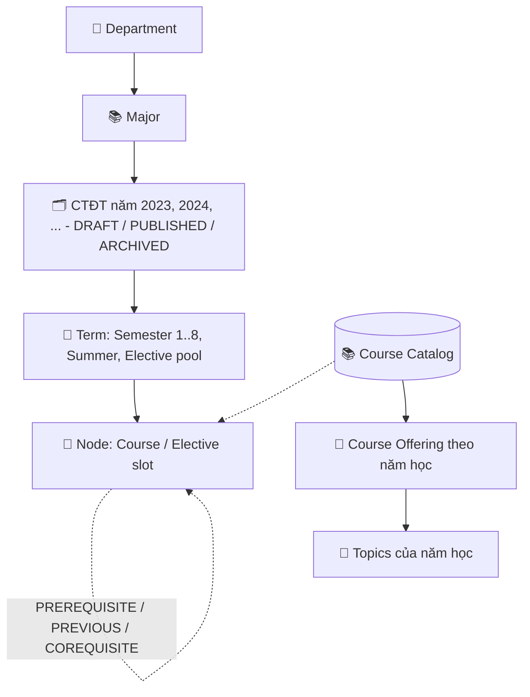
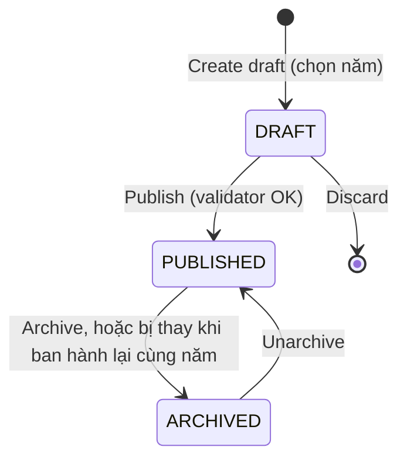

# ROADMAP — Roadmap Management v2 (Semester Curriculum)

> **Version:** v2, 2026-09-26. 🔲 **Planned.** Department/Major CRUD đã có từ v1; Semester canvas, Curriculum Version, Course catalog và thang điểm là phần mới.
> Yêu cầu chi tiết: [`FL-RDM`](../srs/features/FL-RDM-roadmap-management.md). Thiết kế: [`roadmap-v2-design.md`](../architecture/roadmap-v2-design.md). Schema: [`roadmap-schema.md`](../schema/roadmap-schema.md).

## 1. Module description

Roadmap Management cho phép Admin quản lý CTĐT theo hierarchy `Department → Major → CTĐT theo năm → Học kỳ → Môn`.

- Canvas v2 là một **lưới theo học kỳ**: mỗi cột là Semester 1..8, Summer hoặc Elective. Admin kéo môn từ thư viện `COURSES` thả vào cột, và node tự căn giữa cột như sơ đồ CTĐT giấy.
- Mỗi ngành có **một CTĐT cho mỗi năm (khoá)**. CTĐT được **publish thành bản bất biến**, learner clone từ đó. Nhờ vậy learner chỉ cần lưu phần họ thay đổi.
- Môn học và ngành là quan hệ **N:N**, suy ra qua CTĐT: một môn có mặt trong CTĐT của nhiều ngành.

## 2. Tên viết tắt

- **ROADMAP** = Roadmap Management & Curriculum Canvas
- Vietnamese: **Quản lý Lộ trình & Chương trình Đào tạo**

## 3. Submodules

| Submodule | Mô tả | API (qua gateway, thêm tiền tố `/api`) |
|---|---|---|
| Departments CRUD | Quản lý khoa | `/departments/*` |
| Majors CRUD | Quản lý ngành | `/majors/*` (cần thêm prefix vào gateway) |
| **Course Catalog** | Thư viện môn dùng chung, kèm thông tin cho sinh viên | `/courses/*` |
| **Course Categories** | Nhóm môn và màu node (master data) | `/course-categories/*` (cần thêm prefix vào gateway) |
| **CTĐT theo năm** | Draft / Publish / Archive CTĐT của từng năm | `/admin/roadmaps/:roadmapId/versions`, `/admin/roadmap-versions/:id/*` |
| **Semester Canvas** | Xếp môn vào học kỳ, nối quan hệ | `/admin/roadmap-versions/:id/canvas[/save]` |
| **Course Offerings** | Môn mở theo năm học: giảng viên, đề cương, trọng số, project, lưu ý cho SV | `/admin/course-offerings/*` |
| **Lecturers** | Giảng viên (master data, dùng chung với FL-LR) | `/lecturers/*` |
| Topic (micro) Canvas | Học liệu của môn **theo năm học** | `/admin/course-offerings/:id/topics-graph`, … |
| **Grading Config** | Thang điểm, xếp loại | `/admin/grade-scales/*`, `/admin/academic-classifications/*` |
| **Comment Moderation** | Kiểm duyệt bình luận môn học | `/admin/course-comments/*` |

## 4. Actors

| Role | Trách nhiệm |
|---|---|
| **Admin** (`RM.AD`) | CRUD khoa, ngành, môn, nhóm môn; soạn và publish CTĐT theo năm; cấu hình thang điểm |
| **Superadmin** | Như Admin, cộng thêm short-circuit permission |

## 5. Data hierarchy & vòng đời version

## 6. Core flows

### Flow 1 — Department CRUD (UC-A01)

Giữ nguyên như v1:

- Danh sách hiển thị `Name`, `Slug`, `Description`, `Total Majors`.
- Tạo và sửa qua `POST /departments/create|update`; xoá qua `POST /departments/delete/:id`.

Thay đổi ở v2: **không cascade**. Khoa còn ngành thì không xoá được → `409 DEPARTMENT_HAS_MAJORS` (BR-RM-02).

### Flow 2 — Major CRUD (UC-A02)

1. Tạo hoặc sửa ngành với `Name`, `Slug`, `Department`, `Description`. Số tín chỉ tốt nghiệp nhập ở CTĐT từng năm (Flow 4), không nhập ở ngành.
2. Trang chi tiết ngành có tab **CTĐT theo năm** (Flow 4) và nút **Open canvas** cho draft.
3. Xoá ngành bị chặn nếu ngành có CTĐT từng được publish (`PUBLISHED` hoặc `ARCHIVED`) → `409 MAJOR_HAS_PUBLISHED_CURRICULUM`, kèm các năm và số learner. Ngành chỉ có draft thì xoá được (BR-RM-02).

### Flow 3 — Course Catalog (UC-A07, mới)

1. Admin → **Courses**, dạng danh sách `GetByIndex`, lọc theo keyword và category.
2. **Create:** nhập `Code` (IT089IU), `Name`, `Theory credits`, `Lab credits`, `Category` (chọn từ nhóm môn), `Grading mode` (thang điểm hoặc Đạt/Không đạt), `Counts toward GPA`, `Counts toward credits`, `Description` → `POST /courses/create`. Thông tin thay đổi theo năm (trọng số, đề cương, lưu ý cho SV, giảng viên, project) nhập ở Course Offering (Flow 9).
3. Backend validate: code unique (BR-RM-03), tín chỉ hợp lệ (BR-RM-04), trọng số (cả 3 trống hoặc tổng = 100).
4. **Delete:** nếu môn đang được dùng trong một version hoặc roadmap của learner → `409`, kèm danh sách nơi đang dùng.

**Alternative flows:**
- **A1:** Code trùng → `409 "Course code already exists"`.
- **A2:** Theory + Lab = 0 → `400 "Credits must be greater than 0"`.

### Flow 3b — Nhóm môn & màu (mới)

1. Admin → **Course categories** (pattern IAM): `Code`, `Name`, `Fill color`, `Border color`, `Sort order`.
2. Seed sẵn 6 nhóm theo chú thích sơ đồ CTĐT: MAJOR, GENERAL, FOUNDATION, POLITICAL, LANGUAGE, PHYSICAL.
3. Sửa màu → canvas admin, preview và My Roadmap đổi màu ngay.
4. Xoá nhóm còn môn → `409 CATEGORY_IN_USE` (BR-RM-16).

### Flow 4 — CTĐT theo năm (UC-A08, mới)

1. Admin mở tab **CTĐT theo năm** của ngành → `GET /admin/roadmaps/:roadmapId/versions`, nhóm theo năm.
2. Bấm **Tạo CTĐT** và chọn:
   - **Năm áp dụng** (`Cohort year`, bắt buộc), ví dụ 2026.
   - **Nguồn:** *Trống* (tạo sẵn Semester 1..8 và 1 cột Elective), hoặc *Copy từ CTĐT năm X* (giữ nguyên key, BR-RM-13).
3. Nhập `Total credits` (tín chỉ tốt nghiệp của khoá này) và `Decision ref` (ví dụ "89/QĐ-ĐHQT.07.03.2022") → `POST /admin/roadmaps/:roadmapId/versions/create`.
4. Backend kiểm tra `(ngành, năm)` chưa có draft (BR-RM-07) → `201`, chuyển sang canvas (Flow 5).
5. **Sửa CTĐT đã publish:** mở CTĐT năm đó → **Sửa CTĐT năm này** → tạo draft cùng năm (copy). Khi publish, bản cũ tự archive và learner đang dùng được mời cập nhật (BR-RM-15).

**Alternative flows:**
- **A1:** Năm đó đã có draft → `409 ROADMAP_DRAFT_EXISTS`; UI hiện link tới draft đang có.

### Flow 5 — Semester Canvas Editor (UC-A03, viết lại)

1. Mở canvas → `GET /admin/roadmap-versions/:id/canvas`.
2. FE vẽ các cột theo `order_index`, tiêu đề `Semester n (x+y)`. Node được đặt tại `(term, row)` và **căn giữa cột** (design §4.1).
3. **Thêm môn:** kéo từ sidebar Course catalog thả vào cột → tạo node tại ô gần nhất. Môn đã có trong version thì bị từ chối (BR-RM-10).
4. **Dời môn:** kéo node sang cột hoặc hàng khác. Trong lúc kéo, các node trong cột đích tách ra chừa chỗ; thả vào giữa hai node là chèn vào giữa, các node bên dưới trượt xuống tới hàng trống gần nhất. Node luôn về tâm cột (BR-RM-12, design §4.2).
5. **Elective slot:** nút "Add elective slot" → nhập label, tín chỉ, nhóm elective (FL-RDM-07).
6. **Cột:** thêm Summer, Regular hoặc Elective; đổi thứ tự bằng kéo tiêu đề; xoá cột rỗng.
7. **Quan hệ:** xem Flow 6.
8. Sau mỗi thao tác, validator phía client cập nhật panel **Issues**: lỗi (đỏ) và cảnh báo (vàng).
9. **Save** → `POST /admin/roadmap-versions/:id/canvas/save { revision, terms, nodes, edges }`.
10. Backend xử lý trong **1 transaction**:
    - Kiểm tra version là `DRAFT` (BR-RM-11) và `revision` khớp.
    - Upsert theo key, xoá những key không còn.
    - Kiểm tra DAG (BR-RM-01).
    - Tăng `revision`, trả về canvas mới cùng danh sách issues.

**Alternative flows:**
- **A1:** Sai `revision` → `409`; UI hỏi "Canvas đã bị sửa ở nơi khác. Tải lại?".
- **A2:** Version đã được publish → `409 ROADMAP_VERSION_IMMUTABLE`; canvas chuyển sang chế độ chỉ đọc.
- **A3:** Có chu trình → `400 CYCLE_DETECTED`, kèm đường đi của chu trình.

### Flow 6 — Quan hệ giữa môn (UC-A09, mới)

1. Kéo từ handle của node A sang node B → popover chọn loại: **Prerequisite** (mặc định), **Previous**, **Co-requisite**.
2. Client kiểm tra ngay:
   - Có chu trình → từ chối.
   - Vi phạm xếp kỳ (BR-RM-08) → edge đỏ và thêm một issue.
3. Click edge → đổi loại hoặc xoá.
4. Kiểu vẽ theo chú thích sơ đồ CTĐT: prerequisite nét liền có mũi tên; previous nét đứt; co-requisite không mũi tên, nhãn "co-req".

### Flow 7 — Publish (UC-A10, mới)

1. Admin bấm **Publish** → `POST /admin/roadmap-versions/:id/publish { acknowledgeWarnings }`.
2. Backend chạy validator (BR-RM-09):
   - **Lỗi:** chu trình, vi phạm xếp kỳ, node thiếu môn, slot thiếu tín chỉ, version rỗng → `400` kèm danh sách issue.
   - **Cảnh báo:** tổng tín chỉ ≠ `total_credits` của CTĐT, một kỳ vượt số tín chỉ tối đa → nếu `acknowledgeWarnings = false` thì trả `400 PUBLISH_WARNINGS_NOT_ACKNOWLEDGED`.
3. Hợp lệ → `status = PUBLISHED`, ghi `published_at`, `published_by`, `revision_no`. CTĐT bây giờ **bất biến** và xuất hiện trong danh sách clone của learner.
4. Nếu năm đó đã có bản `PUBLISHED` → bản cũ chuyển `ARCHIVED` trong cùng transaction (BR-RM-15).

### Flow 8 — Archive / Unarchive (UC-A11, mới)

1. **Archive** → CTĐT bị ẩn khỏi Explore và danh sách clone. Roadmap của learner đang dùng vẫn chạy bình thường. Learner **không clone lại** được năm đã archive, nên chỉ archive năm không còn sinh viên theo học.
2. **Unarchive** → quay lại `PUBLISHED`, chỉ khi năm đó chưa có bản `PUBLISHED` khác (BR-RM-15).

### Flow 9 — Course Offering theo năm học & Topic canvas (UC-A04, viết lại)

1. Admin → **Course offerings**, lọc theo năm học, môn, giảng viên → `GET /admin/course-offerings/GetByIndex`.
2. **Mở môn cho năm học mới:** chọn môn + năm học → *Copy từ năm trước* (mặc định) hoặc *Trống* → `POST /admin/course-offerings/create { courseId, academicYear, fromOfferingId? }`. Có nút copy hàng loạt mọi môn của năm N sang N+1.
3. Nhập **Thông tin cho sinh viên** (markdown), `Syllabus URL`, trọng số QT/GK/CK, **Có project** + mô tả project.
4. **Gán giảng viên**: chọn từ danh sách `LECTURERS`, vai trò (Giảng viên / Trợ giảng), học kỳ (HK1 / HK2 / Hè / cả năm).
5. **Topic canvas:** thao tác như v1, nhưng gắn với offering của năm đó → `GET /admin/course-offerings/:id/topics-graph`.
6. **Publish** → sinh viên thấy trong Course Explorer và My Roadmap. Offering vẫn sửa được sau publish (FR-RDM.08.1).

**Alternative flows:**
- **A1:** Môn đã có offering cho năm đó → `409 COURSE_OFFERING_EXISTS`, UI mở offering đang có.
- **A2:** Xoá giảng viên đang được gán → `409 LECTURER_IN_USE`.

### Flow 10 — Thang điểm & xếp loại (UC-A12, mới)

1. Admin → **Grading config**.
2. Sửa các band `letter`, `min`, `max`, `grade point`, `passing`. Seed ban đầu có **ngưỡng đạt 50**; các band chưa xác nhận theo quy chế IU được đánh dấu (design §9.3).
3. Validator: các band phủ kín 0–100, không chồng lấn và không hở (BR-RM-14).
4. Lưu → hộp xác nhận: "Thay đổi áp dụng cho mọi bảng điểm hiện có."

### Flow 11 — Kiểm duyệt bình luận môn học (UC-A13, mới)

1. Admin → **Kiểm duyệt bình luận** (menu có badge số bình luận `FLAGGED`) → `GET /admin/course-comments/GetByIndex`, mặc định lọc bình luận bị báo cáo.
2. Mở một bình luận → xem nội dung, ngữ cảnh (bình luận gốc / trả lời) và danh sách report.
3. Chọn một hành động:
   - **Ẩn** → nhập lý do (bắt buộc) → `POST /admin/course-comments/:id/hide`. Bình luận `HIDDEN`, report chuyển `REVIEWED`.
   - **Giữ lại** → `POST /admin/course-comments/:id/dismiss-reports`. Bình luận về `VISIBLE`, report chuyển `DISMISSED`.
   - **Khôi phục** bình luận đã ẩn nhầm → `POST /admin/course-comments/:id/restore`.
4. Không có xoá cứng; mọi nội dung và lý do được giữ để truy vết (BR-RM-17).

**Alternative flows:**
- **A1:** Ẩn mà không nhập lý do → `400 MODERATION_REASON_REQUIRED`.

## 7. Database schema

Tham chiếu [`roadmap-schema.md`](../schema/roadmap-schema.md). Các bảng chính:

- `COURSES`, `COURSE_CATEGORIES`
- `COURSE_OFFERINGS`, `LECTURERS`, `COURSE_OFFERING_LECTURERS`
- `ROADMAP_VERSIONS`, `ROADMAP_TERMS`, `ROADMAP_NODES`, `ROADMAP_EDGES`
- `COURSE_TOPICS_NODE`, `COURSE_TOPICS_EDGE`
- `GRADE_SCALES`, `ACADEMIC_CLASSIFICATIONS`

## 8. Related modules

- **LEARNER:** clone CTĐT đã publish của một năm; overlay tham chiếu `node_key` và `term_key` của CTĐT.
- **LECTURER REVIEW:** tham chiếu môn học qua `COURSES.code`.
- **AUTH:** permission `RM.AD`.

## 9. Business Rules

| Rule ID | Rule |
|---|---|
| **BR-RM-01** | **DAG:** đồ thị môn (gộp mọi loại quan hệ) và đồ thị topic đều không có chu trình (`BR-04` master) |
| **BR-RM-02** | **Không xoá khi còn tham chiếu (thay cho cascade của v1):** khoa còn ngành → `409 DEPARTMENT_HAS_MAJORS`. Ngành có CTĐT từng publish (`PUBLISHED`/`ARCHIVED`) → `409 MAJOR_HAS_PUBLISHED_CURRICULUM`. Chỉ các `DRAFT` bị xoá theo ngành |
| **BR-RM-03** | **Unique:** `departments.slug`, `major_roadmaps.slug`, `courses.code` |
| **BR-RM-04** | **Tín chỉ:** `theory_credits ≥ 0`, `lab_credits ≥ 0`, `theory + lab > 0`. Ví dụ `(0,3)` Internship và `(0,7)` Thesis hợp lệ |
| **BR-RM-05** | **Resource URL** của topic phải là HTTP/HTTPS |
| **BR-RM-06** | **Topic estimatedHours** ≥ 0.1 |
| **BR-RM-07** | **Mỗi (ngành, năm) tối đa 1 DRAFT** (partial unique index) |
| **BR-RM-08** | **Ràng buộc xếp kỳ (cứng, chỉ áp dụng cho CTĐT của admin; D13)** (A = môn trước, B = môn sau): `PREREQUISITE`/`PREVIOUS` cần `order(A) < order(B)`; `COREQUISITE` cần `order(A) ≤ order(B)`. Node trong `ELECTIVE_POOL` được bỏ qua |
| **BR-RM-09** | **Điều kiện publish:** không còn lỗi (BR-RM-01, BR-RM-08, BR-RM-12, node `COURSE` có môn, slot có tín chỉ, version không rỗng); cảnh báo (tổng tín chỉ ≠ `total_credits`, vượt tín chỉ tối đa mỗi kỳ) phải được admin xác nhận |
| **BR-RM-10** | **Một môn xuất hiện tối đa 1 lần** trong một version |
| **BR-RM-11** | **Version bất biến:** chỉ `DRAFT` được sửa. `PUBLISHED`/`ARCHIVED` không sửa và không xoá (dùng archive thay cho xoá) |
| **BR-RM-12** | **Vị trí:** mọi node thuộc đúng 1 term; mỗi ô `(term, row)` có tối đa 1 node; backend không lưu pixel |
| **BR-RM-13** | **Key ổn định:** `term_key`, `node_key`, `edge_key` được giữ nguyên khi tạo draft từ version khác |
| **BR-RM-14** | **Thang điểm** phủ kín 0–100, không chồng lấn và không hở; **xếp loại** phủ kín 0–100 theo GPA hệ 100 |
| **BR-RM-15** | **Một CTĐT hiệu lực mỗi năm:** mỗi `(ngành, năm)` có tối đa 1 bản `PUBLISHED` (partial unique index). Publish bản mới của cùng năm thì bản cũ tự `ARCHIVED`; unarchive bị chặn nếu năm đó đã có bản `PUBLISHED` |
| **BR-RM-16** | **Nhóm môn là master data:** màu node lấy từ `COURSE_CATEGORIES`, không hard-code; nhóm còn môn thì không xoá được |
| **BR-RM-17** | **Kiểm duyệt bình luận:** hậu kiểm; admin ẩn phải có lý do; không xoá cứng; xử lý (ẩn hoặc giữ lại) thì đóng mọi report đang chờ và reset bộ đếm |
| **BR-RM-18** | **Course Offering:** mỗi `(môn, năm học)` tối đa 1 offering; chỉ offering `PUBLISHED` hiện với sinh viên; topic gắn với offering nên mỗi năm học có nội dung riêng; tín chỉ và kiểu chấm là thuộc tính của môn, không đổi theo năm |
| **BR-RM-19** | **Thang điểm:** ngưỡng đạt 50; môn `PASS_FAIL` không tra thang điểm và không tính GPA |
