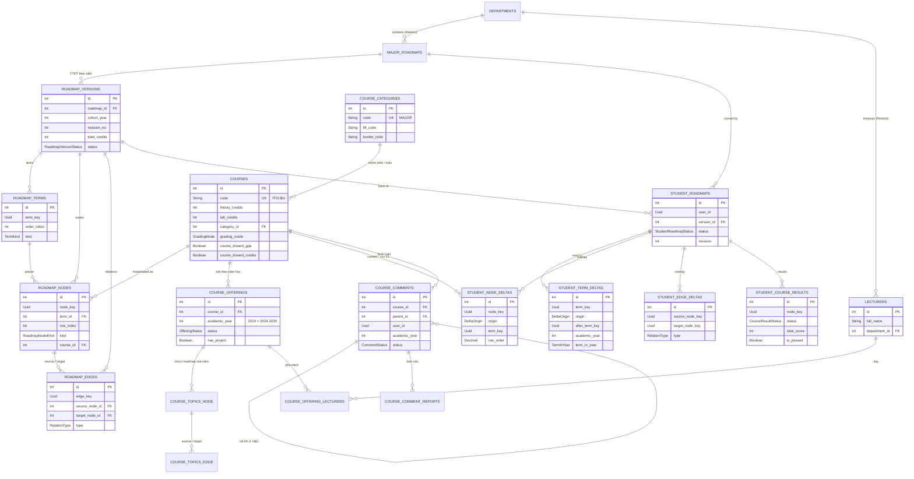

# Roadmap Service Schema — v2 (Semester Curriculum + Student Overlay)

> **Version:** 2.1 (Roadmap v2)
> **Last Updated:** 2026-09-26
> **Thay đổi 2.1:** CTĐT theo năm (`cohort_year`, `revision_no`, `total_credits` ở version); `COURSE_CATEGORIES`; `COURSE_OFFERINGS` + `LECTURERS` (môn theo năm học, topic theo offering); `grading_mode` (`PASS_FAIL` cho IE); bình luận môn học; overlay chỉ thêm/dời (bỏ `is_removed`), `row_order` số thực; kỳ có năm học có cấu trúc; user id là UUID.
> **Trạng thái:** 📝 Target schema, **chưa migrate**. Prisma hiện tại vẫn là v1 (xem [§ Bảng v1 bị thay thế](#bảng-v1-bị-thay-thế)).
> **Service:** `roadmap-service`, DB `ROADMAP_DATABASE_URL` (theo `ADMIN_DATABASE_URL` hiện tại)
> **Thiết kế & lý do:** [`architecture/roadmap-v2-design.md`](../architecture/roadmap-v2-design.md)

Quy ước đặt tên giữ theo style đang có của service: model `UPPER_SNAKE`, cột `snake_case`, `@@map` chữ thường.

---

## ER tổng quan



`GRADE_SCALES` và `ACADEMIC_CLASSIFICATIONS` là bảng cấu hình độc lập, không có FK.

---

## Prisma (target)

```prisma
// ================= ENUMS =================

enum RoadmapVersionStatus { DRAFT PUBLISHED ARCHIVED }
enum TermKind             { REGULAR SUMMER ELECTIVE_POOL }
enum RoadmapNodeKind      { COURSE ELECTIVE_SLOT }
// CourseCategory không còn là enum: xem bảng COURSE_CATEGORIES (master data)
enum RelationType         { PREREQUISITE PREVIOUS COREQUISITE }
enum StudentRoadmapStatus { ENROLLED COMPLETED DROPPED }
enum DeltaOrigin          { BASE CUSTOM }
enum CourseResultStatus   { IN_PROGRESS GRADED }
enum CommentStatus        { VISIBLE FLAGGED HIDDEN DELETED }
enum CommentReportReason  { SPAM OFFENSIVE OFF_TOPIC MISINFORMATION OTHER }
enum CommentReportStatus  { PENDING REVIEWED DISMISSED }   // giống ReportStatus của FL-LR
enum GradingMode          { SCORE PASS_FAIL }             // PASS_FAIL: IE (ENTP01...), chấm P/F
enum OfferingStatus       { DRAFT PUBLISHED }
enum TermInYear           { SEMESTER_1 SEMESTER_2 SUMMER } // khớp AcademicSemester.semester của FL-LR
enum LecturerRole         { LECTURER TA }
enum LecturerStatus       { ACTIVE INACTIVE RETIRED }     // khớp FL-LR

// Mọi cột user id (user_id, published_by, moderated_by, reporter_id) là String UUID,
// vì auth.User.id là uuid(). Không FK chéo service.

// ================= ORGANISATION =================

model DEPARTMENTS {
  // cột như v1 (slug, name, description, ...)
  majors    MAJOR_ROADMAPS[]
  lecturers LECTURERS[]                               // v2: back-relation mới
}

model MAJOR_ROADMAPS {
  id              Int                @id @default(autoincrement())
  slug            String             @unique
  name            String
  // total_credits chuyển sang ROADMAP_VERSIONS (mỗi năm một giá trị)
  description     String?
  department_id   Int
  department      DEPARTMENTS        @relation(fields: [department_id], references: [id], onDelete: Restrict) // v1: Cascade

  versions        ROADMAP_VERSIONS[]
  studentRoadmaps STUDENT_ROADMAPS[]
  created_at      DateTime           @default(now())
  updated_at      DateTime           @updatedAt
  @@map("major_roadmaps")
}

// ================= COURSE CATALOG =================

model COURSE_CATEGORIES {
  id           Int       @id @default(autoincrement())
  code         String    @unique                     // "MAJOR", "GENERAL", ...
  name         String
  fill_color   String                                // "#RRGGBB"
  border_color String                                // "#RRGGBB"
  sort_order   Int       @default(0)                 // thứ tự trong chú thích màu
  courses      COURSES[]
  created_at   DateTime  @default(now())
  updated_at   DateTime  @updatedAt
  @@map("course_categories")
}

model COURSES {
  id                Int               @id @default(autoincrement())
  code              String            @unique        // "IT013IU"
  name              String
  theory_credits    Int
  lab_credits       Int               @default(0)
  category_id       Int
  category          COURSE_CATEGORIES @relation(fields: [category_id], references: [id], onDelete: Restrict)
  grading_mode      GradingMode       @default(SCORE)
  counts_toward_gpa Boolean           @default(true) // false: PT, IE, môn điều kiện…
  counts_toward_credits Boolean       @default(true) // false: IE (ENTP01, ENTP02-1), không cộng vào tín chỉ đạt / % tiến độ
  description       String?                          // mô tả chung, ổn định qua các năm
  // Trọng số, đề cương, lưu ý cho SV, project, giảng viên, topic: chuyển sang COURSE_OFFERINGS (theo năm học)

  roadmapNodes      ROADMAP_NODES[]
  studentNodeDeltas STUDENT_NODE_DELTAS[]
  offerings         COURSE_OFFERINGS[]
  comments          COURSE_COMMENTS[]
  created_at        DateTime       @default(now())
  updated_at        DateTime       @updatedAt
  @@map("courses")
}

// ================= COURSE OFFERING (môn mở trong một năm học) =================

model COURSE_OFFERINGS {
  id                  Int                         @id @default(autoincrement())
  course_id           Int
  course              COURSES                     @relation(fields: [course_id], references: [id], onDelete: Restrict)
  academic_year       Int                                            // năm bắt đầu: 2024 = năm học 2024-2025
  status              OfferingStatus              @default(DRAFT)
  student_guide       String?                     @db.Text           // markdown: điều kiện đăng ký, thủ tục, lưu ý của năm đó
  syllabus_url        String?                                        // HTTP/HTTPS
  weight_process      Int?                                           // % mặc định; cả 3 null hoặc tổng = 100 (bỏ qua nếu PASS_FAIL)
  weight_midterm      Int?
  weight_final        Int?
  has_project         Boolean                     @default(false)
  project_description String?                     @db.Text
  copied_from_id      Int?                                           // offering năm trước dùng làm nguồn copy (truy vết)

  lecturers           COURSE_OFFERING_LECTURERS[]
  topics              COURSE_TOPICS_NODE[]
  created_at          DateTime                    @default(now())
  updated_at          DateTime                    @updatedAt
  @@unique([course_id, academic_year])
  @@index([academic_year, status])
  @@map("course_offerings")
}

model LECTURERS {                                                    // master data; FL-LR dùng lại (D17)
  id            Int                         @id @default(autoincrement())
  full_name     String
  title         String?                                              // ThS, TS, PGS, GS
  department_id Int
  department    DEPARTMENTS                 @relation(fields: [department_id], references: [id], onDelete: Restrict)
  email         String?                     @unique
  status        LecturerStatus              @default(ACTIVE)
  offerings     COURSE_OFFERING_LECTURERS[]
  created_at    DateTime                    @default(now())
  updated_at    DateTime                    @updatedAt
  @@map("lecturers")
}

model COURSE_OFFERING_LECTURERS {
  id           Int              @id @default(autoincrement())
  offering_id  Int
  offering     COURSE_OFFERINGS @relation(fields: [offering_id], references: [id], onDelete: Cascade)
  lecturer_id  Int
  lecturer     LECTURERS        @relation(fields: [lecturer_id], references: [id], onDelete: Restrict)
  role         LecturerRole     @default(LECTURER)
  term_in_year TermInYear?                                           // null = cả năm học
  @@unique([offering_id, lecturer_id, term_in_year]) // term_in_year null: service tự kiểm tra trùng (Postgres coi NULL là khác nhau)
  @@index([lecturer_id])
  @@map("course_offering_lecturers")
}

// ================= CTĐT THEO NĂM (bảng giữ tên ROADMAP_VERSIONS) =================

model ROADMAP_VERSIONS {
  id              Int                  @id @default(autoincrement())
  roadmap_id      Int
  roadmap         MAJOR_ROADMAPS       @relation(fields: [roadmap_id], references: [id], onDelete: Cascade) // service chặn trước nếu có bản đã publish
  cohort_year     Int                                  // năm/khoá áp dụng: định danh nghiệp vụ, hiển thị "K2023"
  revision_no     Int?                                 // lần ban hành trong năm (1, 2, ...); gán khi publish, DRAFT = null
  total_credits   Int                                  // tín chỉ tốt nghiệp của khoá này → publish check + % tiến độ
  decision_ref    String?                              // "89/QĐ-ĐHQT.07.03.2022"
  status          RoadmapVersionStatus @default(DRAFT)
  revision        Int                  @default(0)     // optimistic lock khi lưu canvas
  published_at    DateTime?
  published_by    String?              @db.Uuid        // userId (auth)

  terms           ROADMAP_TERMS[]
  nodes           ROADMAP_NODES[]
  edges           ROADMAP_EDGES[]
  studentRoadmaps STUDENT_ROADMAPS[]
  created_at      DateTime             @default(now())
  updated_at      DateTime             @updatedAt
  @@unique([roadmap_id, cohort_year, revision_no])
  @@index([roadmap_id, cohort_year, status])
  @@map("roadmap_versions")
}

model ROADMAP_TERMS {
  id          Int              @id @default(autoincrement())
  version_id  Int
  version     ROADMAP_VERSIONS @relation(fields: [version_id], references: [id], onDelete: Cascade)
  term_key    String           @db.Uuid              // ổn định qua các version
  order_index Int                                    // thứ tự cột, dùng cho ràng buộc xếp kỳ
  kind        TermKind
  semester_no Int?                                   // REGULAR: 1..n (nhãn hiển thị qua i18n)

  nodes       ROADMAP_NODES[]
  @@unique([version_id, term_key])
  @@unique([version_id, order_index])
  @@map("roadmap_terms")
}

model ROADMAP_NODES {
  id                  Int              @id @default(autoincrement())
  version_id          Int
  version             ROADMAP_VERSIONS @relation(fields: [version_id], references: [id], onDelete: Cascade)
  node_key            String           @db.Uuid      // ổn định qua các version
  term_id             Int
  term                ROADMAP_TERMS    @relation(fields: [term_id], references: [id], onDelete: Cascade)
  row_index           Int                            // hàng trong cột (vị trí logic, không phải pixel)
  kind                RoadmapNodeKind
  course_id           Int?                           // bắt buộc khi kind = COURSE
  course              COURSES?         @relation(fields: [course_id], references: [id], onDelete: Restrict)
  slot_label          String?                        // ELECTIVE_SLOT: "Elective CS1"
  slot_theory_credits Int?
  slot_lab_credits    Int?
  elective_group      String?                        // slot: nhóm chấp nhận (null = tự do); pool: nhóm của môn
  choice_group        String?                        // (Could) nhánh điều kiện
  condition           String?                        // (Could) "CUM_GPA100>=70"

  edgesOut            ROADMAP_EDGES[]  @relation("source")
  edgesIn             ROADMAP_EDGES[]  @relation("target")
  @@unique([version_id, node_key])
  @@unique([term_id, row_index])                     // 1 ô = 1 node
  @@unique([version_id, course_id])                  // 1 môn xuất hiện tối đa 1 lần / version
  @@map("roadmap_nodes")
}

model ROADMAP_EDGES {
  id             Int              @id @default(autoincrement())
  version_id     Int
  version        ROADMAP_VERSIONS @relation(fields: [version_id], references: [id], onDelete: Cascade)
  edge_key       String           @db.Uuid
  source_node_id Int                                 // A — môn trước
  sourceNode     ROADMAP_NODES    @relation("source", fields: [source_node_id], references: [id], onDelete: Cascade)
  target_node_id Int                                 // B — môn sau
  targetNode     ROADMAP_NODES    @relation("target", fields: [target_node_id], references: [id], onDelete: Cascade)
  type           RelationType
  @@unique([version_id, edge_key])
  @@unique([source_node_id, target_node_id])
  @@index([target_node_id])
  @@map("roadmap_edges")
}

// ================= COURSE TOPICS (micro — gắn với offering theo năm học) =================

model COURSE_TOPICS_NODE {
  id          Int              @id @default(autoincrement())
  offering_id Int                                    // v1: course_node_id
  offering    COURSE_OFFERINGS @relation(fields: [offering_id], references: [id], onDelete: Cascade)
  // slug, title, description, coords, learning_objectives, resources_url — như v1
  @@unique([offering_id, slug])
  @@map("course_topics_node")
}

model COURSE_TOPICS_EDGE { /* như v1 */ }

// ================= STUDENT ROADMAP (overlay) =================

model STUDENT_ROADMAPS {
  id         Int                  @id @default(autoincrement())
  user_id    String               @db.Uuid           // userId từ auth (uuid, không FK chéo service)
  roadmap_id Int
  roadmap    MAJOR_ROADMAPS       @relation(fields: [roadmap_id], references: [id], onDelete: Restrict)
  version_id Int
  version    ROADMAP_VERSIONS     @relation(fields: [version_id], references: [id], onDelete: Restrict)
  status     StudentRoadmapStatus @default(ENROLLED)
  revision   Int                  @default(0)        // optimistic lock cho batch changes

  termDeltas STUDENT_TERM_DELTAS[]
  nodeDeltas STUDENT_NODE_DELTAS[]
  edgeDeltas STUDENT_EDGE_DELTAS[]
  results    STUDENT_COURSE_RESULTS[]
  created_at DateTime             @default(now())
  updated_at DateTime             @updatedAt
  @@unique([user_id, roadmap_id])
  @@index([version_id])
  @@map("student_roadmaps")
}

model STUDENT_TERM_DELTAS {
  id                  Int              @id @default(autoincrement())
  student_roadmap_id  Int
  studentRoadmap      STUDENT_ROADMAPS @relation(fields: [student_roadmap_id], references: [id], onDelete: Cascade)
  term_key            String           @db.Uuid      // BASE: key term gốc; CUSTOM: key mới
  origin              DeltaOrigin
  kind                TermKind?                      // CUSTOM: REGULAR | SUMMER
  after_term_key      String?          @db.Uuid      // CUSTOM: chèn ngay sau kỳ này (base hoặc custom); null = trước kỳ đầu tiên
  custom_label        String?                        // CUSTOM: "IE1 – Tiếng Anh tăng cường", "Semester 9"
  academic_year       Int?                           // năm học của kỳ: 2025 = 2025-2026 (BASE và CUSTOM)
  term_in_year        TermInYear?                    // HK1 / HK2 / Hè → hiển thị "HK1 2025-2026" qua i18n
  @@unique([student_roadmap_id, term_key])
  @@map("student_term_deltas")
}

model STUDENT_NODE_DELTAS {
  id                    Int              @id @default(autoincrement())
  student_roadmap_id    Int
  studentRoadmap        STUDENT_ROADMAPS @relation(fields: [student_roadmap_id], references: [id], onDelete: Cascade)
  node_key              String           @db.Uuid    // BASE: key node gốc; CUSTOM: key mới
  origin                DeltaOrigin                  // không có "xoá/ẩn" node CTĐT (BR-LRN-08, D6)
  term_key              String?          @db.Uuid    // null = giữ term của base
  row_order             Decimal?         @db.Decimal(12, 6) // thứ tự trong cột; chèn giữa = trung bình 2 node kề (design §4.2)
  course_id             Int?                         // CUSTOM từ catalog, hoặc điền ELECTIVE_SLOT
  course                COURSES?         @relation(fields: [course_id], references: [id], onDelete: Restrict)
  custom_code           String?                      // CUSTOM ngoài catalog
  custom_name           String?
  custom_theory_credits Int?
  custom_lab_credits    Int?
  created_at            DateTime         @default(now())
  updated_at            DateTime         @updatedAt
  @@unique([student_roadmap_id, node_key])
  @@index([course_id])
  @@map("student_node_deltas")
}

model STUDENT_EDGE_DELTAS {
  id                 Int              @id @default(autoincrement())
  student_roadmap_id Int
  studentRoadmap     STUDENT_ROADMAPS @relation(fields: [student_roadmap_id], references: [id], onDelete: Cascade)
  edge_key           String           @db.Uuid       // chỉ edge learner thêm; edge CTĐT không xoá được nên không có dòng ở đây
  source_node_key    String           @db.Uuid
  target_node_key    String           @db.Uuid
  type               RelationType
  @@unique([student_roadmap_id, edge_key])
  @@unique([student_roadmap_id, source_node_key, target_node_key])
  @@map("student_edge_deltas")
}

model STUDENT_COURSE_RESULTS {
  id                 Int                @id @default(autoincrement())
  student_roadmap_id Int
  studentRoadmap     STUDENT_ROADMAPS   @relation(fields: [student_roadmap_id], references: [id], onDelete: Cascade)
  node_key           String             @db.Uuid
  status             CourseResultStatus
  weight_process     Int?
  weight_midterm     Int?
  weight_final       Int?
  score_process      Decimal?           @db.Decimal(4, 1)
  score_midterm      Decimal?           @db.Decimal(4, 1)
  score_final        Decimal?           @db.Decimal(4, 1)
  total_score        Int?                            // SCORE: round_half_up(Σw·s/100) hoặc nhập tay
  is_passed          Boolean?                        // chỉ PASS_FAIL: true = P, false = F; SCORE thì null
  note               String?
  created_at         DateTime           @default(now())
  updated_at         DateTime           @updatedAt
  @@unique([student_roadmap_id, node_key])
  @@map("student_course_results")
}

// ================= COURSE COMMENTS (hậu kiểm) =================

model COURSE_COMMENTS {
  id                  Int                      @id @default(autoincrement())
  course_id           Int
  course              COURSES                  @relation(fields: [course_id], references: [id], onDelete: Restrict)
  parent_id           Int?                                        // null = bình luận gốc; chỉ 1 cấp
  parent              COURSE_COMMENTS?         @relation("replies", fields: [parent_id], references: [id], onDelete: Restrict)
  replies             COURSE_COMMENTS[]        @relation("replies")
  user_id             String                   @db.Uuid           // userId từ auth (không FK chéo service)
  academic_year       Int?                                        // năm học tác giả đã học môn (tuỳ chọn, để lọc)
  author_display_name String?                                     // snapshot tên lúc đăng; null = user đã bị xoá (FE hiện nhãn i18n)
  content             String                   @db.Text           // văn bản thuần, độ dài từ EntityConstant
  status              CommentStatus            @default(VISIBLE)
  pending_report_count Int                     @default(0)        // denormalized, reset khi admin xử lý
  edited_at           DateTime?
  moderated_by        String?                  @db.Uuid           // admin userId
  moderated_at        DateTime?
  moderation_reason   String?                                     // bắt buộc khi HIDDEN
  reports             COURSE_COMMENT_REPORTS[]
  created_at          DateTime                 @default(now())
  updated_at          DateTime                 @updatedAt
  @@index([course_id, parent_id, status, created_at])             // đọc luồng bình luận của môn
  @@index([status, pending_report_count])                         // hàng chờ kiểm duyệt
  @@index([user_id, created_at])                                  // giới hạn tần suất
  @@map("course_comments")
}

model COURSE_COMMENT_REPORTS {
  id          Int                 @id @default(autoincrement())
  comment_id  Int
  comment     COURSE_COMMENTS     @relation(fields: [comment_id], references: [id], onDelete: Cascade)
  reporter_id String              @db.Uuid                        // userId từ auth
  reason      CommentReportReason
  note        String?                                             // bắt buộc khi reason = OTHER
  status      CommentReportStatus @default(PENDING)
  created_at  DateTime            @default(now())
  @@unique([comment_id, reporter_id])                             // 1 user báo cáo 1 lần
  @@map("course_comment_reports")
}

// ================= GRADING CONFIG =================

model GRADE_SCALES {
  id          Int     @id @default(autoincrement())
  letter      String  @unique                        // "A+"
  min_score   Int                                    // inclusive, hệ 100
  max_score   Int                                    // inclusive
  grade_point Decimal @db.Decimal(3, 2)
  is_passing  Boolean
  @@map("grade_scales")
}

model ACADEMIC_CLASSIFICATIONS {
  id        Int     @id @default(autoincrement())
  label_key String  @unique                          // i18n key, vd "academic.classification.good"
  min_gpa100 Decimal @db.Decimal(4, 1)              // inclusive, GPA hệ 100
  max_gpa100 Decimal @db.Decimal(4, 1)              // exclusive (band cao nhất: inclusive 100)
  @@map("academic_classifications")
}
```

**Ràng buộc Prisma không biểu diễn được.** Các ràng buộc sau phải thêm bằng SQL thủ công trong migration:

- **Partial unique index:**
  ```sql
  -- Mỗi (ngành, năm) tối đa 1 DRAFT và tối đa 1 PUBLISHED (BR-RM-07, BR-RM-15)
  CREATE UNIQUE INDEX roadmap_versions_one_draft_per_year
    ON roadmap_versions (roadmap_id, cohort_year) WHERE status = 'DRAFT';
  CREATE UNIQUE INDEX roadmap_versions_one_published_per_year
    ON roadmap_versions (roadmap_id, cohort_year) WHERE status = 'PUBLISHED';

  -- Chuỗi kỳ custom: mỗi vị trí tối đa 1 kỳ chèn ngay sau (NULL = trước kỳ đầu tiên)
  CREATE UNIQUE INDEX student_term_deltas_one_after
    ON student_term_deltas (student_roadmap_id,
        COALESCE(after_term_key, '00000000-0000-0000-0000-000000000000'::uuid))
    WHERE origin = 'CUSTOM';

  -- Giảng viên không bị gán trùng cho cả năm (term_in_year NULL)
  CREATE UNIQUE INDEX course_offering_lecturers_whole_year
    ON course_offering_lecturers (offering_id, lecturer_id) WHERE term_in_year IS NULL;
  ```
- **CHECK:**
  - `course_categories.fill_color`, `border_color` khớp `^#[0-9A-Fa-f]{6}$`.
  - `roadmap_versions.total_credits > 0`.
  - `courses`: `theory_credits >= 0 AND lab_credits >= 0 AND theory_credits + lab_credits > 0`.
  - `roadmap_nodes`: `kind = 'COURSE'` thì `course_id IS NOT NULL`; `kind = 'ELECTIVE_SLOT'` thì `slot_label IS NOT NULL`.
  - Trọng số (`course_offerings`, `student_course_results`): cả 3 cùng `NULL`, hoặc mỗi giá trị 0–100 và tổng bằng 100.
  - `student_course_results`: điểm thành phần và `total_score` trong khoảng 0–100.
  - `student_edge_deltas`, `roadmap_edges`: `source <> target` (không self-loop).
  - `course_offerings.academic_year`, `roadmap_versions.cohort_year`: trong khoảng hợp lý (ví dụ 2000–2100).
- **Kiểm tra ở service** (liên bảng, CHECK không làm được): `is_passed` chỉ có khi môn là `PASS_FAIL`; `parent_id` của bình luận phải là bình luận gốc cùng môn; không xoá node/edge có `origin = BASE`.

---

## Ghi chú theo bảng

### `COURSES` — Thư viện môn học dùng chung

Một môn chỉ nhập **một lần** rồi dùng lại cho mọi ngành và mọi năm. `COURSES` chỉ giữ thông tin **ổn định**; phần thay đổi theo năm học nằm ở `COURSE_OFFERINGS`.

- **Môn ↔ ngành là N:N**, suy ra qua `ROADMAP_NODES` → `ROADMAP_VERSIONS.roadmap_id`. Không có `major_id` trên `COURSES` và không có bảng nối riêng, để tránh hai nguồn dữ liệu lệch nhau (môn có trong CTĐT nhưng không có trong bảng nối). Lọc "môn của ngành X": `SELECT DISTINCT course_id FROM roadmap_nodes n JOIN roadmap_versions v ON v.id = n.version_id WHERE v.roadmap_id = X`.
- **Hiển thị:** `code (theory,lab)`, ví dụ `IT089IU (3,1)` = 4 tín chỉ.
- **`grading_mode`:** `SCORE` (thang 100, tra `GRADE_SCALES`) hoặc `PASS_FAIL` (P/F, như ENTP01 13 TC, ENTP02-1 17 TC trong Ảnh 3). Môn IE: `PASS_FAIL`, `counts_toward_gpa = false`, `counts_toward_credits = false`.
- **Xoá:** bị chặn (`409`) nếu còn `ROADMAP_NODES`, `STUDENT_NODE_DELTAS`, `COURSE_OFFERINGS` hoặc `COURSE_COMMENTS` tham chiếu (`Restrict`).
- **Đổi tín chỉ:** tín chỉ là thuộc tính ổn định của môn. Nếu trường đổi tín chỉ thì thường cấp mã mới; khi đó tạo môn mới thay vì sửa.

### `COURSE_OFFERINGS`, `LECTURERS`, `COURSE_OFFERING_LECTURERS` — Môn theo năm học

- **Một dòng = môn X mở trong năm học Y** (`academic_year` = năm bắt đầu). Giống *Course Catalog* vs *Schedule of Classes* trong PeopleSoft Campus Solutions (design §15).
- **Giữ:** lưu ý cho SV (`student_guide`, markdown, sanitize khi render), đề cương, trọng số mặc định, project, giảng viên, topic.
- **Sửa được sau publish** (khác `ROADMAP_VERSIONS`), vì overlay của learner không tham chiếu offering.
- **Tạo năm mới** bằng copy từ năm trước (`copied_from_id`), copy cả topic và edge topic.
- **Chọn offering khi đọc:** `(course_id, academic_year)` với `status = PUBLISHED`; không có thì lấy năm `PUBLISHED` gần nhất trước đó.
- **`LECTURERS`** là master data dùng chung với FL-LR (thay cho `LecturerProfile` trong `lecturer-review-schema.md`, D17). Giảng viên không có tài khoản đăng nhập.
- **Lọc theo giảng viên:** index `course_offering_lecturers(lecturer_id)`.

### `COURSE_CATEGORIES` — Nhóm môn & màu (master data)

- Seed 6 nhóm theo chú thích sơ đồ CTĐT: `MAJOR` xanh, `GENERAL` trắng, `FOUNDATION` vàng (toán/lý), `POLITICAL` hồng, `LANGUAGE`/`PHYSICAL` trắng viền.
- Admin sửa màu hoặc thêm nhóm qua CRUD pattern IAM; FE đọc qua `ForDropdown` và cache ngắn hạn.
- **Xoá:** bị chặn (`409 CATEGORY_IN_USE`) nếu còn môn thuộc nhóm (`Restrict`).

### `ROADMAP_VERSIONS` — CTĐT theo năm

Định danh nghiệp vụ là `(roadmap_id, cohort_year)`. `revision_no` chỉ tăng khi admin ban hành lại CTĐT của cùng năm.

Có 3 trạng thái:

- `DRAFT`: admin sửa được. Mỗi `(ngành, năm)` tối đa 1.
- `PUBLISHED`: **bất biến**, learner clone từ đây. Mỗi `(ngành, năm)` tối đa 1; publish bản mới cùng năm thì bản cũ tự `ARCHIVED`.
- `ARCHIVED`: ẩn khỏi clone mới; roadmap đã clone vẫn chạy.

**Xoá ngành:** service kiểm tra trước. Ngành có bản `PUBLISHED`/`ARCHIVED` → `409 MAJOR_HAS_PUBLISHED_CURRICULUM`. Ngành chỉ có `DRAFT` → cascade xoá các draft. `STUDENT_ROADMAPS.version_id` vẫn là `Restrict` để làm lớp bảo vệ thứ hai (DB trả P2003).

**Xoá khoa:** `MAJOR_ROADMAPS.department_id` là `Restrict`; khoa còn ngành → `409 DEPARTMENT_HAS_MAJORS`.

### `ROADMAP_TERMS` — Cột trên canvas

- **`order_index`** quyết định thứ tự trái → phải và là căn cứ để kiểm tra ràng buộc xếp kỳ.
- **Draft trống** mặc định có 8 `REGULAR` (semester 1..8) và 1 `ELECTIVE_POOL`. Số kỳ mặc định lấy từ `AppConstant` (đề xuất `AppConstant.Roadmap.DefaultSemesterCount = 8`).
- **Nhãn** `Semester n` / `Học kỳ n`, `Summer`, `Elective` đi qua i18n.

### `ROADMAP_NODES` — Ô trên canvas

- **Vị trí** chỉ gồm `(term_id, row_index)`. FE tự tính pixel để node nằm giữa cột (design §4.1).
- **`kind = COURSE`**: bắt buộc có `course_id`.
- **`kind = ELECTIVE_SLOT`**: bắt buộc có `slot_label` và tín chỉ slot; `course_id` để trống.
- **`elective_group`** có nghĩa khác nhau tuỳ loại node:
  - Trên **slot**, là nhóm môn được phép điền vào (null = free elective).
  - Trên **node trong pool**, là nhóm của môn đó.

### `ROADMAP_EDGES` — Quan hệ giữa môn

- **Chiều:** `source` (A, môn trước) → `target` (B, môn sau). **v1 lưu ngược** chiều này (xem migration).
- **Số lượng:** mỗi cặp `(A,B)` có tối đa 1 quan hệ.
- **DAG:** toàn đồ thị phải là DAG. Service kiểm tra khi lưu và khi publish.

### `STUDENT_ROADMAPS` — Roadmap cá nhân

- **Clone** chỉ tạo **1 dòng** ở bảng này.
- **Unique `(user_id, roadmap_id)`:** mỗi learner có 1 roadmap cho mỗi ngành.
- **`revision`** tăng sau mỗi batch changes, save kết quả hoặc upgrade.
- **Không lưu** % tiến độ và GPA; các số này được tính khi đọc.

### `STUDENT_*_DELTAS` — Overlay

**Thứ tự kỳ khi có kỳ custom.** Kỳ custom tạo thành chuỗi qua `after_term_key`: mỗi vị trí có tối đa 1 kỳ custom chèn ngay sau (unique index `(student_roadmap_id, COALESCE(after_term_key, '00000000-0000-0000-0000-000000000000'))` tạo bằng SQL thủ công). Chèn X vào vị trí đang có Y thì service trỏ `Y.after_term_key = X.term_key` trong cùng transaction. Xoá X thì nối Y về `X.after_term_key`. Ví dụ IE0 → IE1 → IE2 → Semester 1: `IE0.after = null`, `IE1.after = IE0`, `IE2.after = IE1`.

**Vị trí trong cột.** Node CTĐT dùng `ROADMAP_NODES.row_index` (số nguyên). Delta dùng `row_order` (số thực): chèn giữa hai node thì lấy trung bình, nên **chỉ node được kéo có dòng**, các node bị đẩy xuống không bị ghi. Hàng hiển thị do hàm bố cục tính khi đọc (design §4.2). Ví dụ đầy đủ ở design §6.6.

**Không có dòng nghĩa là giống base.** Mỗi phần tử bị đổi ứng với 1 dòng lưu trạng thái cuối, không lưu log. Nếu override trở về đúng giá trị base thì dòng đó bị xoá.

Tham chiếu bằng key UUID, không phải id theo version, để overlay vẫn dùng được sau khi rebase sang version mới. Chi tiết thuật toán ghép ở design §6.3.

| Bảng | `origin = BASE` | `origin = CUSTOM` |
|---|---|---|
| `STUDENT_TERM_DELTAS` | Gắn năm học (`academic_year`, `term_in_year`) cho kỳ base | Kỳ learner chèn ở bất kỳ vị trí nào (`kind`, `after_term_key`, `custom_label`), ví dụ IE1 trước Semester 1, Semester 9 |
| `STUDENT_NODE_DELTAS` | Dời (`term_key`, `row_order`), điền slot (`course_id`). Không có xoá/ẩn | Node mới, từ catalog (`course_id`) hoặc tự nhập (`custom_*`) |
| `STUDENT_EDGE_DELTAS` | — (edge CTĐT không xoá được, BR-LRN-08) | Edge learner tự nối (`source/target_node_key`, `type`) |

### `STUDENT_COURSE_RESULTS` — Kết quả học tập

- **Tạo dòng** chỉ khi learner đánh dấu "đang học" hoặc nhập điểm (dữ liệu thưa).
- **Gắn với `node_key`**, nên dời node sang kỳ khác thì kết quả đi theo. Bảng điểm của một kỳ luôn bằng các node đang nằm trong cột đó.
- **`total_score`** được tính khi có đủ 3 điểm thành phần; nếu không, learner nhập tay.
- **`letter`, `grade_point`, `PASSED`/`FAILED`** tra từ `GRADE_SCALES` khi đọc (không lưu). Riêng môn `PASS_FAIL`: không có điểm, `is_passed` quyết định `PASSED`/`FAILED`, không tính GPA.

### `COURSE_COMMENTS`, `COURSE_COMMENT_REPORTS` — Bình luận môn học

- **Gắn theo môn**, không theo ngành: mọi sinh viên học cùng môn đọc chung một luồng. `academic_year` (tuỳ chọn) ghi năm học tác giả đã học, để lọc theo năm.
- **Trả lời 1 cấp:** `parent_id` luôn trỏ tới bình luận gốc (service ép khi tạo).
- **Không xoá cứng:** tác giả xoá → `DELETED`; admin ẩn → `HIDDEN` kèm `moderation_reason`. FK `Restrict` giữ nguyên dữ liệu để truy vết. Vì vậy môn đã có bình luận thì không xoá được (cùng quy tắc FR-RDM.03.5).
- **`pending_report_count`:** tăng khi có report mới. Đạt `AppConstant.Moderation.ReportThreshold` thì bình luận chuyển `FLAGGED` trong cùng transaction. Admin ẩn hoặc giữ lại thì reset về 0 và đổi trạng thái các report `PENDING`.
- **Giới hạn tần suất:** đếm theo index `(user_id, created_at)` trong cửa sổ `AppConstant.CourseComment.WindowMinutes`.

### `GRADE_SCALES` — Thang điểm

Các band phải phủ kín 0–100, không chồng lấn và không hở. **Ngưỡng đạt: 50** (dưới 50 là trượt, theo chuẩn quốc tế). Seed ban đầu (các dòng ⚠️ là giả định, ghi rõ trong comment của seed; sửa seed, không sửa code):

| Letter | Min | Max | Hệ 4 | Qua môn | Nguồn |
|---|---|---|---|---|---|
| A+ | 90 | 100 | 4.00 | ✓ | ✅ bảng điểm Ảnh 2 (95, 97) |
| A | 80 | 89 | 3.50 | ✓ | ✅ Ảnh 2, Ảnh 3 (80, 81, 86, 88) |
| B+ | 70 | 79 | 3.00 | ✓ | ✅ Ảnh 2, Ảnh 3 (74, 76, 77, 78) |
| B | 60 | 69 | 2.50 | ✓ | ✅ Sổ tay 2022 (60 ≤ GPA < 70) |
| C | 50 | 59 | 2.00 | ✓ | ✅ Sổ tay 2022 (50 ≤ GPA < 60) |
| D+ | 40 | 49 | 1.50 | ✗ | ✅ 45 → D+, không đạt (Ảnh 3: tín chỉ đạt 15 = 17 − 2); 1.50 suy ra từ GPA 2.97. ⚠️ cận dưới 40 giả định |
| D | 30 | 39 | 1.00 | ✗ | ⚠️ giả định |
| F | 0 | 29 | 0.00 | ✗ | ⚠️ giả định |

Kiểm chứng Ảnh 3 (HK2 2023-2024): hệ 4 = (3.5×4 + 3.0×4 + 1.5×2 + 2.5×2 + 3.5×3 + 3.0×2) / 17 = 50.5 / 17 = **2.97** ✓.

### `ACADEMIC_CLASSIFICATIONS` — Xếp loại

Xếp loại theo **GPA hệ 100** (sổ tay IU 2022). Kiểm chứng: bảng điểm 85.0 / 3.45 ghi "Giỏi" — nếu xếp theo hệ 4 thì 3.45 < 3.5 sẽ ra "Khá", nên xếp loại phải dựa trên hệ 100.

| Xếp loại | `label_key` | Khoảng GPA hệ 100 | Nguồn |
|---|---|---|---|
| Xuất sắc (Excellent) | `roadmap.classification.excellent` | 90–100 | ✅ Sổ tay 2022 |
| Giỏi (Very good) | `roadmap.classification.veryGood` | 80–<90 | ✅ |
| Khá (Good) | `roadmap.classification.good` | 70–<80 | ✅ |
| Trung bình khá (Average good) | `roadmap.classification.averageGood` | 60–<70 | ✅ |
| Trung bình (Ordinary) | `roadmap.classification.ordinary` | 50–<60 | ✅ |
| Yếu | `roadmap.classification.weak` | <50 | ⚠️ giả định (ngoài trích đoạn sổ tay) |

### Xoá user (liên service)

User nằm ở auth service nên không có FK. Khi SUPERADMIN xoá cứng một user (auth-schema, `BR-CFG-05`), auth gọi roadmap-service qua HTTP client để:

- Xoá `STUDENT_ROADMAPS` của user (cascade overlay và kết quả).
- Giữ `COURSE_COMMENTS` của user nhưng ẩn danh hoá: `author_display_name = null` (FE hiện nhãn i18n "Người dùng đã xoá"); nội dung vẫn giữ để luồng trả lời không bị đứt.

---

## Bảng v1 bị thay thế

| v1 | v2 | Ghi chú migration |
|---|---|---|
| `COURSE_NODES` (roadmap-service) | `COURSES` + `ROADMAP_NODES` | `code = slug`, `theory_credits = credits`, `lab_credits = 0`. Vị trí lấy từ `coords.x`, chia theo cột |
| `COURSE_NODE_PREREQUISITES` | `ROADMAP_EDGES` (`type = PREREQUISITE`) | **Đảo chiều:** `source = prerequisite_node_id`, `target = course_node_id` |
| `COURSE_TOPICS_NODE.course_node_id` | `COURSE_TOPICS_NODE.offering_id` | Tạo 1 offering `DRAFT` cho năm học hiện tại của mỗi môn, rồi gắn topic cũ vào offering đó |
| `USER_ROADMAPS` (user-service) | `STUDENT_ROADMAPS` (roadmap-service) | Dữ liệu test, không migrate (D5) |
| `USER_NODE_PROGRESS` (user-service) | `STUDENT_COURSE_RESULTS` (thưa) | Không migrate. Môn chưa có kết quả là `PLANNED` (suy ra, không lưu) |
| `MAJOR_ROADMAPS.total_credits` | `ROADMAP_VERSIONS.total_credits` | Copy sang draft đầu tiên của mỗi ngành, rồi drop cột |
| enum `CourseCategory` | `COURSE_CATEGORIES` | Seed 6 nhóm; môn migrate từ v1 mặc định `MAJOR` |

Chi tiết các bước migration ở design §12.
