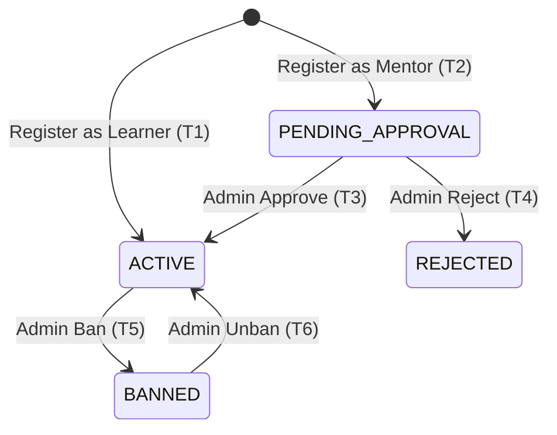
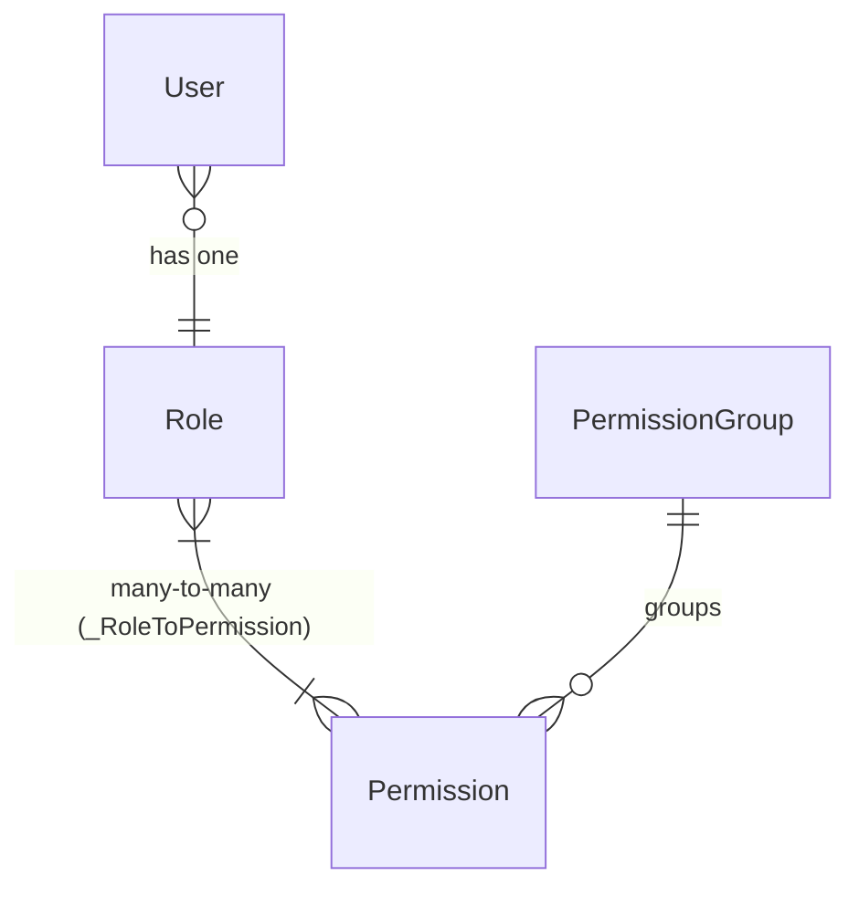

# FL-AUTH — Authentication & Role-Based Access Control

> **Module:** AUTH — Xác thực & Phân quyền
> **Version:** 2.0
> **Last Updated:** 2026-08-31
> **Status:** ✅ Implemented (core) + 🔲 Planned (enhancements)

---

## Liên kết chéo

- Business Flow → [`00-authentication-rbac.md`](../../business-flow/00-authentication-rbac.md)
- Database Schema → [`auth-schema.md`](../../schema/auth-schema.md)
- Source code → `iuroadmap.services/auth/`, `iuroadmap.services/shared/src/enums/permissions.enum.ts`
- Constants → `iuroadmap.services/shared/src/constants/app.constant.ts`
- Flow tổng quan → [`_OVERVIEW.md`](_OVERVIEW.md)

**Quy ước ID:** `FR-AUTH.<sub-flow>.<n>` (vd `FR-AUTH.06.3`). Cột **Ưu tiên**: Must / Should / Could. Cột **Nguồn** truy vết tài liệu gốc.

> **Ngôn ngữ:** mã trạng thái tiếng Anh (`ACTIVE`, `BANNED`,…) + vai trò (`ADMIN`, `LEARNER`,…). Tên bảng/cột = vật lý (`User`, `Role`, `Permission`, `PermissionGroup`).

---

## Bản đồ sub-flow

| FL | Tên sub-flow | Trigger chính | Trạng thái liên quan | Actor | Use case | API chính |
|---|---|---|---|---|---|---|
| **FL-AUTH-00** | Permission Model & State Machine | — | tất cả | Tất cả | — | — |
| **FL-AUTH-01** | Đăng ký Learner | Guest submit form | *(new)* → `ACTIVE` | Guest | UC-AUTH-01 | `POST /auth/register/learner` |
| **FL-AUTH-02** | Đăng ký Mentor | Guest submit form | *(new)* → `PENDING_APPROVAL` | Guest | UC-AUTH-02 | `POST /auth/register/mentor` |
| **FL-AUTH-03** | Đăng nhập (JWT) | Guest submit credentials | — | Guest | UC-AUTH-03 | `POST /auth/login` |
| **FL-AUTH-04** | Quên & Đặt lại mật khẩu | User request reset | — | Authenticated User | UC-AUTH-04 | `POST /auth/forgot-password`, `/reset-password` |
| **FL-AUTH-05** | Đổi mật khẩu (khi đăng nhập) | User muốn đổi pass | — | Authenticated User | UC-AUTH-05 | `POST /auth/change-password` |
| **FL-AUTH-06** | Quản lý Role & Permission Matrix | Admin tạo/sửa role | — | Admin | UC-AUTH-06 | `/iam/Role/*` |
| **FL-AUTH-07** | Quản lý User Directory | Admin CRUD users | Account lifecycle | Admin, Superadmin | UC-AUTH-07 | `/iam/User/*` |
| **FL-AUTH-08** | Duyệt Mentor Application | Admin approve/reject | `PENDING_APPROVAL` → `ACTIVE`/`REJECTED` | Admin | UC-AUTH-08 | `/iam/User/approve`, `/reject` |
| **FL-AUTH-09** | Cấm / Mở khóa User | Admin ban/unban | `ACTIVE` ↔ `BANNED` | Admin | UC-AUTH-09 | `/iam/User/softDelete`, `/unban` |
| **FL-AUTH-10** | Đăng xuất & Session | User click logout | — | Authenticated User | UC-AUTH-10 | `POST /auth/logout` |
| **FL-AUTH-11** | Cross-cutting Auth (Guard, Audit, Profile) | Mọi request | — | System | — | `/auth/me` |

---

## FL-AUTH-00 — Permission Model & Account State Machine

**Mục đích:** Khung trạng thái tài khoản + mô hình phân quyền RBAC điều phối mọi hành động theo vai trò × permission.

**Actor:** tất cả. **Trạng thái:** `ACTIVE, PENDING_APPROVAL, BANNED, REJECTED`.

### Account State Machine



| Transition | From | To | Action | Actor | Business Rule |
|---|---|---|---|---|---|
| T1 | *(new)* | `ACTIVE` | Register as Learner | Guest | BR-AUTH-01 |
| T2 | *(new)* | `PENDING_APPROVAL` | Register as Mentor | Guest | BR-AUTH-01 |
| T3 | `PENDING_APPROVAL` | `ACTIVE` | Approve Mentor | Admin | — |
| T4 | `PENDING_APPROVAL` | `REJECTED` | Reject Mentor | Admin | Mandatory reason |
| T5 | `ACTIVE` | `BANNED` | Ban/Suspend | Admin | BR-AUTH-05 |
| T6 | `BANNED` | `ACTIVE` | Unban | Admin | — |

### RBAC Model



### FR tổng quan

| FR ID | Yêu cầu | Ưu tiên | Nguồn |
|---|---|---|---|
| FR-AUTH.00.1 | Hệ thống PHẢI quản lý trạng thái tài khoản theo đúng state machine 4 trạng thái + 6 transition (T1–T6). Mọi transition không hợp lệ trả `400 BAD_REQUEST` kèm trạng thái hiện tại. | Must | 00-auth §5 |
| FR-AUTH.00.2 | Mỗi `User` có đúng **1 Role** tại mọi thời điểm (FK `User.roleId → Role.id`). | Must | auth-schema |
| FR-AUTH.00.3 | Mỗi `Role` gắn **N permissions** qua bảng many-to-many `_RoleToPermission`. | Must | auth-schema |
| FR-AUTH.00.4 | Mỗi `Permission` thuộc đúng **1 `PermissionGroup`** (FK `Permission.groupId → PermissionGroup.id`). | Must | auth-schema |
| FR-AUTH.00.5 | Trạng thái `BANNED` và `REJECTED` là **blocking**: user không thể đăng nhập, mọi API trả `403 FORBIDDEN`. | Must | BR-AUTH-05 |
| FR-AUTH.00.6 | Permissions được encode vào JWT payload field `permissions[]` dưới dạng mảng string (vd `["RM.USER", "LR.USER"]`). Backend guard kiểm tra permission trước mỗi request. | Must | 00-auth §6, Flow 2 |
| FR-AUTH.00.7 | Frontend decode JWT payload để toggle UI features (ẩn/hiện menu, nút, tab) theo `permissions[]` và `role`. | Must | BR-AUTH-06 |

---

## FL-AUTH-01 — Đăng ký Learner

**Mục đích:** Guest tạo tài khoản Learner, trạng thái mặc định `ACTIVE`, role mặc định `LEARNER`.
**Actor:** Guest. **Transition:** T1 (*(new)* → `ACTIVE`). **API:** `POST /api/v1/auth/register/learner`.

| FR ID | Yêu cầu | Ưu tiên | Nguồn |
|---|---|---|---|
| FR-AUTH.01.1 | Guest gửi form đăng ký với payload `LearnerRegisterRequestDto`: `email` (bắt buộc, format email), `password` (bắt buộc), `confirmPassword` (bắt buộc, phải khớp `password`), `name` (bắt buộc). | Must | UC-AUTH-01, 00-auth Flow 1 |
| FR-AUTH.01.2 | Hệ thống validate: (a) email format hợp lệ; (b) email **unique** trên toàn bảng `User` — nếu trùng trả `"Email already exists"` (`409 CONFLICT`); (c) `password === confirmPassword`. | Must | BR-AUTH-01, EF-01 |
| FR-AUTH.01.3 | Password PHẢI được hash bằng `bcrypt` với work factor **≥ 10** trước khi lưu. Không lưu plaintext. | Must | BR-AUTH-02 |
| FR-AUTH.01.4 | Insert bản ghi `User` với: `status = ACTIVE`, `roleId = <LEARNER role ID>` (lookup `Role.name = 'LEARNER'`), `subscriptionTier = FREE`. | Must | 00-auth Flow 1 |
| FR-AUTH.01.5 | Trả về thông tin user **không chứa password hash** (sanitized response). | Must | security |
| FR-AUTH.01.6 | Nếu Role `LEARNER` chưa tồn tại trong DB → trả lỗi `500 INTERNAL_SERVER_ERROR` (role phải được seed trước). | Must | seed.ts |
| FR-AUTH.01.7 | Password PHẢI đáp ứng policy: tối thiểu **8 ký tự**, chứa ít nhất **1 chữ hoa**, **1 chữ thường**, **1 số**. Không đạt → trả lỗi validation kèm chi tiết vi phạm. | Should | security best practice |

**Alternative Flows:**
- **AF-01** — Email đã tồn tại → `409 "Email already exists"`.
- **AF-02** — Password không match confirm → `400 "Password does not match"`.
- **AF-03** — Fields bắt buộc trống → `400 "Please fill in all required fields"`.

---

## FL-AUTH-02 — Đăng ký Mentor

**Mục đích:** Guest tạo tài khoản Mentor, trạng thái mặc định `PENDING_APPROVAL`, cần Admin duyệt trước khi truy cập Mentor Portal.
**Actor:** Guest. **Transition:** T2 (*(new)* → `PENDING_APPROVAL`). **API:** `POST /api/v1/auth/register/mentor`.

| FR ID | Yêu cầu | Ưu tiên | Nguồn |
|---|---|---|---|
| FR-AUTH.02.1 | Guest gửi form đăng ký Mentor với payload `MentorRegisterRequestDto`: `email`, `password`, `confirmPassword`, `name` + thông tin mentor profile (specializations, bio, experience). | Must | UC-AUTH-02, 00-auth Flow 1 |
| FR-AUTH.02.2 | Validate giống FL-AUTH-01 (email unique, password match, password policy). | Must | BR-AUTH-01 |
| FR-AUTH.02.3 | Insert `User` với `status = PENDING_APPROVAL`, `roleId = <MENTOR role ID>`. Kích hoạt `RegisterMentorSaga` để xử lý thêm mentor profile data. | Must | 00-auth Flow 1 |
| FR-AUTH.02.4 | User `PENDING_APPROVAL` có thể đăng nhập nhưng **KHÔNG thể truy cập Mentor Portal** (gate check: `status === APPROVED`). Chỉ xem được trang chờ duyệt. | Must | FR-MNT-06, 05-mentor §6 |
| FR-AUTH.02.5 | Hệ thống gửi thông báo cho Admin khi có mentor application mới chờ duyệt. | Should | UX |

---

## FL-AUTH-03 — Đăng nhập (JWT Authentication)

**Mục đích:** Xác thực credentials và cấp JWT access token cho user.
**Actor:** Guest. **API:** `POST /api/v1/auth/login`.

| FR ID | Yêu cầu | Ưu tiên | Nguồn |
|---|---|---|---|
| FR-AUTH.03.1 | Guest gửi `email` + `password` qua `POST /api/v1/auth/login`. | Must | UC-AUTH-03, 00-auth Flow 2 |
| FR-AUTH.03.2 | Hệ thống verify: (a) email tồn tại trong bảng `User`; (b) `bcrypt.compare(password, User.password)` = true. Nếu sai → trả `401 "Invalid email or password"` (**không tiết lộ field nào sai** — chống enumeration). | Must | BR-AUTH-03, EF-01 |
| FR-AUTH.03.3 | Kiểm tra `User.status`: nếu `BANNED` → trả `403 "Account has been suspended"`; nếu `REJECTED` → trả `403 "Account application was rejected"`. Chỉ `ACTIVE` và `PENDING_APPROVAL` được đăng nhập. | Must | BR-AUTH-05 |
| FR-AUTH.03.4 | Generate JWT payload chứa: `sub` (user UUID), `userId`, `email`, `role` (tên role), `permissions[]` (mảng mã permission từ `_RoleToPermission`), `iat`, `exp`. | Must | 00-auth Flow 2 |
| FR-AUTH.03.5 | Access token expiry: **24 giờ** (configurable). | Must | BR-AUTH-03 |
| FR-AUTH.03.6 | Trả về response: `{ accessToken: string, user: UserSanitized }`. | Must | 00-auth Flow 2 |
| FR-AUTH.03.7 | Unauthenticated access vào protected route → redirect to Login + `"Please log in to continue"` (`401`). | Must | 00-auth Flow 2, AF-02 |


---

## FL-AUTH-04 — Quên & Đặt lại mật khẩu

**Mục đích:** User quên mật khẩu → nhận mã 6 số qua email → đặt lại mật khẩu mới.
**Actor:** Any User. **API:** `POST /api/v1/auth/forgot-password`, `POST /api/v1/auth/reset-password`.

| FR ID | Yêu cầu | Ưu tiên | Nguồn |
|---|---|---|---|
| FR-AUTH.04.1 | User gửi `email` qua `POST /auth/forgot-password`. Hệ thống generate mã 6 chữ số ngẫu nhiên (`resetPasswordToken`) + set `resetPasswordExpires = now() + 15 phút`. | Must | 00-auth Flow 4 |
| FR-AUTH.04.2 | Gửi email chứa mã 6 số cho user. Nếu email không tồn tại trong DB → **vẫn trả `200 OK`** (không tiết lộ email có tồn tại hay không — chống enumeration). | Must | security |
| FR-AUTH.04.3 | User gửi `{ email, code, newPassword }` qua `POST /auth/reset-password`. | Must | 00-auth Flow 4 |
| FR-AUTH.04.4 | Validate: (a) `resetPasswordToken` khớp; (b) `resetPasswordExpires > now()` (chưa hết hạn); (c) `newPassword` đạt password policy. Nếu token hết hạn → `400 "Reset code has expired"`. | Must | 00-auth Flow 4 |
| FR-AUTH.04.5 | Thành công: hash mật khẩu mới (`bcrypt`), update `User.password`, xóa `resetPasswordToken` + `resetPasswordExpires` (set `null`). | Must | 00-auth Flow 4 |
| FR-AUTH.04.6 | Mỗi lần request forgot-password → **ghi đè** token cũ (chỉ 1 token active tại mọi thời điểm). | Must | security |
| FR-AUTH.04.7 | Rate limit: tối đa **3 lần request forgot-password / email / giờ**. Vượt → `429 "Too many requests"`. | Should | security |

---

## FL-AUTH-05 — Đổi mật khẩu (khi đã đăng nhập)

**Mục đích:** User đang đăng nhập muốn đổi mật khẩu (yêu cầu xác minh mật khẩu cũ).
**Actor:** Authenticated User. **API:** `POST /api/v1/auth/change-password`.

| FR ID | Yêu cầu | Ưu tiên | Nguồn |
|---|---|---|---|
| FR-AUTH.05.1 | User gửi `{ currentPassword, newPassword, confirmNewPassword }` kèm Bearer token. | Must | security |
| FR-AUTH.05.2 | Validate: (a) `bcrypt.compare(currentPassword, User.password)` — sai → `400 "Current password is incorrect"`; (b) `newPassword === confirmNewPassword`; (c) `newPassword` đạt policy; (d) `newPassword ≠ currentPassword` — không dùng lại mật khẩu hiện tại. | Must | security |
| FR-AUTH.05.3 | Thành công: hash + update password, **invalidate tất cả JWT hiện tại** (nếu implement token blacklist), ghi audit log. | Must | security |
| FR-AUTH.05.4 | Trả về `200 OK` + message yêu cầu đăng nhập lại. | Should | UX |

---

## FL-AUTH-06 — Quản lý Role & Permission Matrix ★

**Mục đích:** Admin tạo/sửa/xóa Role và gán Permission cho Role thông qua giao diện Permission Matrix dạng grid nhóm với tickbox.
**Actor:** Admin (yêu cầu permission `ROLE.AD` hoặc `SYS.AD`). **API:** `/api/v1/iam/Role/*`.
**Vị trí UI:** Sidebar → Configuration → Role.
**Tham chiếu UI:** HSEVN Platform (`/config/role_manager`, `/role/create`).

---

### Màn hình 1 — Danh sách Role (SCR-ROLE-LIST)

**Route:** `/config/role_manager`

Admin vào menu **Configuration → Role** ở sidebar trái. Hiển thị bảng danh sách tất cả Role hiện có trong hệ thống.

**Layout:**
- Breadcrumb: `Overview / Configuration / Role`
- Nút **"+ Create new"** (góc phải trên)
- Bảng: cột `No.` (STT) | `Role` (tên role) | `Action` (icon sửa ✏️ + icon xóa 🗑️)

| FR ID | Yêu cầu | Ưu tiên | Nguồn |
|---|---|---|---|
| FR-AUTH.06.1 | Màn hình danh sách Role (`GET /iam/Role/GetByIndex`) hiển thị bảng gồm: STT, tên Role, cột Action (nút sửa + nút xóa). Phân trang nếu > 20 dòng. | Must | 00-auth Flow 3 |
| FR-AUTH.06.2 | Nút **"+ Create new"** ở góc phải trên → điều hướng sang màn tạo Role mới (SCR-ROLE-CREATE). | Must | 00-auth Flow 3 |
| FR-AUTH.06.3 | Nút **sửa** (✏️) trên mỗi dòng → điều hướng sang màn sửa Role (SCR-ROLE-EDIT) với dữ liệu pre-populated. | Must | 00-auth Flow 3 |
| FR-AUTH.06.4 | Nút **xóa** (🗑️) trên mỗi dòng → hiển thị dialog xác nhận trước khi xóa. **Chặn xóa** nếu còn User đang gán role đó → trả `409 "Cannot delete role. {count} users are currently assigned to this role."` | Must | data integrity |
| FR-AUTH.06.5 | **Roles mặc định** (seeded: `SUPERADMIN`, `ADMIN`, `LEARNER`, `MENTOR`) **ẩn nút xóa** (trả `403 "Cannot delete system role"` nếu gọi API trực tiếp). | Must | seed.ts, BR-AUTH-07 |

---

### Màn hình 2 — Tạo / Sửa Role (SCR-ROLE-CREATE / SCR-ROLE-EDIT)

**Route:** `/role/create` (tạo mới) hoặc `/role/edit/:id` (sửa)

Khi Admin bấm **"+ Create new"** hoặc nút sửa (✏️), hệ thống mở màn hình gồm 2 phần:

#### Phần 1 — Nhập tên Role

| FR ID | Yêu cầu | Ưu tiên | Nguồn |
|---|---|---|---|
| FR-AUTH.06.6 | Trường `Role Name` (text input, **bắt buộc**). Tên Role PHẢI **unique** (case-insensitive) trên bảng `Role`. Tạo trùng → `409 "Role name already exists"`. | Must | data integrity |
| FR-AUTH.06.7 | Trường `Description` (text input, optional) — mô tả mục đích của role. | Should | UX |

#### Phần 2 — Permission Matrix (Grid nhóm với tickbox)

Ngay bên dưới phần nhập tên, hiển thị khối **"Permissions"** gồm toàn bộ permissions hệ thống, nhóm theo `PermissionGroup`, trình bày dạng **grid lưới 3 cột** (responsive).

**Layout mỗi nhóm (group card):**
```
☐ Tên Group (PermissionGroup.name)         ← checkbox cha (group header)
    ☐ Permission con 1 (displayName)       ← checkbox con
    ☐ Permission con 2 (displayName)       ← checkbox con
    ☐ Permission con 3 (displayName)       ← checkbox con
```

**Ví dụ thực tế cho IUROADMAP:**
```
┌─────────────────────────────┐  ┌─────────────────────────────┐  ┌─────────────────────────────┐
│ ☐ Quản lý Hệ thống         │  │ ☐ Quản lý Roadmap           │  │ ☐ Đánh giá Giảng viên       │
│   ☐ Quản trị cấu hình      │  │   ☐ Sử dụng Roadmap         │  │   ☐ Xem và đánh giá GV      │
│     (SYS.AD)                │  │     (RM.USER)                │  │     (LR.USER)                │
│                             │  │   ☐ Quản trị Roadmap         │  │   ☐ Quản trị Đánh giá GV    │
│                             │  │     (RM.AD)                  │  │     (LR.AD)                  │
├─────────────────────────────┤  ├─────────────────────────────┤  ├─────────────────────────────┤
│ ☐ Quản lý Người dùng       │  │ ☐ Quản lý Mentor            │  │ ☐ AI Chatbot                │
│   ☐ Xem người dùng         │  │   ☐ Sử dụng Mentor Portal   │  │   ☐ Sử dụng AI Chatbot      │
│     (USER.VIEW)             │  │     (MNT.USER)               │  │     (RAG.USER)               │
│   ☐ Quản lý Users          │  │   ☐ Quản trị Mentor          │  │   ☐ Quản trị AI Chatbot     │
│     (USER.AD)               │  │     (MNT.AD)                 │  │     (RAG.AD)                 │
│   ☐ Quản trị Role          │  │                             │  │                             │
│     (ROLE.AD)               │  │                             │  │                             │
└─────────────────────────────┘  └─────────────────────────────┘  └─────────────────────────────┘
```

| FR ID | Yêu cầu | Ưu tiên | Nguồn |
|---|---|---|---|
| FR-AUTH.06.8 | Permission Matrix PHẢI hiển thị dạng **grid lưới** (mặc định 3 cột, responsive xuống 2 hoặc 1 cột trên màn hình nhỏ). Mỗi ô trong grid = 1 **group card** đại diện cho 1 `PermissionGroup`. | Must | HSEVN ref |
| FR-AUTH.06.9 | Mỗi group card gồm: (a) **checkbox cha** (group header) kèm tên group (`PermissionGroup.name`), (b) danh sách **checkbox con** cho từng `Permission` thuộc group đó (hiển thị `displayName`). | Must | HSEVN ref |
| FR-AUTH.06.10 | **Hành vi checkbox cha (group):** khi tick checkbox group → **tự động tick TẤT CẢ checkbox con** trong group đó. Khi bỏ tick checkbox group → **bỏ tick tất cả con**. | Must | yêu cầu user |
| FR-AUTH.06.11 | **Hành vi checkbox con → cha:** khi tất cả checkbox con trong group đều được tick → checkbox cha tự động chuyển thành ☑ (checked). Khi ít nhất 1 con được tick nhưng không phải tất cả → checkbox cha hiển thị trạng thái **indeterminate** (▣ — nửa tick). Khi không có con nào được tick → checkbox cha = ☐ (unchecked). | Must | UX best practice |
| FR-AUTH.06.12 | Dữ liệu Permission Matrix load từ API `GET /iam/Role/GetAllPermission` trả về cấu trúc: `{ groups: [{ id, name, permissions: [{ id, name, displayName }] }] }` — đã nhóm sẵn theo `PermissionGroup`. | Must | 00-auth Flow 3 |
| FR-AUTH.06.13 | Khi **sửa Role**: matrix pre-populate các checkbox đã tick dựa trên permissions hiện tại của role (từ `GET /iam/Role/getById/:id`). | Must | 00-auth Flow 3 |

#### Phần 3 — Lưu Role

| FR ID | Yêu cầu | Ưu tiên | Nguồn |
|---|---|---|---|
| FR-AUTH.06.14 | Nút **"Lưu" / "Save"** gửi `POST /iam/Role/create` (tạo mới) hoặc `POST /iam/Role/update` (sửa) với payload: `{ name, description, permissionIds: string[] }` — mảng ID các permissions đã tick. | Must | 00-auth Flow 3 |
| FR-AUTH.06.15 | Validate trước khi lưu: (a) `name` không trống; (b) `name` unique; (c) ít nhất **1 permission** được chọn. Nếu vi phạm → hiển thị lỗi inline tại trường tương ứng, không submit. | Must | validation |
| FR-AUTH.06.16 | Lưu thành công → redirect về danh sách Role (SCR-ROLE-LIST) + hiển thị toast thông báo "Role created successfully" / "Role updated successfully". | Must | UX |
| FR-AUTH.06.17 | Thay đổi permissions của role reflect trong JWT payload ở **lần login kế tiếp** của user có role đó (JWT không tự update realtime). | Must | 00-auth Flow 3 |
| FR-AUTH.06.18 | Nút **"Hủy" / "Cancel"** → redirect về danh sách Role không lưu thay đổi. Nếu có thay đổi chưa lưu → hiển thị dialog xác nhận "Bạn có muốn thoát? Thay đổi chưa được lưu." | Should | UX |

---

### Permission Catalog (full)

Dữ liệu seeded vào bảng `PermissionGroup` + `Permission`:

| Group (`PermissionGroup.name`) | Code (`Permission.name`) | Display Name (`Permission.displayName`) | Trạng thái |
|---|---|---|---|
| **SYSTEM_MANAGEMENT** | `SYS.AD` | Quản trị cấu hình hệ thống | ✅ Có |
| **ROADMAP_MANAGEMENT** | `RM.USER` | Sử dụng Roadmap (Explore, Clone) | ✅ Có |
| **ROADMAP_MANAGEMENT** | `RM.AD` | Quản trị Roadmap (CRUD Departments, Majors, Courses) | ✅ Có |
| **LECTURER_REVIEW_MANAGEMENT** | `LR.USER` | Xem và đánh giá Giảng viên | ✅ Có |
| **LECTURER_REVIEW_MANAGEMENT** | `LR.AD` | Quản trị Đánh giá Giảng viên (moderate, CRUD lecturers) | ✅ Có |
| **USER_MANAGEMENT** | `USER.VIEW` | Xem danh sách người dùng (read-only) | 🆕 Mới |
| **USER_MANAGEMENT** | `USER.AD` | Quản lý Users (CRUD, ban, approve mentor) | ✅ Có |
| **USER_MANAGEMENT** | `ROLE.AD` | Quản trị Role & Permission (tạo/sửa/xóa role, gán permission) | 🆕 Mới |
| **MENTOR_MANAGEMENT** | `MNT.USER` | Sử dụng Mentor Portal (inbox, chat, calendar) | 🆕 Mới |
| **MENTOR_MANAGEMENT** | `MNT.AD` | Quản trị Mentor (duyệt applications, quản lý profiles) | 🆕 Mới |
| **AI_CHATBOT** | `RAG.USER` | Sử dụng AI Chatbot (hỏi đáp) | 🆕 Mới |
| **AI_CHATBOT** | `RAG.AD` | Quản trị AI Chatbot (re-index, config, analytics) | 🆕 Mới |

### Default Roles (Seeded)

| Role Name | Permissions (mặc định) | Có thể xóa? | Có thể sửa permissions? |
|---|---|---|---|
| `SUPERADMIN` | **ALL** (tất cả permissions) | ❌ | ❌ (luôn full) |
| `ADMIN` | Tất cả permissions | ❌ | ✅ |
| `LEARNER` | `RM.USER`, `LR.USER`, `RAG.USER` | ❌ | ✅ |
| `MENTOR` | `RM.USER`, `LR.USER`, `MNT.USER`, `RAG.USER` | ❌ | ✅ |

### FR bổ sung — Quy tắc nghiệp vụ

| FR ID | Yêu cầu | Ưu tiên | Nguồn |
|---|---|---|---|
| FR-AUTH.06.19 | Admin không thể **sửa permissions của role `SUPERADMIN`** (luôn full). Trên UI: matrix hiển thị read-only (tất cả tick, disabled) khi xem/sửa SUPERADMIN. | Should | security |
| FR-AUTH.06.20 | API `GET /iam/Role/ForDropdown` trả danh sách roles rút gọn (`id`, `name`) cho dropdown khi tạo/sửa User (FL-AUTH-07). | Must | 00-auth Flow 3 |
| FR-AUTH.06.21 | Hệ thống chỉ sử dụng Base CRUD (`createdAt`, `updatedAt`, `createdBy`, `updatedBy`) để lưu vết người tạo và người chỉnh sửa cuối cùng khi quản lý Role. Không cần lưu lại lịch sử chi tiết. | Should | audit |

---

## FL-AUTH-07 — Quản lý User Directory

**Mục đích:** Admin tạo, sửa, xem, xóa (soft/hard) tài khoản người dùng và gán Role.
**Actor:** Admin (permission `USER.AD`), Superadmin. **API:** `/api/v1/iam/User/*`.

| FR ID | Yêu cầu | Ưu tiên | Nguồn |
|---|---|---|---|
| FR-AUTH.07.1 | Admin truy cập màn "Quản lý User" (`GET /iam/User/GetByIndex`): danh sách users với phân trang, hiển thị: name, email, role (badge), status (badge màu), `createdAt`. Hỗ trợ tìm kiếm theo name/email, lọc theo role, status. | Must | 00-auth Flow 5 |
| FR-AUTH.07.2 | Admin xem chi tiết User (`GET /iam/User/getById/:id`): thông tin đầy đủ + role hiện tại + danh sách permissions (inherited từ role) + trạng thái + subscription tier + `createdAt`/`updatedAt`. | Must | 00-auth Flow 5 |
| FR-AUTH.07.3 | Admin **tạo User thủ công** (`POST /iam/User/create`): nhập `email` (unique), `name`, `password` (auto-generate hoặc nhập), **chọn Role từ dropdown** (dữ liệu từ `GET /iam/Role/ForDropdown`), `status` (mặc định `ACTIVE`). Hệ thống hash password + insert `User`. | Must | 00-auth Flow 5 |
| FR-AUTH.07.4 | Admin **sửa User** (`POST /iam/User/update`): cập nhật `name`, **đổi Role** (dropdown), `subscriptionTier`. **Không cho sửa email** (immutable). Đổi role → permissions thay đổi ở lần login kế tiếp. | Must | 00-auth Flow 5 |
| FR-AUTH.07.5 | Admin **soft-delete (Ban)** (`POST /iam/User/softDelete/:id`): chuyển `status = BANNED`. JWT hiện tại của user bị chặn ngay lập tức (middleware check `status` on every request, hoặc token blacklist). | Must | BR-AUTH-05, 00-auth Flow 5 |
| FR-AUTH.07.6 | Superadmin **hard-delete** (`POST /iam/User/delete/:id`): xóa vĩnh viễn User + cascade xóa: `user_roadmaps`, `user_course_progress`, tokens, mentor profiles, reviews. **Chỉ Superadmin** (role check). | Must | BR-CFG-05, 00-auth Flow 5 |
| FR-AUTH.07.7 | Admin **KHÔNG THỂ** xóa/downgrade/ban **chính mình** → trả `403 "Cannot modify your own account"`. | Must | BR-CFG-03 |
| FR-AUTH.07.8 | Admin **KHÔNG THỂ** sửa/xóa tài khoản có role `SUPERADMIN` (Không có ngoại lệ) → trả `403 "Insufficient privileges"`. | Must | security |
| FR-AUTH.07.9 | Hệ thống chỉ sử dụng Base CRUD (`updatedAt`, `updatedBy`) để lưu vết người chỉnh sửa cuối cùng khi tạo user, sửa user, ban/unban user. | Should | audit |

---

## FL-AUTH-08 — Duyệt Mentor Application

**Mục đích:** Admin review và approve/reject mentor đăng ký mới.
**Actor:** Admin. **Transition:** T3 (`PENDING_APPROVAL → ACTIVE`), T4 (`PENDING_APPROVAL → REJECTED`).

| FR ID | Yêu cầu | Ưu tiên | Nguồn |
|---|---|---|---|
| FR-AUTH.08.1 | Admin xem danh sách mentor applications đang chờ duyệt (filter `User.status = PENDING_APPROVAL AND User.role.name = MENTOR`). Hiển thị: name, email, ngày đăng ký, mentor profile preview. | Must | 04-config Flow, UC-C02 |
| FR-AUTH.08.2 | Admin xem chi tiết mentor application: thông tin cá nhân + mentor profile (specializations, bio, experience, credentials). | Must | 04-config |
| FR-AUTH.08.3 | Admin **Approve**: `status = PENDING_APPROVAL → ACTIVE` (T3). Mentor có thể truy cập Mentor Portal. Gửi notification cho mentor "Đơn đăng ký đã được duyệt". | Must | 00-auth §5, T3 |
| FR-AUTH.08.4 | Admin **Reject**: **lý do bắt buộc** (`rejectionReason` — không cho trống) → `status = PENDING_APPROVAL → REJECTED` (T4). Gửi notification cho mentor kèm lý do. | Must | BR-CFG-06, T4 |
| FR-AUTH.08.5 | User `REJECTED` **không thể** đăng nhập (chặn ở FL-AUTH-03). Muốn thử lại → phải đăng ký tài khoản mới. | Must | state machine |
| FR-AUTH.08.6 | Sử dụng trường Base CRUD (`updatedAt`, `updatedBy`) để lưu vết người duyệt/từ chối cuối cùng. Lịch sử duyệt chi tiết không bắt buộc. | Should | audit |

---

## FL-AUTH-09 — Cấm / Mở khóa User

**Mục đích:** Admin tạm cấm user vi phạm, hoặc mở khóa khi vấn đề đã giải quyết.
**Actor:** Admin. **Transition:** T5 (`ACTIVE → BANNED`), T6 (`BANNED → ACTIVE`).

| FR ID | Yêu cầu | Ưu tiên | Nguồn |
|---|---|---|---|
| FR-AUTH.09.1 | Admin **Ban** user: `ACTIVE → BANNED` (T5). **Lý do ban tùy chọn** (recommended nhưng không bắt buộc). JWT hiện tại của user bị invalidate **ngay lập tức**. | Must | BR-AUTH-05, T5 |
| FR-AUTH.09.2 | Invalidation tức thời: middleware trên mọi protected route PHẢI check `User.status` từ DB (hoặc cache invalidation) — nếu `BANNED` → trả `403 "Account has been suspended"` kể cả JWT chưa hết hạn. | Must | BR-AUTH-05 |
| FR-AUTH.09.3 | Admin **Unban** user: `BANNED → ACTIVE` (T6). User có thể đăng nhập lại bình thường. | Must | T6 |
| FR-AUTH.09.4 | Badge status trên UI theo quy ước: `ACTIVE` = xanh lá, `PENDING_APPROVAL` = vàng, `BANNED` = đỏ, `REJECTED` = xám. | Should | UX |
| FR-AUTH.09.5 | Sử dụng trường Base CRUD (`updatedAt`, `updatedBy`) để lưu vết người Ban/Unban cuối cùng. | Should | audit |

---

## FL-AUTH-10 — Đăng xuất & Session Management

**Mục đích:** User đăng xuất an toàn; quản lý phiên đăng nhập.
**Actor:** Authenticated User. **API:** `POST /api/v1/auth/logout`.

| FR ID | Yêu cầu | Ưu tiên | Nguồn |
|---|---|---|---|
| FR-AUTH.10.1 | User gửi `POST /auth/logout` kèm Bearer token. Hệ thống xử lý đăng xuất (clear token ở client side). | Must | 00-auth Flow, §3.1 |
| FR-AUTH.10.2 | Client-side: xóa access token khỏi localStorage/cookie, redirect về trang Login. | Must | frontend |
| FR-AUTH.10.3 | Server-side token blacklist (optional): nếu implement → thêm token vào blacklist với TTL = remaining expiry time. Mọi request kèm blacklisted token → `401`. | Could | security enhancement |
| FR-AUTH.10.4 | (Đã lược bỏ yêu cầu Audit Log đăng xuất để đơn giản hóa hệ thống). | Could | audit |

---

## FL-AUTH-11 — Cross-cutting Auth (Guard, Audit, Profile)

**Mục đích:** Các concern áp dụng xuyên suốt mọi flow: auth guard, permission check, audit log, profile management.
**Actor:** System, Authenticated User.

### Auth Guard & Permission Check

| FR ID | Yêu cầu | Ưu tiên | Nguồn |
|---|---|---|---|
| FR-AUTH.11.1 | **JWT Auth Guard** PHẢI được áp dụng trên **mọi protected route** (tất cả trừ register, login, forgot/reset password). Guard validate: (a) token present; (b) signature valid; (c) not expired; (d) user status ≠ `BANNED`/`REJECTED`. | Must | 00-auth §3.1 |
| FR-AUTH.11.2 | **Permission Guard** kiểm tra `permissions[]` trong JWT payload match required permission cho endpoint. Không đủ quyền → `403 "Insufficient permissions"`. | Must | 00-auth §3.2, RBAC |
| FR-AUTH.11.3 | `SUPERADMIN` **short-circuit** permission check: luôn pass mọi permission guard. | Must | security |
| FR-AUTH.11.4 | JWT payload bị tamper (signature invalid) → `401 "Invalid token"`. | Must | security |

### User Profile

| FR ID | Yêu cầu | Ưu tiên | Nguồn |
|---|---|---|---|
| FR-AUTH.11.5 | `GET /api/v1/auth/me` trả về profile user hiện tại dựa trên JWT: `id`, `email`, `name`, `role` (name + permissions list), `status`, `subscriptionTier`, `createdAt`. **Không trả password hash**. | Must | 00-auth §3.1 |
| FR-AUTH.11.6 | `PUT /api/v1/auth/me` (hoặc `POST /auth/update-profile`) cho phép user cập nhật: `name`, `avatar` (upload file). **Không cho sửa email, role, status** (chỉ admin sửa). | Should | UX |
| FR-AUTH.11.7 | `GET /api/v1/auth/:id` trả thông tin user bằng ID (public profile — limited fields: `id`, `name`, `role.name`). | Should | 00-auth §3.1 |

### Basic Tracking (Base CRUD)

| FR ID | Yêu cầu | Ưu tiên | Nguồn |
|---|---|---|---|
| FR-AUTH.11.8 | Hệ thống lược bỏ tính năng Audit Log phức tạp. Thay vào đó, áp dụng chuẩn **Base Entity** (`createdAt`, `updatedAt`, `createdBy`, `updatedBy`) cho tất cả các bảng chính (`Role`, `User`) để theo dõi thông tin người cập nhật cuối cùng. | Must | simplicity |

### Error Handling

| FR ID | Yêu cầu | Ưu tiên | Nguồn |
|---|---|---|---|
| FR-AUTH.11.11 | Chuẩn lỗi API cho Auth: `{ statusCode: number, message: string, field?: string }`. | Must | convention |
| FR-AUTH.11.12 | Validation errors trả `400` kèm array lỗi: `{ errors: [{ field: string, message: string }] }`. | Must | convention |
| FR-AUTH.11.13 | Mọi response lỗi **KHÔNG tiết lộ** internal stack trace ở production. | Must | security |

---

## Business Rules tổng hợp

| Rule ID | Rule | Liên quan |
|---|---|---|
| **BR-AUTH-01** | Email unique across platform (case-insensitive). | FR-AUTH.01.2, FR-AUTH.02.2 |
| **BR-AUTH-02** | Password hash bcrypt work factor ≥ 10. | FR-AUTH.01.3 |
| **BR-AUTH-03** | Access token expiry: 24h. | FR-AUTH.03.5 |
| **BR-AUTH-04** | Admin/Superadmin role KHÔNG thể đăng ký công khai — chỉ Admin tạo qua IAM. | FR-AUTH.07.3 |
| **BR-AUTH-05** | `BANNED` status → immediate JWT invalidation (middleware check). | FR-AUTH.09.2 |
| **BR-AUTH-06** | Frontend decode JWT payload để toggle UI features. | FR-AUTH.00.7 |
| **BR-AUTH-07** | Roles mặc định (SUPERADMIN, ADMIN, LEARNER, MENTOR) không cho xóa. | FR-AUTH.06.9 |
| **BR-AUTH-08** | Admin không thể xóa/modify chính mình. | FR-AUTH.07.7 |
| **BR-AUTH-09** | Password policy: ≥ 8 chars, 1 uppercase, 1 lowercase, 1 digit. | FR-AUTH.01.7 |
| **BR-AUTH-10** | Account lockout: 5 failed attempts → 15 min lock. | FR-AUTH.03.8 |
| **BR-AUTH-11** | Forgot-password token: 6-digit, 15 min expiry, 1 active at a time. | FR-AUTH.04.1, FR-AUTH.04.6 |
| **BR-AUTH-12** | Reject mentor requires mandatory reason. | FR-AUTH.08.4 |

---

## Ma trận truy vết (sub-flow ↔ transition ↔ API ↔ use case)

| Sub-flow | Transition | API chính | Use case | BR chính |
|---|---|---|---|---|
| FL-AUTH-01 | T1 | `POST /auth/register/learner` | UC-AUTH-01 | BR-01, 02, 09 |
| FL-AUTH-02 | T2 | `POST /auth/register/mentor` | UC-AUTH-02 | BR-01, 02, 09 |
| FL-AUTH-03 | — | `POST /auth/login` | UC-AUTH-03 | BR-03, 05, 06, 10 |
| FL-AUTH-04 | — | `POST /auth/forgot-password`, `/reset-password` | UC-AUTH-04 | BR-02, 11 |
| FL-AUTH-05 | — | `POST /auth/change-password` | UC-AUTH-05 | BR-02, 09 |
| FL-AUTH-06 | — | `/iam/Role/*` | UC-AUTH-06 | BR-04, 07 |
| FL-AUTH-07 | T1–T6 (indirect) | `/iam/User/*` | UC-AUTH-07 | BR-04, 08 |
| FL-AUTH-08 | T3, T4 | approve/reject mentor | UC-AUTH-08 | BR-12 |
| FL-AUTH-09 | T5, T6 | softDelete, unban | UC-AUTH-09 | BR-05 |
| FL-AUTH-10 | — | `POST /auth/logout` | UC-AUTH-10 | — |
| FL-AUTH-11 | mọi | `/auth/me`, guard middleware | — | BR-03, 05, 06 |

---

## Phụ lục — Default Seeded Data

### Roles

| Role Name | Permissions (default) |
|---|---|
| `SUPERADMIN` | **ALL** (full access, short-circuit guard) |
| `ADMIN` | `SYS.AD`, `RM.USER`, `RM.AD`, `LR.USER`, `LR.AD`, `USER.AD`, `ROLE.AD`, `MNT.USER`, `MNT.AD`, `RAG.USER`, `RAG.AD` |
| `LEARNER` | `RM.USER`, `LR.USER`, `RAG.USER` |
| `MENTOR` | `RM.USER`, `LR.USER`, `MNT.USER`, `RAG.USER` |

### Permission Groups

| Group Name | Description |
|---|---|
| `SYSTEM_MANAGEMENT` | System configuration and settings |
| `ROADMAP_MANAGEMENT` | Academic roadmaps: browse, clone, CRUD |
| `LECTURER_REVIEW_MANAGEMENT` | Lecturer profiles, reviews, moderation |
| `USER_MANAGEMENT` | User accounts, roles, permissions |
| `MENTOR_MANAGEMENT` | Mentor portal, applications, profiles |
| `AI_CHATBOT` | AI chatbot RAG, conversations, analytics |
