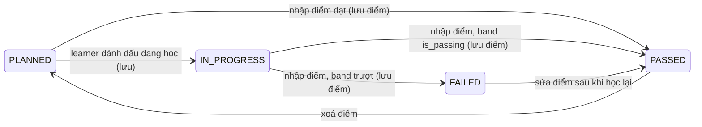
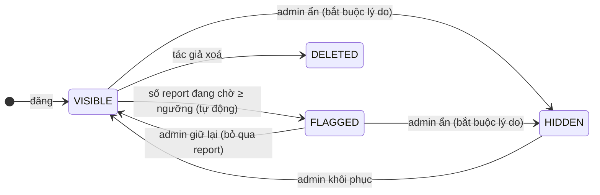

# FL-LRN — Learner Portal (v2: My Roadmap cá nhân hoá + Kết quả học tập)

> **Module:** LEARNER — Cổng thông tin sinh viên
> **Version:** 3.0 (Roadmap v2)
> **Last Updated:** 2026-09-26
> **Status:** 🔲 Planned (v2). Backend learner của v1 đã bị gỡ khỏi gateway trong refactor `5acc76f5` (design G7).

---

## Liên kết chéo

- Business Flow → [`01-learner-portal.md`](../../business-flow/01-learner-portal.md)
- Thiết kế & phân tích → [`roadmap-v2-design.md`](../../architecture/roadmap-v2-design.md)
- Database Schema → [`roadmap-schema.md`](../../schema/roadmap-schema.md) (phần `STUDENT_*`)
- Phía admin → [`FL-RDM-roadmap-management.md`](FL-RDM-roadmap-management.md)
- Source code → `iuroadmap.services/roadmap-service/` (module mới `student-roadmap`), `iuroadmap.webapp/apps/web/src/views/roadmap/`
- Flow tổng quan → [`_OVERVIEW.md`](_OVERVIEW.md)

**Quy ước ID:** `FR-LRN.<sub-flow>.<n>`. "Ảnh 1" là sơ đồ CTĐT; "Ảnh 2" là bảng điểm HK1 2025-2026; "Ảnh 3" là bảng điểm HK1–HK2 2023-2024 (có môn tiếng Anh tăng cường chấm P).

> **Tóm tắt thay đổi so với v1:**
> - Clone chỉ ghi **1 dòng**, không còn nhân bản node và tiến độ.
> - Learner được **sửa cấu trúc theo kiểu chỉ thêm và dời**: dời node qua các kỳ, thêm node, thêm edge, chèn kỳ. **Không xoá** node hay edge của CTĐT. Hệ thống **chỉ lưu phần khác** so với CTĐT.
> - Bấm tiêu đề học kỳ để **nhập điểm**; GPA học kỳ, GPA tích luỹ và xếp loại được tính tự động.
> - Learner clone CTĐT của **một năm** bất kỳ đang public (mặc định là năm của khoá mình).
> - Quan hệ giữa môn (prerequisite, previous, co-req) ở phía learner **chỉ để hiển thị và gợi ý**, không chặn thao tác nào. Bỏ trạng thái `LOCKED`/`AVAILABLE`.

---

## Bản đồ sub-flow

| FL | Tên sub-flow | Trigger chính | Actor | API chính |
|---|---|---|---|---|
| **FL-LRN-00** | Mô hình Student Roadmap & trạng thái node | — | Tất cả | — |
| **FL-LRN-01** | Lọc & Preview CTĐT | Lọc theo khoa / ngành / năm | Guest, Learner | `GET /explore/roadmaps`, `GET /explore/roadmaps/:majorSlug` |
| **FL-LRN-02** | Clone roadmap | Bấm "Clone to My Roadmap" | Learner | `POST /student-roadmaps/clone` |
| **FL-LRN-03** | My Roadmap (merged view) | Mở roadmap cá nhân | Learner | `GET /student-roadmaps/my`, `GET /student-roadmaps/:id` |
| **FL-LRN-04** | Cá nhân hoá cấu trúc | Chế độ chỉnh sửa | Learner | `POST /student-roadmaps/:id/changes`, `/reset` |
| **FL-LRN-05** | Nhập kết quả học kỳ | Bấm tiêu đề học kỳ | Learner | `GET/POST /student-roadmaps/:id/terms/:termKey/results[/save]` |
| **FL-LRN-06** | GPA, tín chỉ & tiến độ | Mỗi lần đọc | System | (nằm trong merged view) |
| **FL-LRN-07** | Nâng lên version CTĐT mới | Banner "Có CTĐT mới" | Learner | `GET .../upgrade-preview`, `POST .../upgrade` |
| **FL-LRN-08** | Micro learning (topics theo năm học) | Tab "Nội dung" của trang môn | Guest, Learner | `GET /explore/courses/:courseId/topics?academicYear=` |
| **FL-LRN-09** | Drop / Re-activate | Learner ngừng hoặc tiếp tục | Learner | `POST .../drop`, `POST .../reactivate` |
| **FL-LRN-10** | Bình luận môn học | Mở trang môn → tab "Bình luận" | Guest (đọc), Learner | `GET /explore/courses/:courseId/comments`, `POST /course-comments/*` |
| **FL-LRN-11** | Tra cứu môn học (Course Explorer) | Menu Explore → "Môn học" | Guest, Learner | `GET /explore/courses`, `GET /explore/courses/:courseId?academicYear=` |

---

## FL-LRN-00 — Mô hình Student Roadmap & trạng thái node

**Mục đích:** Roadmap cá nhân = **CTĐT của một năm (base, bất biến)** + **overlay** (chỉ phần learner đổi) + **kết quả học tập**, được ghép khi đọc (design §6).

| FR ID | Yêu cầu | Ưu tiên | Nguồn |
|---|---|---|---|
| FR-LRN.00.1 | Student roadmap tham chiếu đúng 1 CTĐT (`ROADMAP_VERSIONS`) `PUBLISHED` hoặc `ARCHIVED`. Cấu trúc hiển thị = base ⊕ overlay (thuật toán ở design §6.3). | Must | R5 |
| FR-LRN.00.2 | Trạng thái node: có điểm thì `PASSED`/`FAILED` (tra `GRADE_SCALES`); có kết quả `IN_PROGRESS` thì `IN_PROGRESS`; còn lại là `PLANNED`. **Chỉ** `IN_PROGRESS` và điểm được lưu. Quan hệ giữa môn **không** ảnh hưởng trạng thái: learner được đánh dấu đang học hoặc nhập điểm cho bất kỳ môn nào (BR-LRN-01). | Must | BR-LRN-01, BR-LRN-02 |
| FR-LRN.00.3 | Màu node: `PASSED` xanh lá, `IN_PROGRESS` vàng, `PLANNED` theo màu nhóm môn (FR-RDM.03.4), `FAILED` đỏ. Slot chưa điền có viền đứt. Node do learner tự thêm có badge "Của tôi"; node base đã bị dời có badge "Đã chỉnh". | Must | v1 color coding |
| FR-LRN.00.4 | **Gợi ý** kế hoạch (chỉ hiển thị, không chặn, tách riêng khỏi trạng thái node): môn đứng trước môn tiên quyết của nó; môn tiên quyết `FAILED` nhưng môn phụ thuộc vẫn nằm ở kỳ sau; quan hệ tạo vòng; tổng tín chỉ kế hoạch < `total_credits`. Mỗi gợi ý có icon ⚠ trên node và dòng trong panel *Gợi ý*; learner có thể ẩn panel. | Must | BR-LRN-12 |

---

## FL-LRN-01 — Browse & Preview CTĐT

**Actor:** Guest, Learner. **API:**
- `GET /explore/roadmaps?departmentId=&majorId=&cohortYear=&keyword=&page=`: danh sách CTĐT đang `PUBLISHED`, mỗi thẻ là một cặp (ngành, năm).
- `GET /explore/roadmaps/:majorSlug?cohortYear=`: canvas chỉ đọc của CTĐT năm đó.

| FR ID | Yêu cầu | Ưu tiên | Nguồn |
|---|---|---|---|
| FR-LRN.01.1 | **Lọc CTĐT** theo **khoa**, **ngành** (lọc theo khoa đã chọn), **năm** (`cohort_year`) và từ khoá (tên/slug ngành). Mỗi thẻ kết quả: tên ngành, khoa, năm, `total_credits`, số môn, số learner đang theo. Bộ lọc được giữ trên URL để chia sẻ được. | Must | v1, yêu cầu 2026-09-26 |
| FR-LRN.01.2 | Preview CTĐT dùng **đúng bố cục theo học kỳ** của canvas admin (FR-RDM.05.1–05.3) ở chế độ chỉ đọc, có chú thích 3 loại quan hệ và chú thích màu nhóm môn. | Must | Ảnh 1 |
| FR-LRN.01.3 | Mở một ngành mà chưa chọn năm thì hiển thị năm mới nhất đang `PUBLISHED`; trên trang preview có dropdown **Năm** để chuyển. Năm chỉ còn bản `ARCHIVED` bị ẩn. | Must | FR-RDM.04.6 |
| FR-LRN.01.4 | Guest xem được mà không cần đăng nhập. | Must | v1 |
| FR-LRN.01.5 | Click node trong preview mở **trang môn học** (FL-LRN-11) ở dạng panel, với năm học ước tính cho kỳ đó của khoá (FR-LRN.11.6). | Should | FL-LRN-11 |

---

## FL-LRN-02 — Clone roadmap

**Mục đích:** Tạo roadmap cá nhân **không nhân bản dữ liệu**.
**Actor:** Learner (`RM.USER`). **API:** `POST /student-roadmaps/clone` với body `{ roadmapId, versionId }`.

| FR ID | Yêu cầu | Ưu tiên | Nguồn |
|---|---|---|---|
| FR-LRN.02.1 | Guest bấm Clone → chuyển tới Login với thông báo "Please log in to continue", đăng nhập xong quay lại trang preview. | Must | v1 UC-05 |
| FR-LRN.02.2 | `versionId` phải là CTĐT `PUBLISHED` của `roadmapId` (của bất kỳ năm nào); nếu không → `400`. | Must | FR-RDM.04.6 |
| FR-LRN.02.3 | Mỗi learner có 1 roadmap cho mỗi ngành. Clone lần hai → `409 ALREADY_CLONED` kèm `studentRoadmapId`. Nếu roadmap cũ đang `DROPPED` thì gợi ý Re-activate (FL-LRN-09). | Must | BR-LRN-03 |
| FR-LRN.02.4 | Clone chỉ insert **1 dòng** `STUDENT_ROADMAPS` (`status = ENROLLED`, `revision = 0`). **Không** tạo node, edge hay progress. | Must | R5, BR-LRN-06 |
| FR-LRN.02.5 | Gợi ý mặc định là CTĐT có `cohort_year` bằng khoá của learner, nếu năm đó chưa có thì là năm mới nhất. Learner được chọn năm khác (ví dụ sinh viên bảo lưu theo CTĐT khoá sau). | Should | design §5 |
| FR-LRN.02.6 | Thành công → `201` kèm `studentRoadmapId`, rồi chuyển tới My Roadmap. | Must | — |
| FR-LRN.02.7 | **Clone lại sau khi xoá:** nếu learner đã xoá hẳn roadmap (FR-LRN.09.3) thì clone lại được, miễn là CTĐT năm đó còn `PUBLISHED`. Roadmap mới là CTĐT gốc; phần chỉnh sửa và điểm cũ **không** khôi phục được. Vì vậy UI ưu tiên **Drop** (giữ dữ liệu) thay cho xoá hẳn. | Must | Yêu cầu 2026-09-26 |

---

## FL-LRN-03 — My Roadmap (merged view)

**Actor:** Learner (chủ sở hữu). **API:**
- `GET /student-roadmaps/my`: danh sách roadmap với tên ngành, năm CTĐT, % tiến độ, tín chỉ đạt / yêu cầu, GPA tích luỹ, status.
- `GET /student-roadmaps/:id`: merged view gồm `terms[]` (có tổng hợp học kỳ), `nodes[]` (status, origin, isModified, result), `edges[]` (origin), `warnings[]`, `summary`, `revision`.

| FR ID | Yêu cầu | Ưu tiên | Nguồn |
|---|---|---|---|
| FR-LRN.03.1 | Chỉ chủ sở hữu được truy cập (`user_id` lấy từ JWT qua `@CurrentUser`); người khác nhận `403`. | Must | BR-LRN-14 |
| FR-LRN.03.2 | Canvas dùng cùng bố cục học kỳ với admin, node căn giữa cột (FR-RDM.05.2). | Must | R1, R2 |
| FR-LRN.03.3 | Tiêu đề mỗi cột (**bấm được**): `Semester n · HK1 2025-2026 · 20 TC · GPA 3.45`. Nhãn năm học lấy từ overlay; GPA chỉ hiện khi kỳ đã có điểm. Bấm vào mở bảng điểm (FL-LRN-05). | Must | R4, Ảnh 2 |
| FR-LRN.03.4 | Thanh tổng quan: **tín chỉ đạt / `total_credits`** (ví dụ `98 / 140 TC`), % tiến độ, GPA tích luỹ (hệ 100 và hệ 4), xếp loại. Learner học vượt thì hiển thị đúng số thật, ví dụ `145 / 140 TC · 103%` (FR-LRN.06.3). | Must | Ảnh 2 |
| FR-LRN.03.5 | Hover node hiện code, tên, `(LT,TH)`, trạng thái, điểm nếu có. Click node mở panel bên gồm kết quả của learner và **trang môn học** (FL-LRN-11) của đúng năm học mà learner học môn đó (FR-LRN.11.6): thông tin cho sinh viên, giảng viên, project, topic, bình luận. | Must | v1 UC-07 |
| FR-LRN.03.6 | Dashboard hiển thị danh sách "My Roadmaps"; không có roadmap nào thì hiện nút "Explore Majors". | Must | v1 UC-06 |

---

## FL-LRN-04 — Cá nhân hoá cấu trúc

**Mục đích:** Learner sửa kế hoạch cho khớp học kỳ thực tế (ví dụ Ảnh 2: IT153 ở HK2 của CTĐT nhưng thực tế học ở HK1 2025-2026). Hệ thống **chỉ ghi phần khác**.
**Actor:** Learner (chủ sở hữu). **API:**
- `POST /student-roadmaps/:id/changes` với body `{ revision, ops[] }`
- `POST /student-roadmaps/:id/reset` với body `{ scope: 'ALL' | 'NODE', nodeKey? }`

| FR ID | Yêu cầu | Ưu tiên | Nguồn |
|---|---|---|---|
| FR-LRN.04.1 | Bật/tắt chế độ **Chỉnh sửa**. Thay đổi được gom ở client; **Lưu** gửi 1 batch, **Huỷ** bỏ toàn bộ. | Must | design §6.4 |
| FR-LRN.04.2 | `MOVE_NODE { nodeKey, termKey, rowOrder }`: kéo node sang cột hoặc vị trí khác (kể cả từ pool vào một kỳ). Thả vào giữa hai node thì node được **chèn vào giữa**, các node bên dưới trượt xuống (FR-LRN.04.15). Chỉ node được kéo sinh ra 1 dòng delta; vị trí các node bị đẩy xuống được tính lại khi hiển thị, **không lưu** (design §4.2, §6.6). | Must | R3, yêu cầu 2026-09-26 |
| FR-LRN.04.3 | `ADD_NODE { courseId \| custom, termKey, rowOrder }`: thêm môn (kéo từ sidebar vào cột, chèn giống FR-LRN.04.15) từ catalog (`courses/ForDropdown`), hoặc tự nhập `code`, `name`, `theory`, `lab` cho môn ngoài catalog (ví dụ môn chuyển điểm). Môn đã có trong kế hoạch → `409 DUPLICATE_COURSE_IN_PLAN`. | Must | R3, BR-LRN-09 |
| FR-LRN.04.4 | **Không xoá hay ẩn node của CTĐT** (không có thao tác xoá node base). `REMOVE_NODE` chỉ áp dụng cho node **do chính learner thêm** (hoàn tác việc thêm nhầm); node đó đã có kết quả → `409 NODE_HAS_RESULT`. Môn CTĐT mà learner không học (ví dụ được miễn) thì để nguyên, hoặc đánh dấu `EXEMPTED` (FR-LRN.04.12). | Must | BR-LRN-10, D6 |
| FR-LRN.04.5 | `FILL_SLOT` / `CLEAR_SLOT`: chọn môn cho elective slot từ pool hoặc catalog, theo quy tắc FR-RDM.07.3. Nếu môn được chọn đang nằm trong pool thì node đó **không được vẽ** trong pool (suy ra khi ghép, không lưu). | Should | Ảnh 1 (ITCS1) |
| FR-LRN.04.6 | `ADD_EDGE`: learner nối edge giữa 2 node bất kỳ (chọn 1 trong 3 loại). **Không xoá, không đổi loại edge của CTĐT.** `REMOVE_EDGE` chỉ áp dụng cho edge do chính learner thêm. | Must | R3, BR-LRN-08 |
| FR-LRN.04.7 | `ADD_TERM { kind, afterTermKey, label }`: learner **chèn kỳ ở bất kỳ vị trí nào**. `afterTermKey = null` là chèn trước kỳ đầu tiên, ví dụ kỳ "IE1 – Tiếng Anh tăng cường" trước Semester 1 của sinh viên quốc tế; còn lại là chèn ngay sau kỳ được chọn (kể cả sau một kỳ custom khác), ví dụ Semester 9 hoặc một Summer phụ. `kind` ∈ `REGULAR`, `SUMMER`; `label` do learner tự đặt (bắt buộc cho kỳ custom). Kỳ base giữ nguyên nhãn "Semester n" của CTĐT. | Must | Ảnh 2, yêu cầu 2026-09-26 |
| FR-LRN.04.8 | Chuẩn hoá: override nào trở về đúng trạng thái base (ví dụ kéo node về chỗ cũ) thì dòng delta bị xoá. | Must | BR-LRN-07 |
| FR-LRN.04.9 | Mỗi batch chỉ validate **toàn vẹn dữ liệu** (key tồn tại, môn không trùng, không xoá node/edge của CTĐT, không xoá node có điểm, tổng số kỳ). Quan hệ giữa môn **không** được validate: sai thứ tự hay có vòng vẫn lưu, và được trả về trong `hints[]` (FR-LRN.00.4). | Must | BR-LRN-12 |
| FR-LRN.04.10 | Sai `revision` (ví dụ sửa ở 2 tab) → `409 REVISION_CONFLICT`; UI tải lại merged view. | Must | design §6.4 |
| FR-LRN.04.11 | Reset 1 node (xoá delta của node, giữ điểm) hoặc Reset toàn bộ (xoá mọi delta cấu trúc). Nếu có node custom **đã có điểm** thì Reset toàn bộ → `409`, kèm danh sách các node đó. | Should | BR-LRN-10 |
| FR-LRN.04.12 | Đánh dấu một môn base là `EXEMPTED` (miễn học): vẫn tính tín chỉ đạt nhưng không tính GPA. | Could | D6 |
| FR-LRN.04.13 | `UPDATE_TERM`: đổi `label` của kỳ custom; gắn **năm học có cấu trúc** cho mọi kỳ: `academicYear` (năm bắt đầu, ví dụ 2025) + `termInYear` ∈ `SEMESTER_1`, `SEMESTER_2`, `SUMMER`, hiển thị qua i18n thành "HK1 2025-2026". Gắn cho một kỳ thì UI gợi ý tự điền các kỳ sau theo thứ tự (HK1 → HK2 → năm sau), learner sửa được. Năm học của kỳ quyết định offering (topic, giảng viên) hiện khi click môn trong kỳ đó (FR-LRN.11.6). `MOVE_TERM`: dời kỳ custom sang vị trí khác. `REMOVE_TERM`: chỉ kỳ custom và phải rỗng. Kỳ base không xoá hay dời được; muốn bỏ thì dời hết môn ra khỏi kỳ đó. Tổng số kỳ ≤ `AppConstant.Roadmap.MaxTermCount`. | Must | Ảnh 2 |
| FR-LRN.04.14 | Thứ tự kỳ sau khi chèn là thứ tự dùng để tính GPA tích luỹ (FR-LRN.06.2) và gợi ý xếp kỳ (FR-LRN.00.4). | Must | — |
| FR-LRN.04.15 | **Kéo thả có chừa chỗ:** trong lúc kéo, node đang ở vị trí con trỏ và các node bên dưới trong cột đích **trượt xuống 1 hàng** (có animation) để lộ chỗ trống; rời con trỏ khỏi cột thì cột trở lại như cũ. Hàng trống sẵn có trong cột hấp thụ phần bị đẩy, nên các node ở dưới hàng trống không bị xê dịch (giữ các hàng thẳng với cột bên cạnh). | Must | Yêu cầu 2026-09-26 |
| FR-LRN.04.16 | **Chèn kỳ ngay khi kéo:** kéo node vào khe giữa hai cột (hoặc trước cột đầu, sau cột cuối) thì hiện một cột mờ "＋ Kỳ mới"; thả vào đó tạo 2 op trong cùng batch: `ADD_TERM { afterTermKey = cột bên trái }` và `MOVE_NODE` node vào kỳ mới. Ngoài lúc kéo, giữa các tiêu đề cột có nút "＋" để chèn kỳ. | Must | Yêu cầu 2026-09-26 |

---

## FL-LRN-05 — Nhập kết quả học kỳ

**Mục đích:** Bấm tiêu đề học kỳ trên My Roadmap để nhập điểm các môn trong cột đó, theo đúng bố cục Ảnh 2.
**Actor:** Learner (chủ sở hữu). **API:**
- `GET /student-roadmaps/:id/terms/:termKey/results`
- `POST /student-roadmaps/:id/terms/:termKey/results/save` với body `{ revision, items[] }`

| FR ID | Yêu cầu | Ưu tiên | Nguồn |
|---|---|---|---|
| FR-LRN.05.1 | Drawer "Kết quả học kỳ – Semester n (HK1 2025-2026)" gồm một dòng cho mỗi node `COURSE` hoặc slot đã điền trong cột. Các cột: STT, Mã MH, Tên MH, TC, %QT, %GK, %CK, QT, GK, CK, Tổng (hệ 100), Điểm chữ, Hệ 4, Trạng thái. | Must | Ảnh 2 |
| FR-LRN.05.2 | Trọng số lấy mặc định từ offering của năm học của kỳ (FR-RDM.08.3); không có offering thì để trống. Learner được sửa. Tổng ≠ 100 → `400`. | Must | Ảnh 2 (PE017 30/20/50, IT153 25/30/45), BR-LRN-05 |
| FR-LRN.05.3 | Điểm thành phần trong khoảng 0–100, tối đa 1 chữ số thập phân, được bỏ trống. | Must | BR-LRN-05 |
| FR-LRN.05.4 | Có đủ 3 điểm thành phần thì `Tổng = round_half_up(Σ w·s / 100)` (số nguyên) và ô Tổng bị khoá, không sửa tay. Nếu thiếu, learner nhập thẳng Tổng. | Must | design §9.3, BR-LRN-13 |
| FR-LRN.05.5 | Có thể đánh dấu **"Đang học"** mà chưa có điểm (`IN_PROGRESS`). Có Tổng thì chuyển sang `GRADED`. | Must | FR-LRN.00.2 |
| FR-LRN.05.6 | Điểm chữ, hệ 4 và `PASSED`/`FAILED` tra từ `GRADE_SCALES` khi đọc. | Must | FR-RDM.09.4 |
| FR-LRN.05.7 | Chân bảng hiển thị như Ảnh 2: TB học kỳ hệ 10/100, TB học kỳ hệ 4, TB tích luỹ, TB tích luỹ hệ 4, số tín chỉ đạt, số tín chỉ tích luỹ, xếp loại học kỳ. | Must | Ảnh 2 |
| FR-LRN.05.8 | Xoá kết quả của một môn = xoá dòng `STUDENT_COURSE_RESULTS`. | Must | — |
| FR-LRN.05.9 | Kết quả gắn theo node: dời node sang kỳ khác thì kết quả đi theo, nên bảng điểm của kỳ luôn khớp với các node trong cột. | Must | schema |
| FR-LRN.05.10 | Slot chưa điền bị disable với ghi chú "Chọn môn trước". Cột `ELECTIVE_POOL` không bấm được và không nhận kết quả. | Must | BR-LRN-10 |
| FR-LRN.05.11 | Lịch sử các lần học lại của một môn (nhiều attempt). | Could | — |
| FR-LRN.05.12 | **Môn `PASS_FAIL`** (ví dụ ENTP01, ENTP02-1): dòng trong bảng chỉ có TC và ô chọn **Đạt / Không đạt**; các cột trọng số, điểm thành phần, điểm chữ và hệ 4 hiện `P` hoặc `F`. Không tính vào GPA. | Must | Ảnh 3 |

---

## FL-LRN-06 — GPA, tín chỉ & tiến độ

**Actor:** System (tính khi đọc, không lưu).

| FR ID | Yêu cầu | Ưu tiên | Nguồn |
|---|---|---|---|
| FR-LRN.06.1 | TB học kỳ hệ 100 = `Σ(total × tc)/Σ tc` (1 chữ số thập phân). TB hệ 4 = `Σ(point × tc)/Σ tc` (2 chữ số thập phân). Chỉ tính môn `SCORE`, `counts_toward_gpa` và đã có điểm, **kể cả môn trượt** (Ảnh 3: EN007 45 điểm vẫn được tính vào TB 73.9), với `tc = theory + lab`. | Must | design §9.2, BR-LRN-13 |
| FR-LRN.06.2 | Chỉ số tích luỹ tại kỳ k tính theo cùng công thức trên mọi kỳ có `order ≤ k`. Tín chỉ tích luỹ = `Σ tc` của các môn `PASSED`. | Must | Ảnh 2 |
| FR-LRN.06.3 | % tiến độ = `floor(tín chỉ đạt / total_credits × 100)`, với `total_credits` lấy từ CTĐT learner đang dùng. **Không giới hạn** ở 100%: học vượt thì hiển thị đúng, ví dụ `145 / 140 TC · 103%`. Thanh tiến độ đầy ở 100% và hiện thêm nhãn "+5 TC". `total_credits = 0` thì hiển thị 0%. | Must | BR-LRN-04 |
| FR-LRN.06.4 | Xếp loại tra `ACADEMIC_CLASSIFICATIONS` theo **GPA hệ 100** (của học kỳ và tích luỹ), theo sổ tay IU 2022. | Must | Ảnh 2 ("Giỏi") |
| FR-LRN.06.5 | Unit test phải tái hiện đúng **hai** bảng điểm mẫu: Ảnh 2 (85.0 / 3.45 / 20 tín chỉ / Giỏi) và Ảnh 3 (HK2 2023-2024: 73.9 / 2.97 / đạt 15 / tích luỹ 15 / Khá, với HK1 chỉ có 2 môn IE chấm P không được tính). | Must | design §9.3 |
| FR-LRN.06.6 | Khi tín chỉ đạt ≥ `total_credits` và mọi node bắt buộc (không phải slot hay pool) đều `PASSED`, status tự chuyển sang `COMPLETED`. | Should | v1 EnrollmentStatus |
| FR-LRN.06.7 | Nhánh điều kiện (FR-RDM.07.4): đánh dấu nhánh phù hợp theo GPA tích luỹ hệ 100. | Could | Ảnh 1 (HK8) |
| FR-LRN.06.8 | Môn có `counts_toward_credits = false` (ví dụ IE0/IE1/IE2 tiếng Anh tăng cường) vẫn nhập được điểm và hiện `PASSED`/`FAILED`, nhưng **không** được cộng vào tín chỉ đạt, tín chỉ tích luỹ, % tiến độ và tiêu đề cột. Các môn này thường cũng có `counts_toward_gpa = false`. | Must | FR-RDM.03.1 |

---

## FL-LRN-07 — Cập nhật / đổi CTĐT (rebase)

**Actor:** Learner. **API:** `GET /student-roadmaps/:id/upgrade-preview?targetVersionId=`, `POST /student-roadmaps/:id/upgrade` với body `{ targetVersionId, revision }`.

Có hai trường hợp dùng chung một luồng:
- **Bản cập nhật của cùng năm:** admin ban hành lại CTĐT 2023 (FR-RDM.04.5).
- **Đổi sang năm khác:** ví dụ learner bảo lưu và muốn theo CTĐT 2024.

| FR ID | Yêu cầu | Ưu tiên | Nguồn |
|---|---|---|---|
| FR-LRN.07.1 | Khi CTĐT learner đang dùng bị thay bởi bản mới **cùng năm**, My Roadmap hiện banner "CTĐT 2023 có bản cập nhật". Đổi sang năm khác thì learner chủ động chọn trong menu roadmap. | Should | design §6.5 |
| FR-LRN.07.2 | Preview liệt kê: overlay giữ nguyên, overlay được remap theo môn, overlay bị bỏ (môn đã bị loại khỏi CTĐT), node có điểm sẽ được chuyển thành node custom. | Should | design §6.5 |
| FR-LRN.07.3 | Confirm thì cập nhật `version_id` và các dòng bị ảnh hưởng trong 1 transaction. **Không bao giờ mất điểm.** | Should | BR-LRN-11 |
| FR-LRN.07.4 | Hệ thống không tự rebase. Đích phải là CTĐT `PUBLISHED` của cùng ngành (năm bất kỳ). | Must | BR-LRN-11 |

---

## FL-LRN-08 — Micro learning (topics theo năm học)

**Actor:** Guest, Learner. **API:** `GET /explore/courses/:courseId/topics?academicYear=`.

| FR ID | Yêu cầu | Ưu tiên | Nguồn |
|---|---|---|---|
| FR-LRN.08.1 | Từ trang môn (FL-LRN-11) mở danh sách topic: tiêu đề, mô tả, learning objectives, resources, kèm Next/Previous. Giữ như v1 UC-08. | Must | v1 |
| FR-LRN.08.2 | Topic lấy theo **offering** `(course_id, academic_year)` đang `PUBLISHED`. Năm học xác định theo FR-LRN.11.6; năm đó chưa có offering thì lấy offering `PUBLISHED` gần nhất trước đó và hiện ghi chú "Nội dung năm 2024-2025". Node custom lấy từ catalog cũng xem được topic. | Must | FR-RDM.08.6 |

---

## FL-LRN-09 — Drop / Re-activate

**Actor:** Learner. **API:** `POST /student-roadmaps/:id/drop`, `POST /student-roadmaps/:id/reactivate`.

| FR ID | Yêu cầu | Ưu tiên | Nguồn |
|---|---|---|---|
| FR-LRN.09.1 | Drop → `status = DROPPED`. Roadmap bị ẩn khỏi dashboard mặc định; overlay và điểm được giữ. | Must | v1 EnrollmentStatus |
| FR-LRN.09.2 | Re-activate → `status = ENROLLED`. | Must | — |
| FR-LRN.09.3 | Xoá hẳn roadmap (cascade overlay và điểm, cần xác nhận 2 bước). | Could | — |

---

## FL-LRN-10 — Bình luận môn học

**Mục đích:** Sinh viên chia sẻ kinh nghiệm về một môn (ví dụ "Internship nên liên hệ công ty từ HK6"). Bình luận hiện ngay (hậu kiểm); cộng đồng báo cáo, admin ẩn khi không phù hợp môi trường học thuật (FL-RDM-10).
**Actor:** Guest (chỉ đọc), Learner (`RM.USER`). **API:**
- `GET /explore/courses/:courseId/comments?page=&pageSize=` (Guest): bình luận gốc mới nhất trước, mỗi bình luận kèm các trả lời.
- `POST /course-comments/create` với body `{ courseId, parentId?, content, academicYear? }`
- `POST /course-comments/update` với body `{ id, content }`
- `POST /course-comments/delete/:id`
- `POST /course-comments/:id/report` với body `{ reason, note? }`

Bình luận gắn theo **môn** (`course_id`), không theo ngành hay năm, nên sinh viên mọi ngành học cùng môn đều thấy chung một luồng.

| FR ID | Yêu cầu | Ưu tiên | Nguồn |
|---|---|---|---|
| FR-LRN.10.1 | Panel môn (FR-LRN.01.5, FR-LRN.03.5) có tab **Bình luận**. Guest đọc được; bấm "Viết bình luận" khi chưa đăng nhập thì chuyển tới Login và quay lại. | Should | D14 |
| FR-LRN.10.2 | Nội dung là **văn bản thuần** (không HTML, không markdown), 1 đến `EntityConstant.CourseComment.ContentMaxLength` ký tự sau khi trim. Link được FE tự nhận dạng và mở tab mới với `rel="noopener nofollow"`. | Should | BR-LRN-15 |
| FR-LRN.10.3 | **Trả lời 1 cấp:** `parentId` phải là bình luận gốc cùng `courseId`. Trả lời vào một trả lời thì server gắn vào bình luận gốc của nó. Không trả lời được bình luận đang `HIDDEN` hoặc `DELETED`. | Should | BR-LRN-16 |
| FR-LRN.10.4 | **Giới hạn tần suất:** mỗi user tối đa `AppConstant.CourseComment.MaxPerWindow` bình luận trong `AppConstant.CourseComment.WindowMinutes` phút → vượt thì `429 COMMENT_RATE_LIMITED`. | Should | BR-LRN-16 |
| FR-LRN.10.5 | Tác giả sửa được bình luận của mình khi đang `VISIBLE`; UI hiện nhãn "đã sửa" (`edited_at`). Bình luận `FLAGGED`/`HIDDEN` không sửa được → `409 COMMENT_NOT_EDITABLE`. | Should | — |
| FR-LRN.10.6 | Tác giả xoá được bình luận của mình (xoá mềm → `DELETED`). Nếu còn trả lời thì vị trí đó hiện "Bình luận đã bị xoá" để giữ ngữ cảnh; nếu không thì ẩn hẳn. | Should | — |
| FR-LRN.10.7 | **Báo cáo:** user đã đăng nhập báo cáo bình luận của người khác, chọn `reason` ∈ `SPAM`, `OFFENSIVE`, `OFF_TOPIC`, `MISINFORMATION`, `OTHER` (`OTHER` bắt buộc `note`). Mỗi user báo cáo 1 bình luận tối đa 1 lần → `409 ALREADY_REPORTED`; tự báo cáo mình → `400`. | Should | BR-LRN-17 |
| FR-LRN.10.8 | Khi số report `PENDING` của một bình luận ≥ `AppConstant.Moderation.ReportThreshold` (mặc định 3, dùng chung với FL-LR), bình luận chuyển `FLAGGED` và **tạm ẩn** với người khác cho tới khi admin xử lý. | Should | BR-LRN-17, FL-LR-10 |
| FR-LRN.10.9 | Chỉ bình luận `VISIBLE` được trả về cho người khác. Tác giả vẫn thấy bình luận `FLAGGED`/`HIDDEN` của mình, kèm nhãn "Đang chờ kiểm duyệt" hoặc "Đã bị ẩn: <lý do>". | Should | — |
| FR-LRN.10.10 | Hiển thị tên tác giả (lấy từ claim `name` của JWT lúc đăng, lưu snapshot; `name` trống thì dùng phần trước `@` của email), thời gian tương đối và nhãn khoá lấy từ CTĐT tác giả đã clone của ngành chứa môn đó, nếu có (ví dụ "K2023"). Không có chế độ ẩn danh. | Should | — |
| FR-LRN.10.11 | Bấm "Hữu ích" cho bình luận, và sắp xếp theo "Hữu ích nhất". | Could | FL-LR-13 |
| FR-LRN.10.12 | Bình luận gốc có thể gắn **năm học đã học môn** (`academicYear`, tuỳ chọn; mặc định lấy từ kỳ chứa môn trong My Roadmap của tác giả). Luồng bình luận lọc được theo năm học, vì mỗi năm giảng viên và nội dung có thể khác (NUSMods, UW Flow cũng gắn review với học kỳ đã học). | Should | design §15 |

---

## FL-LRN-11 — Tra cứu môn học (Course Explorer)

**Mục đích:** Sinh viên tìm hiểu môn trước khi học: môn thuộc ngành nào, năm học đó ai dạy, bao nhiêu tín chỉ, có project không, cần lưu ý gì, học những topic gì, và sinh viên khoá trước nói gì. Tham khảo Stanford ExploreCourses, NUSMods, Berkeleytime, UW Flow (design §15).
**Actor:** Guest, Learner. **API:**
- `GET /explore/courses` với query `{ keyword?, departmentId?, majorId?, academicYear?, lecturerId?, credits?, minCredits?, maxCredits?, hasProject?, categoryId?, gradingMode?, sort?, page, pageSize }`
- `GET /explore/courses/:courseId?academicYear=`: chi tiết môn + offering của năm đó + danh sách năm có offering
- `GET /explore/courses/:courseId/curricula`: các CTĐT (ngành, năm) có môn này, kèm kỳ và quan hệ trong CTĐT đó
- Dropdown cho bộ lọc: `departments/ForDropdown`, `majors/ForDropdown?departmentId=`, `lecturers/ForDropdown?departmentId=`, `explore/courses/academic-years`

| FR ID | Yêu cầu | Ưu tiên | Nguồn |
|---|---|---|---|
| FR-LRN.11.1 | Trang **Môn học** trong menu Explore, Guest xem được. Danh sách phân trang, bộ lọc giữ trên URL. | Should | Yêu cầu 2026-09-26 |
| FR-LRN.11.2 | **Bộ lọc:** khoa → ngành (phụ thuộc khoa), năm học, giảng viên (phụ thuộc năm và khoa nếu đã chọn), số tín chỉ (chọn giá trị hoặc khoảng), **có project**, nhóm môn, kiểu chấm (thang điểm / Đạt-Không đạt), từ khoá (mã hoặc tên). Ngữ nghĩa: *khoa/ngành* = môn có mặt trong ít nhất một CTĐT `PUBLISHED` của ngành (FR-RDM.00.6); *năm học, giảng viên, có project* = xét trên offering `PUBLISHED` của năm đó; chưa chọn năm thì xét offering mới nhất của mỗi môn. | Should | Yêu cầu 2026-09-26 |
| FR-LRN.11.3 | **Thẻ môn:** `code (LT,TH)`, tên, màu nhóm môn, tổng tín chỉ, giảng viên của năm đang lọc, badge "Có project", badge "Đạt/Không đạt", các ngành đang dùng (tối đa 3 + "…"), số bình luận. Sắp xếp theo mã, tên, số tín chỉ hoặc số bình luận. | Should | — |
| FR-LRN.11.4 | **Trang chi tiết môn** có dropdown **Năm học** (chỉ các năm có offering `PUBLISHED`, mặc định năm mới nhất) và các tab: **Tổng quan** (mô tả, thông tin cho sinh viên, đề cương, trọng số, project, giảng viên theo học kỳ); **Nội dung** (topic của năm đó, FL-LRN-08); **Trong CTĐT** (ngành + năm nào có môn này, ở kỳ mấy, môn trước và sau); **Bình luận** (FL-LRN-10, mặc định lọc theo năm đang xem, có tuỳ chọn "Tất cả các năm"). | Should | Yêu cầu 2026-09-26 |
| FR-LRN.11.5 | Đổi năm học trên trang chi tiết thì tab Tổng quan và Nội dung đổi theo, URL cập nhật `?academicYear=`. Môn chưa có offering `PUBLISHED` nào thì chỉ hiện tab Tổng quan (thông tin chung) và Bình luận. | Should | — |
| FR-LRN.11.6 | **Chọn năm học khi mở từ roadmap:** click node trên My Roadmap thì dùng năm học đã gắn cho kỳ chứa node (FR-LRN.04.13). Kỳ chưa gắn năm (hoặc mở từ preview CTĐT) thì ước tính `cohort_year + floor((semester_no − 1) / 2)` với `semester_no` của kỳ base. Năm đó chưa có offering thì lùi về offering `PUBLISHED` gần nhất trước đó, hiện ghi chú. | Should | — |
| FR-LRN.11.7 | Từ trang chi tiết có nút **"Thêm vào My Roadmap"** (nếu learner đã có roadmap của một ngành): mở chế độ chỉnh sửa với thao tác `ADD_NODE` môn đó (FR-LRN.04.3). | Could | — |

---

## Error codes (bổ sung vào `shared/src/constants/error.constant.ts`)

| Code | HTTP | Khi nào |
|---|---|---|
| `ROADMAP_VERSION_IMMUTABLE` | 409 | Sửa CTĐT không ở trạng thái `DRAFT` |
| `ROADMAP_DRAFT_EXISTS` | 409 | Tạo draft khi `(ngành, năm)` đã có draft |
| `CURRICULUM_YEAR_ALREADY_PUBLISHED` | 409 | Unarchive khi năm đó đã có bản `PUBLISHED` |
| `DEPARTMENT_HAS_MAJORS` | 409 | Xoá khoa còn ngành |
| `MAJOR_HAS_PUBLISHED_CURRICULUM` | 409 | Xoá ngành có CTĐT từng publish |
| `CATEGORY_IN_USE` | 409 | Xoá nhóm môn còn môn |
| `COURSE_HAS_RESULTS` | 409 | Đổi `grading_mode` của môn đã có kết quả của learner |
| `COURSE_OFFERING_EXISTS` | 409 | Tạo offering trùng `(môn, năm học)` |
| `LECTURER_IN_USE` | 409 | Xoá giảng viên đang được gán vào offering |
| `COMMENT_RATE_LIMITED` | 429 | Bình luận vượt giới hạn tần suất |
| `COMMENT_NOT_EDITABLE` | 409 | Sửa bình luận đang `FLAGGED`/`HIDDEN`/`DELETED` |
| `ALREADY_REPORTED` | 409 | Báo cáo cùng một bình luận lần hai |
| `MODERATION_REASON_REQUIRED` | 400 | Admin ẩn bình luận mà không nhập lý do |
| `ALREADY_CLONED` | 409 | Clone lần hai cùng một ngành |
| `REVISION_CONFLICT` | 409 | `revision` gửi lên không khớp |
| `DUPLICATE_COURSE_IN_PLAN` | 409 | Thêm môn đã có trong kế hoạch |
| `NODE_HAS_RESULT` | 409 | Ẩn hoặc xoá node đã có điểm |
| `CYCLE_DETECTED` | 400 | Edge tạo ra chu trình (chỉ canvas admin; phía learner chỉ là gợi ý) |
| `INVALID_WEIGHTS` | 400 | Tổng trọng số ≠ 100 |
