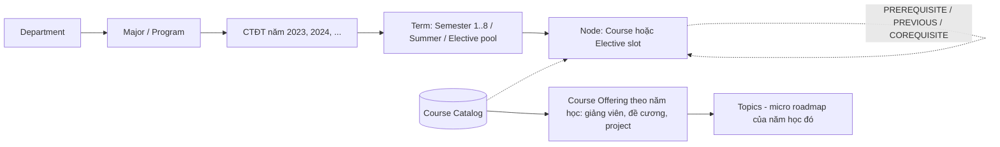
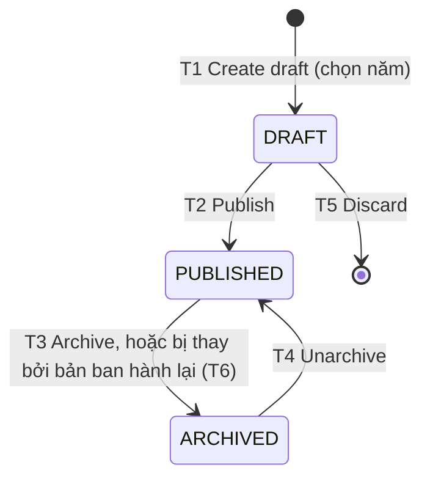

# FL-RDM — Roadmap Management (v2: Semester Curriculum)

> **Module:** ROADMAP — Quản trị Roadmap học thuật
> **Version:** 3.0 (Roadmap v2)
> **Last Updated:** 2026-09-26
> **Status:** 🔲 Planned (v2). FL-RDM-01/02 (Department/Major CRUD) đã implement từ v1.

---

## Liên kết chéo

- Business Flow → [`02-roadmap-management.md`](../../business-flow/02-roadmap-management.md)
- Thiết kế & phân tích → [`roadmap-v2-design.md`](../../architecture/roadmap-v2-design.md)
- Database Schema → [`roadmap-schema.md`](../../schema/roadmap-schema.md)
- Phía learner → [`FL-LRN-learner-portal.md`](FL-LRN-learner-portal.md)
- Source code → `iuroadmap.services/roadmap-service/`, `iuroadmap.webapp/apps/web/src/views/config/roadmap/`
- Flow tổng quan → [`_OVERVIEW.md`](_OVERVIEW.md)

**Quy ước ID:** `FR-RDM.<sub-flow>.<n>`. Cột **Ưu tiên**: Must / Should / Could. Cột **Nguồn** truy vết tài liệu gốc. "Ảnh 1" là sơ đồ CTĐT *Curriculum – Computer Science*; "Ảnh 2" là bảng điểm HK1 2025-2026; "Ảnh 3" là bảng điểm HK1–HK2 2023-2024 (có môn tiếng Anh tăng cường chấm P).

> **Tóm tắt thay đổi so với v1:**
> - Node không còn toạ độ tự do; mỗi node thuộc 1 **học kỳ** và 1 **hàng**.
> - CTĐT được quản lý **theo năm (khoá)**: mỗi ngành có một CTĐT cho mỗi năm, đi qua draft → publish.
> - Có **thư viện môn học** dùng chung (`COURSES`). Môn và ngành là quan hệ **N:N**.
> - **Nhóm môn** (category) và màu node là **master data**, admin tự cấu hình.
> - Môn học có **Course Offering theo năm học**: giảng viên, đề cương, project và topic riêng cho từng năm.
> - Có **3 loại quan hệ**, tín chỉ tách **(LT, TH)**, **elective slot**, **thang điểm** cấu hình được.
> - Khoa và ngành **không xoá được** khi còn dữ liệu tham chiếu (không cascade).

---

## Bản đồ sub-flow

| FL | Tên sub-flow | Trigger chính | Trạng thái liên quan | Actor | API chính |
|---|---|---|---|---|---|
| **FL-RDM-00** | Mô hình dữ liệu & vòng đời Version | — | `DRAFT`, `PUBLISHED`, `ARCHIVED` | Tất cả | — |
| **FL-RDM-01** | Department CRUD | Admin quản lý khoa | — | Admin | `/departments/*` |
| **FL-RDM-02** | Major CRUD | Admin quản lý ngành | — | Admin | `/majors/*` |
| **FL-RDM-03** | Course Catalog & Nhóm môn | Admin quản lý thư viện môn và nhóm môn | — | Admin | `/courses/*`, `/course-categories/*` |
| **FL-RDM-04** | Quản lý CTĐT theo năm | Admin tạo / publish / archive CTĐT của một năm | `DRAFT` → `PUBLISHED` ↔ `ARCHIVED` | Admin | `/admin/roadmaps/:id/versions`, `/admin/roadmap-versions/:id/*` |
| **FL-RDM-05** | Semester Canvas Editor | Admin mở canvas của draft | `DRAFT` | Admin | `/admin/roadmap-versions/:id/canvas[/save]` |
| **FL-RDM-06** | Quan hệ giữa môn & ràng buộc xếp kỳ | Admin nối edge | — | Admin | (nằm trong canvas save) |
| **FL-RDM-07** | Elective slot, Elective pool, nhánh điều kiện | Admin cấu hình môn tự chọn | — | Admin | (nằm trong canvas save) |
| **FL-RDM-08** | Course Offering theo năm học, giảng viên & Topic | Admin mở môn cho một năm học | `DRAFT` → `PUBLISHED` | Admin | `/admin/course-offerings/*`, `/lecturers/*`, `/admin/course-offerings/:id/topics-graph` |
| **FL-RDM-09** | Thang điểm & xếp loại | Admin cấu hình | — | Admin | `/admin/grade-scales/*`, `/admin/academic-classifications/*` |
| **FL-RDM-10** | Kiểm duyệt bình luận môn học | Bình luận bị báo cáo, hoặc admin rà soát | `VISIBLE`, `FLAGGED`, `HIDDEN`, `DELETED` | Admin | `/admin/course-comments/*` |

---

## FL-RDM-00 — Mô hình dữ liệu & vòng đời Version

**Mục đích:** Xác định hierarchy v2 và state machine của CTĐT theo năm, để learner clone từ một bản CTĐT **bất biến** và chỉ lưu phần họ thay đổi.
**Actor:** tất cả.

> **Thuật ngữ.** Nghiệp vụ và UI nói "**CTĐT năm 2023**" (khoá K2023). Trong DB và API, một bản CTĐT vẫn là một dòng `ROADMAP_VERSIONS` (gọi tắt là *version*), định danh bởi `(roadmap_id, cohort_year, revision_no)`. `revision_no` chỉ tăng khi admin **ban hành lại** CTĐT của cùng một năm (sửa sai sau khi đã publish); learner hầu như chỉ thấy năm.

| Transition | From | To | Action | Actor | Business Rule |
|---|---|---|---|---|---|
| T1 | *(new)* | `DRAFT` | Tạo draft cho một năm: trống, hoặc copy từ CTĐT của năm khác / của chính năm đó | Admin | BR-RM-07, BR-RM-13 |
| T2 | `DRAFT` | `PUBLISHED` | Publish | Admin | BR-RM-09 |
| T3 | `PUBLISHED` | `ARCHIVED` | Archive thủ công | Admin | BR-RM-11 |
| T4 | `ARCHIVED` | `PUBLISHED` | Unarchive (chỉ khi năm đó chưa có bản `PUBLISHED` khác) | Admin | BR-RM-15 |
| T5 | `DRAFT` | *(deleted)* | Huỷ draft | Admin | — |
| T6 | `PUBLISHED` | `ARCHIVED` | Tự động khi một draft **cùng năm** được publish (ban hành lại) | System | BR-RM-15 |

| FR ID | Yêu cầu | Ưu tiên | Nguồn |
|---|---|---|---|
| FR-RDM.00.1 | Hierarchy: `Department → Major → CTĐT theo năm → Term → Node`. Môn học nằm trong `COURSES` dùng chung; node chỉ tham chiếu tới môn. Thông tin thay đổi theo năm học (giảng viên, đề cương, topic) thuộc về **Course Offering** `(môn, năm học)`, không thuộc node hay CTĐT (FL-RDM-08). | Must | design §3, G4 |
| FR-RDM.00.6 | **Môn ↔ ngành là N:N.** Một môn (ví dụ `MA001IU`) nằm trong CTĐT của nhiều ngành, một ngành có nhiều môn. Quan hệ này được **suy ra** qua `ROADMAP_NODES` (ngành → CTĐT → node → môn), nên `COURSES` không có cột `major_id` và không có bảng nối riêng. v1 sai ở chỗ `COURSE_NODES.roadmap_id` gắn cứng môn vào 1 ngành (G4). | Must | G4 |
| FR-RDM.00.2 | Version tuân theo state machine T1–T5. Transition không hợp lệ trả `400` kèm trạng thái hiện tại. | Must | design §5 |
| FR-RDM.00.3 | Mỗi term, node và edge có key UUID ổn định (`term_key`, `node_key`, `edge_key`). Key được **giữ nguyên** khi tạo draft từ một version khác. | Must | BR-RM-13 |
| FR-RDM.00.4 | Version `PUBLISHED`/`ARCHIVED` là **bất biến**: mọi thao tác sửa nội dung trả `409 ROADMAP_VERSION_IMMUTABLE`. | Must | BR-RM-11 |
| FR-RDM.00.5 | Vị trí node lưu dạng logic `(term, row_index)`. Backend **không lưu toạ độ pixel**. | Must | Ảnh 1, design §4.1 |

---

## FL-RDM-01 — Department CRUD

**Mục đích:** Quản lý khoa. Giữ nguyên như v1, chỉ đổi quy tắc xoá.
**Actor:** Admin. **API:** `POST /departments/create|update|delete/:id`, `GET /departments/getById/:id|GetByIndex|ForDropdown`.

| FR ID | Yêu cầu | Ưu tiên | Nguồn |
|---|---|---|---|
| FR-RDM.01.1 | Admin CRUD khoa với `slug` (unique), `name`, `description`. | Must | v1, BR-RM-03 |
| FR-RDM.01.2 | **Không cascade.** Khoa còn ít nhất 1 ngành → xoá bị chặn `409 DEPARTMENT_HAS_MAJORS`, kèm số ngành. Admin phải xoá hoặc chuyển các ngành sang khoa khác trước. | Must | BR-RM-02 |

---

## FL-RDM-02 — Major CRUD

**Mục đích:** Quản lý ngành (program).
**Actor:** Admin. **API:** `/majors/*`. Controller này **chưa có prefix trong gateway**, cần thêm `majors` vào `routes.config.ts` (design G10).

| FR ID | Yêu cầu | Ưu tiên | Nguồn |
|---|---|---|---|
| FR-RDM.02.1 | Admin CRUD ngành: `slug` (unique), `name`, `department_id`, `description`. `total_credits` **không** nằm ở ngành mà nằm ở CTĐT từng năm (FR-RDM.04.2), vì mỗi khoá có thể có số tín chỉ tốt nghiệp khác nhau. | Must | v1 |
| FR-RDM.02.2 | Trang chi tiết ngành liệt kê CTĐT theo năm (FL-RDM-04) và có nút **"Mở canvas"** cho draft hoặc **"Tạo CTĐT năm mới"**. | Must | design §5 |
| FR-RDM.02.3 | `total_credits` của CTĐT (tín chỉ yêu cầu để tốt nghiệp) được dùng để: (1) cảnh báo khi publish (FR-RDM.04.4); (2) hiển thị **tín chỉ đạt / `total_credits`** và tính % tiến độ của learner (FR-LRN.06.3). Learner được học **vượt** số này, nên con số hiển thị **không bị giới hạn** ở `total_credits` hay 100%. | Must | Ảnh 2 |
| FR-RDM.02.4 | Xoá ngành bị chặn `409 MAJOR_HAS_PUBLISHED_CURRICULUM` nếu ngành có CTĐT `PUBLISHED` hoặc `ARCHIVED` (đã từng public, nên có thể đã có learner clone). Response kèm danh sách năm và số learner đang dùng. Ngành chỉ có `DRAFT` thì xoá được, và các draft bị xoá theo. | Must | BR-RM-02 |

---

## FL-RDM-03 — Course Catalog & Nhóm môn

**Mục đích:** Thư viện môn học dùng chung cho mọi ngành và mọi năm. Nhập một lần, kéo vào canvas nhiều lần. Nhóm môn (category) và màu node là master data.
**Actor:** Admin. **API:** theo đúng pattern IAM.
- `POST /courses/create|update|delete/:id`, `GET /courses/getById/:id|GetByIndex|ForDropdown`. Prefix `courses` đã có trong gateway.
- `POST /course-categories/create|update|delete/:id`, `GET /course-categories/getById/:id|GetByIndex|ForDropdown`. Cần thêm prefix `course-categories` vào gateway.

| FR ID | Yêu cầu | Ưu tiên | Nguồn |
|---|---|---|---|
| FR-RDM.03.1 | Trường dữ liệu **ổn định qua các năm**: `code` (unique, ví dụ `IT013IU`), `name`, `theory_credits ≥ 0`, `lab_credits ≥ 0` (tổng > 0), `category_id`, `grading_mode` ∈ `SCORE` (thang 100) / `PASS_FAIL` (chỉ Đạt/Không đạt, ví dụ ENTP01 "Intensive English 1"), `counts_toward_gpa` (mặc định `true`), `counts_toward_credits` (mặc định `true`; `false` cho môn không tính vào tín chỉ tốt nghiệp như IE), `description` (mô tả chung). Những gì **thay đổi theo năm học** (giảng viên, đề cương, trọng số, project, topic, lưu ý cho SV) nằm ở Course Offering (FL-RDM-08). Độ dài lấy từ `EntityConstant`. | Must | Ảnh 1 chú thích, Ảnh 2, Ảnh 3, BR-RM-04 |
| FR-RDM.03.2 | `code` trùng → `409 "Course code already exists"`. | Must | BR-RM-03 |
| FR-RDM.03.3 | Tổng tín chỉ = `theory_credits + lab_credits`. Mọi nơi hiển thị theo dạng `IT089IU (3,1)`. | Must | Ảnh 1, Ảnh 2 |
| FR-RDM.03.4 | **Nhóm môn là master data** (`COURSE_CATEGORIES`): `code` (unique), `name`, `fill_color`, `border_color` (dạng `#RRGGBB`), `sort_order`. Seed ban đầu 6 nhóm theo chú thích Ảnh 1: `MAJOR`, `GENERAL`, `FOUNDATION`, `POLITICAL`, `LANGUAGE`, `PHYSICAL`. Admin sửa màu hoặc thêm nhóm thì canvas và My Roadmap đổi màu ngay, không cần deploy. | Must | Ảnh 1 chú thích |
| FR-RDM.03.5 | Không xoá được môn đang được node, overlay của learner hoặc bình luận (FL-LRN-10) tham chiếu → `409`, kèm danh sách CTĐT (ngành + năm) đang dùng. Không xoá được nhóm môn còn môn thuộc nhóm → `409 CATEGORY_IN_USE`. | Must | schema `Restrict` |
| FR-RDM.03.6 | `GetByIndex` lọc theo `keyword` (code/name), `categoryId` và `majorId` (môn có mặt trong ít nhất 1 CTĐT của ngành, FR-RDM.00.6). `ForDropdown` phục vụ sidebar canvas và cho learner thêm môn. | Must | pattern IAM |
| FR-RDM.03.7 | Import danh sách môn từ CSV (code, name, theory, lab, category code). | Could | — |
| FR-RDM.03.8 | **Thông tin cho sinh viên** nằm ở Course Offering của từng năm (FR-RDM.08.3), vì điều kiện, mốc thời gian và thủ tục thay đổi theo năm. | Should | Yêu cầu 2026-09-26 |
| FR-RDM.03.9 | Đổi `grading_mode` của môn đã có kết quả của learner → `409 COURSE_HAS_RESULTS`, vì điểm cũ sẽ bị hiểu sai. | Must | — |

---

## FL-RDM-04 — Quản lý CTĐT theo năm

**Mục đích:** Mỗi năm (khoá) có thể có một CTĐT riêng. Admin soạn CTĐT của từng năm (draft), publish, và archive khi không còn dùng. Learner clone CTĐT của bất kỳ năm nào đang public.
**Actor:** Admin (`RM.AD`). **API:**
- `GET /admin/roadmaps/:roadmapId/versions` (nhóm theo năm)
- `POST /admin/roadmaps/:roadmapId/versions/create` với body `{ cohortYear, fromVersionId?, totalCredits, decisionRef? }`
- `POST /admin/roadmap-versions/:id/update|publish|archive|unarchive`
- `POST /admin/roadmap-versions/delete/:id`

| FR ID | Yêu cầu | Ưu tiên | Nguồn |
|---|---|---|---|
| FR-RDM.04.1 | Danh sách CTĐT nhóm theo `cohort_year` (mới nhất trước). Mỗi dòng: năm, `decision_ref`, `total_credits`, `status`, `published_at`, số learner đang dùng. Nếu năm đó đã ban hành lại, các bản cũ (`ARCHIVED`) gập bên dưới và hiện `revision_no`. | Must | design §5 |
| FR-RDM.04.2 | **Tạo draft theo năm:** admin chọn `cohort_year` (bắt buộc), nhập `total_credits` và `decision_ref`. Nguồn: **trống** (sinh sẵn 8 term `REGULAR` theo `AppConstant` + 1 `ELECTIVE_POOL`), hoặc **copy** từ CTĐT của một năm bất kỳ (thường là năm trước) và giữ nguyên key. | Must | Ảnh 1, BR-RM-13 |
| FR-RDM.04.3 | Mỗi `(ngành, năm)` có tối đa 1 `DRAFT`. Tạo draft thứ hai cho cùng năm → `409 ROADMAP_DRAFT_EXISTS`, kèm link tới draft đang có. Các năm khác nhau có thể có draft song song (ví dụ soạn 2027 trong khi sửa 2026). | Must | BR-RM-07 |
| FR-RDM.04.4 | **Publish** chạy validator trên toàn CTĐT. **Lỗi (chặn publish):** có chu trình; vi phạm xếp kỳ; node `COURSE` thiếu môn; slot thiếu tín chỉ; CTĐT rỗng. **Cảnh báo (phải xác nhận `acknowledgeWarnings = true`):** tổng tín chỉ các term `REGULAR`+`SUMMER` (tính cả slot, bỏ môn `counts_toward_credits = false`) ≠ `total_credits` của CTĐT; một kỳ vượt `AppConstant.Roadmap.MaxCreditsPerTerm`. Response trả danh sách `{ code, severity, nodeKeys[] }`. | Must | BR-RM-01, BR-RM-08, BR-RM-09 |
| FR-RDM.04.5 | Publish thành công: ghi `published_at`, `published_by`, gán `revision_no` (tăng dần trong cùng năm, bắt đầu từ 1) và chuyển sang `PUBLISHED`. Nếu năm đó **đã có** bản `PUBLISHED` (ban hành lại để sửa sai) thì bản cũ tự chuyển sang `ARCHIVED` trong cùng transaction (T6); learner đang dùng bản cũ thấy banner "CTĐT 2023 có bản cập nhật" (FL-LRN-07). | Must | BR-RM-15 |
| FR-RDM.04.6 | Archive: CTĐT biến mất khỏi Explore và danh sách clone; các `STUDENT_ROADMAPS` đang dùng **không bị ảnh hưởng**. Chỉ nên archive năm thật sự không còn sinh viên theo học, vì learner không clone lại được năm đã archive. | Must | BR-RM-11 |
| FR-RDM.04.7 | Chỉ xoá được `DRAFT`. CTĐT đã publish không bao giờ bị xoá, chỉ archive. | Must | BR-RM-11 |
| FR-RDM.04.8 | Mở một CTĐT không phải draft thì canvas ở chế độ chỉ đọc, kèm hai nút **"Sửa CTĐT năm này"** (tạo draft cùng năm, copy từ bản này) và **"Tạo CTĐT năm mới từ bản này"**. | Must | FR-RDM.00.4 |
| FR-RDM.04.9 | Unarchive chỉ được khi năm đó đang không có bản `PUBLISHED` nào khác; nếu có → `409 CURRICULUM_YEAR_ALREADY_PUBLISHED`. | Must | BR-RM-15 |
| FR-RDM.04.10 | So sánh 2 CTĐT (2 năm, hoặc 2 bản của cùng năm): môn thêm, bớt, dời kỳ, đổi quan hệ. Diff này cũng được dùng cho preview rebase của learner. | Should | design §6.5 |

**Alternative Flows:**
- **AF-01:** Publish còn lỗi → `400`; UI mở panel *Issues* và focus vào node lỗi đầu tiên.
- **AF-02:** Publish có cảnh báo nhưng thiếu `acknowledgeWarnings` → `400 PUBLISH_WARNINGS_NOT_ACKNOWLEDGED`.
- **AF-03:** Publish bản ban hành lại → UI hỏi xác nhận: "Bản 2023 hiện tại sẽ bị thay. N learner đang dùng sẽ được mời cập nhật."

---

## FL-RDM-05 — Semester Canvas Editor

**Mục đích:** Admin xếp môn vào các học kỳ bằng kéo thả; node **tự căn giữa cột** như Ảnh 1.
**Actor:** Admin. **UI:** `RoutePaths` mới cho canvas của một version. **API:**
- `GET /admin/roadmap-versions/:id/canvas` → `{ version, terms[], nodes[], edges[] }`
- `POST /admin/roadmap-versions/:id/canvas/save` với body `{ revision, terms[], nodes[], edges[] }` (full state, khớp theo key)

| FR ID | Yêu cầu | Ưu tiên | Nguồn |
|---|---|---|---|
| FR-RDM.05.1 | Canvas vẽ các cột theo `order_index`. Tiêu đề cột theo đúng sơ đồ CTĐT giấy: `Semester n (x+y)`. **x** = tổng tín chỉ các môn **cụ thể** trong cột; **y** = tổng tín chỉ các **ô tự chọn** (elective slot) trong cột, tức phần sinh viên sẽ tự chọn môn sau. Ví dụ `Semester 4 (16+3)`: 16 tín chỉ môn bắt buộc + 1 ô "Elective CS1" 3 tín chỉ = kỳ đó học 19 tín chỉ. Cột không có slot thì chỉ hiện `(x)`. Cột Summer: `Summer (x)`; cột Elective không tính tín chỉ. Tooltip trên tiêu đề giải thích x và y. Nhãn đi qua i18n. | Must | Ảnh 1 |
| FR-RDM.05.2 | Node được đặt **giữa cột**: `x = pad + lane×LANE_WIDTH + (LANE_WIDTH−NODE_WIDTH)/2`, `y = HEADER + row×ROW_HEIGHT`. Các hằng số nằm trong `@iuroadmap/core`. | Must | R2, design §4.1 |
| FR-RDM.05.3 | Thẻ node hiển thị `code (LT,TH)` và tên môn, tô màu theo `fill_color`/`border_color` của nhóm môn (FR-RDM.03.4). Chú thích màu trên canvas đọc từ `course-categories/ForDropdown`. `ELECTIVE_SLOT` có viền xanh đậm như ô "Elective CS1". | Must | Ảnh 1 chú thích |
| FR-RDM.05.4 | Kéo node sang cột hoặc hàng khác. Trong lúc kéo, node ở vị trí con trỏ và các node bên dưới **trượt xuống chừa chỗ** (tới hàng trống gần nhất); thả ra thì node được **chèn** vào đó. Thả vào ô trống thì node vào đúng ô đó. Khi lưu, FE đổi thứ tự hiển thị thành `row_index` số nguyên cho mọi node. Dùng chung logic với learner (FR-LRN.04.15). | Must | R2, design §4.2 |
| FR-RDM.05.5 | Sidebar **Course catalog** có ô tìm kiếm. Kéo một môn từ sidebar thả vào cột sẽ tạo node. Môn đã có trong version thì không được thả, và có toast báo lỗi. | Must | BR-RM-10 |
| FR-RDM.05.6 | Thêm cột (`REGULAR`, `SUMMER`, `ELECTIVE_POOL`), đổi thứ tự cột bằng cách kéo tiêu đề, xoá cột (**chỉ khi cột rỗng**). | Must | Ảnh 1 (cột Summer) |
| FR-RDM.05.7 | Xoá node thì xoá luôn các edge nối với node đó (có hộp xác nhận). | Must | — |
| FR-RDM.05.8 | Lưu theo batch full-state trong **1 transaction**: upsert theo key, xoá những key không còn gửi lên, tăng `revision`. Sai `revision` → `409`, UI hỏi admin có muốn tải lại không. | Must | FR-RDM v1.08 |
| FR-RDM.05.9 | Validate trực tiếp khi sửa: edge vi phạm xếp kỳ chuyển đỏ; panel *Issues* liệt kê lỗi và cảnh báo giống FR-RDM.04.4. | Must | BR-RM-08 |
| FR-RDM.05.10 | Cảnh báo khi rời trang mà còn thay đổi chưa lưu. | Should | UX |
| FR-RDM.05.11 | Undo/redo phía client. | Could | UX |
| FR-RDM.05.12 | Nút "Dồn hàng": xoá các hàng trống trong mọi cột. | Could | — |

**Alternative Flows:**
- **AF-01:** Thả node ra ngoài vùng cột → node snap vào cột gần nhất.
- **AF-02:** Lưu khi version không còn là `DRAFT` (ví dụ đã được publish ở tab khác) → `409 ROADMAP_VERSION_IMMUTABLE`.

---

## FL-RDM-06 — Quan hệ giữa môn & ràng buộc xếp kỳ

**Mục đích:** Biểu diễn đủ 3 loại quan hệ trong chú thích Ảnh 1 và đảm bảo CTĐT **chính thức** xếp kỳ hợp lệ.
**Actor:** Admin.

> **Phạm vi ràng buộc (D13, chốt 2026-09-26).** Các ràng buộc ở đây (DAG, xếp kỳ) là **ràng buộc cứng** của **CTĐT do admin publish**: vi phạm thì không publish được (FR-RDM.04.4). Sau khi learner clone, quan hệ `PREREQUISITE`/`PREVIOUS`/`COREQUISITE` chỉ còn là **thông tin hiển thị**: learner được dời môn, thêm/ẩn quan hệ tuỳ ý, hệ thống chỉ gợi ý và không chặn gì (BR-LRN-01, BR-LRN-08, BR-LRN-12).

| FR ID | Yêu cầu | Ưu tiên | Nguồn |
|---|---|---|---|
| FR-RDM.06.1 | Edge có hướng từ **A (môn trước, source)** tới **B (môn sau, target)**, với `type` ∈ `PREREQUISITE`, `PREVIOUS`, `COREQUISITE`. | Must | Ảnh 1 chú thích |
| FR-RDM.06.2 | Tạo edge bằng cách kéo từ handle của A sang B, sau đó chọn loại trong popover (mặc định `PREREQUISITE`). Click vào edge để đổi loại hoặc xoá. | Must | — |
| FR-RDM.06.3 | Kiểu vẽ: `PREREQUISITE` nét liền có mũi tên; `PREVIOUS` nét đứt có mũi tên; `COREQUISITE` nét liền không mũi tên, có nhãn "co-req". Node có handle ở 4 phía, để 2 môn cùng cột (ví dụ PH015–PH016) vẫn nối được theo chiều dọc. | Must | Ảnh 1 |
| FR-RDM.06.4 | Không cho self-loop. Mỗi cặp `(A,B)` có tối đa 1 edge, bất kể loại. | Must | schema unique |
| FR-RDM.06.5 | Toàn đồ thị (mọi loại edge) phải là **DAG**. Tạo edge gây chu trình → từ chối ngay trên UI; server trả `400 CYCLE_DETECTED` kèm đường đi của chu trình. | Must | BR-RM-01 |
| FR-RDM.06.6 | Ràng buộc xếp kỳ: `PREREQUISITE`/`PREVIOUS` cần `order(A) < order(B)`; `COREQUISITE` cần `order(A) ≤ order(B)`. Node ở `ELECTIVE_POOL` không bị kiểm tra. | Must | BR-RM-08 |

---

## FL-RDM-07 — Elective slot, Elective pool & nhánh điều kiện

**Mục đích:** Mô hình hoá các ô "Elective CS1 (3,1)", "Free elective – 3 credits", các cột Elective, và nhánh "GPA ≥ 70 / < 70" ở HK8 của Ảnh 1.
**Actor:** Admin.

| FR ID | Yêu cầu | Ưu tiên | Nguồn |
|---|---|---|---|
| FR-RDM.07.1 | Node `ELECTIVE_SLOT` có: `slot_label`, `slot_theory_credits`, `slot_lab_credits`, `elective_group` (null = free elective). Tín chỉ của slot được cộng vào phần `+y` ở tiêu đề cột. | Must | Ảnh 1 (ITCS1, ITCS2) |
| FR-RDM.07.2 | Cột `ELECTIVE_POOL` chứa node `COURSE` gắn `elective_group`. Các node này không được tính tín chỉ và không bị kiểm tra xếp kỳ. | Must | Ảnh 1 (cột Elective) |
| FR-RDM.07.3 | Quy tắc điền slot (áp dụng phía learner): môn phải cùng `elective_group` với slot, hoặc bất kỳ môn nào nếu slot là free elective. Tín chỉ môn khác tín chỉ slot thì chỉ cảnh báo. | Should | FR-LRN.04.5 |
| FR-RDM.07.4 | Nhánh điều kiện: nhóm node theo `choice_group`, mỗi nhánh có `condition` dạng giới hạn `CUM_GPA100 >= n` / `< n`, và được vẽ thành một khung nhóm như Ảnh 1. | Could | Ảnh 1 (HK8) |
| FR-RDM.07.5 | Thống kê overlay theo version: các môn learner hay dời kỳ, ẩn hoặc thêm nhiều nhất. Đây là tín hiệu để khoa chỉnh CTĐT. | Could | design §7 |

---

## FL-RDM-08 — Course Offering theo năm học, giảng viên & Topic

**Mục đích:** Cùng một môn nhưng mỗi năm học có thể khác giảng viên, đề cương, trọng số, project và nội dung (topic). Tách **môn** (danh mục ổn định, FL-RDM-03) khỏi **lần mở môn trong một năm học** (Course Offering). Đây là mô hình chuẩn của hệ thống quản lý đào tạo: *Course Catalog* và *Schedule of Classes* trong PeopleSoft Campus Solutions, hay trang môn theo năm học của Stanford ExploreCourses và NUSMods (design §15).
**Actor:** Admin (`RM.AD`). **API:**
- `POST /admin/course-offerings/create` với body `{ courseId, academicYear, fromOfferingId? }`, cùng `update`, `getById/:id`, `GetByIndex`, `delete/:id`, `publish/:id`
- `GET /admin/course-offerings/:id/topics-graph` và các endpoint topic (chuyển từ `course-nodes/:id` của v1)
- `POST /lecturers/create|update|delete/:id`, `GET /lecturers/getById/:id|GetByIndex|ForDropdown` (master data, pattern IAM)

`academic_year` là **năm bắt đầu** của năm học: `2024` nghĩa là năm học 2024-2025 (khớp `AcademicSemester.academic_year` của FL-LR).

| FR ID | Yêu cầu | Ưu tiên | Nguồn |
|---|---|---|---|
| FR-RDM.08.1 | Mỗi `(course_id, academic_year)` có tối đa 1 offering. Trạng thái `DRAFT` (chỉ admin thấy) → `PUBLISHED` (sinh viên thấy). Offering **sửa được** kể cả khi đã publish, vì overlay của learner không tham chiếu tới offering (khác CTĐT). | Must | Yêu cầu 2026-09-26 |
| FR-RDM.08.2 | **Tạo offering năm mới bằng cách copy** từ offering của năm trước (`fromOfferingId`): copy thông tin, trọng số, project, topic và edge topic; giảng viên được copy nhưng admin cần xác nhận lại. Tạo trống cũng được. | Must | — |
| FR-RDM.08.3 | Trường của offering: `student_guide` (markdown, ví dụ Internship: *"Đăng ký khi đã tích luỹ đủ X tín chỉ. Đến hạn mà chưa tìm được công ty thì email phòng đào tạo xin drop."*), `syllabus_url` (HTTP/HTTPS), trọng số QT/GK/CK mặc định (cả 3 trống hoặc tổng = 100; bỏ qua nếu môn `PASS_FAIL`), `has_project` và `project_description`. Markdown được sanitize khi render. | Must | Yêu cầu 2026-09-26 |
| FR-RDM.08.4 | **Giảng viên phụ trách:** gán nhiều giảng viên cho một offering, mỗi dòng có `role` ∈ `LECTURER`, `TA` và `term_in_year` tuỳ chọn (`SEMESTER_1`, `SEMESTER_2`, `SUMMER`), vì một môn có thể mở ở cả HK1 và HK2 với giảng viên khác nhau. | Must | Yêu cầu 2026-09-26 |
| FR-RDM.08.5 | **Giảng viên là master data** (`LECTURERS`): `full_name`, `title` (ThS, TS, PGS, GS), `department_id`, `email`, `status`. FL-LR (đánh giá giảng viên) dùng lại bảng này thay vì tạo `LecturerProfile` riêng (D17). Không xoá được giảng viên đang được gán → `409`. | Must | FL-LR-01 |
| FR-RDM.08.6 | **Topic (micro roadmap) gắn với offering**, không gắn với môn: mỗi năm học có bộ topic riêng. Sửa topic năm 2025 không ảnh hưởng năm 2024. | Must | Yêu cầu 2026-09-26 |
| FR-RDM.08.7 | Validate topic giữ nguyên như v1: resource URL (BR-RM-05), estimated hours (BR-RM-06), DAG của topic (BR-RM-01). | Must | v1 |
| FR-RDM.08.8 | Chỉ xoá được offering `DRAFT`. Offering `PUBLISHED` đã có bình luận gắn năm đó thì chỉ chuyển về `DRAFT` (ẩn). | Should | — |
| FR-RDM.08.9 | Danh sách offering (`GetByIndex`) lọc theo `courseId`, `academicYear`, `lecturerId`, `status`; có nút "Mở môn cho năm học mới" hàng loạt: copy mọi offering `PUBLISHED` của năm N sang năm N+1 ở trạng thái `DRAFT`. | Should | — |

---

## FL-RDM-09 — Thang điểm & xếp loại

**Mục đích:** Cấu hình quy đổi điểm hệ 100 → chữ → hệ 4, và ngưỡng xếp loại, phục vụ bảng điểm học kỳ của learner (Ảnh 2). Không hard-code.
**Actor:** Admin. **API:** `/admin/grade-scales/*`, `/admin/academic-classifications/*` (pattern IAM).

| FR ID | Yêu cầu | Ưu tiên | Nguồn |
|---|---|---|---|
| FR-RDM.09.1 | `GRADE_SCALES`: `letter`, `min_score`, `max_score` (hệ 100, inclusive), `grade_point`, `is_passing`. Các band phải phủ kín 0–100, không chồng lấn và không hở; vi phạm → `400`. | Must | BR-RM-14 |
| FR-RDM.09.2 | `ACADEMIC_CLASSIFICATIONS`: `label_key` (i18n), `min_gpa100`, `max_gpa100`, phủ kín 0–100. Xếp loại dựa trên **GPA hệ 100** theo sổ tay IU 2022 (Excellent 90–100, Very good 80–<90, Good 70–<80, Average good 60–<70, Ordinary 50–<60). | Must | Ảnh 2 ("Giỏi") |
| FR-RDM.09.3 | Seed ban đầu theo bảng ở design §9.3: **ngưỡng đạt 50** (dưới 50 là trượt, theo chuẩn quốc tế). Đã xác nhận từ bảng điểm: A+, A, B+, B (2.5), D+ (1.5, trượt). Các band C, D, F và ranh giới chính xác là **giả định, cần xác nhận** theo quy chế IU; seed gắn cờ trong comment, sửa seed không cần sửa code. | Must | design §9.3, D4 |
| FR-RDM.09.5 | Môn `PASS_FAIL` không tra `GRADE_SCALES`: kết quả chỉ là Đạt (`P`) hoặc Không đạt (`F`), không có điểm số, không tính GPA. | Must | Ảnh 3 (ENTP01, ENTP02-1) |
| FR-RDM.09.4 | Chữ và hệ 4 của learner được tính **khi đọc**, nên sửa thang điểm sẽ áp dụng hồi tố. UI hiện hộp xác nhận nêu rõ điều này. | Must | design §9.1 |

---

## FL-RDM-10 — Kiểm duyệt bình luận môn học

**Mục đích:** Giữ bình luận của sinh viên (FL-LRN-10) phù hợp môi trường học thuật theo mô hình **hậu kiểm**: bình luận hiện ngay, cộng đồng báo cáo, admin xử lý hàng chờ. Cơ chế report và ngưỡng dùng chung với FL-LR (`AppConstant.Moderation.ReportThreshold`, trạng thái report `PENDING/REVIEWED/DISMISSED`).
**Actor:** Admin (`RM.AD`). **API:**
- `GET /admin/course-comments/GetByIndex` với filter `{ status?, courseId?, keyword?, hasPendingReports? }`
- `GET /admin/course-comments/getById/:id`: bình luận, ngữ cảnh (bình luận gốc hoặc các trả lời), danh sách report
- `POST /admin/course-comments/:id/hide` với body `{ reason }`
- `POST /admin/course-comments/:id/restore`
- `POST /admin/course-comments/:id/dismiss-reports`

| FR ID | Yêu cầu | Ưu tiên | Nguồn |
|---|---|---|---|
| FR-RDM.10.1 | Màn hình **Kiểm duyệt bình luận** mặc định lọc `FLAGGED` + bình luận có report `PENDING`, sắp theo số report giảm dần. Cột: môn (code), trích nội dung, tác giả, số report, trạng thái, thời gian. Menu admin hiện badge số bình luận `FLAGGED`. | Should | D14 |
| FR-RDM.10.2 | **Ẩn** (xoá mềm): chuyển `HIDDEN`, bắt buộc `reason` (thiếu → `400 MODERATION_REASON_REQUIRED`), ghi `moderated_by`, `moderated_at`. Mọi report `PENDING` của bình luận chuyển `REVIEWED`. Ẩn bình luận gốc thì các trả lời của nó cũng không hiện với người khác. | Should | BR-RM-17 |
| FR-RDM.10.3 | **Giữ lại** (`dismiss-reports`): bình luận `FLAGGED` quay về `VISIBLE`, mọi report `PENDING` chuyển `DISMISSED`. Report mới sau đó được đếm lại từ 0. | Should | BR-RM-17 |
| FR-RDM.10.4 | **Khôi phục** bình luận `HIDDEN` về `VISIBLE` (sửa khi ẩn nhầm); ghi lại người khôi phục. | Should | — |
| FR-RDM.10.5 | **Không xoá cứng** bình luận qua UI. Nội dung gốc, lý do ẩn và report được giữ để truy vết. Bình luận `DELETED` do tác giả xoá vẫn xem được trong màn hình admin. | Should | BR-RM-17 |
| FR-RDM.10.6 | Admin xem được mọi bình luận của một user (lọc theo `userId`) để xử lý người vi phạm nhiều lần. | Could | — |
| FR-RDM.10.7 | Tạm khoá quyền bình luận của một user trong N ngày. | Could | — |
| FR-RDM.10.8 | Gửi thông báo cho tác giả khi bình luận bị ẩn, kèm lý do. | Could | — |
