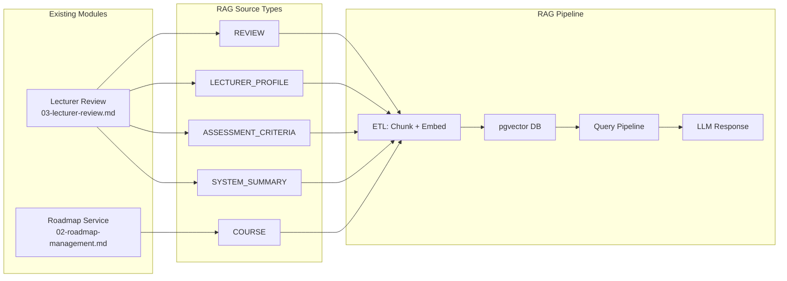

# PRD — AI Chatbot (RAG) Module

> **Project:** IUROADMAP — IU Academic Roadmap & AI Assistant
> **Module:** RAG — AI Chatbot powered by Retrieval-Augmented Generation
> **Version:** 1.0
> **Last Updated:** 2026-08-29
> **Status:** Planned — Future Phase
> **Owner:** Product Team

---

## 1. Overview

### 1.1 Vấn đề cần giải quyết

Sinh viên Đại học Quốc tế (IU) gặp khó khăn khi tìm kiếm thông tin học thuật:

- **Thông tin phân tán**: Chương trình đào tạo, syllabus, thông tin giảng viên nằm rải rác trên nhiều nguồn (website trường, Edusoftweb, Blackboard, group Facebook/Zalo).
- **Không có nguồn tin đáng tin cậy từ peers**: Kinh nghiệm học tập, tips chọn môn, đánh giá giảng viên chỉ truyền miệng.
- **Khó tra cứu nhanh**: Sinh viên phải tự tìm prerequisite chains, lên kế hoạch đăng ký môn mà không có công cụ hỗ trợ.

### 1.2 Giải pháp

Xây dựng **AI Chatbot** sử dụng kiến trúc **RAG (Retrieval-Augmented Generation)**, cho phép sinh viên hỏi bất kỳ câu hỏi nào về IU bằng ngôn ngữ tự nhiên (Tiếng Việt / English). Chatbot trả lời dựa trên **dữ liệu thực** từ hệ thống IUROADMAP — không hallucinate.

### 1.3 Giá trị mang lại

| Stakeholder | Giá trị |
|---|---|
| **Sinh viên** | Tra cứu nhanh, chính xác — "GV nào dạy DSA tốt?", "Môn OOP cần học trước gì?" |
| **Hệ thống** | Tăng engagement, thu thập analytics về nhu cầu thông tin sinh viên |
| **Trường IU** | Kênh thông tin không chính thức nhưng hữu ích, giảm tải tư vấn học vụ |

---

## 2. Personas & User Stories

### 2.1 Persona: Minh — Tân sinh viên năm nhất IT

> *"Em mới vào trường, không biết ngành Software Engineering học những gì, nên đăng ký môn nào trước."*

**User Stories:**
- US-RAG-01: Là Minh, tôi muốn hỏi chatbot "Ngành SE cần học bao nhiêu tín chỉ?" để nắm tổng quan.
- US-RAG-02: Là Minh, tôi muốn hỏi "Năm nhất SE nên đăng ký môn gì?" để có kế hoạch.
- US-RAG-03: Là Minh, tôi muốn hỏi "Môn Intro Programming dạy gì?" để chuẩn bị trước.

### 2.2 Persona: Lan — Sinh viên năm 3 CS chọn chuyên ngành

> *"Em muốn biết chuyên ngành AI khác gì Data Science, GV nào dạy Machine Learning tốt?"*

**User Stories:**
- US-RAG-04: Là Lan, tôi muốn hỏi "So sánh GV A và GV B dạy Machine Learning" để chọn lớp.
- US-RAG-05: Là Lan, tôi muốn hỏi "Các môn prerequisite cho Machine Learning?" để lên lịch đăng ký.
- US-RAG-06: Là Lan, tôi muốn hỏi "Sinh viên khóa trước review gì về môn AI?" để biết mức khó.

### 2.3 Persona: Admin Hà — Quản trị viên hệ thống

> *"Tôi cần biết sinh viên hay hỏi gì để cải thiện data và content."*

**User Stories:**
- US-RAG-07: Là Admin, tôi muốn xem dashboard queries phổ biến để biết nhu cầu sinh viên.
- US-RAG-08: Là Admin, tôi muốn trigger re-index khi update data mới.
- US-RAG-09: Là Admin, tôi muốn quản lý system prompts để kiểm soát chatbot behavior.

---

## 3. Feature Specifications

### 3.1 Feature: Chat Interface

**Mô tả**: Giao diện chat cho phép user gửi câu hỏi và nhận trả lời real-time.

```
┌─────────────────────────────────────────────────┐
│  💬 IU Assistant                          [+ New]│
├──────────┬──────────────────────────────────────┤
│ Sidebar  │                                      │
│          │   Chào bạn! Tôi là IU Assistant 🎓   │
│ ○ Chat 1 │   Hỏi tôi bất cứ gì về IU nhé!      │
│ ○ Chat 2 │                                      │
│ ○ Chat 3 │   💡 Suggested Questions:             │
│          │   • "Ngành SE có bao nhiêu tín chỉ?" │
│          │   • "GV nào dạy DSA tốt nhất?"       │
│          │   • "Prerequisite của Machine Learning"│
│          │                                      │
│          │                                      │
│          │                                      │
│          ├──────────────────────────────────────┤
│          │  [💬 Hỏi tôi về IU...         ] [➤] │
└──────────┴──────────────────────────────────────┘
```

**Acceptance Criteria:**
- [ ] Chat input hỗ trợ Tiếng Việt + English
- [ ] Response hiển thị streaming (typing effect) qua SSE
- [ ] Mỗi câu trả lời có citations (link đến source: review, lecturer, course)
- [ ] Sidebar liệt kê conversation history
- [ ] Button "New Chat" tạo conversation mới
- [ ] Suggested questions hiển thị khi conversation trống

---

### 3.2 Feature: RAG Data Ingestion Pipeline (ETL)

**Mô tả**: Pipeline tự động chuyển đổi dữ liệu từ PostgreSQL → document chunks → embeddings → pgvector.

```
┌──────────────────┐     ┌──────────────┐     ┌─────────────┐     ┌──────────────┐
│   Data Sources   │────▸│  Chunking &  │────▸│  Embedding  │────▸│  pgvector    │
│                  │     │  Templating  │     │  Generation │     │  Storage     │
│ • Student Reviews│     │              │     │             │     │              │
│ • Lecturer Profs │     │ 500-1000 tok │     │ OpenAI API  │     │ rag_documents│
│ • Courses        │     │ overlap 100  │     │ 1536 dims   │     │ + metadata   │
│ • Assessments    │     │ rich metadata│     │             │     │ + indexes    │
│ • Summaries      │     └──────────────┘     └─────────────┘     └──────────────┘
└──────────────────┘
```

**Trigger Events:**
| Event | Action |
|---|---|
| Review status → `APPROVED` | Index review chunk(s) |
| Lecturer Profile updated | Re-index lecturer profile chunk |
| Assessment Criteria changed | Re-index course assessment chunk |
| System Summary generated | Index summary chunk |
| Admin trigger manual re-index | Re-index specified source_type |
| Daily cron (02:00 AM) | Full consistency re-index |

**Document Templates:**

**Template 1: Review Chunk**
```
[REVIEW] Lecturer: Dr. Nguyen Van A (TS, Khoa CNTT)
Course: Data Structures and Algorithms (4 TC)
Semester: HK2-2025
Assessment: Final Project 20%, Midterm 20%, Final Exam 30%, Lab 20%, Participation 10%
---
Ratings: Difficulty 4/5, Grading 3/5, Teaching Quality 5/5, Content Relevance 4/5
Would Take Again: Yes
Tags: Clear Explanations, Caring, Tough Grader
Grade: B+
Review: "Thầy A giải thích thuật toán rất rõ ràng với ví dụ thực tế..."
```

**Template 2: Lecturer Profile Chunk**
```
[LECTURER] Dr. Nguyen Van A, Tiến sĩ
Khoa: Công nghệ Thông tin
Chuyên ngành: AI, Databases, Web Development
---
Tổng quan: 45 reviews, Avg Teaching Quality 4.5/5, 78% muốn học lại
Các môn đã dạy: DSA (HK2-2025, HK2-2024), Database (HK1-2025)
```

**Template 3: Course Assessment Chunk**
```
[ASSESSMENT] Data Structures and Algorithms (4 TC)
Semester: HK2-2025
Cấu trúc đánh giá:
- Participation: 10%
- Lab Exercises: 20%
- Midterm Exam: 20%
- Final Project: 20%
- Final Exam: 30%
```

**Acceptance Criteria:**
- [ ] Pipeline tự động trigger khi data source thay đổi
- [ ] Mỗi chunk có metadata JSON đầy đủ cho hybrid filtering
- [ ] Version tracking: new index không xóa old cho đến khi complete
- [ ] Admin API endpoint để trigger manual re-index
- [ ] Logging: mỗi ETL run log số documents processed/failed

---

### 3.3 Feature: RAG Query Pipeline

**Mô tả**: Pipeline xử lý câu hỏi từ user → tìm kiếm context → sinh câu trả lời.

```
User Query                    Query Pipeline                         Response
───────────                   ──────────────                         ────────
"GV nào dạy    ──▸  1. Embed query (1536d)
 DSA tốt nhất?"     2. Hybrid search:                        "Dựa trên 23 reviews,
                       • Vector: cosine similarity             GV Dr. Nguyen Van A
                       • Keyword: BM25 matching               được đánh giá cao nhất
                    3. Metadata filter:                        với avg 4.5/5..."
                       • source_type = REVIEW
                       • course_name LIKE '%DSA%'              📎 Sources:
                    4. Re-rank top-K (K=5-10)                  • Review #1 (HK2-2025)
                    5. Feed context to LLM                     • Review #2 (HK1-2025)
                    6. Generate answer + citations             • Lecturer Profile
```

**System Prompt (Draft):**
```
Bạn là IU Assistant — trợ lý AI chính thức của hệ thống IUROADMAP, hỗ trợ sinh viên
Đại học Quốc tế (IU - HCMC International University).

Quy tắc:
1. CHỈ trả lời dựa trên context được cung cấp. KHÔNG bịa thông tin.
2. Nếu không có đủ context → trả lời: "Tôi chưa có đủ thông tin về vấn đề này.
   Bạn có thể thử hỏi cụ thể hơn hoặc liên hệ phòng đào tạo."
3. Trả lời bằng ngôn ngữ mà user sử dụng (Tiếng Việt hoặc English).
4. Luôn trích dẫn nguồn (review, lecturer profile, course info).
5. KHÔNG đưa ra nhận xét tiêu cực mang tính cá nhân về giảng viên.
6. Khi được hỏi về ratings, cung cấp con số cụ thể và sample size.
```

**Acceptance Criteria:**
- [ ] Hybrid search: vector similarity + keyword matching
- [ ] Metadata filtering hoạt động: filter by department, course, semester
- [ ] Re-ranking top-K chunks theo relevance score
- [ ] LLM response có citations với link đến source
- [ ] Fallback: "Không đủ thông tin" khi relevance < threshold
- [ ] Multi-turn: chatbot hiểu follow-up questions trong cùng conversation

---

### 3.4 Feature: Conversation Management

**Mô tả**: Quản lý lịch sử chat cho mỗi user.

**Data Model:**
```
Conversations                     Messages
─────────────                     ────────
id (UUID, PK)                     id (UUID, PK)
user_id (UUID, FK → users)        conversation_id (UUID, FK)
title (String)                    role (ENUM: USER | ASSISTANT | SYSTEM)
created_at                        content (Text)
updated_at                        sources (Json[]) — citations
                                  feedback (ENUM: THUMBS_UP | THUMBS_DOWN | null)
                                  created_at
```

**Acceptance Criteria:**
- [ ] User tạo conversation mới
- [ ] User xem list conversations (sorted by updated_at DESC)
- [ ] User rename conversation title
- [ ] User xóa conversation (cascade delete messages)
- [ ] Auto-title: conversation tự đặt tên theo câu hỏi đầu tiên

---

### 3.5 Feature: Rate Limiting & Access Control

| User Type | Giới hạn | Behavior khi vượt |
|---|---|---|
| **Guest** | 5 queries/ngày | "Đăng nhập để hỏi thêm" + redirect login |
| **Learner** | 50 queries/ngày | "Bạn đã đạt giới hạn hôm nay" |
| **VIP/PRO** | Không giới hạn | — |
| **Admin** | Không giới hạn | — |

**Acceptance Criteria:**
- [ ] Rate limit tracked per user per day (Redis counter)
- [ ] Guest tracking by IP + fingerprint
- [ ] Upgrade prompt hiển thị khi gần đạt limit
- [ ] Rate limit reset lúc 00:00 GMT+7

---

### 3.6 Feature: Admin Analytics Dashboard

**Mô tả**: Dashboard cho Admin theo dõi usage và chất lượng chatbot.

**Metrics:**
| Metric | Mô tả |
|---|---|
| Total Conversations | Tổng số conversations đã tạo |
| Queries/Day | Số câu hỏi trung bình mỗi ngày |
| Popular Topics | Top 10 topics được hỏi nhiều nhất |
| Avg Response Time | Thời gian trả lời trung bình |
| Feedback Score | % thumbs up vs thumbs down |
| Unanswered Rate | % câu hỏi chatbot không trả lời được |

**Acceptance Criteria:**
- [ ] Dashboard hiển thị metrics trên với date range filter
- [ ] Export CSV cho analytics data
- [ ] Alert khi unanswered rate > 20%

---

## 4. Technical Architecture

### 4.1 Service Architecture

```
┌─────────────────────────────────────────────────────────────────┐
│                        API Gateway (Nginx)                       │
├────────┬────────┬──────────┬──────────┬──────────┬──────────────┤
│  Auth  │Roadmap │  User    │ Mentor   │Lecturer  │  AI/RAG      │
│Service │Service │ Service  │ Service  │ Review   │  Service 🆕  │
│        │        │          │          │ Service  │              │
│ JWT    │Dept    │Dashboard │Request   │Review    │ETL Pipeline  │
│ RBAC   │Major   │Enroll    │Chat      │Lecturer  │Query Pipeline│
│ Users  │Course  │Progress  │Feedback  │Moderate  │Conversations │
│ IAM    │Topics  │          │Availab.  │Analytics │Analytics     │
├────────┴────────┴──────────┴──────────┴──────────┴──────────────┤
│                     PostgreSQL + pgvector                        │
│  auth_db  │ roadmap_db │ user_db │ mentor_db │ review_db │rag_db│
└─────────────────────────────────────────────────────────────────┘
```

### 4.2 RAG Service Stack

| Layer | Technology |
|---|---|
| **Runtime** | NestJS (TypeScript) |
| **Database** | PostgreSQL 14+ with `pgvector` extension |
| **Embedding** | OpenAI `text-embedding-3-small` (1536 dims) |
| **LLM** | OpenAI GPT-4o-mini (cost) / GPT-4o (quality) |
| **Search** | Hybrid: pgvector cosine + PostgreSQL full-text search |
| **Streaming** | Server-Sent Events (SSE) |
| **Rate Limiting** | Redis |
| **Queue** | Bull/BullMQ (for ETL jobs) |

### 4.3 API Endpoints

#### AI Chatbot APIs (`/api/v1/ai`)

| Endpoint | Method | Auth | Mô tả |
|---|---|---|---|
| `/conversations` | `GET` | JWT | List user's conversations |
| `/conversations` | `POST` | JWT/Guest | Create new conversation |
| `/conversations/:id` | `PATCH` | JWT | Rename conversation |
| `/conversations/:id` | `DELETE` | JWT | Delete conversation |
| `/conversations/:id/messages` | `GET` | JWT | Get messages in conversation |
| `/conversations/:id/chat` | `POST` | JWT/Guest | Send message + get AI response (SSE) |
| `/conversations/:id/messages/:msgId/feedback` | `POST` | JWT | Submit 👍/👎 feedback |

#### Admin RAG APIs (`/api/v1/ai/admin`)

| Endpoint | Method | Auth | Mô tả |
|---|---|---|---|
| `/reindex` | `POST` | Admin | Trigger manual re-index |
| `/reindex/:sourceType` | `POST` | Admin | Re-index specific source type |
| `/analytics/overview` | `GET` | Admin | Dashboard analytics |
| `/analytics/popular-topics` | `GET` | Admin | Top queried topics |
| `/system-prompt` | `GET/PUT` | Admin | Manage system prompt |

---

## 5. Data Sources Map

Dữ liệu nào từ module nào được index vào RAG:



---

## 6. Success Metrics (KPIs)

| Metric | Target (3 tháng sau launch) | Cách đo |
|---|---|---|
| **Daily Active Users** (chatbot) | ≥ 50 users/ngày | Analytics dashboard |
| **Query Success Rate** | ≥ 80% (chatbot trả lời được) | 1 - unanswered_rate |
| **User Satisfaction** | ≥ 70% thumbs up | Feedback tracking |
| **Avg Response Time** | ≤ 5s (end-to-end) | Latency monitoring |
| **Knowledge Coverage** | ≥ 90% courses indexed | ETL metrics |
| **Re-index Freshness** | < 1h sau data update | Event-driven monitoring |

---

## 7. Phasing & Milestones

### Phase 1: Foundation (4 tuần)
- [ ] Setup RAG service (NestJS + Prisma + pgvector)
- [ ] Implement ETL pipeline cho COURSE source type
- [ ] Basic query pipeline (vector search only)
- [ ] Simple chat UI (no conversation management)
- [ ] Integration test

### Phase 2: Full RAG (3 tuần)
- [ ] Add REVIEW, LECTURER_PROFILE, ASSESSMENT_CRITERIA source types
- [ ] Hybrid search (vector + keyword)
- [ ] Metadata filtering
- [ ] Conversation management (CRUD)
- [ ] SSE streaming response

### Phase 3: Polish & Analytics (2 tuần)
- [ ] Rate limiting (Redis)
- [ ] Feedback system (thumbs up/down)
- [ ] Admin analytics dashboard
- [ ] System prompt management
- [ ] Re-indexing admin controls

### Phase 4: Optimization (ongoing)
- [ ] Fine-tune chunking strategy
- [ ] A/B test embedding models
- [ ] Add SYSTEM_SUMMARY source type
- [ ] Suggested questions (ML-based)
- [ ] Multi-language optimization

---

## 8. Risks & Mitigations

| Risk | Impact | Probability | Mitigation |
|---|---|---|---|
| **OpenAI API downtime** | Chatbot offline | Medium | Graceful degradation: fallback to keyword search |
| **API cost overrun** | Budget exceed | Medium | Rate limiting + GPT-4o-mini (cheaper) + caching frequent queries |
| **Hallucination** | Wrong info to students | High | Strict system prompt + relevance threshold + "no info" fallback |
| **Cold start (no reviews)** | Chatbot has no data | High | Seed data from courses/syllabus first, reviews come later |
| **Prompt injection** | Security breach | Low | Input sanitization + system prompt hardcoded |
| **Data staleness** | Outdated answers | Medium | Event-driven re-index + daily cron |

---

## 9. Dependencies

| Dependency | Module | Trạng thái |
|---|---|---|
| Auth Service (JWT) | FR-AUTH | ✅ Ready |
| Roadmap Service (Courses, Topics) | FR-RDM | ✅ Ready |
| Lecturer Review Service | FR-LR | ⚠️ Chưa implement |
| PostgreSQL + pgvector | Infrastructure | 🔲 Cần setup extension |
| OpenAI API key | External | 🔲 Cần đăng ký |
| Redis (rate limiting) | Infrastructure | 🔲 Cần thêm vào docker-compose |

> ⚠️ **Blocker**: RAG chatbot chất lượng cao **phụ thuộc vào module Lecturer Review** (`03-lecturer-review.md`). Nên implement FR-LR trước hoặc song song với RAG Phase 1.
